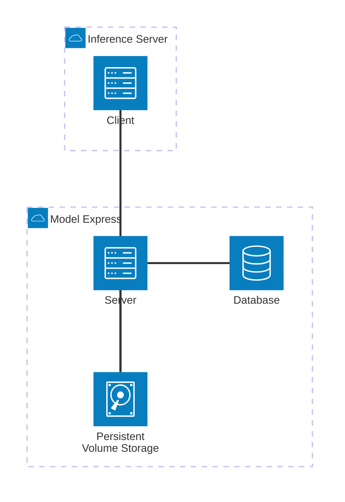

<!--
SPDX-FileCopyrightText: Copyright (c) 2025 NVIDIA CORPORATION & AFFILIATES. All rights reserved.
SPDX-License-Identifier: Apache-2.0
-->


[](https://opensource.org/licenses/Apache-2.0)

# Dynamo Model Express

Model Express is a Rust-based model cache management service designed to be deployed as a sidecar alongside existing inference solutions such as NVIDIA Dynamo. Model Express accelerates overall inference performance by reducing the latency of artifact downloads and writes.

## Project Overview

It should be established that although Model Express is a component of the Dynamo inference stack, Model Express can be deployed standalone to accelerate other inference solutions such as vLLM, Sglang, etc. independent of Dynamo.

The current version of Model Express acts as a cache for HuggingFace, providing fast access to pre-trained models and reducing the need for repeated downloads across multiple servers. Model Express supports two deployment modes: shared storage (where client and server share a network drive) and distributed mode (where model files are transferred over gRPC when shared storage is not available). This enables flexible deployment in various infrastructure setups, from high-performance shared filesystem environments to distributed cloud deployments.

Model Express also shines in multi-node / multi-worker environments, where inference solutions may spawn multiple replicas that require model artifacts to be shared efficiently.

Future versions will expand support to additional model providers (AWS, Azure, NFS, etc.) and include features like model versioning, advanced caching strategies, advanced networking using [NIXL](https://github.com/ai-dynamo/nixl), checkpoint storage, as well as a peer-to-peer model sharing system.

## Architecture

The project is organized as a Rust workspace with the following components:

- **`modelexpress_server`**: The main gRPC server that provides model services
- **`modelexpress_client`**: Client library for interacting with the server
- **`modelexpress_common`**: Shared code and constants between client and server

The current diagram represents a high-level overview of the Model Express architecture in shared storage mode. In this mode, both the server and client share access to the same persistent volume for model storage. Model Express also supports a distributed mode where the client and server do not share storage; in this case, model files are transferred over gRPC streams from the server to the client. The architecture will evolve with time as we add new features and components.



The client is either a library embedded in the inference server of your choice, or a CLI tool which can be used beforehand to hydrate the model cache.

### CLI Tool

The client library includes a command-line interface, meant to facilitate interaction with the Model Express server, and act as a HuggingFace CLI replacement. In the future, it will also abstract other model providers, making it a one-stop shop for interacting with various model APIs.

See [docs/CLI.md](docs/CLI.md) for detailed CLI documentation.

## Prerequisites

- **Rust**: Latest stable version (recommended: 1.90)
- **Cargo**: Rust's package manager (included with Rust)
- **protoc**: The Protocol Buffers compiler is expected to be installed and usable
- **Docker** (optional): For containerized deployment

## Quick Start

### 1. Clone the Repository

```bash
git clone <repository-url>
cd modelexpress
```

### 2. Build the Project

```bash
cargo build
```

### 3. Run the Server

```bash
cargo run --bin modelexpress-server
```

The server will start on `0.0.0.0:8001` by default.

## Running Options

### Option 1: Local Development

```bash
# Start the gRPC server
cargo run --bin modelexpress-server

# In another terminal, run tests
cargo test

# Run integration tests
./run_integration_tests.sh
```

### Option 2: Docker Deployment

```bash
# Build and run with docker-compose
docker-compose up --build

# Or build and run manually
docker build -t model-express .
docker run -p 8001:8001 model-express
```

### Option 3: Kubernetes Deployment

**Prerequisites:**
- **Kubernetes Cluster**: With GPU support and `kubectl` configured to access your cluster
- **HuggingFace Token**: Required for accessing HuggingFace models within your cluster via k8s secret as shown here:
  ```bash
  export HF_TOKEN=your_hf_token
  kubectl create secret generic hf-token-secret \
    --from-literal=HF_TOKEN=${HF_TOKEN} \
    -n ${NAMESPACE}
  ```
- **Docker Registry**: Container registry accessible from your cluster (Docker Hub, private registry, or local registry)
- **Model Express Image**: Built and pushed to your registry by building from root directory of repository
  ```bash
  # Build the Model Express image
  docker build -t model-express:latest .

  # Tag for your registry
  docker tag model-express:latest your-registry/model-express:latest

  # Push to your registry
  docker push your-registry/model-express:latest
  ```
- **Update Image Reference**: Update the image reference in your deployment files to match your registry
  ```yaml
  # In k8s-deployment.yaml or agg.yaml, update:
  image: your-registry/model-express:latest
  ```


Now to deploy Modelexpress in your cluster you can run:
```bash
kubectl apply -f k8s-deployment.yaml
```

Please follow the guide [here](https://github.com/ai-dynamo/modelexpress/tree/main/examples/aggregated_k8s) to learn more on how to launch modelexpress with dynamo on kubernetes.

## Configuration

ModelExpress uses a layered configuration system that supports multiple sources in order of precedence:

1. **Command line arguments** (highest priority)
2. **Environment variables**
3. **Configuration files** (YAML)
4. **Default values** (lowest priority)

### Configuration File

Create a configuration file (supports YAML):

```bash
# Generate a sample configuration file
cargo run --bin config_gen -- --output model-express.yaml
```

Start the server with a configuration file:

```bash
cargo run --bin modelexpress-server -- --config model-express.yaml
```

#### Example Configuration Files

**Basic Configuration (`model-express.yaml`):**

```yaml
server:
  host: 0.0.0.0
  port: 8001

database:
  path: ./models.db

cache:
  eviction:
    enabled: true
    policy:
      type: lru
      unused_threshold: 60
      max_models: null
      min_free_space_bytes: null
    check_interval: 360
  directory: ./cache
  max_size_bytes: null

logging:
  level: Info
  format: Pretty
  file: null
  structured: false
```

**Running Commands:**
```bash
cargo run --bin modelexpress-server -- --config model-express.yaml
```

### Environment Variables

You can use structured environment variables with the `MODEL_EXPRESS_` prefix:

```bash
# Server settings
export MODEL_EXPRESS_SERVER_HOST="127.0.0.1"
export MODEL_EXPRESS_SERVER_PORT=8080

# Database settings
export MODEL_EXPRESS_DATABASE_PATH="/path/to/models.db"

# Cache settings
export MODEL_EXPRESS_CACHE_DIRECTORY="/path/to/cache"
export MODEL_EXPRESS_CACHE_EVICTION_ENABLED=true

# Logging settings
export MODEL_EXPRESS_LOGGING_LEVEL=debug
export MODEL_EXPRESS_LOGGING_FORMAT=json
```

### Command Line Arguments

```bash
# Basic usage
cargo run --bin modelexpress-server -- --port 8080 --log-level debug

# With configuration file
cargo run --bin modelexpress-server -- --config model-express.yaml --port 8080

# Validate configuration
cargo run --bin modelexpress-server -- --config model-express.yaml --validate-config
```


### Configuration Options

#### Server Settings

- `host`: Server host address (default: "0.0.0.0")
- `port`: Server port (default: 8001)

#### Database Settings

- `path`: SQLite database file path (default: "./models.db"). Note that in the case of a multi node kubernetes deployment, the database should be shared among all nodes using a persistent volume.

#### Cache Settings

- `directory`: Cache directory path (default: "./cache")
- `max_size_bytes`: Maximum cache size in bytes (default: null/unlimited)
- `eviction.enabled`: Enable cache eviction (default: true)
- `eviction.check_interval_seconds`: Eviction check interval (default: 3600)
- `eviction.policy.unused_threshold_seconds`: Unused threshold (default: 604800/7 days)
- `eviction.policy.max_models`: Maximum models to keep (default: null/unlimited)
- `eviction.policy.min_free_space_bytes`: Minimum free space (default: null/unlimited)

#### Logging Settings

- `level`: Log level - trace, debug, info, warn, error (default: "info")
- `format`: Log format - json, pretty, compact (default: "pretty")
- `file`: Log file path (default: null/stdout)
- `structured`: Enable structured logging (default: false)

### Default Settings

- **gRPC Port**: 8001
- **Server Address**: `0.0.0.0:8001` (listens on all interfaces)
- **Client Endpoint**: `http://localhost:8001`

## API Services

The server provides the following gRPC services:

- **HealthService**: Health check endpoints
- **ApiService**: General API endpoints
- **ModelService**: Model management and serving

## Testing

### Run All Tests

```bash
cargo test
```

### Run Specific Tests

```bash
# Integration tests
cargo test --test integration_tests

# Client tests with specific model
cargo run --bin test_client -- --test-model "google-t5/t5-small"

# Fallback tests
cargo run --bin fallback_test
```

### Test Coverage

```bash
# Run tests with coverage (requires cargo-tarpaulin)
cargo tarpaulin --out Html
```

## Development

### Project Structure

```
ModelExpress/
├── modelexpress_server/     # Main gRPC server
├── modelexpress_client/     # Client library
├── modelexpress_common/     # Shared code
├── examples/                 # Example deployment with dynamo
├── helm/                     # Helm chart for Kubernetes deployment
├── docs/                     # Documentation and guides
├── workspace-tests/          # Integration tests
├── docker-compose.yml        # Docker configuration
├── Dockerfile                # Docker build file
├── k8s-deployment.yaml       # Kubernetes deployment
└── run_integration_tests.sh  # Test runner script
```

### Adding New Features

1. **Server Features**: Add to `modelexpress_server/src/`
2. **Client Features**: Add to `modelexpress_client/src/`
3. **Shared Code**: Add to `modelexpress_common/src/`
4. **Tests**: Add to appropriate directory under `workspace-tests/`

### Dependencies

Key dependencies include:

- `tokio`: Async runtime
- `tonic`: gRPC framework
- `axum`: Web framework (if needed)
- `serde`: Serialization
- `hf-hub`: Hugging Face Hub integration
- `rusqlite`: SQLite database

### Pre-commit Hooks

This repository uses pre-commit hooks to maintain code quality. In order to contribute effectively, please set up the pre-commit hooks:

```bash
pip install pre-commit
pre-commit install
```

## Performance

The project includes benchmarking capabilities:

```bash
# Run benchmarks
cargo bench
```

## Monitoring and Logging

The server uses structured logging with `tracing`:

```bash
# Set log level
RUST_LOG=debug cargo run --bin modelexpress-server
```

## Contributing

1. Fork the repository
2. Create a feature branch
3. Make your changes
4. Add tests for new functionality
5. Run the test suite
6. Submit a pull request

## Support

For issues and questions:

- Create an issue in the repository
- Check the integration tests for usage examples
- Review the client library documentation


## ModelExpress 0.1.0 Release

**Includes:**
- Model Express being released as a CLI tool.
- Model weight caching within Kubernetes clusters using PVC.
- Database tracking of which models are stored on which nodes.
- Basic model download and storage management.
- Documentation for Kubernetes deployment and CLI usage.

## Known Issues

- Ocassionally the GRPC stream will not close automatically for larger models requested from Huggingface. It is suggested to call modelexpress asynchronously, and implement a check on the calling client side (either with modelexpress client or a file check) to verify when a model has completed downloading. Alternatively, a timeout could be used and inference backends like vLLM or SGlang will typically identify the model if it was downloaded into the cache.
