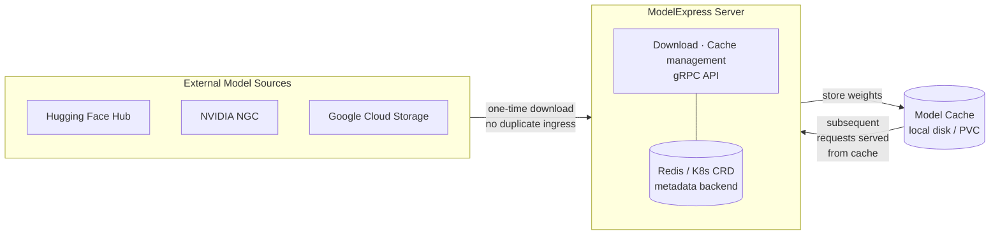
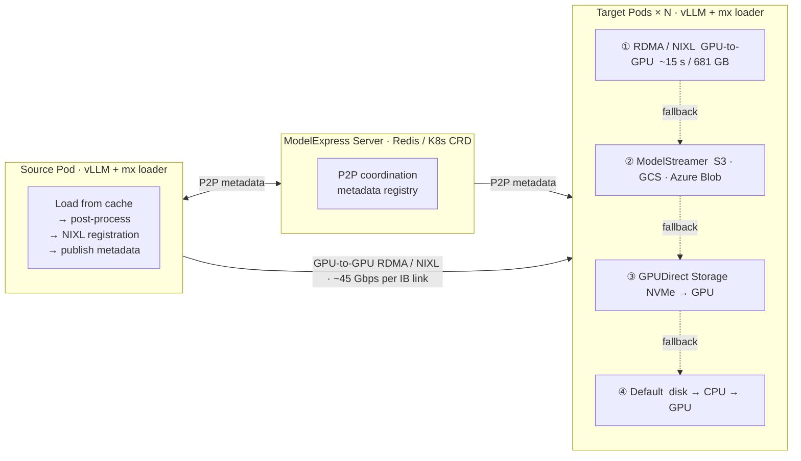

<!--
SPDX-FileCopyrightText: Copyright (c) 2025-2026 NVIDIA CORPORATION & AFFILIATES. All rights reserved.
SPDX-License-Identifier: Apache-2.0
-->

<p align="center">
  
</p>

<p align="center">
  <a href="https://opensource.org/licenses/Apache-2.0"></a>
  <a href="https://www.rust-lang.org"></a>
</p>

<h1 align="center">Dynamo ModelExpress</h1>

<p align="center">
  <strong>Accelerate LLM startup and scale-out with intelligent model distribution</strong>
</p>

<p align="center">
  Reduce repeated ingress from external model providers by ensuring only one copy of a model is downloaded even when many clients request it concurrently.
</p>

<p align="center">
  <a href="#features">Features</a> •
  <a href="#dynamo-modelexpress-architecture">Architecture</a> •
  <a href="#quick-start">Quick Start</a> •
  <a href="#deployment">Deployment</a> •
  <a href="#documentation">Docs</a> •
  <a href="#contributing">Contributing</a>
</p>

---

## Overview

ModelExpress is a model distribution layer for large-model workloads. It manages how model weights are acquired, cached, shared, and transferred across a cluster so systems can start faster, scale more efficiently, and avoid repeated downloads from external model providers. Deploy it as a standalone service or alongside runtimes such as vLLM, NVIDIA Dynamo, and TensorRT-LLM.

| LLM serving problem | How ModelExpress helps |
|---------------------|------------------------|
| **Models take too long to load** | GPU-to-GPU transfer via NIXL/RDMA instead of loading from storage. In P2P mode, weights already serving inference act as the cache—no extra storage. |
| **Many nodes need the same model** | Metadata backends (Redis, K8s CRD) coordinate sharing: one node loads; others receive via P2P or local paths. This reduces ingress bandwidth from external providers such as Hugging Face and ensures only one model copy is downloaded even when multiple clients request the same model concurrently. |

### How ModelExpress manages weights in the cluster

ModelExpress orchestrates the weight lifecycle from external source to GPU memory. It minimizes repeated provider traffic, keeps cache state coordinated across the cluster, and routes each load through the most efficient available path.

1. **Download or stream from external storage** — The ModelExpress server pulls the model from Hugging Face, NGC, or GCS, or a client streams it through ModelStreamer from S3, Azure Blob Storage, other object storage, or local disk; ModelExpress coordinates so no other node duplicates this work. In air-gapped mode, serve from cache only (`HF_HUB_OFFLINE=1`).
2. **Persist to disk** — Store in a cache backed by disk:
   - **Host-attached disk** — Local disk on the node (single-node or per-node cache).
   - **PVC** — RWO (ReadWriteOnce) for single-node; RWX (ReadWriteMany) for shared access across nodes.
3. **Disk to GPU** — Inference engine (vLLM, etc.) loads weights from the cache (disk) into GPU memory.
4. **P2P transfer** — Additional nodes receive weights via GPU-to-GPU RDMA from the first node instead of reading from disk—no duplicate downloads or disk reads.

---

## Features

- **Reduce startup time** — shift model loads from storage-bound workflows to GPU-to-GPU RDMA over InfiniBand
- **Reduce provider ingress** — coordinate downloads so concurrent requests share one external fetch instead of duplicating traffic
- **Operate with distributed state** — keep model lifecycle state and P2P metadata in Redis or Kubernetes CRDs
- **Support multiple model sources** — built-in providers for Hugging Face, NVIDIA NGC, and Google Cloud Storage
- **Load from object storage** — use ModelStreamer with `MX_MODEL_URI` for S3, GCS, Azure Blob, local paths, or Hugging Face cache
- **Use direct file-to-GPU loading** — enable GPUDirect Storage when hardware and software are available
- **Integrate with runtime platforms** — vLLM `mx` loader and TensorRT-LLM `PRESHARDED` support for RDMA-based startup
- **Deploy in Kubernetes** — use Helm, CRDs, Redis, shared storage, or no-shared-storage topologies
- **Operate through CLI and APIs** — health, download, list, validate, and clear models with shared server/client interfaces

### Integrations

| Runtime | Integration |
|---------|-------------|
| vLLM | `--load-format mx` for P2P weight transfer |
| NVIDIA Dynamo (vLLM) | `get_model_path` API; [aggregated K8s example](examples/aggregated_k8s/README.md) |
| TensorRT-LLM | `LoadFormat.PRESHARDED` with `MxLiveCheckpointLoader` for P2P weight transfer (beta) — [TRT-LLM examples](examples/p2p_transfer_k8s/client/trtllm/) |
| SGLang | Coming soon |

### Model Store Providers

ModelExpress exposes a small set of storage-access patterns, depending on how you want weights delivered:

| Path | Supported sources |
|------|-------------------|
| Model providers | Hugging Face, NVIDIA NGC, Google Cloud Storage |
| ModelStreamer (`MX_MODEL_URI`) | S3 / S3-compatible, GCS, Azure Blob Storage, local filesystem, and Hugging Face cache-resolved model IDs |
| GPUDirect Storage | Local filesystem or cached model files loaded directly to GPU |

### Air-Gapped Environments

ModelExpress supports air-gapped deployments when model files are already available inside the environment.

- Use a pre-populated local cache or a mounted local/PVC path as the source of truth.
- For Hugging Face cache-only operation, set `HF_HUB_OFFLINE=1`; ModelExpress resolves models from the local HF cache and does not attempt network access.
- For fully disconnected runtime loading, point `MX_MODEL_URI` at a local filesystem path so ModelStreamer reads from local storage instead of external object stores.
- Once one source pod has loaded the model, additional pods can receive the weights through P2P RDMA without re-downloading from an external provider.
- External providers such as NGC, GCS, S3, and Azure Blob still require network reachability unless their contents are mirrored into local storage inside the air-gapped environment.

---

## ModelExpress Architecture


**Phase 1 — External download and cache:** ModelExpress ensures only one node pulls from external providers; all others read from the shared cache.


```mermaid
flowchart LR
    subgraph ext["External Model Sources"]
        direction TB
        HF["Hugging Face Hub"]
        NGC["NVIDIA NGC"]
        GCS["Google Cloud Storage"]
    end

    subgraph mx["ModelExpress Server"]
        api["Download · Cache management\ngRPC API"]
        be[("Redis / K8s CRD\nmetadata backend")]
        api --- be
    end

    cache[("Model Cache\nlocal disk / PVC")]

    ext -->|"one-time download\nno duplicate ingress"| mx
    mx -->|"store weights"| cache
    cache -->|"subsequent\nrequests served\nfrom cache"| mx
```

**Phase 2 — Autoscale and rolling update:** A single source pod loads from cache and serves weights to all new pods via GPU-to-GPU RDMA — each target pod loads in ~15 s regardless of cluster size.


```mermaid
flowchart LR
    subgraph mx["ModelExpress Server · Redis / K8s CRD"]
        coord["P2P coordination\nmetadata registry"]
    end

    subgraph source["Source Pod · vLLM + mx loader"]
        sl["Load from cache\n→ post-process\n→ NIXL registration\n→ publish metadata"]
    end

    subgraph targets["Target Pods × N · vLLM + mx loader"]
        direction TB
        t1["① RDMA / NIXL  GPU-to-GPU  ~15 s / 681 GB"]
        t2["② ModelStreamer  S3 · GCS · Azure Blob"]
        t3["③ GPUDirect Storage  NVMe → GPU"]
        t4["④ Default  disk → CPU → GPU"]
        t1 -.->|fallback| t2 -.->|fallback| t3 -.->|fallback| t4
    end

    source <-->|"P2P metadata"| mx
    mx -->|"P2P metadata"| targets
    source -->|"GPU-to-GPU RDMA / NIXL · ~45 Gbps per IB link"| targets
```

*The server coordinates discovery and lifecycle state; weight bytes transfer directly between GPUs.*

- **modelexpress_server**: control plane for downloads, cache state, and P2P coordination
- **modelexpress_client**: Rust CLI and Python integration layer for runtime-facing workflows
- **modelexpress_common**: shared protobufs, provider abstractions, and configuration types

See [Architecture](docs/ARCHITECTURE.md).

---

## Quick Start

**Requirements:** Rust 1.90+, `protoc`, Docker

```bash
git clone https://github.com/ai-dynamo/modelexpress.git
cd modelexpress

# Start a local Redis instance for metadata storage
docker run -d --name redis -p 6379:6379 redis:8-alpine

cargo build
MX_METADATA_BACKEND=redis cargo run --bin modelexpress-server
```

Server listens on `0.0.0.0:8001`. In another terminal:

```bash
# Download a model (shared storage)
modelexpress-cli model download meta-llama/Llama-3.3-70B-Instruct

# Verify
modelexpress-cli health
```

**Without shared storage:** use `--no-shared-storage` for gRPC streaming.  
**Air-gapped:** `HF_HUB_OFFLINE=1 modelexpress-cli model download <model-id>`.

---

## Deployment

### Kubernetes (Helm)

```bash
kubectl create secret generic hf-token-secret --from-literal=HF_TOKEN=${HF_TOKEN} -n <namespace>
helm install modelexpress ./helm --namespace modelexpress --create-namespace
```

Override [values-production.yaml](helm/values-production.yaml) for your env. Full config: [helm/README.md](helm/README.md).

### Distributed Backend Prerequisites

ModelExpress requires a distributed backend for model registry state and P2P coordination:

- `redis` for Redis-backed deployments
- `kubernetes` for CRD-backed deployments

For the Kubernetes backend, install the CRDs before starting the server:

```bash
kubectl apply -f examples/crds.yaml
```

### P2P GPU Transfer (vLLM)

```python
from modelexpress import register_modelexpress_loaders
register_modelexpress_loaders()
# vllm serve <model> --load-format mx --worker-cls=modelexpress.vllm_worker.ModelExpressWorker
```

First instance loads from disk; subsequent instances receive via RDMA. [P2P guide](examples/p2p_transfer_k8s/README.md) · [Server setup](examples/p2p_transfer_k8s/server/README.md).

### Example Deployments

- [vLLM P2P transfer](examples/p2p_transfer_k8s/README.md)
- [Dynamo P2P transfer](examples/dynamo_p2p_transfer_k8s/README.md)
- [TensorRT-LLM beta examples](examples/p2p_transfer_k8s/client/trtllm/README.md)

### Docker

```bash
docker-compose up --build
```

---

## Configuration

**Precedence:** CLI → env vars (`MODEL_EXPRESS_*`, `MX_*`) → YAML → defaults.

| Variable | Default | Description |
|----------|---------|-------------|
| `MODEL_EXPRESS_SERVER_PORT` | `8001` | gRPC port |
| `MODEL_EXPRESS_CACHE_DIRECTORY` | `./cache` | Cache root |
| `MX_METADATA_BACKEND` | (required) | `redis` \| `kubernetes` |
| `REDIS_URL` | `redis://localhost:6379` | Redis connection URL (`redis` backend only) |
| `MODEL_EXPRESS_URL` | `localhost:8001` | gRPC server (P2P) |
| `MX_MODEL_URI` | (none) | Enable ModelStreamer with `s3://`, `gs://`, `az://`, absolute local paths, or Hugging Face model IDs |
| `MX_SKIP_FEATURE_CHECK` | `0` | Set to `1` to bypass the MLA transfer block (see Known Issues) |
| `UCX_TLS` | `rc_x,rc,dc_x,dc,cuda_copy` | InfiniBand transports |

```bash
cargo run --bin config_gen -- --output model-express.yaml
cargo run --bin modelexpress-server -- --config model-express.yaml --validate-config
```

Full reference: [docs/DEPLOYMENT.md](docs/DEPLOYMENT.md).

---

## Testing

```bash
cargo test
cargo test --test integration_tests
cargo run --bin test_client -- --test-model "google-t5/t5-small"
./run_integration_tests.sh
cargo bench
```

---

## Documentation

| Doc | Description |
|-----|-------------|
| [Deployment](docs/DEPLOYMENT.md) | Server/client config, Docker, K8s, P2P |
| [Architecture](docs/ARCHITECTURE.md) | Components, gRPC, NIXL, FP8 |
| [CLI](docs/CLI.md) | Full CLI reference |
| [GCS Provider](docs/GCS_PROVIDER.md) | GCS provider design, cache layout, manifest behavior, and credentials |
| [Metadata](docs/metadata.md) | Redis keys, K8s CRD schema |
| [Helm](helm/README.md) | Kubernetes configuration |

---

## Known Issues

- **MLA models blocked from P2P transfer** — Models using Multi-head Latent Attention (DeepSeek-V2/V3, Kimi K2/K2.5, GLM-5.1) are blocked from GPU-to-GPU transfer by default and fall back through the load strategy chain (ModelStreamer → GDS → disk). The root cause of post-transfer inference divergence is still under investigation. However, a workaround was merged (`adopt_hidden_tensors` + storage-level transfer for non-contiguous MLA projections) and P2P transfer has been verified correct for Kimi-K2.5-NVFP4. Set `MX_SKIP_FEATURE_CHECK=1` to enable P2P for MLA models; see [ARCHITECTURE.md](docs/ARCHITECTURE.md) for details.
- **NIXL_ERR_REMOTE_DISCONNECT** — Source restarts invalidate rkeys. Flush Redis, redeploy.
- **Long source warmup** — DeepSeek-V3 (DeepGemm, CUDA graphs) can take significant time; targets wait via coordination.
- **Large model gRPC stream** — May not close automatically; use client timeout.
- **MX_CONTIGUOUS_REG=1** — Blocked; use `0`.

---

## Roadmap

### Priorities Under Development

- **P2P compile/warmup caching**: torch.compile/deepGEMM cache for follower workers. Leader performs full warmup; followers consume caches and skip full warmup.
- **DRAM and NVMe-resident shard streaming**: Stream shards across workers while keeping weights in DRAM and host local high-speed NVMe.
- **RL workloads**: Explore fast P2P transfers to optimize RL refit phase and support for weight resharding.
- **Earlier weight availability**: Bring weights to prefill earlier; identify prefill workers that can act as strong source nodes.
- **MLA P2P transfer**: Resolve root cause of post-transfer inference divergence on MLA models (DeepSeek-V2/V3, Kimi K2/K2.5) and lift the default block.
- **Multi-tier cache hierarchy**: Promote and demote models across DRAM, NVMe, and PVC tiers based on access patterns.
- **Distributed sharded cache**: Shard large models across nodes using consistent hashing and parallel shard assembly.
- **Training checkpoint management**: Cache and reuse CUDA kernel compilations (torch.compile, deepGEMM) and CUDA graphs across restarts.
- **Metrics and observability**: Cache hit rates, eviction frequency, transfer throughput, and P2P RDMA utilization via Prometheus/OpenTelemetry.
- **Predictive prefetching**: Pre-warm caches from workload history or scheduling hints.
- **P2P transfer fault tolerance**: Auto-recovery from stale rkeys on source restart; retry and fallback to storage loading.

---

## Contributing

Contributions welcome. See [CONTRIBUTING.md](CONTRIBUTING.md).

```bash
pip install pre-commit && pre-commit install
pre-commit run --all-files
```

**Issues:** [GitHub Issues](https://github.com/ai-dynamo/modelexpress/issues)

---

## License

Apache 2.0. See [LICENSE](LICENSE).
