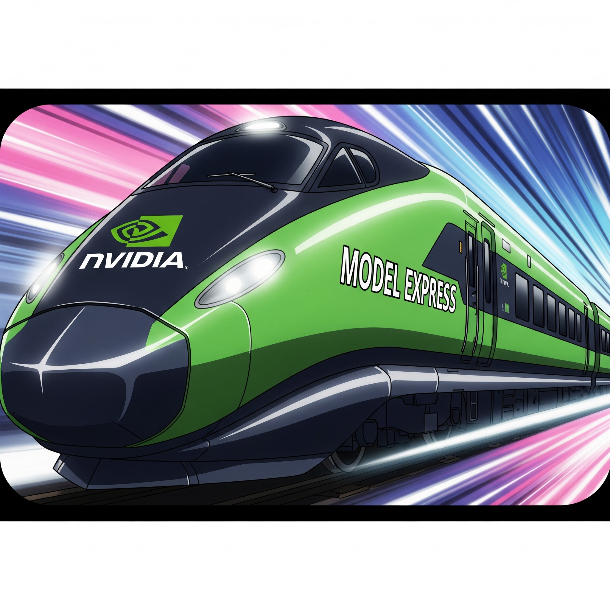
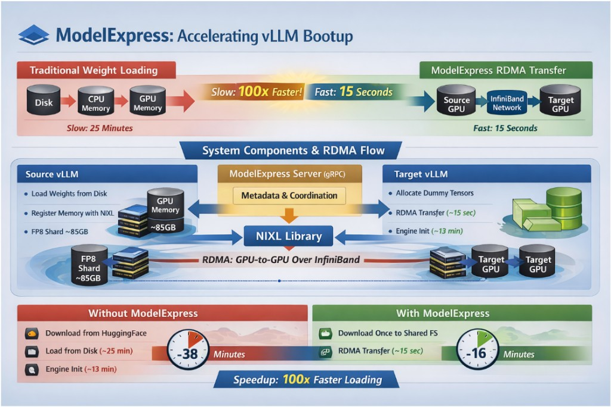

<!--
SPDX-FileCopyrightText: Copyright (c) 2025-2026 NVIDIA CORPORATION & AFFILIATES. All rights reserved.
SPDX-License-Identifier: Apache-2.0
-->

<p align="center">
  
</p>

<p align="center">
  <a href="https://opensource.org/licenses/Apache-2.0"></a>
  <a href="https://www.rust-lang.org"></a>
</p>

<h1 align="center">Dynamo ModelExpress</h1>

<p align="center">
  <strong>Model weight management for LLM inference</strong> — cache, transfer, and serve weights at scale with GPU-to-GPU RDMA and multi-node coordination.
</p>

<p align="center">
  <a href="#features">Features</a> •
  <a href="#dynamo-modelexpress-architecture">Architecture</a> •
  <a href="#quick-start">Quick Start</a> •
  <a href="#deployment">Deployment</a> •
  <a href="#documentation">Docs</a> •
  <a href="#contributing">Contributing</a>
</p>

---

## Overview

ModelExpress is a Rust-based service that manages the complete model weight lifecycle in the cluster—from acquisition to GPU memory. It accelerates LLM inference by caching, routing, and transferring weights through the fastest available path. Deploy standalone or as a sidecar alongside vLLM, NVIDIA Dynamo, and other inference runtimes.

| LLM serving problem | How ModelExpress helps |
|---------------------|------------------------|
| **Models take too long to load** | GPU-to-GPU transfer via NIXL/RDMA instead of loading from storage. In P2P mode, weights already serving inference act as the cache—no extra storage. |
| **Many nodes need the same model** | Metadata backends (Redis, K8s CRD) coordinate sharing: one node loads; others receive via P2P or local paths. |

### How ModelExpress manages weights in the cluster

ModelExpress orchestrates the full flow—from download to GPU memory. It ensures only one node downloads a model from external sources (e.g., HuggingFace); other nodes receive weights via P2P or shared storage—eliminating duplicate downloads and reducing cluster ingress.

1. **Download from HuggingFace** — One node pulls the model; ModelExpress coordinates so no other node duplicates this download, reducing external ingress. In air-gapped mode, serve from cache only (`HF_HUB_OFFLINE=1`).
2. **Persist to disk** — Store in a cache backed by disk:
   - **Host-attached disk** — Local disk on the node (single-node or per-node cache).
   - **PVC** — RWO (ReadWriteOnce) for single-node; RWX (ReadWriteMany) for shared access across nodes.
3. **Disk to GPU** — Inference engine (vLLM, etc.) loads weights from the cache (disk) into GPU memory.
4. **P2P transfer** — Additional nodes receive weights via GPU-to-GPU RDMA from the first node instead of reading from disk—no duplicate downloads or disk reads.

---

## Features

- **Cold start reduction** — GPU-to-GPU P2P transfer over InfiniBand instead of disk load
- **HuggingFace caching** — PVC-backed cache, `HF_HUB_OFFLINE`, `ignore_weights`, `get_model_path` for Dynamo
- **P2P GPU transfer** — vLLM `mx` loader with NVIDIA NIXL over RDMA; auto-detects source/target
- **Metadata backends** — In-memory, Redis, or Kubernetes CRD (layered write-through for HA)
- **Kubernetes** — Helm chart, CRDs/Redis for P2P, no-shared-storage support
- **CLI** — Health, download, list, validate, clear; init-container support for pre-warming

### Integrations

| Runtime | Integration |
|---------|-------------|
| vLLM | `--load-format mx` for P2P weight transfer |
| NVIDIA Dynamo (vLLM) | `get_model_path` API; [aggregated K8s example](examples/aggregated_k8s/README.md) |
| SGLang, TensorRT-LLM | Coming soon |

---

## ModelExpress Architecture



*Phase 1 — Upload once:* Model Source (HuggingFace Hub, NFS) downloads to the Seed Pod (GPU), which loads and postprocesses weights, registers VRAM with NIXL, and publishes metadata to the MX Server. *Phase 2 — Autoscale:* New pods receive weights via NIXL GPUDirect RDMA (GPU VRAM → GPU VRAM, zero-copy) from the seed GPU, using `--load-format mx` for inference.

```
                    ┌─────────────────────────────────────────────────────────────────┐
                    │                    ModelExpress Server                          │
                    │   Health • Model • P2P Metadata • Redis/K8s CRD backends        │
                    └──────────────────────┬──────────────────────────────────────────┘
                                           │
                         ┌─────────────────┼─────────────────┐
                         │ metadata        │                 │ metadata
                         ▼                 │                 ▼
              ┌──────────────────┐         │       ┌──────────────────┐
              │  Source (vLLM)   │  RDMA   │       │  Target (vLLM)   │
              │  mx loader       │════════►│       │  mx loader       │
              │  Load → NIXL     │  NIXL   │       │  Receive → FP8   │
              │  Publish metadata│         │       │  Serve inference │
              └──────────────────┘         │       └──────────────────┘
```

*Source and Target exchange metadata with the server for coordination; weights transfer directly over RDMA between GPUs.*

- **modelexpress_server**: gRPC server with configurable metadata backends (in-memory, Redis, Kubernetes CRD). Layered in-memory with persistence is recommended for high availability.
- **modelexpress_client**: Rust CLI for cache management; Python package with vLLM loaders and `MxClient` for gRPC.
- **modelexpress_common**: Protobuf definitions, provider trait (HuggingFace), shared configuration.

See [Architecture](docs/ARCHITECTURE.md).

---

## Quick Start

**Requirements:** Rust 1.90+, `protoc`, Docker (optional)

```bash
git clone https://github.com/ai-dynamo/modelexpress.git
cd modelexpress

cargo build
cargo run --bin modelexpress-server
```

Server listens on `0.0.0.0:8001`. In another terminal:

```bash
# Download a model (shared storage)
modelexpress-cli model download meta-llama/Llama-3.3-70B-Instruct

# Verify
modelexpress-cli health
```

**Without shared storage:** use `--no-shared-storage` for gRPC streaming.  
**Air-gapped:** `HF_HUB_OFFLINE=1 modelexpress-cli model get <model-id>`.

---

## Deployment

### Kubernetes (Helm)

```bash
kubectl create secret generic hf-token-secret --from-literal=HF_TOKEN=${HF_TOKEN} -n <namespace>
helm install modelexpress ./helm --namespace modelexpress --create-namespace
```

Override [values-production.yaml](helm/values-production.yaml) for your env. Full config: [helm/README.md](helm/README.md).

### P2P GPU Transfer (vLLM)

```python
from modelexpress import register_modelexpress_loaders
register_modelexpress_loaders()
# vllm serve <model> --load-format mx --worker-cls=modelexpress.vllm_worker.ModelExpressWorker
```

First instance loads from disk; subsequent instances receive via RDMA. [P2P guide](examples/p2p_transfer_k8s/README.md) · [Persistence (HA)](examples/p2p_transfer_k8s/deploy/persistence/README.md).

### Docker

```bash
docker-compose up --build
# Or: docker build -t modelexpress . && docker run -p 8001:8001 modelexpress
```

---

## Configuration

**Precedence:** CLI → env vars (`MODEL_EXPRESS_*`, `MX_*`) → YAML → defaults.

| Variable | Default | Description |
|----------|---------|-------------|
| `MODEL_EXPRESS_SERVER_PORT` | `8001` | gRPC port |
| `MODEL_EXPRESS_CACHE_DIRECTORY` | `./cache` | Cache root |
| `MX_METADATA_BACKEND` | `memory` | `memory` \| `redis` \| `kubernetes` |
| `MODEL_EXPRESS_URL` | `localhost:8001` | gRPC server (P2P) |
| `UCX_TLS` | `rc_x,rc,dc_x,dc,cuda_copy` | InfiniBand transports |

```bash
cargo run --bin config_gen -- --output model-express.yaml
cargo run --bin modelexpress-server -- --config model-express.yaml --validate-config
```

Full reference: [docs/DEPLOYMENT.md](docs/DEPLOYMENT.md).

---

## CLI

```bash
modelexpress-cli health
modelexpress-cli model download <model-id>
modelexpress-cli model list
modelexpress-cli model validate <model-id>
modelexpress-cli model clear <model-id>
```

[CLI Reference](docs/CLI.md)

---

## Testing

```bash
cargo test
cargo test --test integration_tests
cargo run --bin test_client -- --test-model "google-t5/t5-small"
./run_integration_tests.sh
cargo bench
```

---

## Documentation

| Doc | Description |
|-----|-------------|
| [Deployment](docs/DEPLOYMENT.md) | Server/client config, Docker, K8s, P2P |
| [Architecture](docs/ARCHITECTURE.md) | Components, gRPC, NIXL, FP8 |
| [CLI](docs/CLI.md) | Full CLI reference |
| [Metadata](docs/metadata.md) | Redis keys, K8s CRD schema |
| [Helm](helm/README.md) | Kubernetes configuration |

---

## Known Issues

- **NIXL_ERR_REMOTE_DISCONNECT** — Source restarts invalidate rkeys. Flush Redis, redeploy.
- **Long source warmup** — DeepSeek-V3 (DeepGemm, CUDA graphs) can take significant time; targets wait via coordination.
- **Large model gRPC stream** — May not close automatically; use client timeout.
- **MX_CONTIGUOUS_REG=1** — Blocked; use `0`.

---

## Roadmap

### Priorities Under Development

- **P2P compile/warmup caching**: torch.compile/deepGEMM cache for follower workers. Leader performs full warmup; followers consume caches and skip full warmup.
- **ModelStreamer Integration**: Pull weights from cold storage with multi-cloud and multi-engine support.
- **DRAM and NVMe-resident shard streaming**: Stream shards across workers while keeping weights in DRAM and host local high-speed NVMe.
- **RL workloads**: Explore fast P2P transfers to optimize RL refit phase and support for weight resharding.
- **Earlier weight availability**: Bring weights to prefill earlier; identify prefill workers that can act as strong source nodes.
- **Expanded model pull providers**: Support NGC in addition to Hugging Face.
- **GDS (GPUDirect Storage) integration**: Load model weights directly from NVMe into GPU memory, bypassing the CPU/DRAM copy path.
- **Multi-tier cache hierarchy**: Promote and demote models across DRAM, NVMe, and PVC tiers based on access patterns.
- **Distributed sharded cache**: Shard large models across nodes using consistent hashing and parallel shard assembly.
- **Training checkpoint management**: Cache and reuse CUDA kernel compilations (torch.compile, deepGEMM) and CUDA graphs across restarts.
- **Metrics and observability**: Cache hit rates, eviction frequency, transfer throughput, and P2P RDMA utilization via Prometheus/OpenTelemetry.
- **Predictive prefetching**: Pre-warm caches from workload history or scheduling hints.
- **P2P transfer fault tolerance**: Auto-recovery from stale rkeys on source restart; retry and fallback to storage loading.
- **Multi-cloud storage backends**: Native support for AWS S3, Azure Blob, and NFS as model pull sources.

---

## Contributing

Contributions welcome. See [CONTRIBUTING.md](CONTRIBUTING.md).

```bash
pip install pre-commit && pre-commit install
pre-commit run --all-files
```

**Issues:** [GitHub Issues](https://github.com/ai-dynamo/modelexpress/issues)

---

## License

Apache 2.0. See [LICENSE](LICENSE).
