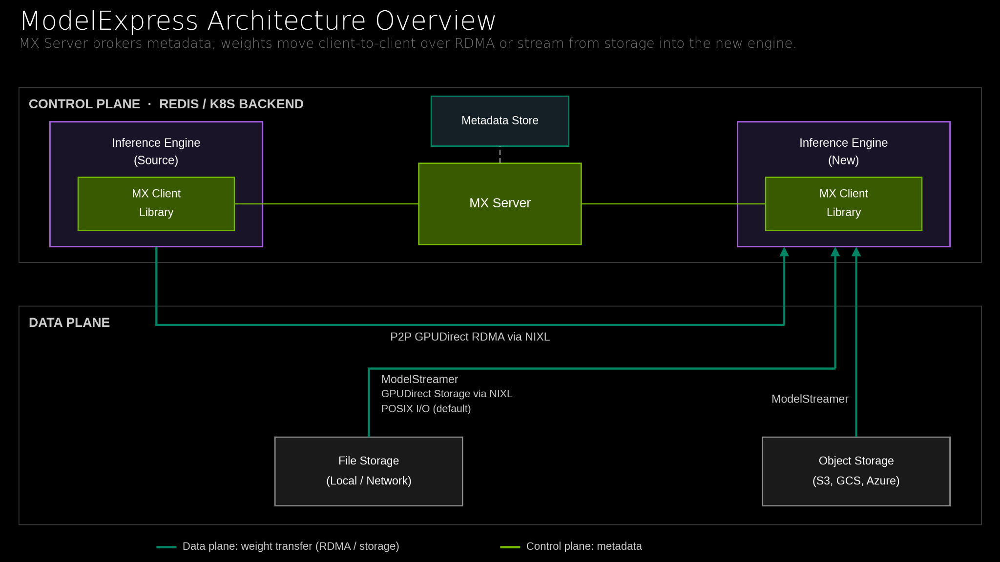
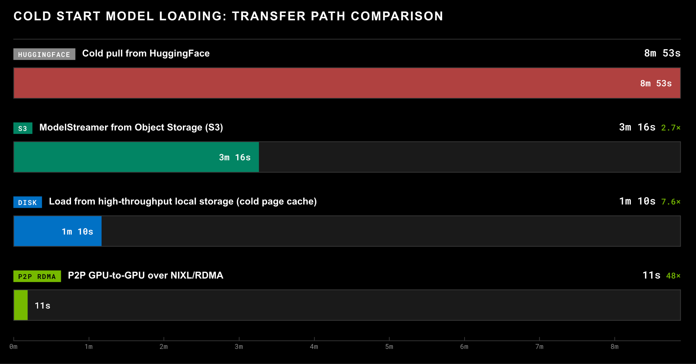
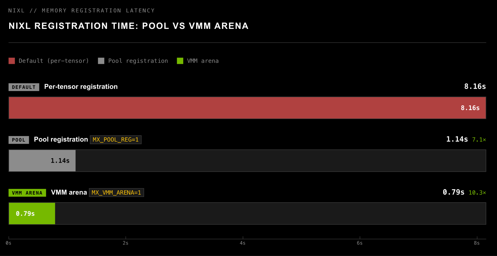
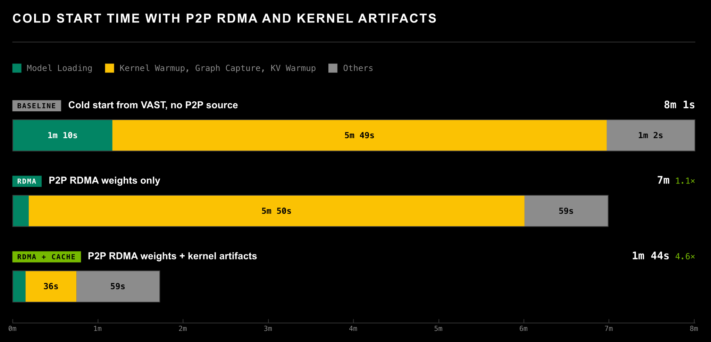

<!--
SPDX-FileCopyrightText: Copyright (c) 2025-2026 NVIDIA CORPORATION & AFFILIATES. All rights reserved.
SPDX-License-Identifier: Apache-2.0
-->

<p align="center">
  
</p>

<p align="center">
  <a href="https://opensource.org/licenses/Apache-2.0"></a>
  <a href="https://www.rust-lang.org"></a>
</p>

<h1 align="center">Dynamo ModelExpress</h1>

<p align="center">
  <strong>Move model weights into GPU memory and reusable artifacts into filesystem caches</strong> — through P2P RDMA, streaming, GPUDirect Storage, or host-staged POSIX I/O.
</p>

<p align="center">
  <a href="#features">Features</a> •
  <a href="#modelexpress-architecture">Architecture</a> •
  <a href="#benchmarks">Benchmarks</a> •
  <a href="#quick-start">Quick Start</a> •
  <a href="#deployment">Deployment</a> •
  <a href="#documentation">Docs</a> •
  <a href="#contributing">Contributing</a>
</p>

---

## Overview

ModelExpress (MX) starts with a simple question: before loading a model, where does a compatible copy of its weights already live? Rather than treating every replica as an independent cold start, ModelExpress discovers available sources and selects the fastest supported path into GPU memory. Deploy it standalone or alongside vLLM, SGLang, NVIDIA Dynamo, and other inference runtimes.

| LLM serving problem | How ModelExpress helps |
|---------------------|------------------------|
| **Models take too long to load** | GPU-to-GPU transfer via NIXL/RDMA instead of loading from storage. In P2P mode, weights already serving inference act as the cache—no extra storage. |
| **JIT warmup dominates startup** | Compatible vLLM and SGLang NIXL TorchInductor, Triton, DeepGEMM, TileLang, CuTe DSL, and FlashInfer JIT caches transfer from a ready replica instead of being rebuilt. |
| **Many nodes need the same model** | Metadata backends (Redis, K8s CRD) coordinate sharing: one node loads; others receive via P2P or local paths. |

> **Today, ModelExpress transfers DeepSeek-V4-Pro weights and compatible JIT kernel-cache artifacts from a serving replica to a fresh replica in under 10 seconds, reducing process-start-to-API-ready time from 8 minutes 1 second to 1 minute 44 seconds.**

### Runtime path selection

At startup, ModelExpress probes the capabilities available in the environment and tries loading strategies in priority order:

1. **Serving peer → GPU** — Transfer post-processed weights directly from a compatible replica over NIXL P2P RDMA. Each new replica then joins the source pool, turning scale-out into GPU-to-GPU fan-out.
2. **Remote or local storage → GPU with ModelStreamer** — Fetch safetensor ranges concurrently through a bounded CPU staging buffer while overlapping reads with GPU placement. Tensor-parallel ranks can divide remote reads instead of each downloading the full checkpoint.
3. **Local storage → GPU with GDS** — Use NIXL's multithreaded GPUDirect Storage backend to bypass host-memory staging when the platform supports it.
4. **Default loader** — Fall back to the inference engine's host-staged POSIX I/O path.

The first applicable strategy runs. If a strategy fails before changing model state, ModelExpress continues to the next one. If weights may already have landed, it reinitializes the model before continuing so a partially loaded model is never served.

The ModelExpress control plane discovers compatible sources through Redis, Kubernetes CRDs, or the decentralized `k8s-service` backend. Weight bytes stay on the data plane and move directly between storage or source and target. For clusters with a shared disk cache, the Model Cache Service also coordinates a single download so concurrent replicas reuse one cached checkpoint instead of multiplying external ingress.

---

## Features

- **Cold start reduction** — GPU-to-GPU P2P transfer over InfiniBand instead of disk load
- **Capability-driven loading** — Automatic priority chain: P2P RDMA → ModelStreamer → GDS → native loader, with safe fallback
- **HuggingFace caching** — PVC-backed cache, `HF_HUB_OFFLINE`, `ignore_weights`, `get_model_path` for Dynamo
- **P2P GPU transfer** — vLLM `modelexpress` loader (`mx` alias) and TRT-LLM `PRESHARDED` loader with NVIDIA NIXL over InfiniBand, RoCE, NVLink, EFA, and other supported fabrics
- **JIT cache transfer** — Reuse compatible vLLM and SGLang NIXL compilation caches when replicas scale out
- **Metadata backends** — Redis, Kubernetes CRD, or decentralized Kubernetes Service routing
- **Kubernetes** — Helm chart, CRDs/Redis for P2P, no-shared-storage support
- **CLI** — Health, download, list, validate, clear; init-container support for pre-warming
- **ModelStreamer integration** — Pipeline concurrent reads from S3, Azure Blob, GCS, Hugging Face, or local storage into vLLM and SGLang
- **Expanded model pull providers**: NGC catalog and Google Cloud Storage in addition to Hugging Face
- **GDS (GPUDirect Storage)**: load model weights directly from NVMe into GPU memory, bypassing the CPU/DRAM copy path
- **Lower NIXL registration overhead** — Opt in to allocation-level pool registration or a single VMM arena registration

### Integrations

| Runtime | Integration |
|---------|-------------|
| vLLM | Native `--load-format modelexpress` in 0.23.0+ for P2P weight and JIT cache transfer; older versions use the ModelExpress plugin, and `mx` is a backward-compatible alias |
| NVIDIA Dynamo (vLLM) | `get_model_path` API; [Dynamo model cache K8s example](examples/dynamo_model_cache_k8s/README.md) |
| TensorRT-LLM | `LoadFormat.PRESHARDED` with `MxLiveCheckpointLoader` for P2P weight transfer (beta) — [TRT-LLM examples](examples/p2p_transfer_k8s/client/trtllm/) |
| SGLang | `remote_instance` + `modelexpress` backend with `transport=nixl` or `transport=transfer_engine` — see [`docs/SGLANG.md`](docs/SGLANG.md) |

---

## ModelExpress Architecture



*The ModelExpress server brokers metadata only. Weight bytes move directly from a compatible serving peer, object storage, or file storage into the new inference engine.*


*Phase 1 — Bootstrap once:* The seed pod selects the fastest available storage path, loads and post-processes the weights, registers GPU memory with NIXL, and publishes metadata. *Phase 2 — Scale out:* Compatible pods discover a serving peer through the control plane and receive weights directly over NIXL GPUDirect RDMA; the ModelExpress server never handles the weight bytes.

- **modelexpress_server**: gRPC server with configurable metadata backends (Redis, Kubernetes CRD).
- **modelexpress_client**: Rust CLI for cache management; Python package with inference engine loaders and `MxClient` for gRPC.
- **modelexpress_common**: Protobuf definitions, model-provider traits, and shared configuration.

See [Architecture](docs/ARCHITECTURE.md).

---

## Benchmarks

The following results use DeepSeek-V4-Pro with vLLM 0.23.0 and TP=8 on an 8×B200 GPU node with NVIDIA ConnectX-7 NICs. Runs used `--enable-flashinfer-autotune`; timings are end-to-end startup measurements from the benchmark environment and will vary with storage, network, and runtime configuration.

### Cold-start loading paths



| Loading path | Time | Speedup vs. cold Hugging Face pull |
|--------------|-----:|-----------------------------------:|
| Cold pull from Hugging Face | 8m 53s | 1× |
| ModelStreamer from S3 | 3m 16s | 2.7× |
| High-throughput local storage, cold page cache | 1m 10s | 7.6× |
| P2P GPU-to-GPU over NIXL/RDMA | 11s | 48× |

### NIXL memory registration



| Registration strategy | Time | Speedup |
|-----------------------|-----:|--------:|
| Per tensor (default) | 8.16s | 1× |
| Pool registration (`MX_POOL_REG=1`) | 1.14s | 7.1× |
| VMM arena (`MX_VMM_ARENA=1`) | 0.79s | 10.3× |

Pool registration and VMM arena registration are alternatives; enable only one.

### Weight and kernel-artifact transfer



| Startup path | API ready | Speedup |
|--------------|----------:|--------:|
| Cold start from VAST, no P2P source | 8m 1s | 1× |
| P2P RDMA weights only | 7m | 1.1× |
| P2P RDMA weights and kernel artifacts | 1m 44s | 4.6× |

The artifact-enabled run reused compatible Triton, DeepGEMM, TileLang, CuTe DSL, and FlashInfer caches. ModelExpress transfers these file-backed artifacts between registered host-memory buffers, verifies them, and installs them into the target engine's filesystem cache; they are not loaded into GPU memory.

---

## Quick Start

**Requirements:** Rust 1.90+, `protoc`, Docker

```bash
git clone https://github.com/ai-dynamo/modelexpress.git
cd modelexpress

# Start a local Redis instance for metadata storage
docker run -d --name redis -p 6379:6379 redis:8-alpine

cargo build
# REDIS_URL is required; the server does not fall back to localhost:6379.
REDIS_URL=redis://localhost:6379 MX_METADATA_BACKEND=redis cargo run --bin modelexpress-server
```

Server listens on `0.0.0.0:8001`. In another terminal:

```bash
# Download a model (shared storage)
modelexpress-cli model download meta-llama/Llama-3.3-70B-Instruct

# Verify
modelexpress-cli health
```

**Without shared storage:** use `--no-shared-storage` for gRPC streaming.  
**Air-gapped:** with the model already in the local HF cache, `HF_HUB_OFFLINE=1 modelexpress-cli model download <model-id>` resolves it without network access.

---

## Deployment

### Kubernetes (Helm)

```bash
kubectl create secret generic hf-token-secret --from-literal=HF_TOKEN=${HF_TOKEN} -n <namespace>
helm install modelexpress ./helm --namespace modelexpress --create-namespace
```

Override [values-production.yaml](helm/values-production.yaml) for your env. Full config: [helm/README.md](helm/README.md).

### P2P GPU Transfer (vLLM)

```bash
vllm serve deepseek-ai/DeepSeek-V4-Pro \
  --load-format modelexpress \
  --tensor-parallel-size 8 \
  --trust-remote-code
```

vLLM 0.23.0 recognizes the load format natively; the ModelExpress Python package must still be installed in the runtime image. The first instance loads from disk, while subsequent instances receive weights via RDMA. Set `MX_ARTIFACT_TRANSFER=1` to transfer compatible JIT caches as well. [P2P guide](examples/p2p_transfer_k8s/README.md) · [Server setup](examples/p2p_transfer_k8s/server/README.md).

### ModelStreamer on Kubernetes

Set `MX_MODEL_URI` to an `s3://`, `gs://`, or `az://` URI, an absolute local path, or a Hugging Face model ID. For tensor-parallel deployments, set `MX_MS_DISTRIBUTED=1` so participating ranks divide remote reads; TP=1 ignores the setting. [ModelStreamer examples](examples/model_streamer_k8s/README.md) · [vLLM recipes](examples/model_streamer_k8s/client/vllm/README.md).

### Docker

```bash
docker compose -f docker/docker-compose.yml up --build
```

---

## Configuration

**Precedence:** CLI → env vars (`MODEL_EXPRESS_*`, `MX_*`) → YAML → defaults.

| Variable | Default | Description |
|----------|---------|-------------|
| `MODEL_EXPRESS_SERVER_PORT` | `8001` | gRPC port |
| `MODEL_EXPRESS_CACHE_DIRECTORY` | `./cache` | Cache root |
| `MX_METADATA_BACKEND` | (required) | `redis` \| `kubernetes` |
| `REDIS_URL` | (required for `redis`) | Redis connection URL. Alternatively set `MX_REDIS_HOST` + `MX_REDIS_PORT`. No localhost fallback. |
| `MX_SERVER_ADDRESS` | `localhost:8001` | Client-side gRPC server address (P2P). Recommended. |
| `MODEL_EXPRESS_URL` | `localhost:8001` | Deprecated, pending removal in a future release. Still read by all client paths and takes precedence when both are set; keep setting it during the transition. |
| `MX_MODEL_URI` | (unset) | Enable ModelStreamer for an object-store URI, absolute local path, or Hugging Face model ID. |
| `MX_MS_DISTRIBUTED` | `0` | Divide ModelStreamer reads across tensor-parallel ranks when TP > 1. |
| `MX_POOL_REG` | `0` | Register each underlying CUDA allocation once instead of registering every tensor. |
| `MX_VMM_ARENA` | `0` | Load into a CUDA VMM arena and register the used range once; alternative to `MX_POOL_REG`. |
| `MX_P2P_SOURCE_SELECTOR` | `random` | Peer ordering policy; set `rendezvous_hash` for deterministic, minimally disruptive selection. |

```bash
cargo run --bin config_gen -- --output model-express.yaml
cargo run --bin modelexpress-server -- --config model-express.yaml --validate-config
```

Full reference: [docs/DEPLOYMENT.md](docs/DEPLOYMENT.md).

---

## CLI

```bash
modelexpress-cli health
modelexpress-cli model download <model-id>
modelexpress-cli model list
modelexpress-cli model validate <model-id>
modelexpress-cli model clear <model-id>
```

[CLI Reference](docs/CLI.md)

---

## Testing

```bash
cargo test
cargo test --test integration_tests
cargo run --bin test_client -- --test-model "google-t5/t5-small"
./run_integration_tests.sh
cargo bench
```

---

## Documentation

| Doc | Description |
|-----|-------------|
| [Deployment](docs/DEPLOYMENT.md) | Server/client config, Docker, K8s, P2P |
| [Architecture](docs/ARCHITECTURE.md) | Components, gRPC, NIXL, FP8 |
| [Benchmarks](docs/BENCHMARKS.md) | Loading paths, NIXL registration, and artifact-transfer results |
| [CLI](docs/CLI.md) | Full CLI reference |
| [Metadata](docs/metadata.md) | Redis keys, K8s CRD schema |
| [Helm](helm/README.md) | Kubernetes configuration |

---

## Known Issues

- **NIXL_ERR_REMOTE_DISCONNECT** — Source restarts invalidate rkeys. Flush Redis, redeploy.
- **Large model gRPC stream** — May not close automatically; use client timeout.
- **GDS loader does not scale with TP** — Each TP rank reads full checkpoint tensors and vLLM shards them afterward, so GDS/disk reads scale with TP degree. This can reduce or reverse expected GDS speedups versus the default mmap-based disk loader; TP-aware range reads are needed for a full fix. See [GDS Reads Full Checkpoint Tensors Under TP](docs/ARCHITECTURE.md#gds-reads-full-checkpoint-tensors-under-tp).

---

## Roadmap

### Priorities Under Development

- **DRAM and NVMe-resident shard streaming**: Stream shards across workers while keeping weights in DRAM and host local high-speed NVMe.
- **RL post-training refit**: Make updates receiver-driven—trainer ranks publish the shards they own, rollout workers discover and plan against their target layout, then pull, convert, reshard, and load directly over NIXL.
- **Earlier weight availability**: Bring weights to prefill earlier; identify prefill workers that can act as strong source nodes.
- **Multi-tier cache hierarchy**: Promote and demote models across DRAM, NVMe, and PVC tiers based on access patterns.
- **Distributed sharded cache**: Shard large models across nodes using consistent hashing and parallel shard assembly.
- **Training checkpoint management**: Cache and reuse CUDA kernel compilations (torch.compile, deepGEMM) and CUDA graphs across restarts.
- **Metrics and observability**: Cache hit rates, eviction frequency, transfer throughput, and P2P RDMA utilization via Prometheus/OpenTelemetry.
- **Predictive prefetching**: Pre-warm caches from workload history or scheduling hints.
- **P2P transfer fault tolerance**: Auto-recovery from stale rkeys on source restart; retry and fallback to storage loading.
- **Dynamic EPLB (Expert Parallelism Load Balancer)**: Rebalance MoE expert placement across GPUs at runtime via P2P transfer of expert weights as load shifts.

---

## Contributing

Contributions welcome. See [CONTRIBUTING.md](CONTRIBUTING.md).

```bash
pip install pre-commit && pre-commit install
pre-commit run --all-files
```

**Issues:** [GitHub Issues](https://github.com/ai-dynamo/modelexpress/issues)

---

## License

Apache 2.0. See [LICENSE](LICENSE).
