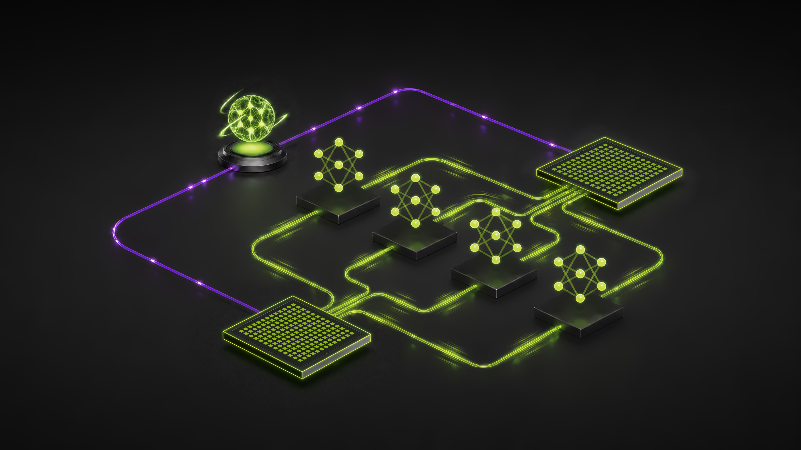

<!--
SPDX-FileCopyrightText: Copyright (c) 2025-2026 NVIDIA CORPORATION & AFFILIATES. All rights reserved.
SPDX-License-Identifier: Apache-2.0
-->

<p align="center">
  
</p>

<h1 align="center">Dynamo ModelExpress</h1>

ModelExpress (MX) moves model weights between storage, training workers, and inference workers. Use it to start inference replicas from an already-loaded peer or to update rollout workers with new weights during reinforcement learning (RL). It integrates with inference engines; NVIDIA Dynamo is optional.

[Get started](#quick-start) · [Documentation](docs/README.md) · [Compatibility](docs/COMPATIBILITY.md) · [Benchmarks](docs/BENCHMARKS.md)

## What can I do with it?

| Goal | How ModelExpress helps | Start here |
|---|---|---|
| **Start inference replicas faster** | The first replica loads from storage. Later compatible replicas can receive its weights directly from GPU memory over NVIDIA NIXL; compatible JIT caches can also be reused. | [vLLM on Kubernetes](docs/integrations/runtimes/vllm.md) |
| **Load from object storage** | ModelStreamer reads weights from S3, GCS, Azure Blob, or local files inside the inference worker. This path can run without an MX server. | [Choose a loading path](docs/guides/choose-a-path.md) |
| **Update weights during RL** | Publish a weight version, pause and drain rollout workers, install that version through direct transfer or object storage, then resume generation. | [RL guide](docs/guides/rl.md) |
| **Cache model downloads** | A server coordinates downloads and serves cached repository files through shared storage or gRPC. This path needs no GPU. | [Server deployment](docs/DEPLOYMENT.md) and [CLI](docs/CLI.md) |

## Quick start

Clone the repository so the docs, client code, and example manifests come from the same revision:

```bash
git clone https://github.com/ai-dynamo/modelexpress.git
cd modelexpress
```

For a released deployment, check out its release tag and follow the docs at that tag. The `main` branch may contain features ahead of published images; see [Compatibility](docs/COMPATIBILITY.md).

### Inference

Follow the [vLLM Kubernetes quick start](docs/integrations/runtimes/vllm.md). It starts a small model, verifies the inference API, then scales to a second replica and checks the transfer logs. You need a Kubernetes cluster with two available GPUs on separate nodes, a supported NIXL transport, and a runtime image containing ModelExpress.

Using another runtime or an orchestrator? Start with [SGLang](docs/integrations/runtimes/sglang.md), [TensorRT-LLM](docs/integrations/runtimes/tensorrt-llm.md), [Dynamo](docs/integrations/orchestrators/dynamo.md), or [llm-d](docs/integrations/orchestrators/llm-d.md). Each guide identifies its integration and example requirements.

### RL

Follow the [RL guide](docs/guides/rl.md) to choose between direct trainer-to-rollout updates and full/delta checkpoints through object storage. The runnable examples state what they validate and which trainer, rollout engine, server, and storage components are required.

The inference load format alone does not configure an RL update loop. Your training orchestrator owns when to publish a version, pause generation, update workers, and resume.

## How it works

For inference, ModelExpress tries eligible loaders in a fixed order: **peer → server cache → InstantTensor → ModelStreamer → GDS → engine default**. Eligibility depends on the runtime adapter, packages, device, and configuration. This is a priority order, not a measurement of the fastest path in your environment. See [loader configuration](docs/CONFIGURATION.md#loading-strategy-selection).

- **Peer transfer:** workers register GPU tensors with NIXL and publish source metadata. A compatible target discovers a source and receives weights directly; the central server handles metadata on this path.
- **Storage loading:** the worker reads the configured storage source. Object-store credentials belong in the worker. A server is optional unless you also enable central P2P discovery.
- **Server cache:** the server downloads repository files into its cache. Clients either share that filesystem or fetch files, including weights, over gRPC.
- **RL updates:** the coordinator tracks weight versions and participating workers. The chosen transfer path supplies weights; the rollout integration installs them at a controlled update boundary. The current RL service requires Redis.

A P2P target still needs model configuration and tokenizer files. Keep a usable storage or server-cache fallback if a peer is unavailable. An inference API becoming ready proves the model loaded; the [transfer logs](docs/TROUBLESHOOTING.md#p2p) show whether P2P was used.

See [Architecture](docs/ARCHITECTURE.md) for data flow, state, and implementation details.

## Benchmarks

These published results use DeepSeek-V4-Pro, vLLM 0.23.0, TP=8, and an 8×B200 node with ConnectX-7 NICs. They measure different parts of startup:

| Measurement | Baseline | With ModelExpress |
|---|---|---|
| Weight loading | Cold Hugging Face pull: 8m 53s | P2P from a loaded peer: 11s (48×) |
| Process start to API ready | Cold VAST storage load: 8m 1s | P2P weights and compatible JIT artifacts: 1m 44s (4.6×) |

Results depend on the model, runtime, storage, and fabric. The 11-second result is weight loading, not total API startup. [Full benchmark conditions and comparisons](docs/BENCHMARKS.md).

## Deployment and operation

- [Helm](helm/README.md): configure a metadata backend and deploy the MX server. Inference workers are deployed separately.
- [Configuration](docs/CONFIGURATION.md): server/client settings, loader eligibility, and transport controls.
- [Troubleshooting](docs/TROUBLESHOOTING.md): startup failures, fallback, stale sources, and offline loading.
- [Metrics](docs/METRICS.md): server and worker metrics and alerting.
- [Compatibility](docs/COMPATIBILITY.md): runtime examples, CI coverage, and version sources.

P2P requires compatible model identity, runtime layout, and accelerator configuration. GDS has a [tensor-parallel I/O limitation](docs/ARCHITECTURE.md#gds-reads-full-checkpoint-tensors-under-tp). Qualify the runtime and fabric combination you deploy; a successful fallback does not establish P2P performance.

## Contributing

See [CONTRIBUTING.md](CONTRIBUTING.md) for development setup, tests, and contribution requirements. Report problems through [GitHub issues](https://github.com/ai-dynamo/modelexpress/issues), including the image versions, selected loader, and relevant logs.

## License

Apache 2.0. See [LICENSE](LICENSE).
