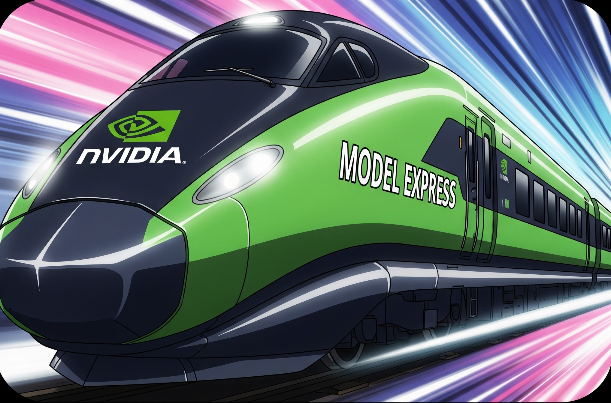

<!--
SPDX-FileCopyrightText: Copyright (c) 2025-2026 NVIDIA CORPORATION & AFFILIATES. All rights reserved.
SPDX-License-Identifier: Apache-2.0
-->



[](https://opensource.org/licenses/Apache-2.0)

# Dynamo Model Express

Model Express is a Rust-based model cache management service designed to be deployed as a sidecar alongside existing inference solutions such as NVIDIA Dynamo. Model Express accelerates overall inference performance by reducing the latency of artifact downloads and writes.

## Project Overview

Although Model Express is a component of the Dynamo inference stack, it can be deployed standalone to accelerate other inference solutions such as vLLM, SGLang, etc. independent of Dynamo.

The current version of Model Express acts as a cache for HuggingFace, providing fast access to pre-trained models and reducing the need for repeated downloads across multiple servers. Model Express supports two deployment modes: shared storage (where client and server share a network drive) and distributed mode (where model files are transferred over gRPC when shared storage is not available). This enables flexible deployment in various infrastructure setups, from high-performance shared filesystem environments to distributed cloud deployments.

Model Express also shines in multi-node / multi-worker environments, where inference solutions may spawn multiple replicas that require model artifacts to be shared efficiently.

Future versions will expand support to additional model providers (AWS, Azure, NFS, etc.) and include features like model versioning, advanced caching strategies, advanced networking using [NIXL](https://github.com/ai-dynamo/nixl), checkpoint storage, as well as a peer-to-peer model sharing system.

## Architecture

The project is organized as a Rust workspace with the following components:

- **`modelexpress_server`**: The main gRPC server that provides model services
- **`modelexpress_client`**: Client library and CLI for interacting with the server
- **`modelexpress_common`**: Shared code, protobuf definitions, and provider trait
- **`workspace-tests`**: Integration tests and Criterion benchmarks


The client is either a library embedded in the inference server of your choice, or a CLI tool which can be used beforehand to hydrate the model cache.

For detailed architecture documentation, see [docs/ARCHITECTURE.md](docs/ARCHITECTURE.md).

## Quick Start

### Prerequisites

- **Rust**: Latest stable version (recommended: 1.90+)
- **Cargo**: Rust's package manager (included with Rust)
- **protoc**: Protocol Buffers compiler
- **Docker** (optional): For containerized deployment

### Build and Run

```bash
git clone <repository-url>
cd modelexpress

cargo build
cargo run --bin modelexpress-server
```

The server will start on `0.0.0.0:8001` by default.

### CLI Tool

The client library includes a command-line interface for interacting with the Model Express server.

```bash
# Check server health
cargo run --bin modelexpress-cli -- health

# Download a model
cargo run --bin modelexpress-cli -- model download google-t5/t5-small
```

See [docs/CLI.md](docs/CLI.md) for detailed CLI documentation.

## Deployment

### Docker

```bash
# Build and run with docker-compose
docker-compose up --build

# Or build and run manually
docker build -t model-express .
docker run -p 8001:8001 model-express
```

### Kubernetes

```bash
kubectl apply -f k8s-deployment.yaml
```

Helm-based deployment details are in [`helm/README.md`](helm/README.md).

For launching ModelExpress with Dynamo on Kubernetes, see the [aggregated K8s example](examples/aggregated_k8s/).

GPU-to-GPU P2P weight transfer instructions are in the [P2P transfer example](examples/p2p_transfer_k8s/).

See [docs/DEPLOYMENT.md](docs/DEPLOYMENT.md) for the full deployment guide covering configuration, Docker, Kubernetes, Helm, and P2P transfer setup.

## Configuration

ModelExpress uses a layered configuration system:

1. **Command line arguments** (highest priority)
2. **Environment variables** (`MODEL_EXPRESS_*` prefix)
3. **Configuration files** (YAML)
4. **Default values** (lowest priority)

```bash
# Generate a sample configuration file
cargo run --bin config_gen -- --output model-express.yaml

# Start with a configuration file
cargo run --bin modelexpress-server -- --config model-express.yaml

# Validate configuration without starting
cargo run --bin modelexpress-server -- --config model-express.yaml --validate-config
```

See [docs/DEPLOYMENT.md](docs/DEPLOYMENT.md) for full configuration reference and environment variable documentation.

## Documentation

| Document | Purpose |
|----------|---------|
| [docs/ARCHITECTURE.md](docs/ARCHITECTURE.md) | Project structure, crate catalog, gRPC services, server internals, Python client, NIXL integration |
| [docs/DEPLOYMENT.md](docs/DEPLOYMENT.md) | Configuration reference, Docker, Kubernetes, Helm, P2P transfer setup |
| [docs/CLI.md](docs/CLI.md) | CLI tool usage, commands, output formats, integration examples |
| [CONTRIBUTING.md](CONTRIBUTING.md) | Development setup, available commands, pre-commit hooks, environment variables, DCO |
| [helm/README.md](helm/README.md) | Helm chart parameters and deployment examples |

## Contributing

See [CONTRIBUTING.md](CONTRIBUTING.md) for development setup, coding conventions, and contribution guidelines.

## ModelExpress 0.1.0 Release

**Includes:**
- Model Express being released as a CLI tool.
- Model weight caching within Kubernetes clusters using PVC.
- Database tracking of which models are stored on which nodes.
- Basic model download and storage management.
- Documentation for Kubernetes deployment and CLI usage.

## Known Issues

- Occasionally the gRPC stream will not close automatically for larger models requested from HuggingFace. It is suggested to call ModelExpress asynchronously, and implement a check on the calling client side (either with the ModelExpress client or a file check) to verify when a model has completed downloading. Alternatively, a timeout could be used and inference backends like vLLM or SGLang will typically identify the model if it was downloaded into the cache.
