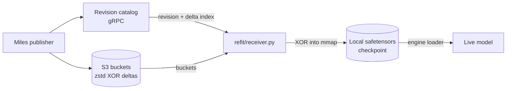

<!--
SPDX-FileCopyrightText: Copyright (c) 2025-2026 NVIDIA CORPORATION & AFFILIATES. All rights reserved.
SPDX-License-Identifier: Apache-2.0
-->

# Delta Refit on vLLM

Bringing the canonical S3 delta receiver
([`refit/receiver.py`](modelexpress_client/python/modelexpress/refit/receiver.py))
to vLLM through vLLM's native weight-transfer engine API.

Status: implemented. See the Proposal section for the shape that was built, and
[`docs/ARCHITECTURE.md`](docs/ARCHITECTURE.md) (Delta Refit Receivers) for the
reference description. Gaps 2 and 3 remain open by choice.

## Executive summary

The delta path applies XOR deltas from S3 to a local safetensors checkpoint and
reloads it into the live model. It exists only for SGLang today.

Porting it is smaller than the file's SGLang coupling suggests. The receiver's
byte-moving half — S3 download, XOR application, per-tensor checksum
verification, and the flock-guarded checkpoint journal — has no engine
dependency and ports unchanged. Only two places touch SGLang: the
launch-checkpoint lookup and `install_prepared_checkpoint`. On the vLLM side the driving contract already
exists: `vllm/distributed/weight_transfer/` defines an abstract
`WeightTransferEngine` whose lifecycle maps nearly one-to-one onto what the
receiver already does, and it registers out-of-tree, so no vLLM fork is needed.

The net new code is one `WeightTransferEngine` subclass driving a receiver as its
client, plus a package split.
The real decisions are where the slow S3-and-XOR preparation happens relative to
vLLM's update window (Gap 2), and whether to install the whole checkpoint or
only the tensors the delta index already marks dirty (Gap 3). The main
correctness risk is Gap 1: the SGLang install cannot be ported verbatim.

## Current state



The receiver splits into **prepare** and **install**, and that split is already
along the right seam.

Prepare is `_LocalCheckpoint`: fetch the revision, verify its declared base
version and digest match what is installed, download and validate the delta
index, then XOR each bucket into the mmapped safetensors while hashing and
comparing against the canonical per-tensor digest. Transitions are journaled in
`state.json` under an exclusive `flock`, marked poisoned for the duration of the
mutation so a crash mid-XOR cannot be mistaken for a clean checkpoint. All of
this is filesystem and object-storage code with no engine dependency.

One non-obvious property to preserve: the cache is keyed only by model ID, so
ranks on a node share one checkpoint. The first rank to take the lock does the
XOR while the others block, then match the installed version and take the early
return at lines 491-503. Under vLLM, where TP ranks are separate processes,
that gives one download-and-XOR per node for free.

Install is `install_prepared_checkpoint`, which is SGLang end to end and is what
Gap 1 replaces.

Available for reuse on the vLLM side:

| Component | Location |
|---|---|
| `WeightTransferEngine`, factory, config | `vllm/distributed/weight_transfer/`, `vllm/config/weight_transfer.py` |
| Layerwise reload | `vllm/model_executor/model_loader/reload/layerwise.py` |
| `NCCLWeightTransferEngine` (reference checkpoint-format engine) | `vllm/distributed/weight_transfer/nccl_engine.py` |
| Graph-safe commit example | [`engines/vllm/refit/receiver.py`](modelexpress_client/python/modelexpress/engines/vllm/refit/receiver.py) |
| `vllm.general_plugins` entry point | [`pyproject.toml`](modelexpress_client/python/pyproject.toml) |

## Gaps

### Gap 1: the install cannot be ported verbatim

This one breaks silently rather than raising.

`process_weights_after_loading` replaces parameters at new addresses for
quantized models, and captured CUDA graphs hold pointers to the old storage, so
a bare `model.load_weights()` on a live vLLM model either corrupts weights or
hangs on graph replay. vLLM's answer is the layerwise-reload window, which is
why `WeightTransferEngine` separates `start_weight_update` and
`finish_weight_update` from `receive_weights`; `NCCLWeightTransferEngine` uses
them for exactly this.

The window alone is not sufficient. `_process_and_commit` in
`engines/vllm/refit/receiver.py` covers the remainder: snapshotting
bare-attribute tensors that are graph-bound but registered as neither parameter
nor buffer (Marlin `workspace`, MLA `W_UV`/`W_UK_T`), restoring kernel tensors,
and asserting nothing is left on the meta device. Written for a different
transport, but the install problem is identical.

### Gap 2: no place to put the target version

vLLM's `start_weight_update()` takes no arguments, while the receiver's takes
the target version and performs the whole download and XOR pass inside it.

The version can only travel in the `update_info` dict handed to
`receive_weights`. That is vLLM-native and fine in itself; the consequence is
the problem. Preparation then runs between `start_weight_update` and
`finish_weight_update`, where parameters have already been reverted to
load-time skeletons, so downloading and XORing gigabytes stalls the worker for
the full duration. vLLM offers no pre-window preparation hook to hang it off
instead.

### Gap 3: the dirty set is computed and then ignored

`prepare` already knows exactly which tensors changed — every index entry
carries a `state`, and only `dirty` tensors appear in a bucket — but
`install_prepared_checkpoint` reloads the entire checkpoint regardless, so a
small revision costs a full-model load.

Exploiting the dirty set means writing only those tensors into live parameters,
which for a quantized model means reconciling checkpoint-format bytes against
already-processed parameter layouts. That is a substantially harder install than
Gap 1's, so it is called out here as a known inefficiency and deliberately left
out of the first implementation. The vehicle for it already exists:
`MdlLoader.load_weights` in
[`engines/vllm/refit/installer.py`](modelexpress_client/python/modelexpress/engines/vllm/refit/installer.py)
takes a `list[(name, tensor)]` and resolves each name to its live destination,
which is the shape of a dirty-subset install.

### Gap 4: no home for outcome reporting

`WeightUpdateResult` and `ReceiverStatus` are returned to a caller, and the
`FAILED`/`POISONED` distinction — drawn from
`ReceiverInstallError.mutation_started`, meaning whether the model was already
touched — tells an orchestrator whether the worker is recoverable or must be
replaced. vLLM's engine methods return `None` and signal by raising, and there
is no counterpart to `pop_metrics`.

### Gap 5: configuration has no vLLM-side source

SGLang's factory call reads the `server_args.modelexpress_*` fields that only
the SGLang fork defines. vLLM's `WeightTransferInitInfo` is the intended
equivalent. Any value taken from the environment instead must have its name
registered in [`modelexpress/envs.py`](modelexpress_client/python/modelexpress/envs.py).

## Proposal

Four moves: reduce `ModelExpressWeightReceiver` to its engine-agnostic half plus
two hooks, put one receiver per engine under `engines/<name>/refit/`, dispatch on
the rollout backend through a factory, and wrap the vLLM receiver in a
`WeightTransferEngine` that drives it as a client.

The `refit/reshard/` tree already establishes the base-and-hooks half —
`ReshardReceiver` owns discovery, planning, transport and buffers, and defers
`_capture`/`_install` to `engines/vllm/refit/receiver.py` — so this follows an
existing seam rather than inventing one.

| Path | Contents |
|---|---|
| `refit/receiver.py` | `ModelExpressWeightReceiver` base, plus the unchanged `_LocalCheckpoint`, `ReceiverConfig`, `PreparedRevision`, `ReceiverInstallError` |
| `refit/factory.py` | `RolloutBackend` and `build_delta_receiver` |
| `engines/sglang/refit/receiver.py` | `SglangWeightReceiver` — the two hooks against SGLang |
| `engines/vllm/refit/delta_receiver.py` | `VllmWeightReceiver` — the two hooks against vLLM |
| `engines/vllm/refit/delta_engine.py` | `MxWeightTransferEngine`, `MxDeltaInitInfo`, `MxDeltaUpdateInfo`, and reload tensor preservation |

`delta_engine.py` also handles Gap 1's remainder. It keeps bare-attribute
tensor addresses stable and refreshes MLA-derived content around vLLM's native
reload window. The existing reshard receiver is out of scope and is not modified
by this work.

### The receiver protocol does not move

`initialize()`, `start_weight_update(version)` and `update_weights()` are the
receiver's own protocol, and they keep their names, signatures and bodies. The
base also keeps `pop_metrics()`, `mark_poisoned()`, `status()` and the
`ReceiverRevisionState` machine. Only two sites become hooks.

### The vLLM engine holds a receiver, it is not one

vLLM's `WeightTransferEngine` is a different object with a different job: it owns
vLLM's update window and the graph-safe commit into live parameters. Its
lifecycle happens to collide with the receiver protocol name for name, while
meaning something else in each case:

| Name | vLLM `WeightTransferEngine` | MX receiver |
|---|---|---|
| `start_weight_update` | `() -> None` — open the layerwise reload window | `(version) -> None` — download and XOR the revision |
| `update_weights` | `(update_info: dict) -> None`, concrete: `parse_update_info`, then `receive_weights`, then `torch.accelerator.synchronize()` | `(layers=None) -> WeightUpdateResult` — install the prepared checkpoint |
| `self.config` | `WeightTransferConfig` | `ReceiverConfig` |

`start_weight_update` is the clearest case: each name is right for its own
object, and the two are not the same operation. Inheriting both would resolve
them by MRO and silently hand one caller the other's contract. Holding the
receiver as a client keeps them in separate objects, so nothing is renamed and
nothing shadows anything.

It also fixes the construction order. vLLM's factory builds the engine as
`cls(config, vllm_config, device, model)`, before any ModelExpress
configuration exists; the receiver is then constructed inside
`init_transfer_engine(init_info)`, where that configuration arrives.

### The shared base

```python
class ModelExpressWeightReceiver:
    """Canonical S3 delta receiver: catalog, S3, prepare, journal, state machine."""

    def __init__(self, config: ReceiverConfig, receiver_id: str) -> None:
        self.config = config
        self.receiver_id = receiver_id
        self.model_id = config.model_id
        self.launch_checkpoint = Path(self._launch_checkpoint())
        ...  # remaining fields unchanged

    def _launch_checkpoint(self) -> Path:
        """The on-disk checkpoint the engine resolved at launch."""
        raise NotImplementedError

    def install_prepared_checkpoint(self, prepared: PreparedRevision) -> None:
        """Load prepared.path into the live model. Raise ReceiverInstallError with
        mutation_started=True once any weight has been touched."""
        raise NotImplementedError

    # initialize, start_weight_update, update_weights, pop_metrics,
    # mark_poisoned, status: unchanged
```

`model_runner` leaves the base constructor; each subclass takes its own engine
handle and sets it before calling `super().__init__()`, since `_launch_checkpoint`
runs there.

### The SGLang receiver

Mechanical: the two hook bodies, lifted out of today's file unchanged.

```python
class SglangWeightReceiver(ModelExpressWeightReceiver):
    def __init__(self, config: ReceiverConfig, receiver_id: str, model_runner) -> None:
        self.model_runner = model_runner
        super().__init__(config, receiver_id)

    def _launch_checkpoint(self) -> Path:
        checkpoint, _, _ = self.model_runner.loader._prepare_weights(
            self.model_runner.model_config.model_path,
            self.model_runner.model_config.revision,
            False,
        )
        return Path(checkpoint)

    def install_prepared_checkpoint(self, prepared: PreparedRevision) -> None:
        ...  # today's body verbatim
```

### The vLLM receiver

```python
class VllmWeightReceiver(ModelExpressWeightReceiver):
    def __init__(
        self, config: ReceiverConfig, receiver_id: str, engine: MxWeightTransferEngine
    ) -> None:
        self._engine = engine
        super().__init__(config, receiver_id)

    @property
    def _load_config(self) -> LoadConfig:
        return _safetensors_load_config(self._engine.vllm_config.load_config)

    def _launch_checkpoint(self) -> Path:
        model_config = self._engine.model_config
        folder, _, _ = DefaultModelLoader(self._load_config)._prepare_weights(
            model_config.model, None, model_config.revision, False, None
        )
        return Path(folder)

    def install_prepared_checkpoint(self, prepared: PreparedRevision) -> None:
        try:
            staged = copy.copy(self._engine.model_config)
            staged.model = str(prepared.path)
            staged.revision = None
            loader = DefaultModelLoader(self._load_config)
        except Exception as error:
            raise ReceiverInstallError(str(error), False) from error
        try:
            loader.load_weights(self._engine.model, staged)
        except Exception as error:
            raise ReceiverInstallError(str(error), True) from error
```

It holds the engine rather than the model, because the engine owns the target:
`set_weight_update_target` retargets `engine.model`/`engine.model_config`, and a
cached reference would install into the wrong module and report success.

Both calls take the engine's own load config with the format rewritten to
`safetensors`, not a fresh `LoadConfig()`. A worker booted on `--load-format
modelexpress` carries a format `_prepare_weights` rejects outright, and
inheriting the rest keeps its download directory and safetensors strategy. This
is what `MxModelLoader.load_weights` already does when it delegates to the stock
loader.

`DefaultModelLoader.load_weights(model, model_config)` builds its `Source` from
`model_config.model`, so pointing a shallow copy at the prepared directory is the
vLLM equivalent of the `SimpleNamespace` source SGLang's install constructs. The
install runs inside the reload window the engine opened, which is what Gap 1
requires.

### The vLLM weight transfer engine

`MxDeltaInitInfo` answers Gap 5 and `MxDeltaUpdateInfo` answers Gap 2's "where
does the version travel", both typed and validated by the ABC's own
`parse_init_info`/`parse_update_info`.

```python
@dataclass
class MxDeltaInitInfo(WeightTransferInitInfo):
    model_id: str
    catalog_endpoint: str
    initial_version: str
    preparation_cache_dir: str
    ready_timeout_seconds: float = 600.0
    s3_endpoint_url: str | None = None


@dataclass
class MxDeltaUpdateInfo(WeightTransferUpdateInfo):
    version: str


class MxWeightTransferEngine(WeightTransferEngine[MxDeltaInitInfo, MxDeltaUpdateInfo]):
    """vLLM weight transfer engine driving a ModelExpress delta receiver."""

    init_info_cls = MxDeltaInitInfo
    update_info_cls = MxDeltaUpdateInfo

    # A receiver is bound to one catalog model id and one local checkpoint, so
    # it cannot serve a draft model; a draft would need its own receiver.
    supports_draft_weight_update = False

    def __init__(self, config, vllm_config, device, model) -> None:
        super().__init__(config, vllm_config, device, model)
        self.receiver: ModelExpressWeightReceiver | None = None
        self._bare_tensors: dict = {}
        self._timing: RefitTimingRecorder | None = None

    def init_transfer_engine(self, init_info: MxDeltaInitInfo) -> None:
        self.receiver = build_delta_receiver(
            RolloutBackend.VLLM,
            config=ReceiverConfig(**asdict(init_info)),
            receiver_id=f"{socket.gethostname()}:{self.parallel_config.rank}",
            engine=self,
        )
        self.receiver.initialize()

    def start_weight_update(self) -> None:
        receiver = self._require_receiver()
        self._timing = RefitTimingRecorder(...)
        # Before the window opens: vLLM preserves parameters and buffers, and
        # this is the only record of the graph-bound tensors that are neither.
        self._bare_tensors = snapshot_bare_tensors(self.model)
        initialize_layerwise_reload(self.model)

    def receive_weights(self, update_info: MxDeltaUpdateInfo) -> None:
        receiver = self._require_receiver()
        try:
            receiver.start_weight_update(update_info.version)
        finally:
            self._drain_receiver_timings(receiver)
        try:
            result = receiver.update_weights()
        finally:
            self._drain_receiver_timings(receiver)
        if not result.success:
            raise RuntimeError(
                f"ModelExpress delta install failed ({result.state.value}): "
                f"{result.detail}"
            )

    def finish_weight_update(self) -> None:
        started = time.perf_counter()
        try:
            finalize_layerwise_reload(self.model, self.model_config)
            restore_bare_tensors(self._bare_tensors)
            update_mla_absorbed_weights(self.model)
            warn_on_meta_parameters(self.model)
        finally:
            self._bare_tensors = {}
            if self._timing is not None:
                self._timing.add_duration("post_install", time.perf_counter() - started)
                self._timing.emit(logger)
                self._timing = None

    def shutdown(self) -> None:
        self.receiver = None
```

The receiver's own `WeightUpdateResult` is consumed here rather than returned, as
Gap 4 recommends: raise for vLLM's caller, while `receiver.status()` still
separates `POISONED` from `FAILED` for anything that can act on it. Metrics are
drained in `finally` blocks so a failed prepare still contributes its timings
instead of leaving them to be misattributed to the next update. The index fetch
lands in `control_discovery` and the bucket pool in `wire_transfer`, with
`transformation` marked combined with the wire because download and XOR share one
thread pool; a revision another rank on the node already prepared reports warm.

### Dispatch

Two registries, each dispatching a different kind of object, so they do not
overlap. vLLM's picks the engine. `WeightTransferConfig.backend` is
`Literal["nccl", "ipc", "sparse_nccl"] | str`, validated against
`WeightTransferEngineFactory` at engine-creation time, so registering from the
existing `vllm.general_plugins` entry point (`register_modelexpress_loaders`)
needs no vLLM patch:

```python
WeightTransferEngineFactory.register_engine(
    "modelexpress",
    "modelexpress.engines.vllm.refit.delta_engine",
    "MxWeightTransferEngine",
)
```

ModelExpress's picks the receiver, for the SGLang fork, the vLLM engine's own
`init_transfer_engine` above, a test harness, and a future TRT-LLM receiver:

```python
class RolloutBackend(str, Enum):
    SGLANG = "sglang"
    VLLM = "vllm"


def build_delta_receiver(
    backend: RolloutBackend, **kwargs
) -> ModelExpressWeightReceiver:
    if backend is RolloutBackend.SGLANG:
        from modelexpress.engines.sglang.refit.receiver import SglangWeightReceiver

        return SglangWeightReceiver(**kwargs)
    from modelexpress.engines.vllm.refit.delta_receiver import VllmWeightReceiver

    return VllmWeightReceiver(**kwargs)
```

Imported inside the branch, because importing either module pulls in that engine.

### Call sites and tests

| Item | Change |
|---|---|
| SGLang integration | Call `build_delta_receiver(RolloutBackend.SGLANG, ...)`, initialize the returned receiver, and cache it in the weight updater manager |
| `refit/__init__.py` | Unchanged. `tests/test_refit_api.py` pins the package root to consumed API only and names `ReceiverConfig` as deliberately non-public, so the new types are imported from their submodules |
| `tests/test_sglang_refit.py` | Import from `engines.sglang.refit.receiver` |
| `tests/test_refit_receiver*.py` | Generic receiver tests use a local `ModelExpressWeightReceiver` subclass implementing only the two engine hooks |
| `tests/vllm_weight_transfer_fake.py` | Localized pinned vLLM `WeightTransferEngine` ABC and factory used by the delta-engine tests |
| New `tests/test_vllm_delta_engine.py` | Lifecycle order, `update_info` version plumbing, install failure classification, `set_weight_update_target` being honored, timing emission, and graph safety through the engine lifecycle |

### Recommended defaults

Safe choices, to revisit once the path is measured.

- **Install (Gap 3):** full-checkpoint install through vLLM's
  `DefaultModelLoader` inside the reload window, which mirrors validated SGLang
  behavior and leaves quantization to vLLM. Dirty-subset install is a follow-up,
  once the full path is correct and measured.
- **Preparation (Gap 2):** call `receiver.start_weight_update(version)` inside
  `receive_weights`, accepting the stall first time round. Because the receiver is
  a separate object, an out-of-band caller can later stage a version ahead by
  calling it directly before the window opens, leaving `receive_weights` down to
  `update_weights()`. The early return at lines 491-503 already makes a redundant
  prepare cheap.
- **Reporting (Gap 4):** hold the state machine internally, raise on failure,
  emit timings through `RefitTimingRecorder`. Surfacing `POISONED` versus
  `FAILED` needs a transport vLLM does not offer and should be designed with
  whatever consumes it.
- **Scope:** worker side only, driven from a test harness. A trainer-side engine
  wrapping the Miles publisher is separable and should not gate the receive path.

### Acceptance bar

Beyond focused tests, this should not be called working without: parameter
equality against a full non-delta load of the same revision; generation parity;
TP > 1, confirming the one-XOR-per-node property; a quantized model and a
CUDA-graph-captured model, which is where Gap 1 fails silently; and crash
recovery mid-XOR honoring the poisoned journal.
