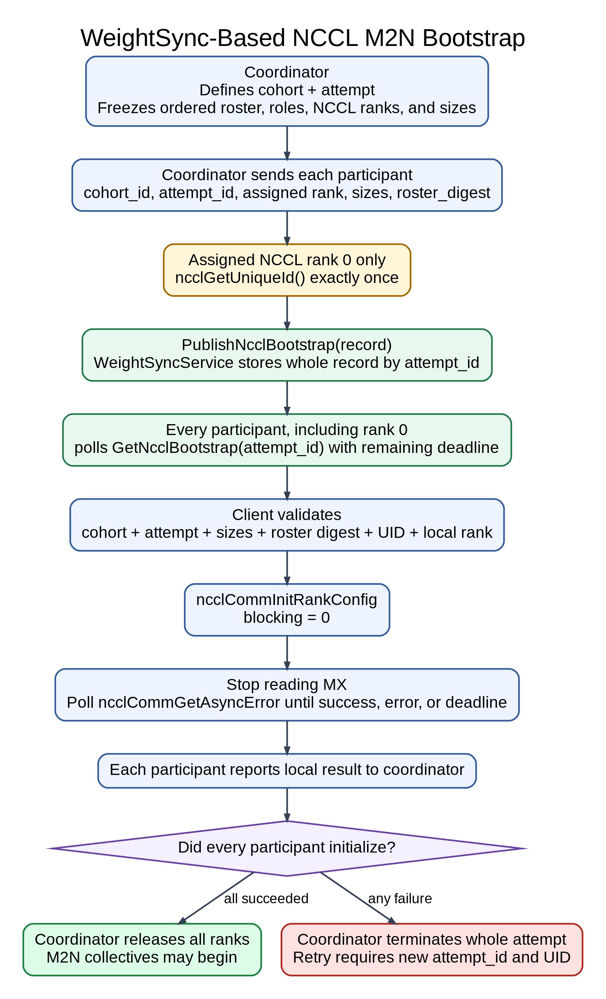
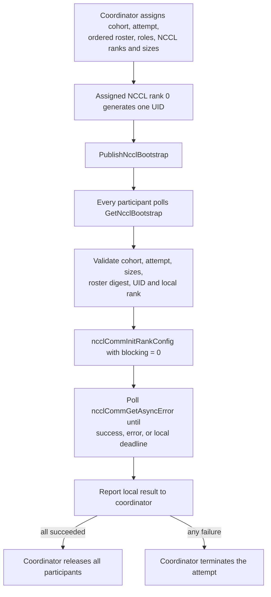

# NCCL M2N bootstrap through WeightSyncService

Status: follow-up to ModelExpress PR #497. This replaces its Torch/Gloo UID
broadcast; it does not change #497's NCCL M2N data plane.

## Decision

Extend the existing `WeightSyncService` with typed publish/get RPCs. The
external NeMo RL/Dynamo coordinator remains the topology authority. MX stores
one complete NCCL bootstrap record and does not discover participants, assign
ranks, run a barrier, or decide when transfers may begin.

There is no dedicated bootstrap service, Redis path, CAS, abort tombstone,
client package, session, provider, or `MxClient` method.

## Identity

| Term | Meaning | Change rule |
|---|---|---|
| `cohort_id` | Stable coordinator-defined logical communication group, such as one pipeline-parallel source/destination group. It is metadata, not the storage key. | Different PP groups use different cohort IDs. A cohort may remain stable across membership changes and communicator reconfiguration. |
| `attempt_id` | Canonical UUIDv4 for one concrete bootstrap or future reconfiguration operation over a specific roster snapshot. It is the MX storage key. | Always create a new value for retry, restart, membership change, or communicator operation. Never reuse it. |
| roster | Coordinator-owned ordered participants, roles, and NCCL ranks. MX does not store it. | Freeze for one attempt. A change requires a new attempt and digest, but not necessarily a new cohort. |
| `roster_digest` | 32-byte SHA-256 consistency token for that ordered roster. | Recompute whenever the roster changes. Every participant receives identical bytes. |

One cohort may have sequential attempts. Multiple PP groups may bootstrap at
the same time because each has a different `cohort_id` and `attempt_id`.
Correctness depends on the trusted coordinator assigning one NCCL rank 0
publisher and never reusing an attempt ID.

## Flow

[](docs/images/nccl-m2n-bootstrap-flow.svg)

[Open the full-size SVG](docs/images/nccl-m2n-bootstrap-flow.svg).



All ranks, including rank zero, fetch and validate the stored record before
NCCL initialization. After that fetch, clients stop reading MX and poll NCCL
only. No rank may enter an M2N collective before coordinator release.

## Assumptions and ownership

- Coordinator defines the complete source and destination membership, roles,
  NCCL ranks, world sizes, `cohort_id`, and never-reused `attempt_id`.
- Source ranks occupy `[0, source_world_size)` and destination ranks follow.
- Assigned NCCL rank zero is the only UID publisher and generates one UID.
- A retry uses a new attempt and UID. A publish timeout fails the attempt; the
  publisher does not regenerate or automatically republish under the same ID.
- Coordinator gathers every local initialization result, releases all ranks
  only after complete success, and terminates all participants on any failure.
- The initial deployment has one MX server state object and a trusted control
  network. Authentication and TLS are separate production work.
- This v1 flow treats membership as fixed for one communicator because current
  NCCL communicator APIs do. Today, joining or replacing a rank requires a new
  attempt, UID, and communicator, while `cohort_id` may remain stable when it
  is still the same logical PP group. This is not an MX restriction.

## WeightSync API and storage

`weight_sync.proto` adds:

```text
PublishNcclBootstrap(NcclBootstrapRecord) -> ok
GetNcclBootstrap(attempt_id) -> found, record
```

The record contains `cohort_id`, `attempt_id`, 128-byte `nccl_unique_id`,
source/destination/total world sizes, and the 32-byte `roster_digest`.

`WeightSyncState` stores `attempt_id -> NcclBootstrapRecord` in its existing
process-local `RwLock`. A whole record is inserted or read atomically inside
one process. The server validates a canonical UUIDv4, nonempty cohort, exact
UID and digest lengths, positive source/destination sizes, and checked total
size arithmetic.

The map intentionally has no CAS, conflict detection, fingerprint, TTL,
deletion, expiry, abort, revision, or publisher field. An identical retry is
accepted, but MX also permits a conflicting overwrite. The coordinator must
guarantee one publisher and identical bytes for any same-attempt retry.

## Why one MX server instance

Each `run_server` creates a separate `WeightSyncServiceImpl` with a private
`Arc<RwLock<WeightSyncState>>`. `Arc` shares state only inside that process.

```text
rank 0 -> replica A -> publish succeeds
rank 1 -> replica B -> found=false until its deadline
```

Therefore every publish and get for an attempt must reach the same state
object. The supported v1 deployment is one MX replica. Multiple replicas are
safe only when every independent participant channel is explicitly pinned to
the same pod; ordinary load balancing or per-client affinity is insufficient.

A server restart before all ranks fetch loses the record and fails the
attempt. After all ranks fetch, NCCL initialization may continue because MX is
not read again. Records accumulate until restart. A backend-neutral shared
ephemeral KV is required before multi-replica or HA claims.

## NCCL initialization and failure handling

The ABI-safe native shim calls `ncclCommInitRankConfig` with
`ncclConfig_t.blocking = 0`, then exposes `ncclCommGetAsyncError` and
`ncclCommAbort`. Every gRPC call receives the remaining local deadline.

On an immediate or asynchronous NCCL error, or deadline expiry, the client
best-effort aborts its local communicator and preserves the original error.
`ncclCommAbort` is synchronous and can hang, so a process supervisor remains
required for a hard termination deadline.

The selected NCCL M2N revision must support a nonblocking communicator,
including asynchronous completion of its internal `ncclDevCommCreate` before
using the device communicator. This is an M2N compatibility prerequisite, not
an MX bootstrap responsibility.

## Verification

The Python bootstrap suite uses both focused fakes and the real generated
`WeightSyncServiceStub`. Its in-process gRPC test starts three nonzero ranks
polling before the publisher, then verifies a two-source/two-destination
world in which:

- NCCL rank zero generates and publishes exactly one 128-byte UID;
- all four ranks fetch that record and initialize world size four with their
  assigned ranks;
- every rank polls simulated nonblocking NCCL state from `ncclInProgress` to
  `ncclSuccess`; and
- no rank aborts on the successful path.

The suite also covers rejected or failed publication, missing and malformed
records, failed Get RPCs, metadata and rank mismatches before NCCL init,
remaining-deadline propagation, immediate and asynchronous NCCL failures,
null communicators, local timeout/abort, abort failure preservation, and no MX
reads after NCCL initialization begins.

Executed locally:

```text
uv run --no-sync pytest -q tests/test_m2n_bootstrap.py
30 passed

uv run --no-sync pytest -q tests/test_m2n_bootstrap.py \
  tests/test_rl_weight_sync.py tests/test_m2n.py tests/test_e2e_nccl_m2n.py
89 passed
```

Rust unit tests cover server-side validation, round-trip retrieval, unknown
attempts, cohort/attempt isolation, same-cohort retries, and identical
republish. They were not executed in this shell because `cargo` is unavailable.
The four-rank test simulates NCCL calls; real GPU/M2N validation must be adapted
from #497 after the required rebase.

## Future elastic membership

The attempt-keyed MX rendezvous does not prevent elastic NCCL membership. If
NCCL adds a supported join or reconfiguration API, the coordinator can keep
the logical `cohort_id` and issue a new, never-reused `attempt_id` for each
membership operation. That operation would carry the updated roster digest,
roles, ranks, sizes, and NCCL-provided join or reconfiguration payload.

If NCCL permits a new rank to join transparently, only that participant needs
to fetch and apply the payload. If NCCL requires existing ranks to participate,
the coordinator dispatches the operation to the affected roster, collects
results, and releases or terminates it as it does for initial bootstrap. MX
would add typed reconfiguration messages or RPCs but would not take ownership
of membership policy.

Unique operation IDs and coordinator serialization can retain the current
KV-without-CAS model. Generation fencing or CAS becomes necessary only if MX
must arbitrate competing reconfigurations for the same cohort.

## Required #497 rebase integration

PR #497 has not landed, so its eight data-plane files are intentionally absent
from this thin diff. After rebasing onto #497, update its existing
`_nccl_m2n_bind.M2N` class to expose device selection, UID bytes, the native
nonblocking init, async-error polling, and local abort methods used by
`bootstrap_comm_from_mx`. Remove `bootstrap_comm_from_torch` and change
`tests/gpu/run_reshard_e2e.py` to construct a generated
`WeightSyncServiceStub` and pass the coordinator assignment. Do not copy those
files into this PR before the rebase.

## Out of scope

- Participant discovery, rank assignment, and tensor-size planning
- Coordinator result collection, release, or whole-attempt termination
- Implementing an NCCL elastic-membership API in this v1 integration
- Multi-replica persistence, cleanup, TTL, and HA
- A file-based test coordinator
- `NcclM2nSession`, `BootstrapProvider`, MPI, or Torch/Gloo bootstrap
