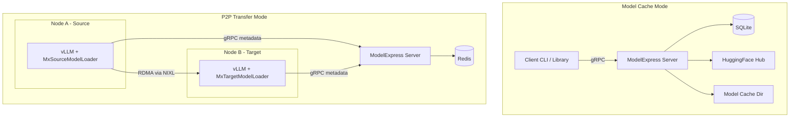
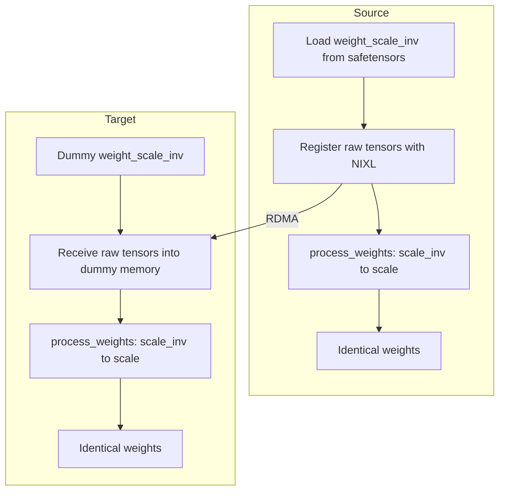

<!--
SPDX-FileCopyrightText: Copyright (c) 2025-2026 NVIDIA CORPORATION & AFFILIATES. All rights reserved.
SPDX-License-Identifier: Apache-2.0
-->

# ModelExpress Architecture

Detailed reference document for the ModelExpress codebase. For deployment and configuration, see [`DEPLOYMENT.md`](DEPLOYMENT.md). For contribution guidelines and dev setup, see [`CONTRIBUTING.md`](../CONTRIBUTING.md). For coding standards and AI assistant instructions, see `CLAUDE.md`. For CLI usage, see [`CLI.md`](CLI.md).

## Project Overview

ModelExpress is a Rust-based model cache management service and GPU-to-GPU model weight transfer system. It serves two roles:

- **Model Cache Service** - A sidecar alongside inference solutions (vLLM, SGLang, NVIDIA Dynamo) that accelerates model downloads from HuggingFace with SQLite-backed tracking and LRU cache eviction.
- **P2P Weight Transfer** - GPU-to-GPU model weight transfers between vLLM instances using NVIDIA NIXL over RDMA/InfiniBand, enabling ~15-second transfers for 681GB models.

### Current Status

| Model | Status | Transfer Time | Notes |
|-------|--------|---------------|-------|
| DeepSeek-V3 (671B, FP8) | Working | ~15s | 681GB across 8 GPUs @ ~112 Gbps per link |
| Llama 3.3 70B | Working | ~5s | 140GB across 8 GPUs @ ~112 Gbps |

## Architecture



### Components

| Component | Language | Location | Purpose |
|-----------|----------|----------|---------|
| Server | Rust | `modelexpress_server/` | gRPC server: model downloads, cache eviction, P2P coordination |
| Rust Client | Rust | `modelexpress_client/src/` | Client library and CLI tool |
| Python Client | Python | `modelexpress_client/python/` | vLLM loaders, NIXL transfer manager, gRPC client |
| Common | Rust | `modelexpress_common/` | Protobuf definitions, shared types, provider trait, config |
| Workspace Tests | Rust | `workspace-tests/` | Integration tests and Criterion benchmarks |

## Repository Structure

```text
ModelExpress/
├── Cargo.toml                          # Workspace root (4 members)
├── Cargo.lock
├── Dockerfile                          # Multi-stage production image
├── docker-compose.yml                  # Single-service dev setup
├── k8s-deployment.yaml                 # Standalone K8s deployment
├── run_integration_tests.sh            # Integration test runner
├── test_client.sh                      # Client test script
├── test_grpc_transfer_k8s.sh           # K8s gRPC transfer test
├── deny.toml                           # cargo-deny config
├── rust-toolchain.toml                 # Rust version pinning
├── rustfmt.toml                        # Formatting config
├── modelexpress-cli-completion.bash    # Shell completions
│
├── modelexpress_server/
│   ├── Cargo.toml
│   └── src/
│       ├── main.rs                     # Server startup, service registration
│       ├── lib.rs                      # Module exports
│       ├── config.rs                   # ServerConfig, layered loading, validation
│       ├── database.rs                 # SQLite ModelDatabase, atomic claim
│       ├── cache.rs                    # CacheEvictionService, LRU policy
│       ├── state.rs                    # P2pStateManager, Redis + Lua scripts
│       ├── services.rs                 # Health, API, Model gRPC services
│       ├── p2p_service.rs              # P2P gRPC service (publish/get metadata + ready)
│       └── bin/
│           └── config_gen.rs           # Config file generator/migrator
│
├── modelexpress_client/
│   ├── Cargo.toml
│   └── src/
│       ├── lib.rs                      # Client struct, public API
│       └── bin/
│           ├── cli.rs                  # CLI entry point (modelexpress-cli)
│           ├── test_client.rs          # Concurrent/single download tests
│           ├── fallback_test.rs        # Provider fallback tests
│           └── modules/
│               ├── args.rs             # CLI args (Cli struct, embeds ClientArgs)
│               ├── handlers.rs         # CLI command handlers
│               ├── output.rs           # Output formatting (human, JSON, JSON-pretty)
│               └── payload.rs          # JSON payload reader (inline, file, stdin)
│
├── modelexpress_client/python/
│   ├── pyproject.toml                  # Python package config
│   ├── generate_proto.sh               # Proto stub generation script
│   └── modelexpress/
│       ├── __init__.py                 # Package init, vLLM loader auto-registration
│       ├── client.py                   # MxClient gRPC client
│       ├── nixl_transfer.py            # NixlTransferManager
│       ├── vllm_loader.py              # MxSourceModelLoader, MxTargetModelLoader
│       ├── vllm_worker.py              # ModelExpressWorker (custom vLLM worker)
│       ├── types.py                    # TensorDescriptor, WorkerMetadata dataclasses
│       ├── p2p_pb2.py                  # Generated protobuf stubs
│       └── p2p_pb2_grpc.py             # Generated gRPC stubs
│
├── modelexpress_common/
│   ├── Cargo.toml
│   ├── build.rs                        # tonic-build: compiles all 4 proto files
│   ├── proto/
│   │   ├── health.proto                # HealthService
│   │   ├── api.proto                   # ApiService
│   │   ├── model.proto                 # ModelService
│   │   └── p2p.proto                   # P2pService
│   └── src/
│       ├── lib.rs                      # Module exports, gRPC stubs, type conversions
│       ├── cache.rs                    # CacheEvictionConfig, LruConfig, DurationConfig
│       ├── client_config.rs            # ClientConfig, ClientArgs (shared CLI args)
│       ├── config.rs                   # Config trait utilities
│       ├── download.rs                 # Download orchestration (smart-fallback, direct, server-only)
│       ├── models.rs                   # Status, ModelProvider, ModelStatus, ModelStatusResponse
│       └── providers/
│           ├── mod.rs                  # ModelProviderTrait definition
│           └── huggingface.rs          # HuggingFaceProvider implementation
│
├── workspace-tests/
│   ├── Cargo.toml
│   ├── tests/
│   │   └── integration_tests.rs        # Health, ping, download, fallback tests
│   └── benches/
│       └── performance.rs              # Criterion: DB ops, serialization benchmarks
│
├── helm/
│   ├── Chart.yaml                      # v0.2.2
│   ├── deploy.sh                       # Deploy script (microk8s/kubectl auto-detect)
│   ├── values.yaml                     # Default (1 replica, 10Gi PVC)
│   ├── values-development.yaml         # Dev (debug, 512Mi)
│   ├── values-production.yaml          # Prod (3 replicas, 2Gi, ingress)
│   ├── values-local-storage.yaml       # Test (no PVC, emptyDir)
│   └── templates/
│       ├── deployment.yaml
│       ├── service.yaml
│       ├── pvc.yaml
│       ├── ingress.yaml
│       └── serviceaccount.yaml
│
├── examples/
│   ├── p2p_transfer_k8s/               # GPU-to-GPU weight transfer example
│   │   ├── README.md
│   │   ├── Dockerfile.client           # vLLM + ModelExpress integration
│   │   ├── vllm-source.yaml
│   │   ├── vllm-target.yaml
│   │   ├── modelexpress-server.yaml    # gRPC server + Redis sidecar
│   │   └── model-download.yaml
│   └── aggregated_k8s/                 # Dynamo integration example
│       ├── README.md
│       └── agg.yaml
│
├── docs/
│   ├── ARCHITECTURE.md                 # Architecture reference
│   ├── CLI.md                          # CLI tool documentation
│   └── DEPLOYMENT.md                   # Deployment and configuration guide
│
├── .devcontainer/
│   ├── devcontainer.json               # VSCode config: rust-analyzer, port 8001
│   └── Dockerfile                      # Ubuntu 24.04 dev env
│
├── .github/
│   ├── copilot-instructions.md         # GitHub Copilot agent instructions
│   ├── dco.yml                         # DCO enforcement
│   └── workflows/
│       ├── ci.yml                      # CI pipeline
│       └── codeql.yml                  # Security scanning
│
├── .cursor/
│   └── rules/
│       └── rust.mdc                    # Cursor agent instructions
│
├── .pre-commit-config.yaml             # Pre-commit hooks config
└── .coderabbit.yaml                    # CodeRabbit review config
```

## Workspace and Crate Structure

| Crate | Package Name | Type | Binary Targets |
|-------|-------------|------|----------------|
| `modelexpress_server` | `modelexpress-server` | lib + bin | `modelexpress-server`, `config_gen` |
| `modelexpress_client` | `modelexpress-client` | lib + bin | `modelexpress-cli`, `test_client`, `fallback_test` |
| `modelexpress_common` | `modelexpress-common` | lib | (none) |
| `workspace-tests` | `workspace-tests` | test + bench | (integration tests, criterion benchmarks) |

All cargo dependencies are declared in the root `Cargo.toml`. Sub-crates use workspace dependencies exclusively.

## gRPC Services

Four proto files define four services, all compiled via `tonic-build` in `modelexpress_common/build.rs`:

### health.proto - HealthService

| RPC | Request | Response | Purpose |
|-----|---------|----------|---------|
| `GetHealth` | `HealthRequest` | `HealthResponse` | Server version, status, uptime |

### api.proto - ApiService

| RPC | Request | Response | Purpose |
|-----|---------|----------|---------|
| `SendRequest` | `ApiRequest` | `ApiResponse` | Generic API (e.g., "ping" -> "pong") |

### model.proto - ModelService

| RPC | Request | Response | Purpose |
|-----|---------|----------|---------|
| `EnsureModelDownloaded` | `ModelDownloadRequest` | stream `ModelStatusUpdate` | Trigger download, stream progress |
| `StreamModelFiles` | `ModelFilesRequest` | stream `FileChunk` | Stream model file contents (1MB chunks) |
| `ListModelFiles` | `ModelFilesRequest` | `ModelFileList` | List files with sizes |

Key message types: `ModelProvider` (HuggingFace), `ModelStatus` (Downloading, Downloaded, Error), `ModelStatusUpdate`, `FileChunk`.

### p2p.proto - P2pService

| RPC | Request | Response | Purpose |
|-----|---------|----------|---------|
| `PublishMetadata` | `PublishMetadataRequest` | `PublishMetadataResponse` | Source publishes NIXL metadata + tensors |
| `GetMetadata` | `GetMetadataRequest` | `GetMetadataResponse` | Target queries for source metadata |
| `PublishReady` | `PublishReadyRequest` | `PublishReadyResponse` | Source signals NIXL readiness |
| `GetReady` | `GetReadyRequest` | `GetReadyResponse` | Target checks source readiness |

Key message types: `TensorDescriptor` (name, addr, size, device_id, dtype), `WorkerMetadata` (rank, nixl_metadata bytes, tensors).

## Rust Server

### Startup Flow

1. Parse CLI args (`ServerArgs` via clap)
2. Load config (`ServerConfig::load()`) - CLI > env vars > config file > defaults
3. Initialize structured logging (tracing-subscriber)
4. Create SQLite database (`ModelDatabase`)
5. Optionally start `CacheEvictionService` background task
6. Connect to Redis for P2P state (non-fatal if unavailable)
7. Register 4 gRPC services with tonic (max message size: 100MB)
8. Listen on configured address (default `0.0.0.0:8001`)
9. Graceful shutdown on CTRL+C

### ServerConfig

```yaml
server:
  host: "0.0.0.0"        # MODEL_EXPRESS_SERVER_HOST
  port: 8001              # MODEL_EXPRESS_SERVER_PORT
database:
  path: "./models.db"     # MODEL_EXPRESS_DATABASE_PATH
cache:
  directory: "./cache"    # MODEL_EXPRESS_CACHE_DIRECTORY
  max_size_bytes: null
  eviction:
    enabled: true         # MODEL_EXPRESS_CACHE_EVICTION_ENABLED
    policy:
      type: lru
      unused_threshold: "7d"
      max_models: null
      min_free_space_bytes: null
    check_interval: "1h"
logging:
  level: info             # MODEL_EXPRESS_LOG_LEVEL
  format: pretty          # MODEL_EXPRESS_LOG_FORMAT
  file: null
  structured: false
```

### ModelDatabase (SQLite)

Schema: single `models` table with columns `model_name` (PK), `provider`, `status`, `created_at`, `last_used_at`, `message`. Indexed on `last_used_at` for LRU queries.

Key operations:

| Method | Purpose |
|--------|---------|
| `get_status(name)` | Query download status |
| `set_status(name, provider, status, msg)` | Create/update via INSERT OR REPLACE |
| `try_claim_for_download(name, provider)` | Atomic compare-and-swap (INSERT OR IGNORE) |
| `touch_model(name)` | Update `last_used_at` for LRU tracking |
| `delete_model(name)` | Remove record |
| `get_models_by_last_used(limit)` | LRU query, oldest first |
| `get_status_counts()` | Count by status (downloading, downloaded, error) |

Concurrency: `Arc<Mutex<Connection>>` with poison recovery.

### CacheEvictionService

Runs in a background tokio task on a configurable interval (default 1 hour). LRU eviction policy:

1. Time-based: evict models with `last_used_at` older than `unused_threshold` (default 7 days)
2. Count-based: if total > `max_models`, evict oldest excess
3. Only DOWNLOADED models are eligible for eviction

### P2pStateManager (Redis)

Redis key patterns:

| Pattern | Purpose | TTL |
|---------|---------|-----|
| `mx:model:{model_name}` | `ModelMetadataRecord` (JSON) | None |
| `mx:models` | Set of all registered model names | None |
| `mx:nixl_ready:{model}:worker:{id}` | `ReadyRecord` | 2 hours |

The `publish_metadata` operation uses an atomic Lua script to merge workers by rank, preventing lost updates when multiple GPU workers publish concurrently in TP=8 setups. Large u64 values (GPU addresses) are serialized as strings to avoid Lua/cjson precision loss.

### ModelDownloadTracker

Global singleton (`LazyLock<ModelDownloadTracker>`) that coordinates concurrent downloads. Uses `try_claim_for_download()` for race-free model claiming and tokio channels for streaming status updates to multiple waiting clients.

## Rust Client

### Client Public API

The `Client` struct in `modelexpress_client/src/lib.rs` wraps gRPC connections:

| Method | Purpose |
|--------|---------|
| `new(config)` | Create client with config |
| `health_check()` | Call HealthService |
| `ping()` | Call ApiService with "ping" |
| `download_model(name, provider)` | Trigger download via streaming RPC |
| `download_model_direct(name, provider, cache_dir)` | Download directly from provider |
| `ensure_model(name, provider, strategy)` | Smart download with fallback strategy |
| `stream_model_files(name)` | Stream model files from server |
| `list_model_files(name)` | List model files on server |
| `delete_model(name, cache_dir)` | Delete cached model |
| `validate_model(name, cache_dir)` | Validate cached model integrity |

### Download Strategies

| Strategy | Behavior |
|----------|----------|
| `SmartFallback` | Try server first, fall back to direct download on failure |
| `ServerOnly` | Only download through the server |
| `DirectOnly` | Only download directly from provider |

### CLI (modelexpress-cli)

The `Cli` struct in `args.rs` embeds `ClientArgs` via `#[command(flatten)]`. Commands:

| Command | Purpose |
|---------|---------|
| `health` | Check server health |
| `ping` | Ping server |
| `model download <name>` | Download a model |
| `model list-files <name>` | List model files |
| `model clear <name>` | Delete cached model |
| `model validate <name>` | Validate model integrity |

Output formats: `--format human` (default), `--format json`, `--format json-pretty`.

## Common Library

### Modules

| Module | Purpose |
|--------|---------|
| `cache` | `CacheEvictionConfig`, `LruConfig`, `DurationConfig` (used by both server and client configs) |
| `client_config` | `ClientConfig` + `ClientArgs` shared struct for CLI argument handling |
| `config` | Config trait utilities |
| `download` | Download orchestration with strategy pattern |
| `models` | `Status`, `ModelProvider`, `ModelStatus`, `ModelStatusResponse` |
| `providers` | `ModelProviderTrait` + `HuggingFaceProvider` |
| `grpc` | Generated tonic stubs for all 4 services |
| `constants` | `DEFAULT_GRPC_PORT` (8001), `DEFAULT_TIMEOUT_SECS` (30), `DEFAULT_TRANSFER_CHUNK_SIZE` (32KB) |

### ModelProviderTrait

```rust
#[async_trait]
pub trait ModelProviderTrait: Send + Sync {
    async fn download_model(&self, name: &str, cache_path: Option<PathBuf>, ignore_weights: bool) -> Result<PathBuf>;
    async fn delete_model(&self, name: &str) -> Result<()>;
    async fn get_model_path(&self, name: &str, cache_dir: PathBuf) -> Result<PathBuf>;
    fn provider_name(&self) -> &'static str;
    fn is_ignored(filename: &str) -> bool;
    fn is_image(path: &Path) -> bool;
    fn is_weight_file(filename: &str) -> bool;
}
```

Currently one implementation: `HuggingFaceProvider` (uses `hf-hub` crate with high-CPU download mode).

### ClientConfig / ClientArgs

`ClientArgs` is the single source of truth for shared CLI arguments. `Cli` embeds it via `#[command(flatten)]`.

Loading precedence: CLI args > environment variables > config file > defaults.

## Python Client

### Modules

| Module | Purpose |
|--------|---------|
| `__init__.py` | Package init, exports `register_modelexpress_loaders()` for callers to register `mx-source`/`mx-target` loaders with vLLM |
| `client.py` | `MxClient` - gRPC client with session management, ready polling |
| `nixl_transfer.py` | `NixlTransferManager` - NIXL agent lifecycle, tensor registration, RDMA transfers |
| `vllm_loader.py` | `MxSourceModelLoader`, `MxTargetModelLoader` - custom vLLM model loaders |
| `vllm_worker.py` | `ModelExpressWorker` - custom vLLM worker class (use `--worker-cls=modelexpress.vllm_worker.ModelExpressWorker`) |
| `types.py` | `TensorDescriptor`, `WorkerMetadata`, `GetMetadataResponse` dataclasses |
| `p2p_pb2.py` / `p2p_pb2_grpc.py` | Generated protobuf/gRPC stubs |

### MxClient

gRPC client wrapping the P2P service stubs:

| Method | Purpose |
|--------|---------|
| `publish_metadata(model_name, workers)` | Publish NIXL metadata for GPU workers |
| `get_metadata(model_name)` | Query for existing source metadata |
| `publish_ready(model_name, worker_id, ...)` | Signal NIXL readiness |
| `wait_for_ready(model_name, worker_id, ...)` | Poll until source is ready (with timeout) |
| `check_session_changed(model_name, worker_id, cached_session_id)` | Detect source restarts via session ID change |
| `close()` | Close the underlying gRPC channel |

### NixlTransferManager

Manages a NIXL agent and RDMA transfers for a single GPU worker:

| Method | Purpose |
|--------|---------|
| `__init__(agent_name, device_id)` | Create NIXL agent with UCX backend |
| `register_tensors(tensors)` | Register GPU tensors for RDMA, return serialized metadata |
| `get_registered_descriptors()` | Return region descriptors (`MX_CONTIGUOUS_REG=1`) or tensor descriptors |
| `receive_from_source(source_metadata, source_tensors, ...)` | Execute RDMA read transfer with optional coalescing |
| `shutdown()` | Clean up NIXL agent and resources |

### vLLM Loaders

**MxSourceModelLoader** (extends `DefaultModelLoader`):
1. Load weights from disk
2. Register raw tensors with NIXL (BEFORE FP8 processing)
3. Publish metadata to ModelExpress server
4. Run `process_weights_after_loading()` (FP8 transform)
5. Signal readiness after warmup

**MxTargetModelLoader** (extends `DummyModelLoader`):
1. Create dummy tensors matching source layout
2. Wait for source readiness (via `MxClient.wait_for_ready()`)
3. Receive weights via RDMA transfer (with transfer-time coalescing of contiguous regions)
4. Run `process_weights_after_loading()` (same FP8 transform)

Both loaders require the `MODEL_NAME` environment variable to identify the model for coordination.

Module-level globals `_raw_tensor_registry` and `_nixl_managers` in `vllm_loader.py` bridge loaders and clients - vLLM's loader API doesn't expose loader instances after `load_model()` returns, so source loaders store state in these dicts (keyed by device ID) for the MxClient to access.

## NIXL Integration

### What is NIXL?

NIXL (NVIDIA Interconnect eXchange Library) provides zero-copy GPU-to-GPU RDMA transfers on top of UCX:

| Concept | Description |
|---------|-------------|
| **Agent** | NIXL instance managing one GPU's memory registrations and transfers |
| **Memory Registration** | GPU memory must be registered before RDMA access; generates rkeys |
| **Metadata** | Serialized agent info (address, rkeys) shared between source/target |
| **Transfer Descriptor** | Prepared list of (addr, size, device) for bulk transfer |
| **rkey** | Remote key - RDMA authorization token for remote memory access |

### How ModelExpress Uses NIXL

```python
# 1. Create NIXL agent (one per GPU worker)
from nixl._api import nixl_agent, nixl_agent_config
config = nixl_agent_config(backends=["UCX"])
agent = nixl_agent("worker-0", config)

# 2. Register GPU tensors for RDMA access
tensors = [(tensor.data_ptr(), tensor.numel() * tensor.element_size(), device_id, "cuda")]
agent.register_memory(tensors, "VRAM")

# 3. Get metadata for remote agent connection
metadata = agent.get_local_md()  # Share this with target

# 4. On target: connect to source and transfer
agent.add_remote_agent("source-worker-0", source_metadata)
src_descs = agent.prep_xfer_dlist("source-worker-0", source_tensors, "cuda", ["UCX"])
dst_descs = agent.prep_xfer_dlist("", local_tensors, "cuda", ["UCX"])
handle = agent.make_prepped_xfer("READ", dst_descs, indices, src_descs, indices, ["UCX"])
agent.transfer(handle)

# 5. Wait for completion
while agent.check_xfer_state(handle) not in ("DONE", "SUCCESS"):
    time.sleep(0.001)
agent.release_xfer_handle(handle)
```

## FP8 Model Handling (DeepSeek-V3)

DeepSeek-V3 uses FP8 quantization with scale factors. vLLM's `process_weights_after_loading()` renames `weight_scale_inv` to `weight_scale` and transforms the data. If we transfer after processing, the source has `weight_scale` but the target expects `weight_scale_inv`, causing a mismatch.

The solution: transfer raw tensors BEFORE `process_weights_after_loading()` runs. Both source and target then run the same FP8 transform independently, producing identical final weights.



## Coordination Protocol

### Redis Keys

| Key Pattern | Purpose |
|-------------|---------|
| `mx:model:{model_name}` | Model metadata (workers, tensor descriptors, NIXL metadata) |
| `mx:models` | Set of all registered model names |
| `mx:nixl_ready:{model}:worker:{id}` | Source readiness signal (2hr TTL) |

### Flow

1. **Source starts**: Loads weights, registers with NIXL, publishes metadata to gRPC server
2. **Source warmup**: DeepGemm compilation, CUDA graph capture
3. **Source publishes ready**: After health check + test inference, publishes NIXL ready flag
4. **Target waits**: Polls for ready flag via gRPC (`GetReady`)
5. **Target transfers**: Executes RDMA reads from source
6. **Target warmup**: Same DeepGemm + CUDA graph as source

## Environment Variables

### ModelExpress Configuration

| Variable | Default | Description |
|----------|---------|-------------|
| `MODEL_NAME` | (none) | Model identifier for P2P coordination (e.g., `deepseek-ai/DeepSeek-V3`) |
| `MX_REGISTER_LOADERS` | `1` | Auto-register mx-source/mx-target loaders with vLLM |
| `MODEL_EXPRESS_URL` | `localhost:8001` | gRPC server address |
| `MX_SERVER_ADDRESS` | `localhost:8001` | Backward-compat alias for `MODEL_EXPRESS_URL` |
| `MX_CONTIGUOUS_REG` | `0` | Enable contiguous region registration (experimental) |
| `MX_EXPECTED_WORKERS` | `8` | Number of GPU workers to wait for |
| `MX_SYNC_PUBLISH` | `1` | Source: wait for all workers before publishing |
| `MX_SYNC_START` | `1` | Target: wait for all workers before transferring |
| `VLLM_RPC_TIMEOUT` | `7200000` | vLLM RPC timeout in ms |

### UCX/NIXL Tuning

| Variable | Recommended | Description |
|----------|-------------|-------------|
| `UCX_TLS` | `rc_x,rc,dc_x,dc,cuda_copy` | Transport layers for InfiniBand |
| `UCX_RNDV_SCHEME` | `get_zcopy` | Zero-copy RDMA reads |
| `UCX_RNDV_THRESH` | `0` | Force rendezvous for all transfers |
| `NIXL_LOG_LEVEL` | `INFO` | NIXL logging (DEBUG for troubleshooting) |
| `UCX_LOG_LEVEL` | `WARN` | UCX logging (DEBUG for troubleshooting) |

## Known Issues

### NIXL_ERR_REMOTE_DISCONNECT

Target fails with `Remote access error on mlx5_X:1/IB`. Common causes: source crashed/restarted (stale rkeys), UCX transport misconfiguration, premature target connection. Fix: use robust ready coordination, check for restarts, enable `UCX_LOG_LEVEL=DEBUG`.

### Contiguous Region Failures

When `MX_CONTIGUOUS_REG=1`, transfers fail even when source is stable. Current workaround: use baseline mode (`MX_CONTIGUOUS_REG=0`).

### Long Source Warmup

DeepSeek-V3 takes ~40 minutes to warm up (loading + DeepGemm + CUDA graphs). Target must wait via ready coordination.

## Performance

| Metric | Value |
|--------|-------|
| Model | DeepSeek-V3 (671B, FP8) |
| Total Data | 681 GB (8 workers x 85 GB) |
| Transfer Time | ~15 seconds (8 parallel RDMA streams @ 112 Gbps each) |
| Per-Worker Speed | 60-112 Gbps |
| Theoretical Max | 400 Gbps per NIC |

Optimization opportunities: contiguous regions (blocked), warm source pool, DeepGemm kernel caching, multi-rail RDMA (`UCX_IB_NUM_PATHS=2`).

## Deployment and Configuration

See [`DEPLOYMENT.md`](DEPLOYMENT.md) for the full deployment guide covering server/client configuration, Docker, Kubernetes, Helm, P2P transfer setup, and debugging commands.
