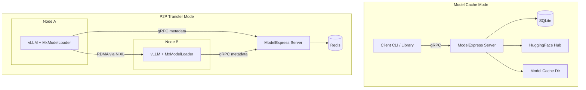
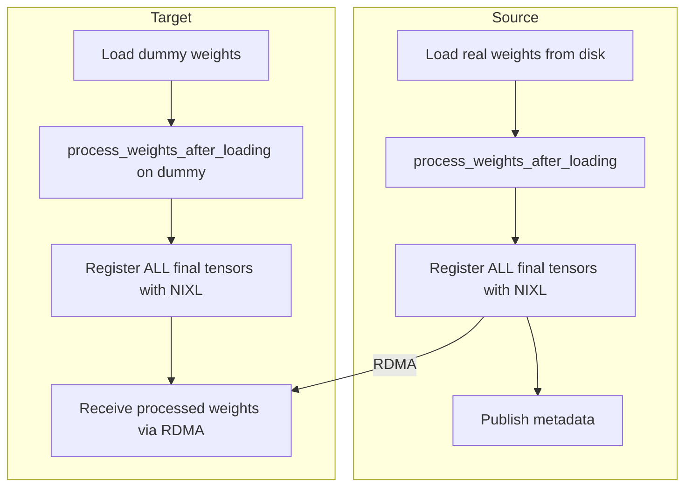

<!--
SPDX-FileCopyrightText: Copyright (c) 2025-2026 NVIDIA CORPORATION & AFFILIATES. All rights reserved.
SPDX-License-Identifier: Apache-2.0
-->

# ModelExpress Architecture

Detailed reference document for the ModelExpress codebase. For deployment and configuration, see [`DEPLOYMENT.md`](DEPLOYMENT.md). For contribution guidelines and dev setup, see [`CONTRIBUTING.md`](../CONTRIBUTING.md). For coding standards and AI assistant instructions, see `CLAUDE.md`. For CLI usage, see [`CLI.md`](CLI.md).

## Project Overview

ModelExpress is a Rust-based model cache management service and GPU-to-GPU model weight transfer system. It serves two roles:

- **Model Cache Service** - A sidecar alongside inference solutions (vLLM, SGLang, NVIDIA Dynamo) that accelerates model downloads from HuggingFace with SQLite-backed tracking and LRU cache eviction.
- **P2P Weight Transfer** - GPU-to-GPU model weight transfers between vLLM instances using NVIDIA NIXL over RDMA/InfiniBand, enabling ~15-second transfers for 681GB models.

### Current Status

| Model | Status | Transfer Time | Notes |
|-------|--------|---------------|-------|
| DeepSeek-V3 (671B, FP8) | Working | ~15s | 681GB across 8 GPUs @ ~45 Gbps per link |
| Llama 3.3 70B | Working | ~5s | 140GB across 8 GPUs @ ~28 Gbps per link |

## Architecture


```mermaid
graph TD
    subgraph "Model Cache Mode"
        C1[Client CLI / Library] -->|gRPC| S1[ModelExpress Server]
        S1 --> DB[(SQLite)]
        S1 --> HF[HuggingFace Hub]
        S1 --> Cache[Model Cache Dir]
    end

    subgraph "P2P Transfer Mode"
        subgraph "Node A"
            A[vLLM + MxModelLoader]
        end
        subgraph "Node B"
            B[vLLM + MxModelLoader]
        end
        A -->|gRPC metadata| S2[ModelExpress Server]
        B -->|gRPC metadata| S2
        S2 --> R[(Redis)]
        A -- "RDMA via NIXL" --> B
    end
```

### Components

| Component | Language | Location | Purpose |
|-----------|----------|----------|---------|
| Server | Rust | `modelexpress_server/` | gRPC server: model downloads, cache eviction, P2P coordination |
| Rust Client | Rust | `modelexpress_client/src/` | Client library and CLI tool |
| Python Client | Python | `modelexpress_client/python/` | vLLM loaders, NIXL transfer manager, gRPC client |
| Common | Rust | `modelexpress_common/` | Protobuf definitions, shared types, provider trait, config |
| Workspace Tests | Rust | `workspace-tests/` | Integration tests and Criterion benchmarks |

## Repository Structure

```text
ModelExpress/
├── Cargo.toml                          # Workspace root (4 members)
├── Cargo.lock
├── Dockerfile                          # Multi-stage production image
├── docker-compose.yml                  # Single-service dev setup
├── run_integration_tests.sh            # Integration test runner
├── test_client.sh                      # Client test script
├── test_grpc_transfer_k8s.sh           # K8s gRPC transfer test
├── deny.toml                           # cargo-deny config
├── rust-toolchain.toml                 # Rust version pinning
├── rustfmt.toml                        # Formatting config
├── modelexpress-cli-completion.bash    # Shell completions
│
├── modelexpress_server/
│   ├── Cargo.toml
│   └── src/
│       ├── main.rs                     # Server startup, service registration
│       ├── lib.rs                      # Module exports
│       ├── config.rs                   # ServerConfig, layered loading, validation
│       ├── database.rs                 # SQLite ModelDatabase, atomic claim
│       ├── cache.rs                    # CacheEvictionService, LRU policy
│       ├── state.rs                    # P2pStateManager wrapper
│       ├── services.rs                 # Health, API, Model gRPC services
│       ├── p2p_service.rs              # P2P gRPC service implementation
│       ├── source_identity.rs          # SHA256-based mx_source_id computation
│       ├── reaper.rs                   # Server-side stale source detection and GC
│       ├── k8s_types.rs               # Kubernetes CRD type definitions
│       ├── metadata_backend.rs         # MetadataBackend trait + types
│       ├── metadata_backend/
│       │   ├── redis.rs               # Redis backend implementation
│       │   └── kubernetes.rs          # Kubernetes CRD backend implementation
│       └── bin/
│           └── config_gen.rs           # Config file generator/migrator
│
├── modelexpress_client/
│   ├── Cargo.toml
│   └── src/
│       ├── lib.rs                      # Client struct, public API
│       └── bin/
│           ├── cli.rs                  # CLI entry point (modelexpress-cli)
│           ├── test_client.rs          # Concurrent/single download tests
│           ├── fallback_test.rs        # Provider fallback tests
│           └── modules/
│               ├── args.rs             # CLI args (Cli struct, embeds ClientArgs)
│               ├── handlers.rs         # CLI command handlers
│               ├── output.rs           # Output formatting (human, JSON, JSON-pretty)
│               └── payload.rs          # JSON payload reader (inline, file, stdin)
│
├── modelexpress_client/python/
│   ├── pyproject.toml                  # Python package config
│   ├── generate_proto.sh               # Proto stub generation script
│   └── modelexpress/
│       ├── __init__.py                 # Package init, vLLM loader auto-registration
│       ├── client.py                   # MxClient gRPC client
│       ├── heartbeat.py                # Client-side heartbeat for source liveness
│       ├── nixl_transfer.py            # NixlTransferManager
│       ├── gds_transfer.py             # GPUDirect Storage transfer support
│       ├── gds_loader.py               # GDS model loader
│       ├── vllm_loader.py              # MxModelLoader (thin orchestration)
│       ├── load_strategy/              # Loading strategy chain
│       │   ├── __init__.py             # LoadStrategyChain.run()
│       │   ├── base.py                 # LoadStrategy ABC, LoadContext, shared helpers
│       │   ├── rdma_strategy.py        # RdmaStrategy (P2P GPU transfer via NIXL)
│       │   ├── gds_strategy.py         # GdsStrategy (GPUDirect Storage)
│       │   └── default_strategy.py     # DefaultStrategy (vLLM DefaultModelLoader)
│       ├── tensor_utils.py             # Tensor collection, checksums, storage views
│       ├── transfer_safety.py          # MLA feature gate, TransferFingerprint
│       ├── metadata.py                 # Metadata building and publishing
│       ├── rank_utils.py               # Rank detection utilities
│       ├── worker_server.py            # WorkerGrpcServer (P2P tensor manifest)
│       ├── vllm_worker.py              # ModelExpressWorker (custom vLLM worker)
│       ├── types.py                    # TensorDescriptor, WorkerMetadata dataclasses
│       ├── p2p_pb2.py                  # Generated protobuf stubs
│       └── p2p_pb2_grpc.py             # Generated gRPC stubs
│
├── modelexpress_common/
│   ├── Cargo.toml
│   ├── build.rs                        # tonic-build: compiles all 4 proto files
│   ├── proto/
│   │   ├── health.proto                # HealthService
│   │   ├── api.proto                   # ApiService
│   │   ├── model.proto                 # ModelService
│   │   └── p2p.proto                   # P2pService
│   └── src/
│       ├── lib.rs                      # Module exports, gRPC stubs, type conversions
│       ├── cache.rs                    # CacheEvictionConfig, LruConfig, DurationConfig
│       ├── client_config.rs            # ClientConfig, ClientArgs (shared CLI args)
│       ├── config.rs                   # Config trait utilities
│       ├── download.rs                 # Download orchestration (smart-fallback, direct, server-only)
│       ├── models.rs                   # Status, ModelProvider, ModelStatus, ModelStatusResponse
│       └── providers/
│           ├── mod.rs                  # ModelProviderTrait definition
│           └── huggingface.rs          # HuggingFaceProvider implementation
│
├── workspace-tests/
│   ├── Cargo.toml
│   ├── tests/
│   │   └── integration_tests.rs        # Health, ping, download, fallback tests
│   └── benches/
│       └── performance.rs              # Criterion: DB ops, serialization benchmarks
│
├── helm/
│   ├── Chart.yaml                      # v0.2.2
│   ├── deploy.sh                       # Deploy script (microk8s/kubectl auto-detect)
│   ├── values.yaml                     # Default (1 replica, 10Gi PVC)
│   ├── values-development.yaml         # Dev (debug, 512Mi)
│   ├── values-production.yaml          # Prod (3 replicas, 2Gi, ingress)
│   ├── values-local-storage.yaml       # Test (no PVC, emptyDir)
│   └── templates/
│       ├── deployment.yaml
│       ├── service.yaml
│       ├── pvc.yaml
│       ├── ingress.yaml
│       └── serviceaccount.yaml
│
├── examples/
│   ├── p2p_transfer_k8s/               # GPU-to-GPU weight transfer example
│   │   ├── README.md
│   │   ├── Dockerfile.client           # vLLM + ModelExpress client image
│   │   ├── model-download.yaml         # Model weights download job
│   │   ├── server/
│   │   │   ├── kubernetes_backend/     # CRD-based metadata (crd, rbac, server)
│   │   │   └── redis_backend/          # Redis-based metadata (redis, server)
│   │   └── client/
│   │       └── vllm/
│   │           ├── vllm-single-node.yaml  # TP-only (DeepSeek-V3)
│   │           └── vllm-multi-node.yaml   # TP+PP (Kimi-K2.5, 2 nodes)
│   └── aggregated_k8s/                 # Dynamo integration example
│       ├── README.md
│       └── agg.yaml
│
├── docs/
│   ├── ARCHITECTURE.md                 # Architecture reference
│   ├── CLI.md                          # CLI tool documentation
│   ├── DEPLOYMENT.md                   # Deployment and configuration guide
│   └── metadata.md                     # Metadata storage and coordination protocol
│
├── .devcontainer/
│   ├── devcontainer.json               # VSCode config: rust-analyzer, port 8001
│   └── Dockerfile                      # Ubuntu 24.04 dev env
│
├── .github/
│   ├── copilot-instructions.md         # GitHub Copilot agent instructions
│   ├── dco.yml                         # DCO enforcement
│   └── workflows/
│       ├── ci.yml                      # CI pipeline
│       └── codeql.yml                  # Security scanning
│
├── .cursor/
│   └── rules/
│       └── rust.mdc                    # Cursor agent instructions
│
├── .pre-commit-config.yaml             # Pre-commit hooks config
└── .coderabbit.yaml                    # CodeRabbit review config
```

## Workspace and Crate Structure

| Crate | Package Name | Type | Binary Targets |
|-------|-------------|------|----------------|
| `modelexpress_server` | `modelexpress-server` | lib + bin | `modelexpress-server`, `config_gen` |
| `modelexpress_client` | `modelexpress-client` | lib + bin | `modelexpress-cli`, `test_client`, `fallback_test` |
| `modelexpress_common` | `modelexpress-common` | lib | (none) |
| `workspace-tests` | `workspace-tests` | test + bench | (integration tests, criterion benchmarks) |

All cargo dependencies are declared in the root `Cargo.toml`. Sub-crates use workspace dependencies exclusively.

## gRPC Services

Four proto files define four services, all compiled via `tonic-build` in `modelexpress_common/build.rs`:

### health.proto - HealthService

| RPC | Request | Response | Purpose |
|-----|---------|----------|---------|
| `GetHealth` | `HealthRequest` | `HealthResponse` | Server version, status, uptime |

### api.proto - ApiService

| RPC | Request | Response | Purpose |
|-----|---------|----------|---------|
| `SendRequest` | `ApiRequest` | `ApiResponse` | Generic API (e.g., "ping" -> "pong") |

### model.proto - ModelService

| RPC | Request | Response | Purpose |
|-----|---------|----------|---------|
| `EnsureModelDownloaded` | `ModelDownloadRequest` | stream `ModelStatusUpdate` | Trigger download, stream progress |
| `StreamModelFiles` | `ModelFilesRequest` | stream `FileChunk` | Stream model file contents (1MB chunks) |
| `ListModelFiles` | `ModelFilesRequest` | `ModelFileList` | List files with sizes |

Key message types: `ModelProvider` (HuggingFace), `ModelStatus` (Downloading, Downloaded, Error), `ModelStatusUpdate`, `FileChunk`.

### p2p.proto - P2pService

| RPC | Request | Response | Purpose |
|-----|---------|----------|---------|
| `PublishMetadata` | `PublishMetadataRequest` | `PublishMetadataResponse` | Source publishes worker metadata (identity + tensors + backend metadata) |
| `ListSources` | `ListSourcesRequest` | `ListSourcesResponse` | Lightweight listing of available source workers (no tensor data) |
| `GetMetadata` | `GetMetadataRequest` | `GetMetadataResponse` | Fetch full tensor metadata for one specific worker (MB-scale, on demand) |
| `UpdateStatus` | `UpdateStatusRequest` | `UpdateStatusResponse` | Update per-worker lifecycle status (Initializing/Ready/Stale) |

Key message types: `SourceIdentity` (all fields affecting tensor layout compatibility), `WorkerMetadata` (rank, oneof backend_metadata, tensors, status, P2P endpoint fields), `TensorDescriptor` (name, addr, size, device_id, dtype), `SourceInstanceRef` (lightweight worker reference for listing).

### p2p.proto - WorkerService (P2P, opt-in)

| RPC | Request | Response | Purpose |
|-----|---------|----------|---------|
| `GetTensorManifest` | `GetTensorManifestRequest` | `GetTensorManifestResponse` | Fetch tensor descriptors directly from a source worker |

Per-worker gRPC service started when `MX_P2P_METADATA=1`. Targets call this instead of fetching tensor descriptors from the central server. Validates `mx_source_id` to catch stale discovery.

See [`metadata.md`](metadata.md) for the full metadata architecture including storage schemas and coordination protocol.

## Rust Server

### Startup Flow

1. Parse CLI args (`ServerArgs` via clap)
2. Load config (`ServerConfig::load()`) - CLI > env vars > config file > defaults
3. Initialize structured logging (tracing-subscriber)
4. Create SQLite database (`ModelDatabase`)
5. Optionally start `CacheEvictionService` background task
6. Connect to metadata backend (Redis or Kubernetes CRD) for P2P state
7. Start reaper background task for stale source detection and GC
8. Register 4 gRPC services with tonic (max message size: 100MB)
9. Listen on configured address (default `0.0.0.0:8001`)
10. Graceful shutdown on CTRL+C (signals cache eviction service and reaper)

### ServerConfig

```yaml
server:
  host: "0.0.0.0"        # MODEL_EXPRESS_SERVER_HOST
  port: 8001              # MODEL_EXPRESS_SERVER_PORT
database:
  path: "./models.db"     # MODEL_EXPRESS_DATABASE_PATH
cache:
  directory: "./cache"    # MODEL_EXPRESS_CACHE_DIRECTORY
  max_size_bytes: null
  eviction:
    enabled: true         # MODEL_EXPRESS_CACHE_EVICTION_ENABLED
    policy:
      type: lru
      unused_threshold: "7d"
      max_models: null
      min_free_space_bytes: null
    check_interval: "1h"
logging:
  level: info             # MODEL_EXPRESS_LOG_LEVEL
  format: pretty          # MODEL_EXPRESS_LOG_FORMAT
  file: null
  structured: false
```

### ModelDatabase (SQLite)

Schema: single `models` table with columns `model_name` (PK), `provider`, `status`, `created_at`, `last_used_at`, `message`. Indexed on `last_used_at` for LRU queries.

Key operations:

| Method | Purpose |
|--------|---------|
| `get_status(name)` | Query download status |
| `set_status(name, provider, status, msg)` | Create/update via INSERT OR REPLACE |
| `try_claim_for_download(name, provider)` | Atomic compare-and-swap (INSERT OR IGNORE) |
| `touch_model(name)` | Update `last_used_at` for LRU tracking |
| `delete_model(name)` | Remove record |
| `get_models_by_last_used(limit)` | LRU query, oldest first |
| `get_status_counts()` | Count by status (downloading, downloaded, error) |

Concurrency: `Arc<Mutex<Connection>>` with poison recovery.

### CacheEvictionService

Runs in a background tokio task on a configurable interval (default 1 hour). LRU eviction policy:

1. Time-based: evict models with `last_used_at` older than `unused_threshold` (default 7 days)
2. Count-based: if total > `max_models`, evict oldest excess
3. Only DOWNLOADED models are eligible for eviction

### P2P Metadata Backends

The server supports two metadata backends, selected via `MX_METADATA_BACKEND`:

- **Redis** (`redis`): Source index hashes (`mx:source:{source_id}`) with an `__attributes__` field storing `SourceIdentity` and `{worker_id}` fields as presence markers. Worker data stored in separate hashes (`mx:source:{source_id}:{worker_id}`). Stale detection and cleanup handled by the server-side reaper.
- **Kubernetes** (`kubernetes`/`k8s`/`crd`): `ModelMetadata` CRDs (one per worker) with `ConfigMap`s for tensor descriptors. Owner references for automatic garbage collection. Standard Kubernetes `status.conditions` (`Ready`) and `status.observedGeneration` are maintained so that `kubectl wait --for=condition=Ready` works. Stale detection handled by the server-side reaper.

Each worker publishes independently (no Lua merge scripts needed). The `mx_source_id` is a 16-char hex key computed from `SHA256(canonical_json(SourceIdentity))`. Large u64 values (GPU addresses) are serialized as strings to avoid JSON precision loss.

See [`metadata.md`](metadata.md) for the full storage layout and schemas.

### ModelDownloadTracker

Global singleton (`LazyLock<ModelDownloadTracker>`) that coordinates concurrent downloads. Uses `try_claim_for_download()` for race-free model claiming and tokio channels for streaming status updates to multiple waiting clients.

## Rust Client

### Client Public API

The `Client` struct in `modelexpress_client/src/lib.rs` wraps gRPC connections:

| Method | Purpose |
|--------|---------|
| `new(config)` | Create client with config |
| `health_check()` | Call HealthService |
| `ping()` | Call ApiService with "ping" |
| `download_model(name, provider)` | Trigger download via streaming RPC |
| `download_model_direct(name, provider, cache_dir)` | Download directly from provider |
| `ensure_model(name, provider, strategy)` | Smart download with fallback strategy |
| `stream_model_files(name)` | Stream model files from server |
| `list_model_files(name)` | List model files on server |
| `delete_model(name, cache_dir)` | Delete cached model |
| `validate_model(name, cache_dir)` | Validate cached model integrity |

### Download Strategies

| Strategy | Behavior |
|----------|----------|
| `SmartFallback` | Try server first, fall back to direct download on failure |
| `ServerOnly` | Only download through the server |
| `DirectOnly` | Only download directly from provider |

### CLI (modelexpress-cli)

The `Cli` struct in `args.rs` embeds `ClientArgs` via `#[command(flatten)]`. Commands:

| Command | Purpose |
|---------|---------|
| `health` | Check server health |
| `ping` | Ping server |
| `model download <name>` | Download a model |
| `model list-files <name>` | List model files |
| `model clear <name>` | Delete cached model |
| `model validate <name>` | Validate model integrity |

Output formats: `--format human` (default), `--format json`, `--format json-pretty`.

## Common Library

### Modules

| Module | Purpose |
|--------|---------|
| `cache` | `CacheEvictionConfig`, `LruConfig`, `DurationConfig` (used by both server and client configs) |
| `client_config` | `ClientConfig` + `ClientArgs` shared struct for CLI argument handling |
| `config` | Config trait utilities |
| `download` | Download orchestration with strategy pattern |
| `models` | `Status`, `ModelProvider`, `ModelStatus`, `ModelStatusResponse` |
| `providers` | `ModelProviderTrait` + `HuggingFaceProvider` |
| `grpc` | Generated tonic stubs for all 4 services |
| `constants` | `DEFAULT_GRPC_PORT` (8001), `DEFAULT_TIMEOUT_SECS` (30), `DEFAULT_TRANSFER_CHUNK_SIZE` (32KB) |

### ModelProviderTrait

```rust
#[async_trait]
pub trait ModelProviderTrait: Send + Sync {
    async fn download_model(&self, name: &str, cache_path: Option<PathBuf>, ignore_weights: bool) -> Result<PathBuf>;
    async fn delete_model(&self, name: &str) -> Result<()>;
    async fn get_model_path(&self, name: &str, cache_dir: PathBuf) -> Result<PathBuf>;
    fn provider_name(&self) -> &'static str;
    fn is_ignored(filename: &str) -> bool;
    fn is_image(path: &Path) -> bool;
    fn is_weight_file(filename: &str) -> bool;
}
```

Currently one implementation: `HuggingFaceProvider` (uses `hf-hub` crate with high-CPU download mode).

### ClientConfig / ClientArgs

`ClientArgs` is the single source of truth for shared CLI arguments. `Cli` embeds it via `#[command(flatten)]`.

Loading precedence: CLI args > environment variables > config file > defaults.

## Python Client

### Modules

| Module | Purpose |
|--------|---------|
| `__init__.py` | Package init, exports `register_modelexpress_loaders()` for callers to register the `mx` loader with vLLM |
| `client.py` | `MxClient` - gRPC client wrapping `PublishMetadata`, `ListSources`, `GetMetadata`, and `UpdateStatus` RPCs |
| `heartbeat.py` | `HeartbeatThread` - background thread sending periodic `UpdateStatus(READY)` and `STALE` on shutdown |
| `nixl_transfer.py` | `NixlTransferManager` - NIXL agent lifecycle, tensor registration, RDMA transfers |
| `gds_transfer.py` | GPUDirect Storage availability check and transfer utilities |
| `gds_loader.py` | `MxGdsLoader` - GDS-based model loader (direct file-to-GPU) |
| `vllm_loader.py` | `MxModelLoader` - thin orchestration, delegates to `LoadStrategyChain` |
| `load_strategy/` | Loading strategy chain package (see below) |
| `tensor_utils.py` | Tensor collection, checksums, storage views, `capture_tensor_attrs` |
| `metadata.py` | `build_source_identity`, `publish_metadata_and_ready`, retry logic |
| `rank_utils.py` | `get_global_rank`, `get_worker_rank` |
| `worker_server.py` | `WorkerGrpcServer` - per-worker gRPC server for P2P tensor manifest exchange |
| `vllm_worker.py` | `ModelExpressWorker` - custom vLLM worker class (use `--worker-cls=modelexpress.vllm_worker.ModelExpressWorker`) |
| `types.py` | `TensorDescriptor`, `WorkerMetadata`, `GetMetadataResponse` dataclasses |
| `p2p_pb2.py` / `p2p_pb2_grpc.py` | Generated protobuf/gRPC stubs |

### MxClient

gRPC client wrapping the P2P service stubs:

| Method | Purpose |
|--------|---------|
| `publish_metadata(identity, worker, worker_id)` | Publish worker metadata; returns `mx_source_id` |
| `list_sources(identity, status_filter)` | List available source workers (lightweight, no tensor data) |
| `get_metadata(mx_source_id, worker_id)` | Fetch full tensor metadata for one worker (on demand) |
| `update_status(mx_source_id, worker_id, worker_rank, status)` | Update worker lifecycle status (e.g., `READY`) |
| `close()` | Close the underlying gRPC channel |

### NixlTransferManager

Manages a NIXL agent and RDMA transfers for a single GPU worker:

| Method | Purpose |
|--------|---------|
| `__init__(agent_name, device_id, listen_port)` | Create NIXL agent with UCX backend; `listen_port` enables P2P listen thread |
| `register_tensors(tensors)` | Register GPU tensors for RDMA, return serialized metadata |
| `get_registered_descriptors()` | Return region descriptors (`MX_CONTIGUOUS_REG=1`) or tensor descriptors |
| `fetch_remote_and_wait(agent_name, ip, port)` | P2P: fetch remote NIXL metadata via listen thread (polls until loaded) |
| `receive_from_source(source_metadata, source_tensors, ..., remote_agent_name)` | Execute RDMA read transfer; `remote_agent_name` skips `add_remote_agent` (P2P) |
| `shutdown()` | Clean up NIXL agent and resources |

### vLLM Loader

**MxModelLoader** (extends `BaseModelLoader`, registered as `--load-format mx`):

Thin orchestration layer that delegates to `LoadStrategyChain.run()`. Builds a `LoadContext` from vLLM config, initializes the model, runs the strategy chain, and updates global registries.

**LoadStrategyChain** (`load_strategy/`):

Auto-detects the best loading strategy with a prioritized chain. Each strategy is a subclass of `LoadStrategy` (ABC) with `is_available(ctx)` and `load(model, ctx)` methods. The chain filters to eligible strategies and runs them in order until one succeeds:

| Priority | Strategy | `is_available()` | Behavior |
|---|---|---|---|
| p0 | `RdmaStrategy` | NIXL available + MLA check passes | `ListSources(READY)`, filter by `worker_rank`, shuffle, try candidates (max 3). On `SourceTransferError` or `ManifestMismatchError`, try next. |
| p1 | `GdsStrategy` | GDS hardware available | Load via `MxGdsLoader` (direct file-to-GPU). Falls through on failure. |
| p2 | `DefaultStrategy` | Always | vLLM `DefaultModelLoader` (CPU-staged, auto-downloads from HF Hub). |

Each strategy is fully self-contained: it handles weight loading, post-processing (`process_weights_after_loading`), NIXL tensor registration, and metadata publishing. New strategies (e.g., ModelStreamer for S3) can be added by creating a new file in `load_strategy/` and registering it in `LoadStrategyChain.run()`.

### Transfer Safety

`RdmaStrategy.is_available()` checks `transfer_safety.check_transfer_allowed()` before attempting P2P transfer. Currently the only blocked feature is MLA (Multi-head Latent Attention), detected via `kv_lora_rank` in the HF model config. MLA models (DeepSeek-V2/V3, Kimi K2/K2.5, GLM-5.1, and any future model using MLA) fall back to GDS or disk loading automatically.

MLA models produce correct inference when loaded from disk but corrupted inference after RDMA weight transfer. The bytes transfer correctly (checksums match), but inference diverges. This has been reproduced across all tested vLLM versions (0.12.0 through 0.17.1). Root cause is under investigation. Set `MX_SKIP_FEATURE_CHECK=1` to bypass the block for debugging.

During transfer, `ManifestMismatchError` is raised if source and target tensor names or sizes don't match. This triggers trying the next source candidate rather than marking the source as stale, which is important during rolling updates where pods may run different image versions.

After loading by any strategy, the worker starts a `HeartbeatThread` that periodically sends `UpdateStatus(READY)` to keep `updated_at` fresh. On clean shutdown, the heartbeat sends `UpdateStatus(STALE)` via an `atexit` handler. Metadata publish failures are logged but do not crash the worker.

Each GPU worker generates a unique `worker_id` (`uuid4().hex[:8]`) at init and publishes independently. Workers use `torch.distributed.get_rank()` as their global rank (captures both TP and PP position).

### Tensor Discovery

The loader uses `iter_module_tensors()` (in `tensor_utils.py`) to walk the full PyTorch module tree and find all CUDA tensors after post-processing. This discovers three categories:

| Category | Source | Example |
|----------|--------|---------|
| Parameters | `module._parameters` | `layers.0.attention.weight` |
| Buffers | `module._buffers` | Batch norm running mean |
| Tensor attributes | `dir(module)` scan | FP8 `weight_scale`, `_k_scale` |

This is more thorough than `named_parameters()` which only finds parameters and would miss tensors created during `process_weights_after_loading()`. Non-contiguous tensors (e.g. transposed views like `W_UK_T`) are skipped because they are views over contiguous tensors already in the module tree. Tensors are deduplicated by `data_ptr()` so tied weights (e.g. `embed_tokens.weight` and `lm_head.weight` sharing the same memory) are only registered and transferred once.

## NIXL Integration

### What is NIXL?

NIXL (NVIDIA Interconnect eXchange Library) provides zero-copy GPU-to-GPU RDMA transfers on top of UCX:

| Concept | Description |
|---------|-------------|
| **Agent** | NIXL instance managing one GPU's memory registrations and transfers |
| **Memory Registration** | GPU memory must be registered before RDMA access; generates rkeys |
| **Metadata** | Serialized agent info (address, rkeys) shared between source/target |
| **Transfer Descriptor** | Prepared list of (addr, size, device) for bulk transfer |
| **rkey** | Remote key - RDMA authorization token for remote memory access |

### How ModelExpress Uses NIXL

```python
# 1. Create NIXL agent (one per GPU worker)
from nixl._api import nixl_agent, nixl_agent_config
config = nixl_agent_config(backends=["UCX"])
agent = nixl_agent("worker-0", config)

# 2. Register GPU tensors for RDMA access
tensors = [(tensor.data_ptr(), tensor.numel() * tensor.element_size(), device_id, "cuda")]
agent.register_memory(tensors, "VRAM")

# 3. Get metadata for remote agent connection
metadata = agent.get_local_md()  # Share this with target

# 4. On target: connect to source and transfer
agent.add_remote_agent("source-worker-0", source_metadata)
src_descs = agent.prep_xfer_dlist("source-worker-0", source_tensors, "cuda", ["UCX"])
dst_descs = agent.prep_xfer_dlist("", local_tensors, "cuda", ["UCX"])
handle = agent.make_prepped_xfer("READ", dst_descs, indices, src_descs, indices, ["UCX"])
agent.transfer(handle)

# 5. Wait for completion
while agent.check_xfer_state(handle) not in ("DONE", "SUCCESS"):
    time.sleep(0.001)
agent.release_xfer_handle(handle)
```

## FP8 Model Handling (DeepSeek-V3)

DeepSeek-V3 uses FP8 quantization with scale factors. vLLM's `process_weights_after_loading()` transforms `weight_scale_inv` into `weight_scale` and may create new tensors as bare attributes or buffers.

The solution: both source and target run `process_weights_after_loading()` first, then register and transfer the fully-processed tensors. The target runs post-processing on dummy data purely to establish the correct tensor layout (shapes, dtypes, attribute names), then receives the real data via RDMA.


```mermaid
graph TD
    subgraph Source
        S1[Load real weights from disk]
        S2[process_weights_after_loading]
        S3[Register ALL final tensors with NIXL]
        S4[Publish metadata]
        S1 --> S2 --> S3 --> S4
    end
    subgraph Target
        T1[Load dummy weights]
        T2[process_weights_after_loading on dummy]
        T3[Register ALL final tensors with NIXL]
        T4[Receive processed weights via RDMA]
        T1 --> T2 --> T3 --> T4
    end
    S3 -- "RDMA" --> T4
```

## Coordination Protocol

### Flow

1. **Source loads**: Loads weights from disk (or GDS), runs `process_weights_after_loading()`
2. **Source publishes**: Registers tensors with NIXL, calls `PublishMetadata(identity, worker, worker_id)` -> gets `mx_source_id` (status=INITIALIZING). In P2P mode (`MX_P2P_METADATA=1`), publishes only lightweight endpoint pointers and starts a `WorkerGrpcServer` for tensor manifest serving.
3. **Heartbeat starts**: `HeartbeatThread` sends `UpdateStatus(READY)` every 30s, refreshing `updated_at`
4. **Target discovers**: Calls `ListSources(identity, status=READY)`, filters by `worker_rank`
5. **Target fetches on demand**: Calls `GetMetadata(mx_source_id, worker_id)` for the chosen candidate. Auto-detects P2P mode if `worker_grpc_endpoint` is populated - fetches tensors from the source worker's `WorkerService` and NIXL metadata via the listen thread instead of from the central server.
6. **Target transfers**: Executes RDMA reads from source; on `SourceTransferError` tries next candidate (max 3)
7. **Target becomes source**: After receiving weights, publishes own metadata and starts its own heartbeat
8. **Stale detection**: Server-side reaper marks workers STALE if `updated_at` > 90s old; GC deletes after 1 hour

See [`metadata.md`](metadata.md) for the full storage schema and debugging guide.

## Environment Variables

### ModelExpress Configuration

| Variable | Default | Description |
|----------|---------|-------------|
| `MX_REGISTER_LOADERS` | `1` | Auto-register the mx loader with vLLM |
| `MODEL_EXPRESS_URL` | `localhost:8001` | gRPC server address |
| `MX_SERVER_ADDRESS` | `localhost:8001` | Backward-compat alias for `MODEL_EXPRESS_URL` |
| `MX_METADATA_BACKEND` | (required) | Metadata backend: `redis` or `kubernetes` |
| `MX_CONTIGUOUS_REG` | `0` | Enable contiguous region registration (experimental) |
| `MX_P2P_METADATA` | `0` | Enable P2P metadata exchange on source workers |
| `MX_METADATA_PORT` | `5555` | Base NIXL listen port; effective port is `MX_METADATA_PORT + device_id` |
| `MX_WORKER_GRPC_PORT` | `0` | Worker gRPC port for P2P tensor manifest serving |
| `MX_WORKER_HOST` | (auto-detect) | Override worker IP/hostname for P2P endpoints |
| `MX_HEARTBEAT_INTERVAL_SECS` | `30` | Client heartbeat frequency |
| `MX_HEARTBEAT_TIMEOUT_SECS` | `90` | Server reaper staleness threshold |
| `MX_REAPER_SCAN_INTERVAL_SECS` | `30` | Server reaper scan frequency |
| `MX_GC_TIMEOUT_SECS` | `3600` | Time before stale entries are deleted |
| `VLLM_RPC_TIMEOUT` | `7200000` | vLLM RPC timeout in ms |

### UCX/NIXL Tuning

| Variable | Recommended | Description |
|----------|-------------|-------------|
| `UCX_TLS` | `rc_x,rc,dc_x,dc,cuda_copy` | Transport layers for InfiniBand |
| `UCX_RNDV_SCHEME` | `get_zcopy` | Zero-copy RDMA reads |
| `UCX_RNDV_THRESH` | `0` | Force rendezvous for all transfers |
| `NIXL_LOG_LEVEL` | `INFO` | NIXL logging (DEBUG for troubleshooting) |
| `UCX_LOG_LEVEL` | `WARN` | UCX logging (DEBUG for troubleshooting) |

## Known Issues

### NIXL_ERR_REMOTE_DISCONNECT

Target fails with `Remote access error on mlx5_X:1/IB`. Common causes: source crashed/restarted (stale rkeys), UCX transport misconfiguration, premature target connection. Fix: use robust ready coordination, check for restarts, enable `UCX_LOG_LEVEL=DEBUG`.

### Contiguous Region Failures

When `MX_CONTIGUOUS_REG=1`, transfers fail even when source is stable. Current workaround: use baseline mode (`MX_CONTIGUOUS_REG=0`).

### Long Source Warmup

DeepSeek-V3 takes ~40 minutes to warm up (loading + DeepGemm + CUDA graphs). Target must wait via ready coordination.

## Performance

| Metric | Value |
|--------|-------|
| Model | DeepSeek-V3 (671B, FP8) |
| Total Data | 681 GB (8 workers x 85 GB) |
| Transfer Time | ~15 seconds (8 parallel RDMA streams @ ~45 Gbps each) |
| Per-Worker Speed | ~45 Gbps |
| Theoretical Max | 400 Gbps per NIC |

Optimization opportunities: contiguous regions (blocked), warm source pool, DeepGemm kernel caching, multi-rail RDMA (`UCX_IB_NUM_PATHS=2`).

## Deployment and Configuration

See [`DEPLOYMENT.md`](DEPLOYMENT.md) for the full deployment guide covering server/client configuration, Docker, Kubernetes, Helm, P2P transfer setup, and debugging commands.
