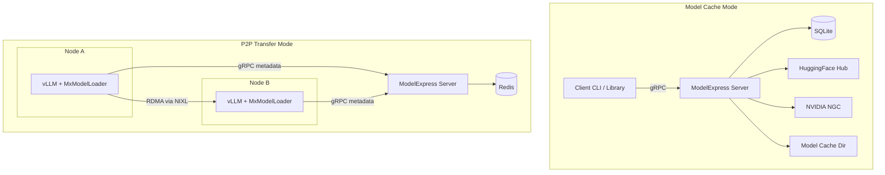
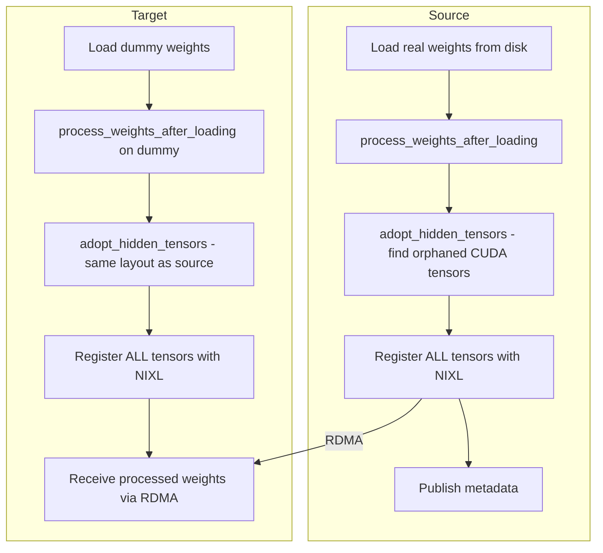

<!--
SPDX-FileCopyrightText: Copyright (c) 2025-2026 NVIDIA CORPORATION & AFFILIATES. All rights reserved.
SPDX-License-Identifier: Apache-2.0
-->

# ModelExpress Architecture

Detailed reference document for the ModelExpress codebase. For deployment and configuration, see [`DEPLOYMENT.md`](DEPLOYMENT.md). For contribution guidelines and dev setup, see [`CONTRIBUTING.md`](../CONTRIBUTING.md). For coding standards and AI assistant instructions, see `CLAUDE.md`. For CLI usage, see [`CLI.md`](CLI.md).

## Project Overview

ModelExpress is a Rust-based model cache management service and GPU-to-GPU model weight transfer system. It serves two roles:

- **Model Cache Service** - A sidecar alongside inference solutions (vLLM, SGLang, NVIDIA Dynamo) that accelerates model downloads from HuggingFace and NGC with SQLite-backed tracking and LRU cache eviction.
- **P2P Weight Transfer** - GPU-to-GPU model weight transfers between vLLM instances using NVIDIA NIXL over RDMA/InfiniBand, enabling ~15-second transfers for 681GB models.

### Current Status

| Model | Status | Transfer Time | Notes |
|-------|--------|---------------|-------|
| DeepSeek-V3 (671B, FP8) | Working | ~15s | 681GB across 8 GPUs @ ~45 Gbps per link |
| Llama 3.3 70B | Working | ~5s | 140GB across 8 GPUs @ ~28 Gbps per link |

## Architecture


```mermaid
graph TD
    subgraph "Model Cache Mode"
        C1[Client CLI / Library] -->|gRPC| S1[ModelExpress Server]
        S1 --> DB[(SQLite)]
        S1 --> HF[HuggingFace Hub]
        S1 --> NGC[NVIDIA NGC]
        S1 --> Cache[Model Cache Dir]
    end

    subgraph "P2P Transfer Mode"
        subgraph "Node A"
            A[vLLM + MxModelLoader]
        end
        subgraph "Node B"
            B[vLLM + MxModelLoader]
        end
        A -->|gRPC metadata| S2[ModelExpress Server]
        B -->|gRPC metadata| S2
        S2 --> R[(Redis)]
        A -- "RDMA via NIXL" --> B
    end
```

### Components

| Component | Language | Location | Purpose |
|-----------|----------|----------|---------|
| Server | Rust | `modelexpress_server/` | gRPC server: model downloads, cache eviction, P2P coordination |
| Rust Client | Rust | `modelexpress_client/src/` | Client library and CLI tool |
| Python Client | Python | `modelexpress_client/python/` | vLLM loaders, NIXL transfer manager, gRPC client |
| Common | Rust | `modelexpress_common/` | Protobuf definitions, shared types, provider trait, config |
| Workspace Tests | Rust | `workspace-tests/` | Integration tests and Criterion benchmarks |

## Repository Structure

```text
ModelExpress/
├── Cargo.toml                          # Workspace root (4 members)
├── Cargo.lock
├── Dockerfile                          # Multi-stage production image
├── docker-compose.yml                  # Single-service dev setup
├── run_integration_tests.sh            # Integration test runner
├── test_client.sh                      # Client test script
├── test_grpc_transfer_k8s.sh           # K8s gRPC transfer test
├── deny.toml                           # cargo-deny config
├── rust-toolchain.toml                 # Rust version pinning
├── rustfmt.toml                        # Formatting config
├── modelexpress-cli-completion.bash    # Shell completions
│
├── modelexpress_server/
│   ├── Cargo.toml
│   └── src/
│       ├── main.rs                     # Server startup, service registration
│       ├── lib.rs                      # Module exports
│       ├── config.rs                   # ServerConfig, layered loading, validation
│       ├── database.rs                 # SQLite ModelDatabase, atomic claim
│       ├── cache.rs                    # CacheEvictionService, LRU policy
│       ├── state.rs                    # P2pStateManager wrapper
│       ├── services.rs                 # Health, API, Model gRPC services
│       ├── p2p_service.rs              # P2P gRPC service implementation
│       ├── source_identity.rs          # SHA256-based mx_source_id computation
│       ├── reaper.rs                   # Server-side stale source detection and GC
│       ├── k8s_types.rs               # Kubernetes CRD type definitions
│       ├── metadata_backend.rs         # MetadataBackend trait + types
│       ├── metadata_backend/
│       │   ├── redis.rs               # Redis backend implementation
│       │   └── kubernetes.rs          # Kubernetes CRD backend implementation
│       └── bin/
│           └── config_gen.rs           # Config file generator/migrator
│
├── modelexpress_client/
│   ├── Cargo.toml
│   └── src/
│       ├── lib.rs                      # Client struct, public API
│       └── bin/
│           ├── cli.rs                  # CLI entry point (modelexpress-cli)
│           ├── test_client.rs          # Concurrent/single download tests
│           ├── fallback_test.rs        # Provider fallback tests
│           └── modules/
│               ├── args.rs             # CLI args (Cli struct, embeds ClientArgs)
│               ├── handlers.rs         # CLI command handlers
│               ├── output.rs           # Output formatting (human, JSON, JSON-pretty)
│               └── payload.rs          # JSON payload reader (inline, file, stdin)
│
├── modelexpress_client/python/
│   ├── pyproject.toml                  # Python package config
│   ├── generate_proto.sh               # Proto stub generation script
│   └── modelexpress/
│       ├── __init__.py                 # Package init, vLLM loader auto-registration
│       ├── client.py                   # MxClient gRPC client
│       ├── heartbeat.py                # Client-side heartbeat for source liveness
│       ├── nixl_transfer.py            # NixlTransferManager
│       ├── gds_transfer.py             # GPUDirect Storage transfer support
│       ├── gds_loader.py               # GDS model loader
│       ├── vllm_loader.py              # MxModelLoader (thin orchestration)
│       ├── load_strategy/              # Loading strategy chain
│       │   ├── __init__.py             # LoadStrategyChain.run()
│       │   ├── base.py                 # LoadStrategy ABC, LoadContext, shared helpers
│       │   ├── rdma_strategy.py        # RdmaStrategy (P2P GPU transfer via NIXL)
│       │   ├── model_streamer_strategy.py # ModelStreamerStrategy (S3/GCS/Azure/local)
│       │   ├── gds_strategy.py         # GdsStrategy (GPUDirect Storage)
│       │   └── default_strategy.py     # DefaultStrategy (vLLM DefaultModelLoader)
│       ├── tensor_utils.py             # Tensor collection, checksums, storage views
│       ├── transfer_safety.py          # MLA feature gate, TransferFingerprint
│       ├── metadata.py                 # Metadata building and publishing
│       ├── rank_utils.py               # Rank detection utilities
│       ├── worker_server.py            # WorkerGrpcServer (P2P tensor manifest)
│       ├── vllm_worker.py              # ModelExpressWorker (custom vLLM worker)
│       ├── types.py                    # TensorDescriptor, WorkerMetadata dataclasses
│       ├── p2p_pb2.py                  # Generated protobuf stubs
│       └── p2p_pb2_grpc.py             # Generated gRPC stubs
│
├── modelexpress_common/
│   ├── Cargo.toml
│   ├── build.rs                        # tonic-build: compiles all 4 proto files
│   ├── proto/
│   │   ├── health.proto                # HealthService
│   │   ├── api.proto                   # ApiService
│   │   ├── model.proto                 # ModelService
│   │   └── p2p.proto                   # P2pService
│   └── src/
│       ├── lib.rs                      # Module exports, gRPC stubs, type conversions
│       ├── cache.rs                    # CacheEvictionConfig, LruConfig, DurationConfig
│       ├── client_config.rs            # ClientConfig, ClientArgs (shared CLI args)
│       ├── config.rs                   # Config trait utilities
│       ├── download.rs                 # Download orchestration (smart-fallback, direct, server-only)
│       ├── models.rs                   # Status, ModelProvider, ModelStatus, ModelStatusResponse
│       ├── providers.rs               # ModelProviderTrait definition, re-exports
│       └── providers/
│           ├── huggingface.rs          # HuggingFaceProvider implementation
│           └── ngc.rs                  # NgcProvider implementation
│
├── workspace-tests/
│   ├── Cargo.toml
│   ├── tests/
│   │   └── integration_tests.rs        # Health, ping, download, fallback tests
│   └── benches/
│       └── performance.rs              # Criterion: DB ops, serialization benchmarks
│
├── helm/
│   ├── Chart.yaml                      # v0.2.2
│   ├── deploy.sh                       # Deploy script (microk8s/kubectl auto-detect)
│   ├── values.yaml                     # Default (1 replica, 10Gi PVC)
│   ├── values-development.yaml         # Dev (debug, 512Mi)
│   ├── values-production.yaml          # Prod (3 replicas, 2Gi, ingress)
│   ├── values-local-storage.yaml       # Test (no PVC, emptyDir)
│   └── templates/
│       ├── deployment.yaml
│       ├── service.yaml
│       ├── pvc.yaml
│       ├── ingress.yaml
│       └── serviceaccount.yaml
│
├── examples/
│   ├── p2p_transfer_k8s/               # GPU-to-GPU weight transfer example
│   │   ├── README.md
│   │   ├── Dockerfile.client           # vLLM + ModelExpress client image
│   │   ├── model-download.yaml         # Model weights download job
│   │   ├── server/
│   │   │   ├── kubernetes_backend/     # CRD-based metadata (crd, rbac, server)
│   │   │   └── redis_backend/          # Redis-based metadata (redis, server)
│   │   └── client/
│   │       └── vllm/
│   │           ├── vllm-single-node.yaml  # TP-only (DeepSeek-V3)
│   │           └── vllm-multi-node.yaml   # TP+PP (Kimi-K2.5, 2 nodes)
│   ├── aggregated_k8s/                 # Dynamo aggregated serving example
│   │   ├── README.md
│   │   └── agg.yaml
│   └── dynamo_p2p_transfer_k8s/        # Dynamo DGD with P2P weight transfer
│       ├── Dockerfile                   # dynamo vllm-runtime + MX client
│       ├── README.md
│       └── vllm/
│           ├── crd-modelmetadata.yaml   # ModelMetadata CRD (cluster-admin)
│           ├── rbac-modelmetadata.yaml  # ServiceAccount + Role + RoleBinding
│           └── vllm-multi-node-aggregated.yaml  # DGD: MX server + Frontend + VllmWorker
│
├── docs/
│   ├── ARCHITECTURE.md                 # Architecture reference
│   ├── CLI.md                          # CLI tool documentation
│   ├── DEPLOYMENT.md                   # Deployment and configuration guide
│   └── metadata.md                     # Metadata storage and coordination protocol
│
├── .devcontainer/
│   ├── devcontainer.json               # VSCode config: rust-analyzer, port 8001
│   └── Dockerfile                      # Ubuntu 24.04 dev env
│
├── .github/
│   ├── copilot-instructions.md         # GitHub Copilot agent instructions
│   ├── dco.yml                         # DCO enforcement
│   └── workflows/
│       ├── ci.yml                      # CI pipeline
│       └── codeql.yml                  # Security scanning
│
├── .cursor/
│   └── rules/
│       └── rust.mdc                    # Cursor agent instructions
│
├── .pre-commit-config.yaml             # Pre-commit hooks config
└── .coderabbit.yaml                    # CodeRabbit review config
```

## Workspace and Crate Structure

| Crate | Package Name | Type | Binary Targets |
|-------|-------------|------|----------------|
| `modelexpress_server` | `modelexpress-server` | lib + bin | `modelexpress-server`, `config_gen` |
| `modelexpress_client` | `modelexpress-client` | lib + bin | `modelexpress-cli`, `test_client`, `fallback_test` |
| `modelexpress_common` | `modelexpress-common` | lib | (none) |
| `workspace-tests` | `workspace-tests` | test + bench | (integration tests, criterion benchmarks) |

All cargo dependencies are declared in the root `Cargo.toml`. Sub-crates use workspace dependencies exclusively.

## gRPC Services

Four proto files define four services, all compiled via `tonic-build` in `modelexpress_common/build.rs`:

### health.proto - HealthService

| RPC | Request | Response | Purpose |
|-----|---------|----------|---------|
| `GetHealth` | `HealthRequest` | `HealthResponse` | Server version, status, uptime |

### api.proto - ApiService

| RPC | Request | Response | Purpose |
|-----|---------|----------|---------|
| `SendRequest` | `ApiRequest` | `ApiResponse` | Generic API (e.g., "ping" -> "pong") |

### model.proto - ModelService

| RPC | Request | Response | Purpose |
|-----|---------|----------|---------|
| `EnsureModelDownloaded` | `ModelDownloadRequest` | stream `ModelStatusUpdate` | Trigger download, stream progress |
| `StreamModelFiles` | `ModelFilesRequest` | stream `FileChunk` | Stream model file contents (1MB chunks) |
| `ListModelFiles` | `ModelFilesRequest` | `ModelFileList` | List files with sizes |

Key message types: `ModelProvider` (HuggingFace, NGC), `ModelStatus` (Downloading, Downloaded, Error), `ModelStatusUpdate`, `FileChunk`.

### p2p.proto - P2pService

| RPC | Request | Response | Purpose |
|-----|---------|----------|---------|
| `PublishMetadata` | `PublishMetadataRequest` | `PublishMetadataResponse` | Source publishes worker metadata (identity + tensors + backend metadata) |
| `ListSources` | `ListSourcesRequest` | `ListSourcesResponse` | Lightweight listing of available source workers (no tensor data) |
| `GetMetadata` | `GetMetadataRequest` | `GetMetadataResponse` | Fetch full tensor metadata for one specific worker (MB-scale, on demand) |
| `UpdateStatus` | `UpdateStatusRequest` | `UpdateStatusResponse` | Update per-worker lifecycle status (Initializing/Ready/Stale) |

Key message types: `SourceIdentity` (all fields affecting tensor layout compatibility), `WorkerMetadata` (rank, oneof backend_metadata, tensors, status, P2P endpoint fields), `TensorDescriptor` (name, addr, size, device_id, dtype), `SourceInstanceRef` (lightweight worker reference for listing).

### p2p.proto - WorkerService (P2P, opt-in)

| RPC | Request | Response | Purpose |
|-----|---------|----------|---------|
| `GetTensorManifest` | `GetTensorManifestRequest` | `GetTensorManifestResponse` | Fetch tensor descriptors directly from a source worker |

Per-worker gRPC service started when `MX_P2P_METADATA=1`, or unconditionally when using a decentralized metadata backend (the backend's client sets `REQUIRES_P2P_METADATA = True` and the env var is ignored). Targets call this instead of fetching tensor descriptors from the central server. Validates `mx_source_id` to catch stale discovery.

See [`metadata.md`](metadata.md) for the full metadata architecture including storage schemas and coordination protocol.

## Rust Server

### Startup Flow

1. Parse CLI args (`ServerArgs` via clap)
2. Load config (`ServerConfig::load()`) - CLI > env vars > config file > defaults
3. Initialize structured logging (tracing-subscriber)
4. Create SQLite database (`ModelDatabase`)
5. Optionally start `CacheEvictionService` background task
6. Connect to metadata backend (Redis or Kubernetes CRD) for P2P state
7. Start reaper background task for stale source detection and GC
8. Register 4 gRPC services with tonic (max message size: 100MB)
9. Listen on configured address (default `0.0.0.0:8001`)
10. Graceful shutdown on CTRL+C (signals cache eviction service and reaper)

### ServerConfig

```yaml
server:
  host: "0.0.0.0"        # MODEL_EXPRESS_SERVER_HOST
  port: 8001              # MODEL_EXPRESS_SERVER_PORT
database:
  path: "./models.db"     # MODEL_EXPRESS_DATABASE_PATH
cache:
  directory: "./cache"    # MODEL_EXPRESS_CACHE_DIRECTORY
  max_size_bytes: null
  eviction:
    enabled: true         # MODEL_EXPRESS_CACHE_EVICTION_ENABLED
    policy:
      type: lru
      unused_threshold: "7d"
      max_models: null
      min_free_space_bytes: null
    check_interval: "1h"
logging:
  level: info             # MODEL_EXPRESS_LOG_LEVEL
  format: pretty          # MODEL_EXPRESS_LOG_FORMAT
  file: null
  structured: false
```

### ModelDatabase (SQLite)

Schema: single `models` table with columns `model_name` (PK), `provider`, `status`, `created_at`, `last_used_at`, `message`. Indexed on `last_used_at` for LRU queries.

Key operations:

| Method | Purpose |
|--------|---------|
| `get_status(name)` | Query download status |
| `set_status(name, provider, status, msg)` | Create/update via INSERT OR REPLACE |
| `try_claim_for_download(name, provider)` | Atomic compare-and-swap (INSERT OR IGNORE) |
| `touch_model(name)` | Update `last_used_at` for LRU tracking |
| `delete_model(name)` | Remove record |
| `get_models_by_last_used(limit)` | LRU query, oldest first |
| `get_status_counts()` | Count by status (downloading, downloaded, error) |

Concurrency: `Arc<Mutex<Connection>>` with poison recovery.

### CacheEvictionService

Runs in a background tokio task on a configurable interval (default 1 hour). LRU eviction policy:

1. Time-based: evict models with `last_used_at` older than `unused_threshold` (default 7 days)
2. Count-based: if total > `max_models`, evict oldest excess
3. Only DOWNLOADED models are eligible for eviction

### P2P Metadata Backends

Two families of backends exist: **server-coordinated** (the server owns the metadata store) and **decentralized** (no central server in the loop).

Server-coordinated backends live in the Rust server and are selected via `MX_METADATA_BACKEND`:

- **Redis** (`redis`): Source index hashes (`mx:source:{source_id}`) with an `__attributes__` field storing `SourceIdentity` and `{worker_id}` fields as presence markers. Worker data stored in separate hashes (`mx:source:{source_id}:{worker_id}`). Stale detection and cleanup handled by the server-side reaper.
- **Kubernetes** (`kubernetes`/`k8s`/`crd`): `ModelMetadata` CRDs (one per worker) with `ConfigMap`s for tensor descriptors. Owner references for automatic garbage collection. Standard Kubernetes `status.conditions` (`Ready`) and `status.observedGeneration` are maintained so that `kubectl wait --for=condition=Ready` works. Stale detection handled by the server-side reaper.

The decentralized backend lives in the Python client and is selected via `MX_METADATA_BACKEND`:

- **K8s-service** (`k8s-service`/`service`): each source pool sits behind a Kubernetes Service (one per tensor-parallel rank, label selector pinned to `mx.rank=R`). Clients open a direct gRPC channel to the Service DNS and call `GetTensorManifest`; kube-proxy load-balances across ready backends. No central server is involved. `mx_source_id` is computed client-side via the same canonical JSON + SHA256 scheme and validated on the response. See [`../examples/k8s_service_sources/`](../examples/k8s_service_sources/) for the deployment shape.

Each worker publishes independently. The `mx_source_id` is a 16-char hex key computed from `SHA256(canonical_json(SourceIdentity))` where `SourceIdentity` includes a `revision` field for content-addressed identity (HuggingFace commit SHA, S3 object version, or a deployer-provided string). When `revision` names immutable content, two sources with identical `mx_source_id` are expected to serve bit-identical weight bytes; the ID itself validates declared identity rather than hashing tensor contents, so the guarantee is only as strong as the revision pin and the local cache being intact. Large u64 values (GPU addresses) are serialized as strings to avoid JSON precision loss.

The Rust and Python implementations of `compute_mx_source_id` are locked together via cross-checked pinned-hash unit tests (`source_identity.rs::test_python_cross_check_*` and `test_source_id.py::test_pinned_hash_*`). Either side drifting on canonical JSON encoding or hashing breaks both test sets together.

See [`metadata.md`](metadata.md) for the full storage layout and schemas.

### Backend choice: stable-weight inference vs live-refit

The choice between server-coordinated and decentralized backends is not purely about operational simplicity; the two families have structurally different guarantees around **source addressability**, which dictates what workloads each can support.

**Server-coordinated backends (Redis / Kubernetes-CRD) give you per-worker addressability.** The central store is organised around `(mx_source_id, worker_id)` tuples, and the client-facing RPCs reflect that:

1. `ListSources(identity)` returns every worker currently serving any source for that identity, including their individual `worker_id`s and `worker_rank`s.
2. `GetMetadata(mx_source_id, worker_id)` fetches *that specific worker's* current `WorkerMetadata` - its NIXL endpoint, agent name, tensor descriptors, status.
3. `PublishMetadata(identity, worker_metadata, worker_id)` is the worker's own way of updating its record. If the identity is unchanged but tensor layout or endpoint has shifted, the worker republishes under the same `worker_id`, the server overwrites the record, and the next `GetMetadata` call on that `worker_id` returns the fresh state. If the identity changes (e.g. the worker refits to a new `revision`), the worker simply publishes under the new `mx_source_id` with the same `worker_id`; `HeartbeatThread` stops renewing the old record, the server-side reaper cleans it up after the TTL.

The central store therefore functions as an authoritative, updatable directory of live source workers. A target that wants to pull from "worker W as it exists right now" can: ask the server, get W's current NIXL endpoint + tensor manifest, NIXL-pull from that exact worker. If W was mid-refit when the target looked it up, W's record is either still the old state (safe - old weights still in memory) or already the new state (safe - W flipped its record after the new weights landed). W's publish ordering ensures the record is never externally inconsistent with W's GPU memory.

This property is what lets the central-coordinator backends support **live weight updates** (RL rollouts, fine-tune broadcasts, continuous checkpoint refresh). W updates its weights, publishes the new state, the server reflects it, future targets see the new state. Older targets that already read the previous record get older weights - stale but consistent. The RL loop tolerates that by design.

**The decentralized `k8s-service` backend gives you pool-level addressability only.** The K8s Service selector is the discovery mechanism; kube-proxy routes each incoming connection to a random ready backend. There is no way through the gRPC call to say "I want worker W specifically, not whichever of the N ready pods kube-proxy happened to pick." That's a deliberate simplification - it's what lets the backend work with zero infrastructure beyond the Service itself - but it has hard consequences:

- Every ready pod in a given Service pool must serve an identical `mx_source_id`. Otherwise the caller's retry loop starts eating into `MX_K8S_SOURCE_RETRIES` to walk past mismatches, and that budget is finite.
- When a single pod refits in place, the Service pool is temporarily inconsistent. The retry loop handles it for a few attempts, which covers a normal rolling update (pods refit in sequence, transition window is bounded). It does *not* cover a continuously-shifting pool where pods refit every few minutes and callers arrive on arbitrary pods throughout.
- There is no per-worker state tracking. The `WorkerGrpcServer` holds one `(tensor_protos, mx_source_id, metadata_endpoint)` tuple bound at construction time (in `metadata.py`'s `publish_metadata_and_ready`). Nothing in the current servicer lets a live pod atomically swap that tuple for a new one.

**Concretely:** an RL rollout workload - training step produces new weights, all inference pods refit, repeat - needs per-worker addressability. A target pulling during the refit window needs to either see `worker W at revision v42` or `worker W at revision v43`, consistently, from the same source. The central-coordinator model provides that. The Service-routed model can't, because "which source" is not a concept the caller can express.

**What would it take to support live refit on the k8s-service backend?** A `WorkerGrpcServer.update_tensors()` method that atomically swaps `(tensor_protos, mx_source_id, metadata_endpoint)` under a lock, plus a trigger mechanism (vLLM weight-reload hook, S3 object-version watch, or external orchestrator poke) that causes every pod in a pool to refit in roughly-synchronised fashion. The retry loop already handles the transient cross-pod mismatch. Neither piece exists today; both are tractable if the workload demand appears. Until they do, live-refit workloads should stay on the central-coordinator backends.

### k8s-service: Service naming and identity drift

**The core design property of this backend: Service names are deliberately decoupled from `mx_source_id`.** The Service name is a deployer-chosen string that lives in the Kubernetes namespace; `mx_source_id` is an internal MX value derived cryptographically from `SourceIdentity` fields (model, dtype, quantization, TP, revision, mx_version, proto schema). These two namespaces never see each other, never reconcile automatically, and have no mechanism to stay in sync beyond operator discipline. **It is the operator's responsibility** to make sure the Service their pods sit behind actually serves the identity their client is asking for.

That decoupling is the whole reason the backend is robust to library-side changes: `mx_version` bumps, `SourceIdentity` proto additions, canonical-JSON tweaks all shift `mx_source_id` without touching Service names, so a Helm chart written today keeps resolving after every future MX release. The cost is that the operator owns the alignment between what the Service is named and what identity its pods serve, and any misalignment has to be caught downstream rather than prevented by the naming scheme itself.

**The handshake is the safety net.** Every `GetTensorManifest` call passes an `mx_source_id`. If the client resolves its pattern, connects to a pod, and that pod's `WorkerServiceServicer` is serving a different `mx_source_id`, it returns `FAILED_PRECONDITION`. The client retries on a fresh channel up to `MX_K8S_SOURCE_RETRIES` times so kube-proxy can route to a potentially-matching backend. Content mismatches fail loudly and give you a retry budget; they never silently transfer wrong weights.

The coordination contract: the string returned by substituting `{rank}` into `MX_K8S_SERVICE_PATTERN` must exactly match the `metadata.name` of a Kubernetes Service whose selector scopes to pods serving a matching `mx_source_id`. If the DNS name doesn't resolve, the client gets connection-refused (operator pattern typo, unresolvable). If it resolves to a pod serving the wrong `mx_source_id`, the handshake catches it.

**Multi-model deployments:** multiple models coexist in one cluster by giving each model Deployment its own Service-name prefix and its own `MX_K8S_SERVICE_PATTERN`. Example for two distinct models:

```text
Model A Deployment:
  Services: model-a-rank-0, model-a-rank-1, ..., model-a-rank-7
  Pods env: MX_K8S_SERVICE_PATTERN=model-a-rank-{rank}:6555

Model B Deployment:
  Services: model-b-rank-0, model-b-rank-1, ..., model-b-rank-7
  Pods env: MX_K8S_SERVICE_PATTERN=model-b-rank-{rank}:6555
```

Both Deployments run concurrently; the per-pod env var is the only per-model coordination needed. There is no global Service pool to share, and nothing in one model's pattern can accidentally resolve to the other model's pool (different DNS names entirely).

**Why `{mx_source_id}` substitution isn't part of the pattern:** using the `mx_source_id` hash as the Service name isn't viable from a UX perspective, even though it would superficially offer "wrong-identity traffic can't even reach the wrong Service" as a DNS-level guarantee. The cost is silent brittleness under any change that shifts `mx_source_id`:

- `mx_version` bumps on every ModelExpress release. A routine container-image bump changes every pod's computed source_id without the deployer touching their Helm values; the declared Service names go stale; resolution fails cluster-wide.
- `SourceIdentity` proto gaining fields (like `revision`, added for this backend). All pre-computed hashes shift by one schema revision. Every Helm chart in the wild becomes stale on the next release unless the deployer re-runs the hashing CLI and re-applies.
- `revision` / `dtype` / `quantization` / TP reshape. Any of these updates re-hashes. Rolling update across one of these boundaries puts half the pool at one name and half at another; the Service selector only matches one.
- Operators have no way to recover a "hash mismatch" failure except by re-deriving and re-applying Services in lockstep with client config. There's no graceful degradation to "any pod serving the right identity" because the DNS layer hard-fails before the source_id handshake even runs.

The deployer-chosen name used today is strictly more robust to library-side drift: `mx_version` bumps don't touch the Service name, `SourceIdentity` schema changes don't touch the Service name, only an explicit rename does. Identity skew that does occur at the content level is caught by the existing `FAILED_PRECONDITION` path, which can retry across the pool for a potential match - graceful degradation rather than hard fail at DNS.

**What's stable about the current contract:**

- Service names are chosen by the deployer and persist across MX releases, proto schema changes, and revision pins. A Deployment manifest written today keeps working after a library upgrade without re-templating.
- `{rank}` is the only substitution, and rank is a deployment-topology property, not a library-version property. Deployer's declared name and client's substituted pattern use the same static prefix forever.

**What can still drift (runtime, not configuration):**

- `SourceIdentity` content changes (revision bump, quantization tweak) between source and target pods produce different `mx_source_id`s. The DNS name still resolves; the handshake catches the mismatch and the retry loop walks the pool.
- Partial-version rolling updates leave a pool mixed between two identities. Same handshake/retry path handles it as long as at least one pod matches.

Runtime drift gets a retry budget; configuration drift (typo in the pattern vs a typo in the Service name) never occurs because the string is under deployer control, declared once, and doesn't depend on cryptographic coincidence.

### ModelDownloadTracker

Global singleton (`LazyLock<ModelDownloadTracker>`) that coordinates concurrent downloads. Uses `try_claim_for_download()` for race-free model claiming and tokio channels for streaming status updates to multiple waiting clients.

## Rust Client

### Client Public API

The `Client` struct in `modelexpress_client/src/lib.rs` wraps gRPC connections:

| Method | Purpose |
|--------|---------|
| `new(config)` | Create client with config |
| `health_check()` | Call HealthService |
| `ping()` | Call ApiService with "ping" |
| `download_model(name, provider)` | Trigger download via streaming RPC |
| `download_model_direct(name, provider, cache_dir)` | Download directly from provider |
| `ensure_model(name, provider, strategy)` | Smart download with fallback strategy |
| `stream_model_files(name)` | Stream model files from server |
| `list_model_files(name)` | List model files on server |
| `delete_model(name, cache_dir)` | Delete cached model |
| `validate_model(name, cache_dir)` | Validate cached model integrity |

### Download Strategies

| Strategy | Behavior |
|----------|----------|
| `SmartFallback` | Try server first, fall back to direct download on failure |
| `ServerOnly` | Only download through the server |
| `DirectOnly` | Only download directly from provider |

### CLI (modelexpress-cli)

The `Cli` struct in `args.rs` embeds `ClientArgs` via `#[command(flatten)]`. Commands:

| Command | Purpose |
|---------|---------|
| `health` | Check server health |
| `ping` | Ping server |
| `model download <name>` | Download a model |
| `model list-files <name>` | List model files |
| `model clear <name>` | Delete cached model |
| `model validate <name>` | Validate model integrity |

Output formats: `--format human` (default), `--format json`, `--format json-pretty`.

## Common Library

### Modules

| Module | Purpose |
|--------|---------|
| `cache` | `CacheEvictionConfig`, `LruConfig`, `DurationConfig` (used by both server and client configs) |
| `client_config` | `ClientConfig` + `ClientArgs` shared struct for CLI argument handling |
| `config` | Config trait utilities |
| `download` | Download orchestration with strategy pattern |
| `models` | `Status`, `ModelProvider`, `ModelStatus`, `ModelStatusResponse` |
| `providers` | `ModelProviderTrait` + `HuggingFaceProvider` + `NgcProvider` |
| `grpc` | Generated tonic stubs for all 4 services |
| `constants` | `DEFAULT_GRPC_PORT` (8001), `DEFAULT_TIMEOUT_SECS` (30), `DEFAULT_TRANSFER_CHUNK_SIZE` (32KB) |

### ModelProviderTrait

```rust
#[async_trait]
pub trait ModelProviderTrait: Send + Sync {
    async fn download_model(&self, name: &str, cache_path: Option<PathBuf>, ignore_weights: bool) -> Result<PathBuf>;
    async fn delete_model(&self, name: &str) -> Result<()>;
    async fn get_model_path(&self, name: &str, cache_dir: PathBuf) -> Result<PathBuf>;
    fn provider_name(&self) -> &'static str;
    fn is_ignored(filename: &str) -> bool;
    fn is_image(path: &Path) -> bool;
    fn is_weight_file(filename: &str) -> bool;
}
```

Two implementations:
- `HuggingFaceProvider` — uses the `hf-hub` crate with high-CPU download mode.
- `NgcProvider` — downloads from NVIDIA NGC via the V2 artifact API (Bearer-authenticated `/files/{path}` for team artifacts; presigned S3 URLs for org-level artifacts). Falls back to `checksums.blake3` manifest enumeration when bulk file listing returns 400. Resolves the NGC API key from `NGC_API_KEY`, `NGC_CLI_API_KEY`, or `~/.ngc/config`.

### ClientConfig / ClientArgs

`ClientArgs` is the single source of truth for shared CLI arguments. `Cli` embeds it via `#[command(flatten)]`.

Loading precedence: CLI args > environment variables > config file > defaults.

## Python Client

### Modules

| Module | Purpose |
|--------|---------|
| `__init__.py` | Package init, exports `register_modelexpress_loaders()` for callers to register the `mx` loader with vLLM |
| `client.py` | `MxClient` - gRPC client wrapping `PublishMetadata`, `ListSources`, `GetMetadata`, and `UpdateStatus` RPCs |
| `heartbeat.py` | `HeartbeatThread` - background thread sending periodic `UpdateStatus(READY)` and `STALE` on shutdown |
| `nixl_transfer.py` | `NixlTransferManager` - NIXL agent lifecycle, tensor registration, RDMA transfers |
| `gds_transfer.py` | GPUDirect Storage availability check and transfer utilities |
| `gds_loader.py` | `MxGdsLoader` - GDS-based model loader (direct file-to-GPU) |
| `vllm_loader.py` | `MxModelLoader` - thin orchestration, delegates to `LoadStrategyChain` |
| `load_strategy/` | Loading strategy chain: `RdmaStrategy`, `ModelStreamerStrategy` (S3/GCS/Azure/local), `GdsStrategy`, `DefaultStrategy` |
| `tensor_utils.py` | Tensor collection, checksums, storage views, `capture_tensor_attrs` |
| `metadata.py` | `build_source_identity`, `publish_metadata_and_ready`, retry logic |
| `rank_utils.py` | `get_global_rank`, `get_worker_rank` |
| `worker_server.py` | `WorkerGrpcServer` - per-worker gRPC server for P2P tensor manifest exchange |
| `vllm_worker.py` | `ModelExpressWorker` - custom vLLM worker class (use `--worker-cls=modelexpress.vllm_worker.ModelExpressWorker`) |
| `types.py` | `TensorDescriptor`, `WorkerMetadata`, `GetMetadataResponse` dataclasses |
| `p2p_pb2.py` / `p2p_pb2_grpc.py` | Generated protobuf/gRPC stubs |

### MxClient

gRPC client wrapping the P2P service stubs:

| Method | Purpose |
|--------|---------|
| `publish_metadata(identity, worker, worker_id)` | Publish worker metadata; returns `mx_source_id` |
| `list_sources(identity, status_filter)` | List available source workers (lightweight, no tensor data) |
| `get_metadata(mx_source_id, worker_id)` | Fetch full tensor metadata for one worker (on demand) |
| `update_status(mx_source_id, worker_id, worker_rank, status)` | Update worker lifecycle status (e.g., `READY`) |
| `close()` | Close the underlying gRPC channel |

### NixlTransferManager

Manages a NIXL agent and RDMA transfers for a single GPU worker:

| Method | Purpose |
|--------|---------|
| `__init__(agent_name, device_id, listen_port)` | Create NIXL agent with UCX backend; `listen_port` enables P2P listen thread |
| `register_tensors(tensors)` | Register GPU tensors for RDMA, return serialized metadata |
| `get_registered_descriptors()` | Return region descriptors (`MX_CONTIGUOUS_REG=1`) or tensor descriptors |
| `fetch_remote_and_wait(agent_name, ip, port)` | P2P: fetch remote NIXL metadata via listen thread (polls until loaded) |
| `receive_from_source(source_metadata, source_tensors, ..., remote_agent_name)` | Execute RDMA read transfer; `remote_agent_name` skips `add_remote_agent` (P2P) |
| `shutdown()` | Clean up NIXL agent and resources |

### vLLM Loader

**MxModelLoader** (extends `BaseModelLoader`, registered as `--load-format mx`):

Thin orchestration layer that delegates to `LoadStrategyChain.run()`. Builds a `LoadContext` from vLLM config, initializes the model, runs the strategy chain, and updates global registries.

**LoadStrategyChain** (`load_strategy/`):

Auto-detects the best loading strategy with a prioritized chain. Each strategy is a subclass of `LoadStrategy` (ABC) with `is_available(ctx)` and `load(model, ctx)` methods. The chain filters to eligible strategies and runs them in order until one succeeds:

| Priority | Strategy | `is_available()` | Behavior |
|---|---|---|---|
| p0 | `RdmaStrategy` | NIXL available + MLA check passes | `ListSources(READY)`, filter by `worker_rank`, shuffle, try candidates (max 3). On `SourceTransferError` or `ManifestMismatchError`, try next. |
| p1 | `ModelStreamerStrategy` | `MX_MODEL_URI` set + `runai_model_streamer` installed | Stream safetensors to GPU via CPU staging buffer. `MX_MODEL_URI` accepts remote URIs (`s3://`, `gs://`, `az://`), absolute local paths, or HF model IDs (resolved via `HF_HUB_CACHE`). All storage backends (S3, GCS, Azure) included by default. |
| p2 | `GdsStrategy` | GDS hardware available | Load via `MxGdsLoader` (direct file-to-GPU). Falls through on failure. |
| p3 | `DefaultStrategy` | Always | vLLM `DefaultModelLoader` (CPU-staged, auto-downloads from HF Hub). |

Each strategy is fully self-contained: it handles weight loading, post-processing (`process_weights_after_loading`), NIXL tensor registration, and metadata publishing. New strategies can be added by creating a new file in `load_strategy/` and registering it in `LoadStrategyChain.run()`.

### Transfer Safety

`RdmaStrategy.is_available()` checks `transfer_safety.check_transfer_allowed()` before attempting P2P transfer. Currently the only blocked feature is MLA (Multi-head Latent Attention), detected via `kv_lora_rank` in the HF model config. MLA models (DeepSeek-V2/V3, Kimi K2/K2.5, GLM-5.1, and any future model using MLA) fall back to GDS or disk loading automatically.

NVFP4 MoE models (known case: Kimi-K2.5-NVFP4) previously produced corrupted inference after RDMA transfer despite all registered tensor bytes matching. This is a specific instance of a broader class of bugs: post-processing stashes computed state on non-Module objects (e.g. `FusedMoEQuantConfig.a1_gscale = 1/activation_scale` on the quant method), which is invisible to `named_parameters()`/`named_buffers()`. On the target those values are computed from dummy weights before RDMA, and RDMA only overwrites the registered tensors, so the stashed values stay wrong. Note DeepSeek-V3 (MLA + FP8) is not affected — FP8 scale state lives on Modules and is already captured. The fix (`adopt_hidden_tensors()`) recursively scans module attributes for orphaned CUDA tensors and registers them as non-persistent buffers so they are included in the RDMA manifest. Verified correct on vLLM v0.17.1 and v0.19.0 with Kimi-K2.5-NVFP4. Set `MX_SKIP_FEATURE_CHECK=1` to bypass the MLA feature gate for models in this class.

During transfer, `ManifestMismatchError` is raised if source and target tensor names or sizes don't match. This triggers trying the next source candidate rather than marking the source as stale, which is important during rolling updates where pods may run different image versions.

After loading by any strategy, the worker starts a `HeartbeatThread` that periodically sends `UpdateStatus(READY)` to keep `updated_at` fresh. On clean shutdown, the heartbeat sends `UpdateStatus(STALE)` via an `atexit` handler. Metadata publish failures are logged but do not crash the worker.

Each GPU worker generates a unique `worker_id` (`uuid4().hex[:8]`) at init and publishes independently. Workers use `torch.distributed.get_rank()` as their global rank (captures both TP and PP position).

### Tensor Discovery

The loader uses `iter_module_tensors()` (in `tensor_utils.py`) to walk the full PyTorch module tree and find all CUDA tensors after post-processing. This discovers three categories:

| Category | Source | Example |
|----------|--------|---------|
| Parameters | `module._parameters` | `layers.0.attention.weight` |
| Buffers | `module._buffers` | Batch norm running mean |
| Tensor attributes | `dir(module)` scan | FP8 `weight_scale`, `_k_scale` |

This is more thorough than `named_parameters()` which only finds parameters and would miss tensors created during `process_weights_after_loading()`. Non-contiguous tensors (e.g. MLA's `W_UV` and `W_UK_T` sharing a dequantized intermediate) are registered as flat byte views of their underlying storage via `storage_view()`. Multiple views into the same storage are deduplicated by `data_ptr()` so tied weights are only transferred once.

Before tensor collection, `adopt_hidden_tensors()` scans each module's non-Module attributes recursively for CUDA tensors not already in `named_parameters()`/`named_buffers()`. These "orphaned" tensors (e.g. `FusedMoEQuantConfig.a1_gscale`, FlashInfer workspace buffers) are registered as non-persistent buffers so they appear in the manifest. Without this, the target's quant method objects retain values computed from dummy weights, causing incorrect inference despite all registered tensor bytes matching.

## NIXL Integration

### What is NIXL?

NIXL (NVIDIA Interconnect eXchange Library) provides zero-copy GPU-to-GPU RDMA transfers on top of UCX:

| Concept | Description |
|---------|-------------|
| **Agent** | NIXL instance managing one GPU's memory registrations and transfers |
| **Memory Registration** | GPU memory must be registered before RDMA access; generates rkeys |
| **Metadata** | Serialized agent info (address, rkeys) shared between source/target |
| **Transfer Descriptor** | Prepared list of (addr, size, device) for bulk transfer |
| **rkey** | Remote key - RDMA authorization token for remote memory access |

### How ModelExpress Uses NIXL

```python
# 1. Create NIXL agent (one per GPU worker)
from nixl._api import nixl_agent, nixl_agent_config
config = nixl_agent_config(backends=["UCX"])
agent = nixl_agent("worker-0", config)

# 2. Register GPU tensors for RDMA access
tensors = [(tensor.data_ptr(), tensor.numel() * tensor.element_size(), device_id, "cuda")]
agent.register_memory(tensors, "VRAM")

# 3. Get metadata for remote agent connection
metadata = agent.get_local_md()  # Share this with target

# 4. On target: connect to source and transfer
agent.add_remote_agent("source-worker-0", source_metadata)
src_descs = agent.prep_xfer_dlist("source-worker-0", source_tensors, "cuda", ["UCX"])
dst_descs = agent.prep_xfer_dlist("", local_tensors, "cuda", ["UCX"])
handle = agent.make_prepped_xfer("READ", dst_descs, indices, src_descs, indices, ["UCX"])
agent.transfer(handle)

# 5. Wait for completion
while agent.check_xfer_state(handle) not in ("DONE", "SUCCESS"):
    time.sleep(0.001)
agent.release_xfer_handle(handle)
```

## FP8 Model Handling (DeepSeek-V3)

vLLM's `process_weights_after_loading()` transforms model weights into kernel-friendly formats (FP8 scale repacking, NVFP4 padding/swizzling, MLA dequantized projections) and may create new tensors as bare attributes, buffers, or on quant method objects.

The solution: both source and target run `process_weights_after_loading()` first, then `adopt_hidden_tensors()` discovers any CUDA tensors on non-Module objects (quant configs, kernel objects), and finally `register_tensors()` collects everything for RDMA. The target runs post-processing on dummy data to establish the correct tensor layout, receives the real data via RDMA, and all state (including hidden quant config tensors) is correct.


```mermaid
graph TD
    subgraph Source
        S1[Load real weights from disk]
        S2[process_weights_after_loading]
        S3[adopt_hidden_tensors - find orphaned CUDA tensors]
        S4[Register ALL tensors with NIXL]
        S5[Publish metadata]
        S1 --> S2 --> S3 --> S4 --> S5
    end
    subgraph Target
        T1[Load dummy weights]
        T2[process_weights_after_loading on dummy]
        T3[adopt_hidden_tensors - same layout as source]
        T4[Register ALL tensors with NIXL]
        T5[Receive processed weights via RDMA]
        T1 --> T2 --> T3 --> T4 --> T5
    end
    S4 -- "RDMA" --> T5
```

## Coordination Protocol

### Flow

1. **Source loads**: Loads weights from storage (S3/GCS/Azure/local via ModelStreamer, GDS, or disk), runs `process_weights_after_loading()`
2. **Source publishes**: Registers tensors with NIXL, calls `PublishMetadata(identity, worker, worker_id)` -> gets `mx_source_id` (status=INITIALIZING). In P2P mode (`MX_P2P_METADATA=1`, or auto-forced on by decentralized backends like `k8s-service`), publishes only lightweight endpoint pointers and starts a `WorkerGrpcServer` for tensor manifest serving.
3. **Heartbeat starts**: `HeartbeatThread` sends `UpdateStatus(READY)` every 30s, refreshing `updated_at`
4. **Target discovers**: Calls `ListSources(identity, status=READY)`, filters by `worker_rank`
5. **Target fetches on demand**: Calls `GetMetadata(mx_source_id, worker_id)` for the chosen candidate. Auto-detects P2P mode if `worker_grpc_endpoint` is populated - fetches tensors from the source worker's `WorkerService` and NIXL metadata via the listen thread instead of from the central server.
6. **Target transfers**: Executes RDMA reads from source; on `SourceTransferError` tries next candidate (max 3)
7. **Target becomes source**: After receiving weights, publishes own metadata and starts its own heartbeat
8. **Stale detection**: Server-side reaper marks workers STALE if `updated_at` > 90s old; GC deletes after 1 hour

See [`metadata.md`](metadata.md) for the full storage schema and debugging guide.

## Environment Variables

### ModelExpress Configuration

| Variable | Default | Description |
|----------|---------|-------------|
| `MX_REGISTER_LOADERS` | `1` | Auto-register the mx loader with vLLM |
| `MODEL_EXPRESS_URL` | `localhost:8001` | gRPC server address |
| `MX_SERVER_ADDRESS` | `localhost:8001` | Backward-compat alias for `MODEL_EXPRESS_URL` |
| `MX_METADATA_BACKEND` | (required on server; `""` on client) | Server: `redis` or `kubernetes`. Client: `""` / `server` / `redis` / `kubernetes` (central server) or `k8s-service` (decentralized via K8s Service routing) |
| `MX_CONTIGUOUS_REG` | `0` | Enable contiguous region registration (experimental) |
| `MX_P2P_METADATA` | `0` | Enable P2P metadata exchange on source workers. Opt-in on central-coordinator backends; auto-enabled (env var ignored) on decentralized backends |
| `MX_MODEL_REVISION` | (from vLLM config) | Override for `SourceIdentity.revision`. Pin to the exact checkpoint identifier so `mx_source_id` is content-addressed |
| `MX_K8S_SERVICE_PATTERN` | `mx-sources-rank-{rank}:6555` | DNS template for the `k8s-service` backend; `{rank}` is substituted with the worker's own rank |
| `MX_K8S_SOURCE_RETRIES` | `5` | `k8s-service` max retries on `FAILED_PRECONDITION` (rolling-update transients). Fresh gRPC channel per attempt so kube-proxy re-picks a backend |
| `MX_K8S_SOURCE_BACKOFF_SECONDS` | `0.5` | `k8s-service` sleep between retry attempts |
| `MX_METADATA_PORT` | `5555` | Base NIXL listen port; effective port is `MX_METADATA_PORT + device_id` |
| `MX_WORKER_GRPC_PORT` | `0` | Worker gRPC port for P2P tensor manifest serving |
| `MX_WORKER_HOST` | (auto-detect) | Override worker IP/hostname for P2P endpoints |
| `MX_HEARTBEAT_INTERVAL_SECS` | `30` | Client heartbeat frequency |
| `MX_HEARTBEAT_TIMEOUT_SECS` | `90` | Server reaper staleness threshold |
| `MX_REAPER_SCAN_INTERVAL_SECS` | `30` | Server reaper scan frequency |
| `MX_GC_TIMEOUT_SECS` | `3600` | Time before stale entries are deleted |
| `VLLM_RPC_TIMEOUT` | `7200000` | vLLM RPC timeout in ms |

### UCX/NIXL Tuning

| Variable | Recommended | Description |
|----------|-------------|-------------|
| `UCX_TLS` | `rc_x,rc,dc_x,dc,cuda_copy` | Transport layers for InfiniBand |
| `UCX_RNDV_SCHEME` | `get_zcopy` | Zero-copy RDMA reads |
| `UCX_RNDV_THRESH` | `0` | Force rendezvous for all transfers |
| `NIXL_LOG_LEVEL` | `INFO` | NIXL logging (DEBUG for troubleshooting) |
| `UCX_LOG_LEVEL` | `WARN` | UCX logging (DEBUG for troubleshooting) |

## Known Issues

### NIXL_ERR_REMOTE_DISCONNECT

Target fails with `Remote access error on mlx5_X:1/IB`. Common causes: source crashed/restarted (stale rkeys), UCX transport misconfiguration, premature target connection. Fix: use robust ready coordination, check for restarts, enable `UCX_LOG_LEVEL=DEBUG`.

### Contiguous Region Failures

When `MX_CONTIGUOUS_REG=1`, transfers fail even when source is stable. Current workaround: use baseline mode (`MX_CONTIGUOUS_REG=0`).

### Long Source Warmup

DeepSeek-V3 takes ~40 minutes to warm up (loading + DeepGemm + CUDA graphs). Target must wait via ready coordination.

## Performance

| Metric | Value |
|--------|-------|
| Model | DeepSeek-V3 (671B, FP8) |
| Total Data | 681 GB (8 workers x 85 GB) |
| Transfer Time | ~15 seconds (8 parallel RDMA streams @ ~45 Gbps each) |
| Per-Worker Speed | ~45 Gbps |
| Theoretical Max | 400 Gbps per NIC |

Optimization opportunities: contiguous regions (blocked), warm source pool, DeepGemm kernel caching, multi-rail RDMA (`UCX_IB_NUM_PATHS=2`).

## Deployment and Configuration

See [`DEPLOYMENT.md`](DEPLOYMENT.md) for the full deployment guide covering server/client configuration, Docker, Kubernetes, Helm, P2P transfer setup, and debugging commands.
