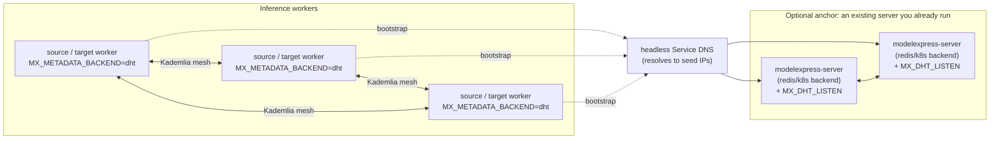

<!--
SPDX-FileCopyrightText: Copyright (c) 2025-2026 NVIDIA CORPORATION & AFFILIATES. All rights reserved.
SPDX-License-Identifier: Apache-2.0
-->

# DHT Metadata Backend

A fully decentralized metadata backend that uses a libp2p Kademlia DHT for source discovery, with no central coordinator and no Kubernetes Service in the data path. Workers find each other peer-to-peer: each one publishes a pointer to itself into the DHT and looks peers up by a content-addressed, rank-keyed key. This document covers the *why* and the *design*; the metadata layer as a whole is described in [`metadata.md`](metadata.md), and deployment context lives in [`DEPLOYMENT.md`](DEPLOYMENT.md).

## Limitations

The first thing to know: **this backend is for stable-weight inference deployments**. The weights loaded at worker startup don't change for the lifetime of the worker, and each rank has exactly one publisher. Reach for the central-coordinator backends (`redis` or `kubernetes`) for anything outside that box.

What does NOT work on this backend:

- **RL-style live weight refits.** Training loops that produce a new checkpoint per step and broadcast to all inference workers without a restart. The DHT carries a rank-keyed pointer to one publisher per rank; there is no per-worker state tracking to keep a live refit consistent.
- **Hot swap between different models.** A worker's published pointer is keyed by the `mx_source_id` it serves; that identity is fixed at publish time. Serving a different model means a new identity and a new key.
- **Multi-instance serving of the same rank.** The storage schema assumes one publisher per `(mx_source_id, rank)` key. Multiple workers serving the same rank behind one logical pool is out of scope; that shape is what the K8s-Service backend handles via Service load-balancing.
- **Per-worker addressability by `worker_id`.** Discovery resolves a rank to its single publisher; there is no "fetch worker W specifically" path through the lookup.
- **Adaptive expert placement (EPLB-style MoE).** Deployments where the expert-to-rank assignment shifts at runtime based on traffic load. The rank-keyed scheme assumes each rank holds a deterministic shard known at deploy time; live placement reshuffles break that. No MX backend supports this case today; static expert placement does work because the rank-to-content mapping stays fixed.

## Choosing a Metadata Backend

Pick based on workload, not operational preference. The choice has structural consequences.

| Workload shape                                                                                              | Backend                 | Why                                                                                                                                                                                  |
|-----------------------------------------------------------------------------------------------------------|-------------------------|------------------------------------------------------------------------------------------------------------------------------------------------------------------------------------|
| Stable-weight inference across nodes with no Kubernetes Service to route through (bare metal, Slurm, mixed). | `dht`                   | Zero central infrastructure and no dependency on kube-proxy or a Service object. Peers self-organize over a Kademlia mesh; bootstrap is the only thing the operator wires up.        |
| Stable-weight inference where a Kubernetes Service is the natural discovery primitive.                      | `k8s-service`           | Lets kube-proxy do the routing. Lowest footprint inside Kubernetes specifically. See [`K8S_SERVICE_BACKEND.md`](K8S_SERVICE_BACKEND.md).                                            |
| MoE inference with static expert placement. Experts pinned to ranks at deploy time, no live rebalancing.    | `dht` or `k8s-service`  | Rank-keyed addressing extends to the `(TP, EP)` coordinate space when each rank holds a known, fixed shard.                                                                          |
| RL rollouts. Training loop updates weights every step, all inference workers refit in-place.                | `redis` or `kubernetes` | Central store tracks each worker's state individually by `worker_id`. Targets fetch "worker W as it exists right now" instead of resolving to a fixed per-rank publisher.            |
| Live fine-tune broadcasts. New checkpoint pushed to all replicas, hot-swapped in place.                     | `redis` or `kubernetes` | Same reason as RL. The decentralized backends can't swap a live worker's identity without re-publishing under a new key.                                                            |
| Mixed-version fleet. Multiple revisions serving concurrently behind one logical endpoint.                   | `redis` or `kubernetes` | Central store indexes by `mx_source_id` and tracks every worker individually; the rank-keyed DHT schema expects one publisher per rank.                                             |
| Multiple checkpoints in parallel (base + LoRA, fp16 + nvfp4, etc.).                                         | Any                     | Different `SourceIdentity` produces a different `mx_source_id`, hence a different DHT key (or Service, or central record). Each identity is discovered independently.                |

## Why This Backend Exists

The central-coordinator backends (`redis`, `kubernetes`) support the full range of workloads by design - per-worker addressability, live weight updates, heterogeneous fleets. The cost is operational: you deploy and maintain a `modelexpress-server`, wire up Redis or K8s CRDs, and treat it as a first-class component of your stack. The `k8s-service` backend removes the central store for stable-weight deployments, but it still leans on a Kubernetes Service object and kube-proxy for routing.

The `dht` backend removes the last piece of shared infrastructure. It is the right path for stable-weight deployments that run outside Kubernetes, or that want source discovery to survive without any coordinating object at all: bare-metal clusters, Slurm allocations, and any topology where "stand up a Service" is not the natural primitive. Workers discover each other directly over a Kademlia mesh; the only thing the operator provides is a way for new nodes to find an existing peer (a bootstrap source). Past that, the data plane is entirely client-to-client.

## Design

### Decentralized discovery, content-addressed keys

Selected via `MX_METADATA_BACKEND=dht` (alias `kademlia`); the metadata client factory then returns `MxDhtClient`. There is no central process to query and no Service to resolve.

Each worker publishes a small pointer into the DHT under a key derived from the identity it serves and its rank:

```
key:   /mx/{mx_source_id}/rank/{worker_rank}
value: JSON { worker_id, worker_rank, worker_grpc_endpoint,
              metadata_endpoint, agent_name }
```

`mx_source_id` is derived locally with `compute_mx_source_id` from the `SourceIdentity` fields (model, dtype, quantization, TP, revision, `mx_version`, proto schema). The canonicalization is identical across the Rust and Python sides, so a receiver computes the exact same key from the identity it wants to load. That is what makes discovery a single GET: a target resolves the source serving its own rank with one keyspace lookup, no directory enumeration.

Only the dial information needed to reach the worker's gRPC server lives in the DHT. The full tensor manifest stays on the worker and is served on demand via `GetTensorManifest`. Discovery is a two-step protocol: GET the rank-keyed pointer to learn the publisher's endpoint, then call `GetTensorManifest` against that endpoint.

### The handshake as safety net

After resolving a pointer and connecting, the client validates the returned manifest before accepting it: `resp.mx_source_id` must match the requested `mx_source_id` and `resp.worker_rank` must match the requested rank, or the manifest is rejected. A `FAILED_PRECONDITION` from the worker (for example, revision skew or a stale pointer routed to the wrong rank) is retried on a fresh lookup. Content mismatches fail loudly and give the caller a retry budget; wrong weights are never silently transferred. This mirrors the GetTensorManifest contract the other decentralized backend relies on.

### Cold-start convergence and the GET retry budget

A freshly published record takes a short while to propagate to the `K` nodes nearest its key, and a freshly joined node takes a short while to fill its routing table. During that window a GET can legitimately miss a key that exists. The client therefore retries lookups with backoff: `MX_DHT_GET_RETRIES` controls the retry count and `MX_DHT_GET_BACKOFF_SECONDS` the delay between attempts. These matter most at cold start, when many workers join and publish at once and the overlay is still converging. Published records are refreshed on the `MX_DHT_RECORD_TTL` interval so they survive node churn.

### Replication factor K

Kademlia replicates each record across the `K` nodes closest to its key. `K` defaults to 20, the standard Kademlia bucket size and the recommended value. Higher `K` means more replication and more resilience to node churn, at the cost of more work per lookup and per publish. K=20 sits at the latency knee: lookups stay fast and well-replicated, comfortably before the cost growth that shows up at much larger `K`. Leave it at the default unless you have a measured reason to change it.

### Bootstrapping into the mesh

A joining node needs at least one existing peer to find the rest of the mesh. The backend supports three explicit bootstrap sources, checked in priority order:

1. `MX_DHT_BOOTSTRAP_PEERS` - explicit libp2p multiaddrs (for example `/ip4/10.0.0.1/tcp/4001/p2p/Qm...`).
2. `MX_DHT_BOOTSTRAP_DNS` - a headless Kubernetes Service DNS name that resolves to every backing peer IP; each is dialed at `MX_DHT_BOOTSTRAP_PORT`.
3. `MX_DHT_BOOTSTRAP_SLURM` - a Slurm-style hostlist (for example `node[01-04]`), auto-detected from `SLURM_JOB_NODELIST` when unset; each resolved host is dialed at `MX_DHT_BOOTSTRAP_PORT`.

When none of these is configured, the client falls back to mDNS, discovering peers on the local network with no configuration at all - convenient for single-host or bare-metal development. In Kubernetes, set an explicit bootstrap source (typically `MX_DHT_BOOTSTRAP_DNS` pointing at a headless Service): cluster networking generally does not carry multicast, so the mDNS fallback will not find peers there, and configuring an explicit source disables it.

## Configuration

All settings are read from the environment. The same variables configure both the client (`MxDhtClient`) and optional server participation (`DhtConfig::from_env`).

| Variable                     | Default        | Meaning                                                                                                                                                                  |
|------------------------------|----------------|------------------------------------------------------------------------------------------------------------------------------------------------------------------------|
| `MX_METADATA_BACKEND`        | central server | Set to `dht` (or `kademlia`) to select this backend.                                                                                                                    |
| `MX_DHT_LISTEN`              | client: `0.0.0.0:0` | `host:port` the local node listens on. On the server this is the opt-in switch: unset means the server does not participate in the DHT at all.                     |
| `MX_DHT_BOOTSTRAP_PEERS`     | (none)         | Comma-separated libp2p multiaddrs to dial for initial peers.                                                                                                            |
| `MX_DHT_BOOTSTRAP_DNS`       | (none)         | Headless Service DNS name that resolves to peer IPs; all resolved addresses are dialed at `MX_DHT_BOOTSTRAP_PORT`.                                                       |
| `MX_DHT_BOOTSTRAP_SLURM`     | `SLURM_JOB_NODELIST` | Slurm hostlist to expand and dial; auto-detected from the Slurm environment when unset.                                                                          |
| `MX_DHT_BOOTSTRAP_PORT`      | `4001`         | Port at which DNS- and Slurm-resolved peers are dialed.                                                                                                                 |
| `MX_DHT_RECORD_TTL`          | `86400` (24h)  | Record republish interval / TTL, in seconds. Published pointers are refreshed on this cadence so they survive churn.                                                    |
| `MX_DHT_GET_RETRIES`         | `5`            | Number of GET retries before a lookup is declared failed. Tune up for large cold-start fan-in.                                                                          |
| `MX_DHT_GET_BACKOFF_SECONDS` | `0.5`          | Delay between GET retries, in seconds.                                                                                                                                  |

The Kademlia implementation ships in-tree with the Python client as the `kademlite` package; `cryptography` is a runtime dependency of the client. The server joins the same mesh through a libp2p stack that is wire-compatible with the Python client (same Kademlia protocol id, same TCP + Noise + Yamux transport, same Identify protocol), so server and client nodes mesh together regardless of which side they run on.

## Optional Server Participation

Server participation in the DHT is **opt-in and purely a routing/bootstrap convenience**. When `MX_DHT_LISTEN` is set, the server joins the Kademlia mesh as a participation-only peer: it helps with routing and provides a stable, long-lived bootstrap target for clients, but it publishes no records of its own. The data plane stays entirely client-to-client. When `MX_DHT_LISTEN` is unset the server skips DHT participation completely, and existing `redis` / `kubernetes` deployments are unaffected.

Running a small set of these participation-only nodes gives the mesh a stable anchor that outlives any individual worker, which smooths cold start: a newly joining worker always has a known, reachable peer to bootstrap against even when the rest of the fleet is still coming up.

## Deployment



Run inference workers with `MX_METADATA_BACKEND=dht` and a bootstrap source. The common shape points `MX_DHT_BOOTSTRAP_DNS` at a headless Service that resolves to a stable set of bootstrap peers:

```yaml
apiVersion: apps/v1
kind: Deployment
metadata:
  name: mx-dht-worker
spec:
  replicas: 4
  selector:
    matchLabels:
      app: mx-dht-worker
  template:
    metadata:
      labels:
        app: mx-dht-worker
    spec:
      containers:
        - name: worker
          image: <your-inference-image>
          env:
            - name: MX_METADATA_BACKEND
              value: "dht"
            - name: MX_DHT_LISTEN
              value: "0.0.0.0:4001"
            - name: MX_DHT_BOOTSTRAP_DNS
              value: "mx-dht-peers.default.svc.cluster.local"
            - name: MX_DHT_BOOTSTRAP_PORT
              value: "4001"
          ports:
            - name: kademlia
              containerPort: 4001
```

Bootstrapping is worker-to-worker by default. Point `MX_DHT_BOOTSTRAP_DNS` at a headless Service whose selector matches the worker pods themselves, with `publishNotReadyAddresses: true` so a joining worker finds peers that are already up even while their weights are still loading. No separate component is required; the mesh is the workers. See [`../examples/dht_sources/`](../examples/dht_sources/) for this shape.

If you already run a `modelexpress-server` (with its own `redis`/`kubernetes` backend) for other reasons, you can additionally set `MX_DHT_LISTEN` on it to give the mesh a stable, long-lived participation-only anchor that outlives individual workers. There is no standalone seed binary - a dedicated anchor is always a full server carrying its own backend - so a pure `dht` deployment uses worker-to-worker bootstrap and adds nothing extra.

Outside Kubernetes the bootstrap source changes but the worker configuration does not: under Slurm, `MX_DHT_BOOTSTRAP_SLURM` (or the auto-detected `SLURM_JOB_NODELIST`) supplies the peer hostlist; on bare metal, list peer multiaddrs in `MX_DHT_BOOTSTRAP_PEERS`.

## Relationship to Other Backends

### Versus the K8s-Service backend

Both are decentralized stable-weight backends with no central store, and both validate identity at the `GetTensorManifest` handshake. The difference is the discovery primitive. The K8s-Service backend resolves a rank to a Kubernetes Service and lets kube-proxy load-balance across a pool of interchangeable replicas behind it; it needs a Service object and the Kubernetes networking layer. The DHT backend resolves a rank to a single publisher by walking a Kademlia mesh; it needs no Service and no kube-proxy, only a bootstrap source, which is what makes it usable outside Kubernetes. The flip side of the DHT's one-publisher-per-rank schema is that it does not model a load-balanced pool of replicas for a single rank the way a Service does.

### Versus central-coordinator (`redis`, `kubernetes`)

Server-coordinated backends give per-worker addressability: their client-facing RPCs are organized around `(mx_source_id, worker_id)` tuples, so a target can pull from "worker W as it exists right now." That is what RL rollouts, live fine-tune broadcasts, and mixed-version deployments rely on, and what the DHT backend deliberately does not provide. The DHT resolves a rank to its current publisher and nothing finer; that simplification is exactly what lets it run with no coordinating infrastructure, at the cost of the limitations enumerated above.

## See Also

- [Metadata architecture](metadata.md) - the metadata storage and coordination layers, `SourceIdentity`, and content-addressed keys.
- [K8s-Service metadata backend](K8S_SERVICE_BACKEND.md) - the other decentralized backend, for when a Kubernetes Service is the natural discovery primitive.
- [Deployment reference](DEPLOYMENT.md) - configuration, Docker, Kubernetes, and P2P transfer setup.
- [Architecture reference](ARCHITECTURE.md) - project structure, gRPC services, and P2P metadata backends.
