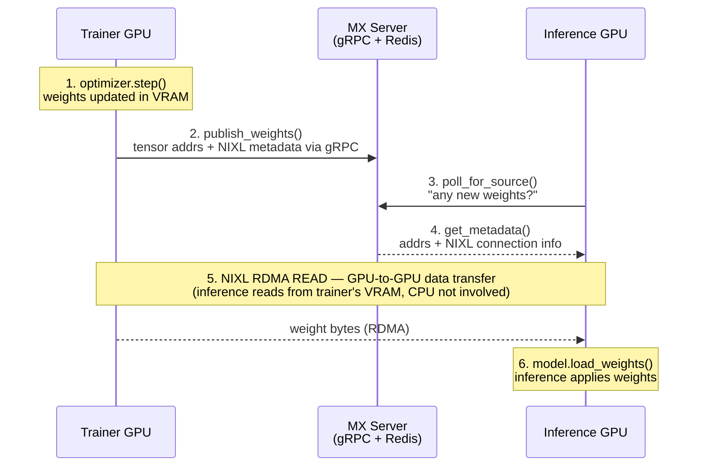
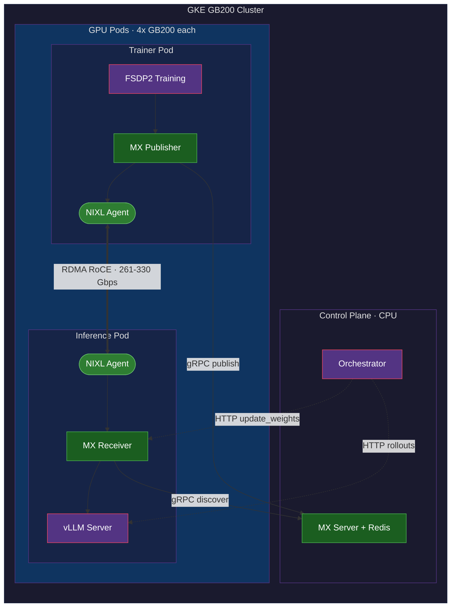
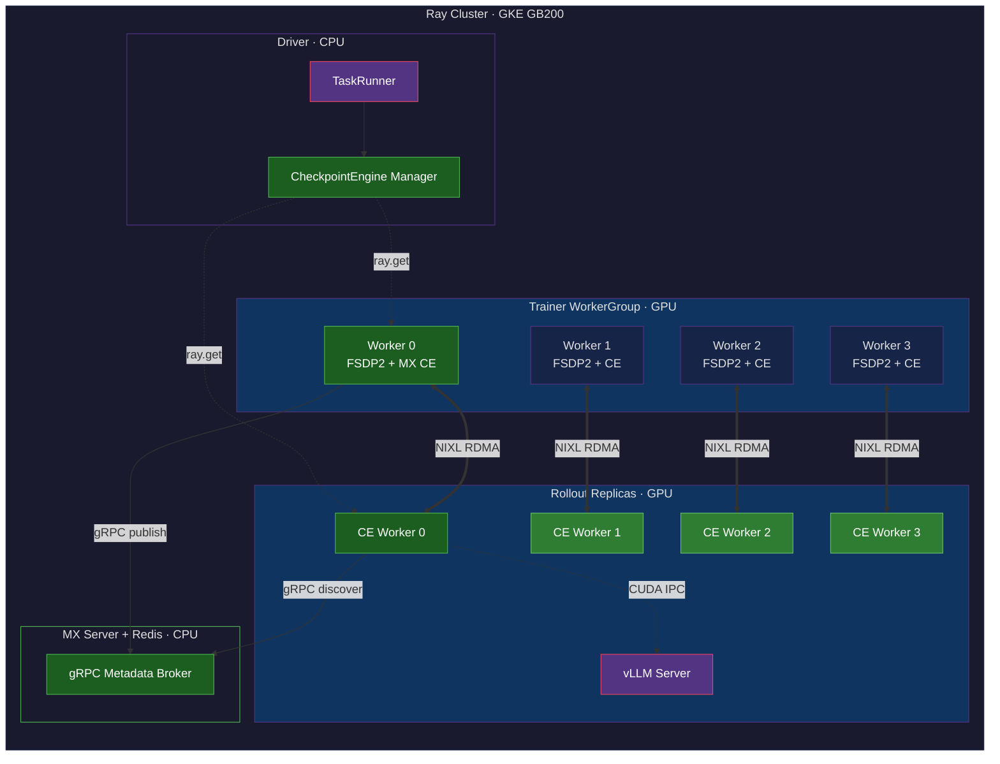

# ModelExpress for RL Post-Training — Design Overview

**Last Updated**: April 2026

This document explains how ModelExpress (MX) accelerates reinforcement learning (RL) post-training by replacing slow weight transfer mechanisms with GPU-to-GPU RDMA. It covers the general design, the PRIME-RL proof of concept (working), and the verl integration plan.

---

## The Problem: Weight Sync in RL

RL post-training runs a continuous loop: generate text (inference) → score it → update the model (training) → sync the updated weights back to inference → repeat. The weight sync step is a bottleneck:

| Method | How | Time (3 GB model) | Limitation |
|--------|-----|-------------------|-----------|
| Filesystem | Serialize to disk → read back | 30-60s | Disk I/O, serialization |
| NCCL broadcast | Collective over network | 2-8s | Requires static groups, `max_async_level=1` |
| **MX + NIXL RDMA** | **GPU reads directly from GPU** | **<1s** | **None for async training** |

ModelExpress eliminates the serialization-to-disk bottleneck while preserving async training capability. NCCL forces synchronous operation; the filesystem is slow. MX + NIXL gives both speed and flexibility.

---

## How ModelExpress Works for RL

### Architecture



**MX Server** stores only metadata — tensor names, GPU memory addresses, NIXL agent connection info, version tracking. It never touches weight data. The bulk transfer is a one-sided RDMA read between GPUs.

### Client Library

Two classes in `modelexpress_client/python/modelexpress/`:

**`MxTrainingPublisher`** (trainer side):
```python
publisher = MxTrainingPublisher("trainer-rank-0", device_id=0, mx_server_url="mx-server:8001")
publisher.initialize(model_name="Qwen/Qwen2.5-1.5B")

# After optimizer.step():
publisher.publish_weights(model.state_dict(), step=training_step)
publisher.mark_ready()
```

- Registers GPU tensors with NIXL (once, on first call — addresses are stable across steps)
- Publishes tensor metadata + NIXL agent info to MX Server via gRPC
- Marks version as READY so inference can discover it

**`MxRefitReceiver`** (inference side):
```python
receiver = MxRefitReceiver("inference-rank-0", device_id=0, mx_server_url="mx-server:8001")
receiver.initialize()

source = receiver.poll_for_source(model_name="Qwen/Qwen2.5-1.5B")
for name, tensor in receiver.receive_weights_scratch(source):
    ...  # feed into model.load_weights()
```

- Queries MX Server for available weight sources
- Allocates scratch GPU buffers matching the source tensor layout
- NIXL RDMA reads weight data directly from the trainer's GPU
- Yields `(name, tensor)` pairs for the inference engine's weight loader

### The Scratch-Buffer Approach

RL trainers publish weights in HuggingFace format (339 separate tensors for Qwen2.5-1.5B). Inference engines like vLLM use fused tensors internally (198 parameters — Q/K/V merged into `qkv_proj`, gate/up merged into `gate_up_proj`). Names and shapes don't match.

Solution: RDMA into temporary scratch buffers matching the trainer's layout, then feed through `model.load_weights()` which handles the name mapping and tensor fusion. The RDMA layer stays simple (just move bytes); the inference engine handles semantics.

---

## PRIME-RL POC (Working)

### What is PRIME-RL?

An async-first RL framework by PrimeIntellect with three separate processes:
- **Trainer** — FSDP2 training (GPU pod)
- **Orchestrator** — Coordination, scoring (CPU pod)
- **Inference** — vLLM rollout generation (GPU pod)

No Ray dependency. Raw Kubernetes pods.

### Architecture



Green = ModelExpress / NIXL components. Purple = existing framework components.

### Integration Summary

| Item | Details |
|------|---------|
| **Repo** | `github.com/KavinKrishnan/prime-rl`, branch `kavink/mx-weight-broadcast` |
| **MX client branch** | `github.com/ai-dynamo/modelexpress`, branch `kavink/RL` |
| **New files in PRIME-RL** | `broadcast/modelexpress.py` (trainer), `worker/modelexpress.py` (inference), `Dockerfile.mx-arm64` |
| **Modified files** | 8 files, 93 lines added (configs, routes, factory, client helper) |
| **Cluster** | GKE DGXCloud, GB200 ARM64, 4 GPUs/node, RoCE networking |
| **Model** | Qwen/Qwen2.5-1.5B (3.55 GB BF16) |

### How It Works

1. Trainer runs `optimizer.step()`, gathers FSDP2 shards, calls `MxTrainingPublisher.publish_weights()`
2. Orchestrator detects new weights (via filesystem marker), tells inference to update
3. Inference calls `MxRefitReceiver.receive_weights_scratch()` — NIXL RDMA pulls weights from trainer GPU
4. Scratch tensors reshaped using safetensors header shapes, fed through `model.load_weights()`
5. vLLM resumes serving with updated model

### Results

| Metric | Filesystem | RDMA | Speedup |
|--------|-----------|------|---------|
| Weight update time | ~55s | <1s | **55x** |
| Transfer bandwidth | ~60 MB/s | 261-330 Gbps | ~500x |
| CPU involvement | Full | None | Eliminated |

### Key Issues Resolved

| Issue | Root Cause | Fix |
|-------|-----------|-----|
| `NIXL_ERR_NOT_ALLOWED` | Wrong `UCX_TLS` value | Match TRT-LLM: `self,sm,rc,cuda_copy,gdr_copy,tcp` |
| 800 KB metadata blob | Re-registering tensors every step | Register once, reuse cached metadata |
| `REMOTE_DISCONNECT` | UCX 1.18 + missing IMEX channels | UCX 1.20 + DRA `compute-domain-channel` claims |
| Tensor name mismatch | HF names vs vLLM fused names | Scratch-buffer approach + `model.load_weights()` |
| Shape assertion | 1D scratch vs 2D expected | Read shapes from safetensors header |

### Cluster Config (GCP GB200)

```yaml
hostNetwork: true
privileged: true
resourceClaims:
  - name: compute-domain-channel
    resourceClaimTemplateName: kavin-compute-domain-channel
env:
  UCX_TLS: "self,sm,rc,cuda_copy,gdr_copy,tcp"
  UCX_IB_GID_INDEX: "3"
  OMPI_MCA_pml: "ob1"
volumes:
  - /dev/infiniband (hostPath)
```

UCX 1.20+, IMEX channels via DRA, and `/dev/infiniband` are all required for cross-node GPU RDMA.

---

## verl Integration (In Progress)

### What is verl?

A production-grade RL framework by ByteDance that uses Ray for orchestration. Supports FSDP, Megatron, vLLM, SGLang, TRT-LLM. Has a `CheckpointEngine` plugin system for weight transfer.

### Architecture



Green = MX checkpoint engine components. Purple = existing verl/Ray components. The `CheckpointEngineManager` coordinates the MX CE workers on both trainer and rollout sides. Each trainer-rollout rank pair transfers via NIXL RDMA. Received weights reach vLLM via CUDA IPC through the existing `ServerAdapter`.

### Why It's Easier Than PRIME-RL

verl already has:
- **`CheckpointEngine` ABC** with `send_weights` / `receive_weights` — just implement a new backend
- **Existing NIXL engine** (`nixl_checkpoint_engine.py`) as a reference implementation
- **Bucketed transfers** that preserve tensor names and shapes — no scratch-buffer approach needed
- **`@CheckpointEngineRegistry.register("mx")`** — one decorator to plug in

### Integration Summary

| Item | Details |
|------|---------|
| **Repo** | `github.com/KavinKrishnan/verl`, branch `kavink/mx-checkpoint-engine` |
| **New file** | `verl/checkpoint_engine/mx_checkpoint_engine.py` (461 lines) |
| **Modified files** | 2 files, 8 lines (imports + config comment) |
| **Total** | 469 new lines, 2 modified |

### `MxCheckpointEngine` Design

Registered as `@CheckpointEngineRegistry.register("mx")`. Implements the `CheckpointEngine` ABC:

- **`prepare()`** — Allocate send/recv GPU buckets, register with NIXL, create MX client
- **`build_topology()`** — Trainer rank 0 is the source, all rollout ranks connect via MX Server
- **`init_process_group()`** — Trainer adds rollout agents; rollouts add trainer agent
- **`send_weights()`** — Pack tensors into GPU buckets, send bucket metadata via ZMQ, make available for RDMA read
- **`receive_weights()`** — Receive metadata via ZMQ, NIXL RDMA read from trainer's bucket, yield `(name, tensor)` pairs
- **`finalize()`** — Cleanup connections, deregister memory

Uses a **star topology** (trainer → all rollouts) instead of the NIXL engine's ring. The MX Server enables future pipeline replication where rollouts become sources.

### Config

```yaml
actor_rollout_ref:
  rollout:
    checkpoint_engine:
      backend: "mx"
      engine_kwargs:
        mx_server_url: "modelexpress-server:8001"
        model_name: "Qwen/Qwen2.5-1.5B"
```

---

## Comparison: PRIME-RL vs verl Integration

| Aspect | PRIME-RL | verl |
|--------|---------|------|
| Plugin system | Custom broadcast/worker extensions | `CheckpointEngine` registry |
| Existing NIXL support | None (built from scratch) | Full NIXL engine as reference |
| Lines of code | ~350 new + 93 modified | ~460 new + 8 modified |
| Ray dependency | None (raw K8s pods) | Ray actors, placement groups |
| Weight format | HF names → scratch buffers → `load_weights()` | Bucketed with shapes preserved |
| Tensor shape issue | Required safetensors header reading | Not an issue (bucket metadata carries shapes) |
| Colocated mode | N/A (always disaggregated) | `naive` engine handles colocated; MX for disaggregated |

---

## Future: Pipeline Replication

Current design uses a star topology (trainer → all rollouts). At scale, the trainer's NIC becomes a bottleneck. [TensorHub](https://arxiv.org/abs/2604.09107v1) (ByteDance, April 2026) demonstrates **pipeline replication**: after a rollout receives weights, it publishes itself as a source. New rollouts pull from the nearest/least-loaded replica, creating a bandwidth-amplifying DAG.

MX Server already supports multiple sources per model — implementing pipeline replication is a client-side change:
1. After RDMA receive, rollout calls `publish_weights()` on MX Server
2. New rollouts call `poll_for_source()` which returns the nearest available replica
3. MX Server load-balances across all replicas

This is prioritized as P1 in our roadmap.

---

## Repository Map

### ModelExpress client (`kavink/RL` branch)

```text
modelexpress_client/python/modelexpress/
├── training_publisher.py    # MxTrainingPublisher — trainer-side publish
├── refit_receiver.py        # MxRefitReceiver — inference-side RDMA receive
├── nixl_transfer.py         # NixlTransferManager — NIXL agent lifecycle
├── client.py                # MxClient — gRPC client to MX Server
└── __init__.py              # Exports MxTrainingPublisher, MxRefitReceiver
```

### PRIME-RL integration (`kavink/mx-weight-broadcast` branch)

```text
src/prime_rl/
├── trainer/rl/broadcast/modelexpress.py    # ModelExpressWeightBroadcast
├── inference/vllm/worker/modelexpress.py   # MxWeightUpdateWorker
├── inference/vllm/server.py                # /init_mx_broadcaster route (+13 lines)
├── orchestrator/orchestrator.py            # elif "modelexpress" branch (+7 lines)
├── utils/client.py                         # init_mx_broadcast() (+34 lines)
└── configs/                                # MxWeightBroadcastConfig (+32 lines)
```

### verl integration (`kavink/mx-checkpoint-engine` branch)

```text
verl/
├── checkpoint_engine/mx_checkpoint_engine.py   # MxCheckpointEngine
├── checkpoint_engine/__init__.py               # Optional import (+7 lines)
└── workers/config/rollout.py                   # "mx" in backend comment (+1 line)
```
