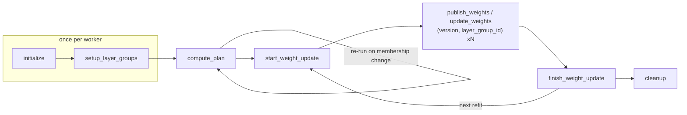
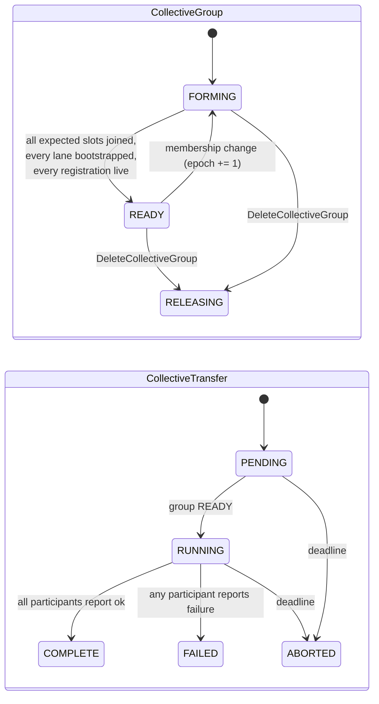

<!--
SPDX-FileCopyrightText: Copyright (c) 2026 NVIDIA CORPORATION & AFFILIATES. All rights reserved.
SPDX-License-Identifier: Apache-2.0
-->

# NCCL M2N Refit — collective weight transfer, standalone from NIXL

> **Status: design.** This document specifies the push-style collective refit
> path. It is a *sibling* of the NIXL pull path in
> [`modelexpress/refit/reshard/`](../modelexpress_client/python/modelexpress/refit/README.md),
> not a mode of it. Nothing on this path imports NIXL, and nothing on the NIXL
> path imports this.

## 1. What this is

ModelExpress (MX) already has one RL refit data plane: a **receiver-driven NIXL
pull**. Each generator rank discovers trainer shard ownership through the MX
control plane and issues one-sided RDMA READs for exactly the byte ranges its own
layout needs.

This document specifies the second, independent data plane: a **sender-driven
NCCL collective push**, built on `nccl.m2n.reshard`. Trainer ranks and generator
ranks enter one collective call together and NCCL performs the M-to-N
redistribution between the two parallelism meshes internally.

The two paths answer the same question with opposite mechanics:

| | NIXL pull (existing) | NCCL M2N push (this document) |
|---|---|---|
| Initiator | Generator rank | Both sides co-call; the trainer supplies bytes |
| Wire primitive | One-sided RDMA `READ` | `nccl.m2n.reshard` collective |
| Who routes | The MX receiver plans byte runs | NCCL routes from the src/dst meshes |
| Membership | Each receiver joins independently | Fixed communicator; every member must enter |
| MX control-plane role | Shard and manifest directory, leases | Rendezvous, admission, fencing, group state |
| Source lifetime | Buffers must outlive the receivers | Buffers live only across the collective |
| Partial generator set | Natural — receivers are independent | Requires a per-operation admitted group (§5) |

Neither supersedes the other. Pull tolerates ragged membership and late joiners;
push gets NCCL's tuned M-to-N kernels and does not need trainer buffers kept
registered and pinned between refits.

### Non-goals

- No NIXL fallback, no runtime transport ranking, no "try NCCL then NIXL". One
  deployment configures one backend.
- No public layer or tensor selection API beyond the `layer_group_id` the shared
  client contract already specifies.
- No change to the existing `RefitService` pull RPCs (`WeightVersionShard`,
  `VersionLease`, `RefitWorkerService`). Those are the pull path's vocabulary.

## 2. Requirements and prior art

### A. What this path must satisfy

The requirements below come from the internal MX RL refit design work. They are
restated here as the contract this path implements:

1. NCCL M2N is a *push-style collective*. Source trainer ranks initiate the data
   movement, **but only after the destination generator ranks have joined and
   exposed prepared destinations.**
2. **MX owns an ephemeral collective transfer group for each operation**:
   participant worker generations, source and destination roles, communicator
   bootstrap information, fencing, and operation state.
3. **Worker clients ask MX to join an operation; they do not choose or create
   groups themselves.**
4. The RL framework still coordinates through its native actor RPCs. It invokes
   the selected generator replicas and the trainer replica with the same version
   and operation reference. **The trainer-side clients launch the collective only
   when MX reports the group READY.**
5. This requires an **additive collective-operation API**. The generator-initiated
   pull call is not sufficient, because a trainer cannot safely push into
   destinations it has no way to know are prepared.
6. The TransferPlan abstraction survives, but its NCCL form carries collective
   membership and prepared destination bindings. Layer grouping stays internal.

### B. The shared two-sided client shape

MX refit clients are `RefitClient.Trainer` and `RefitClient.Generator`, each
decomposed into a pluggable **Publisher** (trainer) / **Loader** (generator) and
a **ShardRedistribution Backend** with a `Sender` and a `Receiver` half. The
lifecycle and its sequencing rules are fixed and shared with the pull path; a
push-mode backend slots in opposite the existing NIXL pull backend.



### C. NeMo RL `nccl_reshard_refit`

NVIDIA-NeMo/RL PR #2971, merged 2026-07-29. The proven upstream implementation of
exactly this transfer. We adopt its wire contract so that an MX-brokered
deployment and a NeMo-RL-native deployment move identical bytes:

- `nccl.m2n.reshard` from the **nccl4py** package is the default and only wire op
  (`xferdtensor`'s pure-Python and golden paths are debugging aids, not our
  contract).
- Parameters are keyed by **HuggingFace names** with **global shapes**; per-expert
  MoE weights are grouped into one `...experts.{gate,up,down}_proj.weight` entry
  of shape `[E, ...]`.
- Source and destination layouts are described as a **rank mesh** plus DTensor
  **`Shard(dim)` / `Replicate()`** placements.
- Communicators are **per trainer PP stage**: stage `s`'s trainer ranks plus all
  participating generator ranks. Rank order within a group is **trainer ranks
  first, generator ranks after**.
- A **bulk/misc split**: FFN projection weights take the reshard path (97-98% of
  the bytes on large MoE models); everything else rides a packed broadcast over a
  separate all-participants communicator.

Where NeMo RL and MX differ is precisely the piece MX is asked to own:

| Concern | NeMo RL today | MX (this design) |
|---|---|---|
| Rendezvous | `StatelessProcessGroup` over a raw `TCPStore`, at an IP/port the Ray driver allocates per PP stage | MX control plane brokers the NCCL `uniqueId` |
| Rank assignment | Computed in the driver, hardcoded "train first, gen after" | MX assigns and returns `rank_in_lane`; same ordering rule, now enforced server-side |
| Membership | Always *all* generator ranks | Per-operation admitted set, so a selected subset of generators can refit |
| Fencing | None; a restarted worker silently rejoins | The `worker_id` generation is admitted or rejected; a membership change bumps the group epoch |
| Readiness | Implicit — everyone calls `init_nccl_communicator` and blocks | Explicit `FORMING -> READY` state the trainer waits on before launching |
| Group lifetime | One communicator for the whole job | Membership-keyed group, reused across refits, invalidated on epoch change |

## 3. Component architecture


Ownership, one line each:

- **RL framework** picks the version, picks *which* generator replicas refit, and
  invokes both sides' actors with the same `(version, operation_ref)`.
- **MX control plane** owns group identity, admission, rank assignment, the NCCL
  `uniqueId`, worker-generation fencing, and the `FORMING -> READY` state the
  trainer gates on.
- **RefitClient.Trainer / .Generator** own the lifecycle, the layer groups, and
  the local plan.
- **Publisher / Loader** own everything engine-specific: which local tensor
  realizes each HF name, and any staging needed to send or install it.
- **ShardRedistribution Backend (nccl_m2n)** owns the communicators and the wire
  ops. It is the only component that imports `nccl`.

## 4. Rendezvous: what MX replaces

NeMo RL's `StatelessProcessGroup` is a `TCPStore` whose sole job is to move 128
bytes of `ncclUniqueId` from rank 0 to everyone else, at an address the Ray driver
had to allocate and plumb through both actor sets, once per PP stage.

MX already is a well-known, authenticated, TTL-backed coordination service that
both sides are connected to. Making it the store removes that port allocation,
makes membership explicit instead of implied by "whoever shows up", and gives us
the three things a `TCPStore` structurally cannot: admission, fencing, and a
readiness state that a *third* party — the trainer that must launch the
collective — can observe.


## 5. Control plane

New proto file `modelexpress_common/proto/refit_collective.proto`, new service
`RefitCollectiveService`. Kept in its own file and its own Rust module so the NIXL
pull path and the NCCL push path never share a type.

### 5.1 Resources

| Resource | Lifetime | Owner |
|---|---|---|
| `CollectiveGroup` | Membership-keyed; reused across refits; `epoch` bumps on membership change | MX |
| `CollectiveLane` | One per group per communicator (per trainer PP stage, plus one broadcast lane) | MX |
| `CollectiveTransfer` | One per refit operation; references `(group_id, epoch)` and a `version_id` | MX |

Splitting group from operation reconciles two requirements that read as being in
tension: the group is described as ephemeral and per-operation, yet MX is also
expected to *reuse* a communicator until membership changes invalidate it. Treating
them as two objects satisfies both. The *operation* is per-refit and cheap. The *group* — and the communicator it describes — is keyed by membership
and reused until membership changes. A client caches its `Communicator` under
`(group_id, epoch)` and drops it when the epoch moves.

### 5.2 Lanes

One `CollectiveGroup` carries several communicators, because the transfer needs
two different spans:

| Lane kind | Count | Span | Carries |
|---|---|---|---|
| `LANE_KIND_RESHARD` | `trainer_pp_size` | PP stage `s`'s trainer ranks + all admitted generator ranks | `nccl.m2n.reshard` bulk params |
| `LANE_KIND_BROADCAST` | 1 | All admitted trainer + generator ranks | Packed misc-param broadcast |

This is NeMo RL's `pp_comm_group` / `model_update_group` split, promoted from two
ad-hoc `StatelessProcessGroup`s into one MX-brokered resource. Keeping the bulk
path on its own communicators is not cosmetic: the workers must run the misc
broadcast strictly after the bulk reshard, because concurrent traffic on
overlapping communicators can deadlock.

### 5.3 Rank assignment

MX assigns `rank_in_lane`. The rule reproduces NeMo RL's convention exactly, so
the mesh arithmetic in §6 is unchanged:

```text
reshard lane s     world_size = trainer_ranks_per_stage + admitted_generator_count
  trainer  index_in_role r  ->  rank_in_lane = r % trainer_ranks_per_stage
  generator index_in_role g ->  rank_in_lane = trainer_ranks_per_stage + g

broadcast lane     world_size = trainer_world_size + admitted_generator_count
  trainer  index_in_role r  ->  rank_in_lane = r
  generator index_in_role g ->  rank_in_lane = trainer_world_size + g
```

MX needs no knowledge of TP/EP/DP to do this — only the role, the lane, and the
index within the role. All parallelism semantics stay client-side (§6). That is
the whole point of keeping MX a rendezvous rather than a planner on this path.

`rank_in_lane == 0` of each lane is always a trainer, and that participant
generates and posts the lane's `ncclUniqueId`.

### 5.4 States



`READY` requires **all three** of: every expected slot has an admitted
participant; every lane has a posted `nccl_unique_id`; every admitted
participant's `WorkerRegistration` is unexpired. The third condition is the
liveness check the NIXL path gets from lease renewal — here it is checked at
admission and re-checked at the `READY` transition, because the collective's
failure mode is a hang rather than a `NOT_FOUND`.

### 5.5 RPCs

```protobuf
service RefitCollectiveService {
  // Orchestrator-facing.
  rpc CreateCollectiveTransfer(CreateCollectiveTransferRequest) returns (CollectiveTransfer);
  rpc GetCollectiveTransfer(GetCollectiveTransferRequest) returns (CollectiveTransfer);
  rpc DeleteCollectiveTransfer(DeleteCollectiveTransferRequest) returns (CollectiveTransfer);

  // Worker-client-facing. Workers join; they never create a group.
  rpc JoinCollectiveGroup(JoinCollectiveGroupRequest) returns (CollectiveGroupMembership);
  rpc GetCollectiveGroup(GetCollectiveGroupRequest) returns (CollectiveGroup);
  rpc PublishGroupBootstrap(PublishGroupBootstrapRequest) returns (CollectiveGroup);
  rpc ReportCollectiveTransfer(ReportCollectiveTransferRequest) returns (CollectiveTransfer);
}

// Worker-to-worker. The trainer coordinator serves the reshard plan; MX stores
// only its digest and endpoint, exactly as the pull path does for manifests.
service RefitCollectiveWorkerService {
  rpc GetReshardPlan(GetReshardPlanRequest) returns (GetReshardPlanResponse);
}
```

`AwaitGroupReady` is deliberately *not* an RPC. Waiting is `GetCollectiveGroup`
polling with backoff, so a stalled peer surfaces as a client-side deadline
carrying the group's own participant list, rather than as a hung stream.

### 5.6 Why the plan is worker-served

The reshard plan (§6) is one record per bulk parameter: HF name, global shape,
dtype, source mesh and placements, destination mesh and placements, PP stage. For
a large MoE model that is on the order of hundreds of entries and hundreds of
kilobytes. The pull path already established the rule: the full sealed manifest
stays worker-served so that CRD or etcd records stay small, while
`manifest_digest` verifies that fetched content matches.

The same rule applies here. MX stores `plan_source = {worker_id, endpoint,
digest}` on the group; generators fetch the plan from the trainer coordinator over
`RefitCollectiveWorkerService` and verify the digest. Because the plan is a
function of `(model layout, trainer parallelism, admitted generator set)` and not
of the weights, it is keyed by `(group_id, epoch)` and fetched **once per epoch**,
never per refit.

## 6. The plan: mesh and placement contract

This is where NeMo RL's contract is adopted wholesale. The plan is torch-free
data; only the backend touches tensors.

For each **bulk** parameter:

```text
ParamPlan {
  name                 # HF name, e.g. model.layers.3.mlp.experts.gate_proj.weight
  global_shape         # full, unsharded
  dtype
  pp_stage             # selects the reshard lane
  src_mesh             # rank grid over this stage's trainer ranks
  src_placements       # [Shard(d) | Replicate()] per mesh dim
  dst_mesh             # rank grid over the admitted generator ranks
  dst_placements
  grouped_expert_proj  # optional: gate_proj | up_proj | down_proj
}
```

Mesh construction follows NeMo RL's `build_mesh_info`: dims are emitted in the
order `(tp, ep, dp, pp)`, size-1 dims are dropped, and the survivors are reversed
into a row-major rank tensor, so the first surviving dim becomes the innermost
(fastest-varying) axis. Non-expert parameters live on a TP mesh (`ep_size=1`);
expert parameters live on an EP mesh (`tp_size=1`). Placements follow
`get_placements`: 1-D parameters replicate; expert parameters `Shard(0)` on the EP
axis; non-expert FFN weights `Shard(0)` for `gate_proj`/`up_proj`
(column-parallel) and `Shard(1)` for `down_proj` (row-parallel).

The **only** thing MX changes is the rank offsets, and only because the
destination rank set is now the *admitted* generator set rather than "all
generators": `dst_mesh` is built with `rank_offset = trainer_ranks_per_stage`
inside each reshard lane, over `len(admitted_generators)` ranks.

Parameters not on the bulk whitelist (`is_bulk_param`: FFN projection weights,
dense and MoE, excluding `shared_expert`) go to the misc list and ride the
broadcast lane in a deterministic order. That order is load-bearing: producer and
consumer walk it in lockstep.

### 6.1 Local realization: Publisher and Loader

The plan says *what* moves. The Publisher and Loader say *where it lives locally*.
This is NeMo RL's `LocalParamSpec` contract, adopted verbatim so that an existing
Megatron or vLLM `build_hf_to_local_param_map` drops in unchanged:

```python
@dataclass
class LocalParamSpec:
    base: Any                                   # live local tensor, or None
    pre:  Callable[[Any], RefitCtx] | None      # base -> RefitCtx(buf=...)
    post: Callable[[RefitCtx], None] | None     # runs after the wire op
```

- Trainer, direct parameter: `base` is the live TP/EP-local shard, sent as-is.
- Trainer, grouped MoE: `pre` stacks this rank's per-expert views into
  `[E_local, ...]` fresh each refit; no `post`.
- Generator, direct parameter: `base` is the live engine parameter, received in
  place.
- Generator, slice of a fused parameter (`gate_up_proj`, `w13`/`w2`): `pre`
  allocates a receive buffer for the region, `post` copies it back into the fused
  tensor.

`pre`, `post`, and the wire op all enqueue on the same CUDA stream, so staging is
ordered with the transfer without a host synchronize.

## 7. Lifecycle and sequencing

The shared lifecycle's sequencing rules map onto the collective path as follows.
The rules are the contract; the right-hand column is what this backend does with
them.

| Call | Sequencing rule | NCCL M2N backend |
|---|---|---|
| `initialize` | Once per worker; before `setup_layer_groups`; unordered across workers | Publisher/Loader `capture()`; register with MX; `Sender/Receiver.initialize()` records local shard geometry |
| `setup_layer_groups` | Once per worker; groups must be disjoint and cover the model | Map each `layer_group_id` to its bulk `ParamPlan` subset and misc subset |
| `compute_plan` | After all workers finish `initialize`+`setup_layer_groups`; re-run on membership change | **Join the group, wait for READY, create the communicators, fetch and verify the plan.** Membership change = new epoch = new communicators |
| `start_weight_update(version, worker_ids)` | Once per refit; all `compute_plan` done; no overlapping refits | `Publisher.start_new_round(version)`; the backend binds the operation and the admitted destination subset |
| `publish_weights` / `update_weights(version, layer_group_id)` | Multiple per refit; concurrency across affected workers is desirable | The co-called `nccl.m2n.reshard` sequence for that group's bulk params, then its misc broadcast |
| `finish_weight_update(version)` | After all `*_weight_update` calls for this refit | `Loader.finish()`; stream sync; `ReportCollectiveTransfer` |
| `cleanup` | Terminal | Release buffers, destroy communicators, deregister |

Two invariants the collective imposes on top of that lifecycle:

1. **Every participant must issue the same sequence of wire ops.** The plan's
   parameter order is the single source of truth for both sides; a rank that skips
   a parameter its peers issue hangs the communicator, not just itself.
2. **The trainer must not enter the collective before the group is READY.** This
   is the core requirement of this path, and it is why readiness is
   server-observable state rather than a client-side barrier.

### 7.1 Refit-time waterfall


Per-PP-stage lanes are independent communicators, so stage 0's and stage 1's
reshards overlap on separate CUDA streams (`MX_NCCL_REFIT_NUM_STREAMS`, default 2,
matching NeMo RL's `NRL_REFIT_NUM_STREAMS`). The misc broadcast is strictly
serialized after all bulk lanes: it uses the all-participants communicator, which
overlaps every reshard lane, and concurrent traffic on overlapping communicators
can deadlock.

## 8. Failure semantics

The collective's characteristic failure is a **hang**, not an error return. Every
guarantee below exists to convert a potential hang into a bounded, attributable
failure.

| Failure | Detection | Behavior |
|---|---|---|
| A participant never joins | `READY` never reached; client-side deadline on `GetCollectiveGroup` | Operation `ABORTED`; the error names the missing slots |
| A participant joined then died before the collective | Its `WorkerRegistration` TTL expires; re-checked at the `READY` transition | Group returns to `FORMING`, epoch bumps; nobody entered the collective |
| A worker restarts and rejoins | New `worker_id` for the same slot | Admitted as a *different generation*; epoch bumps; cached communicators dropped |
| A participant dies mid-collective | NCCL error or timeout on the surviving ranks | `ReportCollectiveTransfer(FAILED)`; operation `FAILED`; the epoch bumps so the next `compute_plan` rebuilds. Communicators are not reusable after an aborted collective |
| Membership changes between refits | Epoch mismatch on `start_weight_update` | `FAILED_PRECONDITION`; the caller re-runs `compute_plan` — the stated trigger for replanning |
| Plan digest mismatch | Generator verifies the fetched plan against `plan_source.digest` | Fail closed before any wire op |

Installation failure follows `DIRECT` installation semantics: a collective push
writes into destinations the Loader prepared, so a partial failure may have already
changed live parameters. Recovery is the RL framework restarting the generator
engine, not an MX-side rollback. A Loader that wants verify-before-activate must
allocate its own receive buffers in `pre` and commit in `post`/`install()` — which
is exactly what the fused-parameter path already does.

## 9. Configuration

| Variable | Default | Purpose |
|---|---|---|
| `MX_REFIT_TRANSPORT` | `nixl` | `nccl_m2n` selects this path. One deployment, one backend |
| `MX_NCCL_REFIT_NUM_STREAMS` | `2` | CUDA streams for overlapping per-PP-stage reshard lanes |
| `MX_NCCL_REFIT_GROUP_TIMEOUT_S` | `600` | Deadline for `FORMING -> READY` |
| `MX_NCCL_REFIT_POLL_INTERVAL_S` | `0.25` | `GetCollectiveGroup` poll backoff floor |
| `MX_NCCL_REFIT_MISC_CHUNK_BYTES` | `268435456` | Packed misc-broadcast chunk size |

Timing is reported through the existing `RefitTimingRecorder` stage vocabulary so
NIXL-pull and NCCL-push refits are directly comparable. For this path, *setup and
registration* is dominated by `Communicator.init` and is charged **once per
epoch**, not once per refit — reporting it per refit would make a warm refit look
an order of magnitude worse than it is.

## 10. Dependencies

`nccl4py` (the `nccl` package) provides everything this path needs:

```python
from nccl.core.utils import get_unique_id, UniqueId   # 128-byte ncclUniqueId
from nccl.core.communicator import Communicator       # Communicator.init(nranks, rank, unique_id)
from nccl.m2n import reshard                          # the M-to-N collective
```

It is an **optional extra** (`modelexpress[nccl-m2n]`). Importing
`modelexpress_rl.collective` without it raises at `initialize()` with an
actionable message; the torch-free plan and rendezvous modules import and test
cleanly without NCCL, CUDA, or torch.

## 11. Proposed implementation slices

| Slice | Contents |
|---|---|
| 1. Control plane | `refit_collective.proto`; Rust `RefitCollectiveService` + backend trait + Redis backend (atomic join, admission, epoch bump via Lua) |
| 2. Torch-free client core | Plan records, mesh and placement derivation, bulk/misc split, layer groups, rank-assignment mirror, digest |
| 3. Rendezvous client | Join, poll to READY, publish/fetch `uniqueId`, communicator cache keyed by `(group_id, epoch)` |
| 4. Backend | `NcclM2nSender` / `NcclM2nReceiver`: reshard lanes, broadcast lane, stream assignment |
| 5. Two-sided clients | `RefitClientTrainer` / `RefitClientGenerator` lifecycle + Publisher/Loader SPI + reference implementations |
| 6. Tests | Torch-free unit tests for slices 1-3 and 5; a GPU end-to-end harness for slice 4 |

Megatron publisher and vLLM loader are deliberately **out of this PR**: they are
the only pieces with genuinely new logic per NeMo RL's own analysis, they need
real engines to validate, and the SPI above is `LocalParamSpec`-compatible so
NeMo RL's existing builders port directly.

## 12. Open questions

- **Group keying.** A group is keyed by `(model_name, trainer topology, admitted
  generator set)`. If the orchestrator refits overlapping generator subsets in
  alternation — the motivating case, where idle instances update first — each
  distinct subset is its own group and pays its own `Communicator.init`. A superset
  group with per-operation participation masks would amortize that, but NCCL
  requires every communicator member to enter every collective.
- **Misc-path ownership.** The packed broadcast currently sits inside the NCCL
  backend. If a second push backend appears it should move up into the client.
- **Layer-group granularity vs. lane count.** `layer_group_id` and `pp_stage` are
  independent partitions of the parameter set; their product determines wire-op
  count. There is a point where finer layer groups cost more in launch overhead
  than they save in trainer memory, which is what motivates layer grouping at all.
- **Bulk whitelist coverage.** Inherited from NeMo RL: FFN projections only.
  Attention projections are the obvious next increment for dense models, where the
  bulk fraction is 67% rather than 97%.
