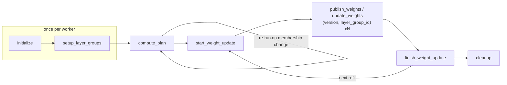
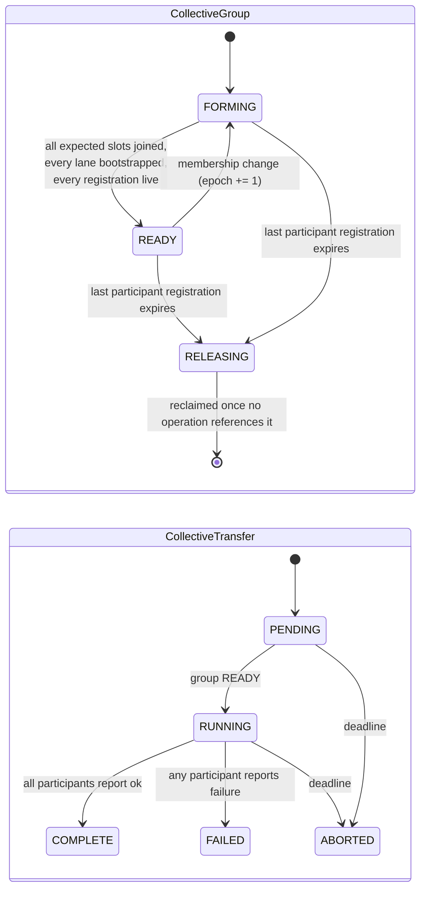

<!--
SPDX-FileCopyrightText: Copyright (c) 2026 NVIDIA CORPORATION & AFFILIATES. All rights reserved.
SPDX-License-Identifier: Apache-2.0
-->

# NCCL M2N Refit

Design for a collective weight-transfer path for Reinforcement Learning (RL) refit, built on
the NVIDIA Collective Communications Library (NCCL) and independent of the NVIDIA
Interconnect eXchange Library (NIXL) pull path. For the existing pull path, see
[the refit package](../modelexpress_client/python/modelexpress/refit/README.md). For
architecture and gRPC services, see [`ARCHITECTURE.md`](ARCHITECTURE.md). For configuration,
see [`DEPLOYMENT.md`](DEPLOYMENT.md).

> [!IMPORTANT]
> This is a design, not an implementation. No code for this path exists in the repository
> yet. It is a *sibling* of the NIXL pull path, not a mode of it: nothing on this path
> imports NIXL, and nothing on the NIXL path imports this.

## What this is

ModelExpress (MX) already has one RL refit data plane: a **receiver-driven NIXL
pull**. Each generator rank discovers trainer shard ownership through the MX
control plane and issues one-sided Remote Direct Memory Access (RDMA) reads for exactly
the byte ranges its own layout needs.

This document specifies the second, independent data plane: a **sender-driven
NCCL collective push**, built on `nccl.m2n.reshard`. Trainer ranks and generator
ranks enter one collective call together and NCCL performs the many-to-many (M-to-N)
redistribution between the two parallelism meshes internally.

The two paths answer the same question with opposite mechanics:

| | NIXL pull (existing) | NCCL M2N push (this document) |
|---|---|---|
| Initiator | Generator rank | Both sides co-call; the trainer supplies bytes |
| Wire primitive | One-sided Remote Direct Memory Access (RDMA) `READ` | `nccl.m2n.reshard` collective |
| Who routes | The MX receiver plans byte runs | NCCL routes from the src/dst meshes |
| Membership | Each receiver joins independently | Fixed communicator; every member must enter |
| MX control-plane role | Shard and manifest directory, leases | Rendezvous, admission, fencing, group state |
| Source lifetime | Buffers must outlive the receivers | Buffers live only across the collective |
| Partial generator set | Natural — receivers are independent | Requires a per-operation admitted group (see [Control plane](#control-plane)) |

Neither supersedes the other. Pull tolerates ragged membership and late joiners;
push gets NCCL's tuned M-to-N kernels and does not need trainer buffers kept
registered and pinned between refits.

### Non-goals

- No NIXL fallback, no runtime transport ranking, no "try NCCL then NIXL". One
  deployment configures one backend.
- No public layer or tensor selection API beyond the `layer_group_id` the shared
  client contract already specifies.
- No change to the existing `RefitService` pull RPCs (`WeightVersionShard`,
  `VersionLease`, `RefitWorkerService`). Those are the pull path's vocabulary.

## Requirements and prior art

### What this path must satisfy

The requirements below come from the internal MX RL refit design work. They are
restated here as the contract this path implements:

1. NCCL M2N is a *push-style collective*. Source trainer ranks initiate the data
   movement, **but only after the destination generator ranks have joined and
   exposed prepared destinations.**
2. **MX owns an ephemeral collective transfer group for each operation**:
   participant worker generations, source and destination roles, communicator
   bootstrap information, fencing, and operation state.
3. **Worker clients ask MX to join an operation; they do not choose or create
   groups themselves.**
4. The RL framework still coordinates through its native actor RPCs. It invokes
   the selected generator replicas and the trainer replica with the same version
   and operation reference. **The trainer-side clients launch the collective only
   when MX reports the group READY.**
5. This requires an **additive collective-operation API**. The generator-initiated
   pull call is not sufficient, because a trainer cannot safely push into
   destinations it has no way to know are prepared.
6. The TransferPlan abstraction survives, but its NCCL form carries collective
   membership and prepared destination bindings. Layer grouping stays internal.

### The shared two-sided client shape

MX refit clients are `RefitClient.Trainer` and `RefitClient.Generator`, each
decomposed into a pluggable **Publisher** (trainer) / **Loader** (generator) and
a **ShardRedistribution Backend** with a `Sender` and a `Receiver` half. The
lifecycle and its sequencing rules are fixed and shared with the pull path; a
push-mode backend slots in opposite the existing NIXL pull backend.



### Prior art: NeMo RL `nccl_reshard_refit`

NVIDIA-NeMo/RL PR #2971, merged 2026-07-29. The proven upstream implementation of
exactly this transfer. We adopt its wire contract so that an MX-brokered
deployment and a NeMo-RL-native deployment move identical bytes:

- `nccl.m2n.reshard` from the **nccl4py** package is the default and only wire op
  (`xferdtensor`'s pure-Python and golden paths are debugging aids, not our
  contract).
Adopted as **mechanism**, and framework-neutral:

- `nccl.m2n.reshard` from the **nccl4py** package as the wire op.
- Parameters keyed by a **canonical name** carrying a **global shape**, with per-expert
  Mixture-of-Experts (MoE) weights grouped into one entry of shape `[E, ...]`.
- Source and destination layouts described as a **rank mesh** plus DTensor
  **`Shard(dim)` / `Replicate()`** placements.
- One communicator per **disjoint source partition**, spanning that partition's trainer
  ranks plus all participating generator ranks, with **trainer ranks first**.
- A **bulk/misc split**: parameters whose layout the reshard can express take the collective
  path; the rest ride a packed broadcast on a separate all-participants communicator.

Adopted as **default policy**, and overridable per deployment:

- HuggingFace (HF) names as the canonical namespace. It is what vLLM, SGLang, and TRT-LLM
  already consume, so it is the useful default — but it is a Publisher choice, not a
  property of this path.
- Pipeline Parallelism (PP) stage as the source partition. It is the common case, not the
  only one.
- Feed-forward network (FFN) projection weights as the bulk set. That is a profiling result
  about MoE models (97-98% of refit bytes there, ~67% on a dense model), not a property of
  the transport.

The line between those two lists is the whole of this path's portability, so
[The plan](#the-plan-mesh-and-placement-contract) states where each is decided.

Where NeMo RL and MX differ is precisely the piece MX is asked to own:

| Concern | NeMo RL today | MX (this design) |
|---|---|---|
| Rendezvous | `StatelessProcessGroup` over a raw `TCPStore`, at an IP/port the Ray driver allocates per PP stage | MX control plane brokers the NCCL `uniqueId` |
| Rank assignment | Computed in the driver, hardcoded "train first, gen after" | MX assigns and returns `rank_in_lane`; same ordering rule, now enforced server-side |
| Membership | Always *all* generator ranks | Per-operation admitted set, so a selected subset of generators can refit |
| Fencing | None; a restarted worker silently rejoins | The `worker_id` generation is admitted or rejected; a membership change bumps the group epoch |
| Readiness | Implicit — everyone calls `init_nccl_communicator` and blocks | Explicit `FORMING -> READY` state the trainer waits on before launching |
| Group lifetime | One communicator for the whole job | Membership-keyed group, reused across refits, invalidated on epoch change |

## Component architecture


Ownership, one line each:

- **RL framework** picks the version, picks *which* generator replicas refit, and
  invokes both sides' actors with the same `(version, operation_ref)`.
- **MX control plane** owns group identity, admission, rank assignment, the NCCL
  `uniqueId`, worker-generation fencing, and the `FORMING -> READY` state the
  trainer gates on.
- **RefitClient.Trainer / .Generator** own the lifecycle, the layer groups, and
  the local plan.
- **Publisher / Loader** own everything engine-specific: which local tensor
  realizes each HF name, and any staging needed to send or install it.
- **ShardRedistribution Backend (nccl_m2n)** owns the communicators and the wire
  ops. It is the only component that imports `nccl`.

## Rendezvous: what MX replaces

NeMo RL's `StatelessProcessGroup` is a `TCPStore` whose sole job is to move 128
bytes of `ncclUniqueId` from rank 0 to everyone else, at an address the Ray driver
had to allocate and plumb through both actor sets, once per PP stage.

MX already is a well-known, authenticated, time-to-live (TTL)-backed coordination service that
both sides are connected to. Making it the store removes that port allocation,
makes membership explicit instead of implied by "whoever shows up", and gives us
the three things a `TCPStore` structurally cannot: admission, fencing, and a
readiness state that a *third* party — the trainer that must launch the
collective — can observe.


## Control plane

New proto file `modelexpress_common/proto/refit_collective.proto`, new service
`RefitCollectiveService`. Kept in its own file and its own Rust module so the NIXL
pull path and the NCCL push path never share a type.

### Resources

| Resource | Lifetime | Owner |
|---|---|---|
| `CollectiveGroup` | Membership-keyed; reused across refits; `epoch` bumps on membership change | MX |
| `CollectiveLane` | One per group per communicator (one per source partition, plus one broadcast lane) | MX |
| `CollectiveTransfer` | One per refit operation; references `(group_id, epoch)` and a `version_id` | MX |

Splitting group from operation reconciles two requirements that read as being in
tension: the group is described as ephemeral and per-operation, yet MX is also
expected to *reuse* a communicator until membership changes invalidate it. Treating
them as two objects satisfies both. The *operation* is per-refit and cheap. The *group* —
and the communicator it describes — is keyed by membership and reused until membership
changes. A client caches its `Communicator` under
`(group_id, epoch)` and drops it when the epoch moves.

### Lanes

One `CollectiveGroup` carries several communicators, because the transfer needs
two different spans:

| Lane kind | Count | Span | Carries |
|---|---|---|---|
| `LANE_KIND_RESHARD` | one per source partition | that partition's trainer ranks + all admitted generator ranks | `nccl.m2n.reshard` bulk params |
| `LANE_KIND_BROADCAST` | 1 | All admitted trainer + generator ranks | Packed misc-param broadcast |

A **source partition** is a set of trainer ranks that jointly own a disjoint slice of the
parameters. The Publisher declares which partition each parameter belongs to; MX only counts
them. Pipeline Parallelism (PP) stages are the common instance — stage `s` owns a disjoint
set of layers — but nothing here requires the partition to *be* PP, and a single-partition
trainer is just the degenerate case of one reshard lane.

Why partition at all, rather than one communicator over everyone: **a collective requires
every member to enter every operation.** With one global communicator, a trainer rank that
owns none of a parameter would still have to enter that parameter's `reshard` as a no-op
participant. Every parameter becomes a fleet-wide barrier and the partitions serialize behind
each other. Separate lanes make them independent, so they overlap on separate Compute Unified
Device Architecture (CUDA) streams.

Generator ranks sit in *every* reshard lane, because a generator holds all layers and so needs
bytes from whichever partition owns each one.

Keeping the bulk path on its own communicators is not cosmetic. The broadcast lane spans every
rank, so it overlaps every reshard lane, and concurrent traffic on overlapping communicators
can deadlock — the workers must drain all reshard lanes before the misc broadcast.

### Rank assignment

MX assigns `rank_in_lane`. Trainers occupy the low ranks of a lane and generators follow, so
each lane looks like a small self-contained world:

| Lane | `world_size` | Trainer at `index_in_role` `r` | Generator at `index_in_role` `g` |
|---|---|---|---|
| Reshard lane `p` | `trainer_ranks_in_partition + admitted_generators` | `r % trainer_ranks_in_partition` | `trainer_ranks_in_partition + g` |
| Broadcast lane | `trainer_world_size + admitted_generators` | `r` | `trainer_world_size + g` |

MX needs no knowledge of Tensor Parallelism (TP), Expert Parallelism (EP), or Data
Parallelism (DP) to do this — only the role, the lane, and the index within the role. All
parallelism semantics stay client-side. That is
the whole point of keeping MX a rendezvous rather than a planner on this path.

`rank_in_lane == 0` of each lane is always a trainer, and that participant
generates and posts the lane's `ncclUniqueId`.

### States



`READY` requires **all four** of: every expected slot has an admitted participant; every lane
has a posted `nccl_unique_id` **stamped with the current epoch**; every admitted participant's
`WorkerRegistration` is unexpired; and every participant reported the same `plan_digest`.

The liveness condition is what the NIXL path gets from lease renewal. Here it is checked at
admission and re-checked at the `READY` transition, because the collective's failure mode is a
hang rather than a `NOT_FOUND`.

The epoch stamp on the bootstrap identifier is load-bearing. A group outlives any single
membership, so a bootstrap identifier left over from a previous epoch would describe a
communicator with the wrong world size. Every rank would then initialize against it and block
forever. So `PublishGroupBootstrap` names its `(group_id, epoch, lane_id)`, an epoch bump
atomically clears every lane's identifier, and a publication whose epoch is not current is
rejected with `FAILED_PRECONDITION` rather than overwriting the live one.

**Reclamation is automatic.** There is no group-delete RPC, symmetrically with workers never
creating a group: a group whose participants have all let their registrations lapse moves to
`RELEASING`, and is reclaimed once no `CollectiveTransfer` still references it. An orchestrator
that wants a group gone stops invoking its workers.

### RPCs

```protobuf
service RefitCollectiveService {
  // Orchestrator-facing. CreateCollectiveTransferRequest carries an
  // idempotency_key, as CreateWeightVersion does on the pull path, so a
  // retried create returns the same operation instead of a second one.
  rpc CreateCollectiveTransfer(CreateCollectiveTransferRequest) returns (CollectiveTransfer);
  rpc GetCollectiveTransfer(GetCollectiveTransferRequest) returns (CollectiveTransfer);
  rpc DeleteCollectiveTransfer(DeleteCollectiveTransferRequest) returns (CollectiveTransfer);

  // Worker-client-facing. Workers join; they never create a group.
  rpc JoinCollectiveGroup(JoinCollectiveGroupRequest) returns (CollectiveGroupMembership);
  rpc GetCollectiveGroup(GetCollectiveGroupRequest) returns (CollectiveGroup);
  // Names (group_id, epoch, lane_id); a stale epoch is rejected, not applied.
  rpc PublishGroupBootstrap(PublishGroupBootstrapRequest) returns (CollectiveGroup);
  // Fenced on (operation_id, group_id, epoch, worker_id). A report from a
  // restarted worker or a superseded epoch is rejected, not recorded.
  rpc ReportCollectiveTransfer(ReportCollectiveTransferRequest) returns (CollectiveTransfer);
}

// Worker-to-worker. The trainer coordinator serves the reshard plan; MX stores
// only its digest and endpoint, exactly as the pull path does for manifests.
service RefitCollectiveWorkerService {
  rpc GetReshardPlan(GetReshardPlanRequest) returns (GetReshardPlanResponse);
}
```

`AwaitGroupReady` is deliberately *not* an RPC. Waiting is `GetCollectiveGroup`
polling with backoff, so a stalled peer surfaces as a client-side deadline
carrying the group's own participant list, rather than as a hung stream.

Both mutating RPCs are fenced rather than last-write-wins. `CreateCollectiveTransfer` is
idempotent on its key, so an orchestrator retry after a timeout cannot open a second operation
against the same group. `ReportCollectiveTransfer` is checked against the operation, the group
epoch, and the reporting worker's admitted generation, so a report that arrives after a worker
restart or an epoch bump is rejected instead of completing an operation the reporter is no
longer part of.

### Why the plan is worker-served

The reshard plan (see [The plan](#the-plan-mesh-and-placement-contract)) is one record per
bulk parameter: HF name, global shape,
dtype, source mesh and placements, destination mesh and placements, partition. For
a large MoE model that is on the order of hundreds of entries and hundreds of
kilobytes. The pull path already established the rule: the full sealed manifest
stays worker-served so that Custom Resource Definition (CRD) or etcd records stay small, while
`manifest_digest` verifies that fetched content matches.

The same rule applies here. MX stores `plan_source = {worker_id, endpoint,
digest}` on the group; generators fetch the plan from the trainer coordinator over
`RefitCollectiveWorkerService` and verify the digest. Because the plan is a
function of `(model layout, trainer parallelism, admitted generator set)` and not
of the weights, it is keyed by `(group_id, epoch)` and fetched **once per epoch**,
never per refit.

## The plan: mesh and placement contract

The plan is torch-free data; only the backend touches tensors. It is **declared by the
Publisher**, not inferred by the shared core. That inversion is what keeps this path
portable, so it is worth being explicit about which component decides what.

### Mechanism versus policy

| Decision | Owner | Why there |
|---|---|---|
| Rank assignment, lane membership, readiness, fencing | MX | Needs only role, lane, index — no parallelism semantics |
| Executing the collective, stream assignment, buffer lifetime | Backend | Transport concerns |
| Canonical name, global shape, dtype, mesh, placements, partition, bulk-eligibility | **Publisher** | Only the training framework knows how its own ranks are laid out |
| Where each canonical name lives locally, and any staging | **Loader** | Only the inference engine knows its own storage |

The shared core never inspects a parameter name to decide how it is sharded, and never
assumes a device-mesh ordering. Both were the two most framework-specific things in the prior
art, and both are silent-failure modes: a wrong mesh order does not raise, it moves the wrong
bytes.

### The declared plan

For each **bulk** parameter the Publisher declares:

```text
ParamPlan {
  name              # canonical name, HF by default
  global_shape      # full, unsharded
  dtype
  partition_id      # which source partition owns it -> selects the reshard lane
  src_mesh          # rank grid over this partition's trainer ranks
  src_placements    # [Shard(d) | Replicate()] per mesh dim
  dst_mesh          # rank grid over the admitted generator ranks
  dst_placements
  group_key         # optional: marks entries fused/stacked from several local tensors
}
```

MX contributes exactly one thing to this: the **rank offsets**, because the destination set
is the *admitted* generator subset rather than "all generators". `dst_mesh` is built at
`rank_offset = trainer_ranks_in_partition` within each reshard lane, over the admitted
generator count.

Parameters the Publisher does not mark bulk-eligible go to the misc list and ride the
broadcast lane in a deterministic order. That order is load-bearing: producer and consumer
walk it in lockstep.

### Coverage is a validated property, not a convention

The bulk plan and the ordered misc list are two contracts, and nothing about writing them
separately guarantees they agree. So the Publisher must prove, before publishing, that their
union names **every canonical parameter exactly once**:

- a parameter in neither list never moves, and the destination silently keeps serving its
  previous value — a partially-updated model that reports success;
- a parameter in both lists is applied twice, once through each path, with the later write
  deciding.

Both fail silently, which is why this is a gate rather than a guideline. The validated
coverage result is folded into the `plan_digest` below, so a generator that verifies the
digest has also verified coverage, and neither side can start a wire operation against a plan
that does not partition the model.

### A changed plan digest bumps the epoch

The plan is fetched once per `(group_id, epoch)`, and the Publisher decides everything in it.
That combination has a hole: membership can stay constant while the plan changes — a different
bulk classification, a renamed parameter, a dtype change — and a group that tracked only
membership would not notice. Generators would keep the plan they cached at the last epoch and
receive bytes laid out for a model that no longer exists.

So the group carries a `plan_digest`: a canonical digest over every `ParamPlan` field, the
misc order, and the coverage proof. Each participant reports its digest when it joins. MX
admits the group to `READY` only when every participant reports the same one, and **a changed
digest bumps the epoch exactly as a membership change does.** The cached plan and the cached
communicator are then invalidated together, which is the only safe pairing — a communicator
that matches the membership but a plan that does not match the model is precisely the case
that moves wrong bytes without erroring.

The digest deliberately stays *off* the group's identity. Folding it into `group_id` would
close the same hole, but every plan change would then strand the previous group as an orphan
that nothing rejoins, to be cleaned up only when its participants' registrations lapse. The
epoch already exists to express "same participants, invalidated caches", and a plan change is
exactly that. Group identity therefore stays `(model_name, trainer topology, admitted
generator set)`, and the digest rides on the group as versioned state.

### Defaults, so the common case stays cheap

Declaring a mesh per parameter would be tedious for a conventional Megatron-style trainer, so
the shared core ships an opt-in default derivation the Publisher may call instead of writing
its own:

- **Mesh** — emit dims in the order `(tp, ep, dp, pp)`, drop size-1 dims, reverse the
  survivors into a row-major rank tensor, so the first surviving dim is the innermost
  (fastest-varying) axis. Non-expert parameters get a TP mesh (`ep_size=1`); expert
  parameters get an EP mesh (`tp_size=1`).
- **Placements** — 1-D parameters replicate; expert parameters `Shard(0)` on the EP axis;
  column-parallel projections `Shard(0)` and row-parallel projections `Shard(1)`.
- **Bulk set** — FFN projection weights, dense and MoE, excluding shared experts.

These reproduce the prior art's behaviour exactly, so a Megatron-to-vLLM deployment gets it
for free. A trainer that lays its ranks out differently — a Fully Sharded Data Parallel
(FSDP) or DTensor-native trainer, say — declares its own and never touches these.

### Local realization: Publisher and Loader

The plan says *what* moves. A second, smaller contract says *where it lives locally*. It is
deliberately identical in shape to the prior art's, so an existing Megatron or vLLM
name-to-local-tensor map drops in unchanged:

```python
@dataclass
class LocalParamSpec:
    base: Any                                   # live local tensor, or None
    pre:  Callable[[Any], RefitCtx] | None      # base -> RefitCtx(buf=...)
    post: Callable[[RefitCtx], None] | None     # runs after the wire op
```

- Trainer, direct parameter: `base` is the live TP/EP-local shard, sent as-is.
- Trainer, grouped MoE: `pre` stacks this rank's per-expert views into
  `[E_local, ...]` fresh each refit; no `post`.
- Generator, direct parameter: `base` is the live engine parameter, received in
  place.
- Generator, slice of a fused parameter (`gate_up_proj`, `w13`/`w2`): `pre`
  allocates a receive buffer for the region, `post` copies it back into the fused
  tensor.

`pre`, `post`, and the wire op all enqueue on the same Compute Unified Device
Architecture (CUDA) stream, so staging is ordered with the transfer without a host
synchronize.

### Current limitations, and where they live

These are properties of the **first Publisher and Loader**, not of the path. They are listed
here so an integrator can see what they would have to lift, rather than discovering it as a
silent constraint:

| Limitation | Lives in | Why it is not structural |
|---|---|---|
| Generator-side pipeline parallelism must be 1 | Loader | Reshard lanes assume a generator holds every layer, so it can receive from every source partition. Generator-side PP needs destination partitions too — symmetric with the source side, not a new concept |
| Generator expert parallelism is 1 or equal to its tensor parallelism | Loader | The Loader maps experts onto its own ranks; a different mapping is a different `dst_mesh`, which the Publisher already declares |
| Source and destination dtype must match | Backend | The collective moves bytes. A converting path needs staging on the receive side, which the `pre`/`post` hooks can already express |
| Expert tensor parallelism on the trainer is 1 | Default derivation only | A Publisher declaring its own meshes is unaffected |

## Lifecycle and sequencing

The shared lifecycle's sequencing rules map onto the collective path as follows.
The rules are the contract; the right-hand column is what this backend does with
them.

| Call | Sequencing rule | NCCL M2N backend |
|---|---|---|
| `initialize` | Once per worker; before `setup_layer_groups`; unordered across workers | Publisher/Loader `capture()`; register with MX; `Sender/Receiver.initialize()` records local shard geometry |
| `setup_layer_groups` | Once per worker; groups must be disjoint and cover the model | Map each `layer_group_id` to its bulk `ParamPlan` subset and misc subset |
| `compute_plan` | After all workers finish `initialize`+`setup_layer_groups`; re-run on membership change | **Join the group, wait for READY, create the communicators, fetch and verify the plan.** Membership change = new epoch = new communicators |
| `start_weight_update(version, worker_ids)` | Once per refit; all `compute_plan` done; no overlapping refits | `Publisher.start_new_round(version)`; the backend binds the operation and the admitted destination subset |
| `publish_weights` / `update_weights(version, layer_group_id)` | Multiple per refit; concurrency across affected workers is desirable | The co-called `nccl.m2n.reshard` sequence for that group's bulk params. Bulk only — see below |
| `finish_weight_update(version)` | After all `*_weight_update` calls for this refit | Drain every reshard lane, then the **single** misc broadcast for the whole refit; `Loader.finish()`; stream sync; `ReportCollectiveTransfer` |
| `cleanup` | Terminal | Release buffers, destroy communicators, deregister |

Two invariants the collective imposes on top of that lifecycle:

1. **Every participant must issue the same sequence of wire ops.** The plan's
   parameter order is the single source of truth for both sides; a rank that skips
   a parameter its peers issue hangs the communicator, not just itself.
2. **The trainer must not enter the collective before the group is READY.** This
   is the core requirement of this path, and it is why readiness is
   server-observable state rather than a client-side barrier.
3. **The misc broadcast is one phase per refit, not one per layer group.** It belongs to
   `finish_weight_update`, after every reshard lane has drained.

That third one falls out of the deadlock rule rather than being an independent choice. The
broadcast communicator spans every rank, so it overlaps every reshard lane. If each
`publish_weights` call ended with its own broadcast, then with more than one layer group a
rank would enter the broadcast for group 0 while its peers were still resharding group 1 —
two overlapping communicators with operations in flight in different orders, which is exactly
the case that hangs. One broadcast, after everything, is the only ordering that holds for any
number of layer groups.

### Refit-time waterfall


Per-PP-stage lanes are independent communicators, so stage 0's and stage 1's
reshards overlap on separate CUDA streams (`MX_NCCL_REFIT_NUM_STREAMS`, default 2,
matching NeMo RL's `NRL_REFIT_NUM_STREAMS`). The misc broadcast is strictly
serialized after all bulk lanes: it uses the all-participants communicator, which
overlaps every reshard lane, and concurrent traffic on overlapping communicators
can deadlock.

## Two integration depths

A framework can adopt this path at either of two levels, and which one fits
depends on what it already has.

**Full two-sided client.** `RefitClient.Trainer` / `.Generator` own the
lifecycle, the layer groups, the plan, and the wire ops. A framework with no
existing reshard path takes this one: it supplies a Publisher and a Loader and
gets everything else.

**Bootstrap only.** A framework that *already* performs an equivalent reshard
needs far less. The transfer consumes exactly one thing from its process group
-- the NCCL communicator -- so MX can supply a group object carrying an
MX-brokered `ncclUniqueId` and let the framework's existing refit loop run
untouched.

The second is the better deal wherever it applies, and not only because it is
less code. The framework's two transports then share every line below the
bootstrap, so they cannot drift apart, and a measured comparison between them
isolates the rendezvous rather than confounding it with two separate
implementations of the same transfer. NeMo RL integrates this way.

Both depths use the same control plane; they differ only in how much of the
client the framework delegates.

## Failure semantics

The collective's characteristic failure is a **hang**, not an error return. Every
guarantee below exists to convert a potential hang into a bounded, attributable
failure.

| Failure | Detection | Behavior |
|---|---|---|
| A participant never joins | `READY` never reached; client-side deadline on `GetCollectiveGroup` | Operation `ABORTED`; the error names the missing slots |
| A participant joined then died before the collective | Its `WorkerRegistration` TTL expires; re-checked at the `READY` transition | Group returns to `FORMING`, epoch bumps; nobody entered the collective |
| A worker restarts and rejoins | New `worker_id` for the same slot | Admitted as a *different generation*; epoch bumps; cached communicators dropped |
| A participant dies mid-collective | NCCL error, or `MX_NCCL_REFIT_TRANSFER_TIMEOUT_S` on the surviving ranks | Abort the lane's communicator, `ReportCollectiveTransfer(FAILED)`, operation `FAILED`, epoch bumps so the next `compute_plan` rebuilds |
| `Communicator.init` never returns | `MX_NCCL_REFIT_COMM_INIT_TIMEOUT_S` | Abort the lane, fail `compute_plan` naming the lane and its participants. No operation ever starts |
| A collective stalls with every rank alive | `MX_NCCL_REFIT_TRANSFER_TIMEOUT_S` | Abort every lane of the group, not just the stalled one: a partially-aborted group would leave peers blocked in the lanes that did not time out |
| Membership changes between refits | Epoch mismatch on `start_weight_update` | `FAILED_PRECONDITION`; the caller re-runs `compute_plan` — the stated trigger for replanning |
| Plan digest mismatch | Generator verifies the fetched plan against `plan_source.digest` | Fail closed before any wire op |

**An aborted communicator is never reused.** Abort is what makes a deadline mean anything —
without it the call is still blocked, it merely has an error attached. So an abort marks the
whole group's communicators dead, bumps the epoch, and forces the next `compute_plan` through
a fresh bootstrap. That is deliberately the most expensive recovery available: rebuilding is
seconds, whereas silently reusing a communicator whose peers disagree about what already
completed is unbounded.

Installation failure follows `DIRECT` installation semantics: a collective push
writes into destinations the Loader prepared, so a partial failure may have already
changed live parameters. Recovery is the RL framework restarting the generator
engine, not an MX-side rollback. A Loader that wants verify-before-activate must
allocate its own receive buffers in `pre` and commit in `post`/`install()` — which
is exactly what the fused-parameter path already does.

## Configuration

| Variable | Default | Purpose |
|---|---|---|
| `MX_REFIT_TRANSPORT` | `nixl` | `nccl_m2n` selects this path. One deployment, one backend |
| `MX_NCCL_REFIT_NUM_STREAMS` | `2` | CUDA streams for overlapping reshard lanes |
| `MX_NCCL_REFIT_GROUP_TIMEOUT_S` | `600` | Deadline for `FORMING -> READY` |
| `MX_NCCL_REFIT_POLL_INTERVAL_S` | `0.25` | `GetCollectiveGroup` poll backoff floor |
| `MX_NCCL_REFIT_COMM_INIT_TIMEOUT_S` | `300` | Deadline for `Communicator.init` on one lane |
| `MX_NCCL_REFIT_TRANSFER_TIMEOUT_S` | `600` | Deadline covering one refit's reshards, broadcast, and final stream sync |
| `MX_NCCL_REFIT_MISC_CHUNK_BYTES` | `268435456` | Packed misc-broadcast chunk size |

Every one of those is a deadline, not a hint. Group formation being bounded is not enough on
its own: `READY` only means the group *formed*, and each of `Communicator.init`, each
`nccl.m2n.reshard`, the packed broadcast, and the closing stream synchronization can block
indefinitely on its own. A path whose whole failure story is "turn hangs into attributable
failures" has to bound the operations after `READY` too, or the story stops being true at the
point it matters most.

Timing is reported through the existing `RefitTimingRecorder` stage vocabulary so
NIXL-pull and NCCL-push refits are directly comparable. For this path, *setup and
registration* is dominated by `Communicator.init` and is charged **once per
epoch**, not once per refit — reporting it per refit would make a warm refit look
an order of magnitude worse than it is.

## Dependencies

`nccl4py` (the `nccl` package) provides everything this path needs:

```python
from nccl.core.utils import get_unique_id, UniqueId   # 128-byte ncclUniqueId
from nccl.core.communicator import Communicator       # Communicator.init(nranks, rank, unique_id)
from nccl.m2n import reshard                          # the M-to-N collective
```

It is an **optional extra** (`modelexpress[nccl-m2n]`). Importing
`modelexpress_rl.collective` without it raises at `initialize()` with an
actionable message; the torch-free plan and rendezvous modules import and test
cleanly without NCCL, CUDA, or torch.

## Proposed implementation slices

| Slice | Contents |
|---|---|
| 1. Control plane | `refit_collective.proto`; Rust `RefitCollectiveService` + backend trait + Redis backend (atomic join, admission, epoch bump via Lua) |
| 2. Torch-free client core | Plan records, mesh and placement derivation, bulk/misc split, layer groups, rank-assignment mirror, digest |
| 3. Rendezvous client | Join, poll to READY, publish/fetch `uniqueId`, communicator cache keyed by `(group_id, epoch)` |
| 4. Backend | `NcclM2nSender` / `NcclM2nReceiver`: reshard lanes, broadcast lane, stream assignment |
| 5. Two-sided clients | `RefitClientTrainer` / `RefitClientGenerator` lifecycle + Publisher/Loader Service Provider Interface (SPI) + reference implementations |
| 6. Tests | Torch-free unit tests for slices 1-3 and 5; a Graphics Processing Unit (GPU) end-to-end harness for slice 4 |

Megatron publisher and vLLM loader are deliberately **out of this PR**: they are
the only pieces with genuinely new logic per NeMo RL's own analysis, they need
real engines to validate, and the SPI above is `LocalParamSpec`-compatible so
NeMo RL's existing builders port directly.

## Open questions

- **Group keying.** A group is keyed by `(model_name, trainer topology, admitted
  generator set)`. If the orchestrator refits overlapping generator subsets in
  alternation — the motivating case, where idle instances update first — each
  distinct subset is its own group and pays its own `Communicator.init`. A superset
  group with per-operation participation masks would amortize that, but NCCL
  requires every communicator member to enter every collective.
- **Misc-path ownership.** The packed broadcast currently sits inside the NCCL
  backend. If a second push backend appears it should move up into the client.
- **Layer-group granularity vs. lane count.** `layer_group_id` and `partition_id` are
  independent partitions of the parameter set; their product determines wire-op
  count. There is a point where finer layer groups cost more in launch overhead
  than they save in trainer memory, which is what motivates layer grouping at all.
- **Default bulk set coverage.** The shipped default covers FFN projections only. Attention
  projections are the obvious next increment for dense models, where the bulk fraction is
  ~67% rather than ~97%. A Publisher can already widen this today by declaring
  bulk-eligibility itself; the open question is what the *default* should be.
- **Cost of declaring versus deriving.** Pushing mesh and placement declaration into the
  Publisher removes the silent-wrong-bytes failure mode, but it moves real work onto every
  new trainer integration. If the default derivation turns out to fit every trainer we
  actually target, the extra surface is not paying for itself.

## Related documentation

- [ModelExpress for RL Weight Refit](../modelexpress_client/python/modelexpress/refit/README.md) — the NIXL pull path this is a sibling of
- [ModelExpress architecture](ARCHITECTURE.md) — components, gRPC services, server internals
- [Deployment and NIXL configuration](DEPLOYMENT.md)
- [NVIDIA-NeMo/RL#2971](https://github.com/NVIDIA-NeMo/RL/pull/2971) — the upstream `nccl_reshard_refit` implementation whose wire contract this adopts
