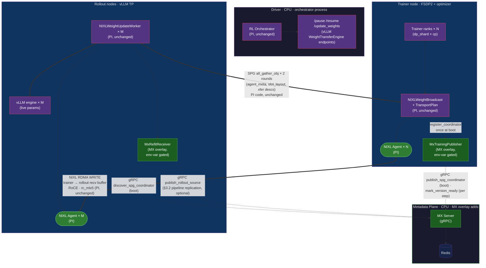
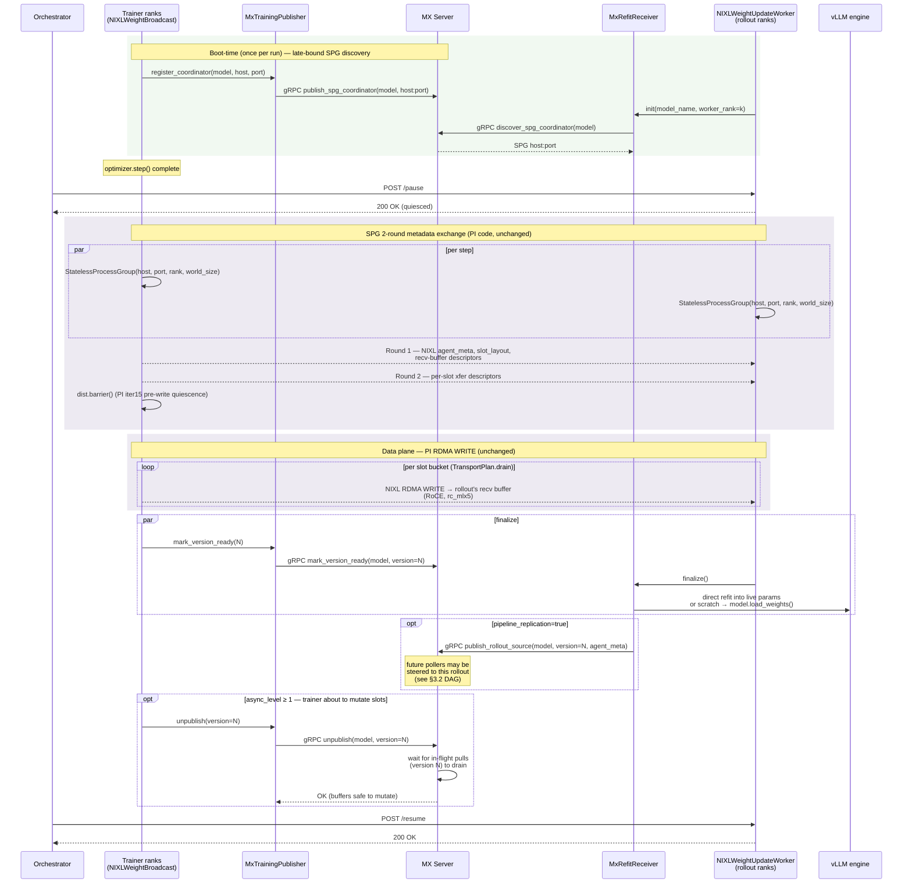

# ModelExpress × PRIME-RL — Design Overview

**Last Updated**: April 24, 2026
**Status**: **Scenario A green on GB200** — overlay validated end-to-end against PI's `nixl-weight-transfer` branch ([#2326](https://github.com/PrimeIntellect-ai/prime-rl/pull/2326)). 20/20 RL training steps with real NIXL RDMA pushes (~596 MB/step, 310 slots, 100% `/update_weights` success). Scenarios B (MX rendezvous engaged) and C (pipeline replication) are next — MX overlay code is deployed behind env-var gates (`PRIME_RL_MX_RENDEZVOUS`, `PRIME_RL_MX_PIPELINE_REPLICATION`) and awaits flip + measurement. Scenarios D (scratch-buffer diagnostic) and E (peer recovery) are designed but not yet run. Draft PR: [#2343](https://github.com/PrimeIntellect-ai/prime-rl/pull/2343).

This document covers how ModelExpress (MX) plugs into [PRIME-RL](https://github.com/PrimeIntellect-ai/prime-rl)'s NIXL weight-transfer path as a **metadata and elasticity layer on top of** the existing `NIXLWeightBroadcast` / `TransportPlan` introduced by PR #2326. We do not reimplement their transport. We replace the SPG (StatelessProcessGroup) rendezvous with an MX-Server-mediated discovery plane, add pipeline replication, add a mutability contract, and enable a scratch-buffer diagnostic mode — all opt-in behind a single config flag.

---

## 1. Design Overview

### What MX adds to PRIME-RL's NIXL backend

PR #2326 gives PRIME-RL a bit-exact RDMA weight transport built on NIXL/UCX over RoCE, with slots (`ShardedSlot` / `GatheredSlot` / `ExpertSlot`), model-agnostic `ConversionSpec` / `QuantizationSpec`, FP8 trainer-side quantization, HSDP primary-replica push, per-rank NIC pinning, and an `expandable_segments`-safe `CUDAPluggableAllocator` slot pool. The transport works. What it doesn't have is a dynamic discovery plane.

| Layer | Role in PR #2326 | Role with MX overlay |
|-------|------------------|----------------------|
| Data plane | NIXL RDMA (UCX / `rc_mlx5` / RoCE) | **Unchanged** — identical bytes on the wire |
| Slot / bucket system | `ShardedSlot`, `GatheredSlot`, `ExpertSlot`, `TransportPlan` | **Unchanged** — imported as-is |
| Publishing topology | **Per-rank sharding-aware** — each trainer rank publishes its own FSDP / TP / EP shard; no rank-0 allgather | **Unchanged** — this is a core property of PI's foundation, inherited by the overlay (see §3.9) |
| Quantization / conversion | `ConversionSpec`, `QuantizationSpec` | **Unchanged** — same trainer-side FP8 path |
| Rendezvous / discovery | SPG — static, rank-paired, global-world-size fixed at init | **Replaced by MX Server** (gRPC + Redis) when `rendezvous: mx_server` is set |
| Topology | Star (trainer rank k → inference rank k, 1:1, no fan-in to rank 0) — trainer NIC is the single source for all fan-out | **Dynamic DAG** — trainer seeds the first rollout; each finished rollout becomes an additional source; MX Server load-balances new pollers across the growing source set. Same TensorHub pattern. Trainer NIC stops being a bottleneck once any rollout has received (§3.2) |
| Mutability contract | None | **Explicit `publish` / `unpublish`** — trainer publisher marks slots immutable during rollout pulls, mutable before `optimizer.step()` |
| Elastic topology | No — SPG locks `dp_shard×cp + inference_ws` at boot | **Yes** — rollouts can join / leave mid-run via `poll_for_source` |
| Retention | None — no version history | **Keep-latest-N** — MX Server reaper preserves designated versions, CPU-offloads the last GPU copy if necessary |
| Cross-framework | prime-rl only | **Same MX client** also powers verl `MxCheckpointEngine`, future NeMo-RL |
| Expert-aware source tracking (MoE) | Implicit (ExpertSlot in client; no server-level index) | **Explicit server-side `(model, version, expert_id) → worker` index** + `poll_for_expert_source` RPC. Low-hanging win — primitives already exist in MX Server, overlay wires them up (§3.7) |
| Peer recovery on pod restart | Not available — recovering rank must re-pull from trainer | **Multi-source discovery** — `poll_for_sources` returns ranked live peers holding the current version of rank k's shard; recovering rank pulls from nearest/least-loaded peer. Uses the same source index pipeline replication writes to. No event log / no version replay (§3.10) |
| Scratch-buffer diagnostic | Not supported (direct refit only) | **Opt-in via `transfer_mode: scratch`** — uses PI's same transport but stages into isolated GPU tensors + `model.load_weights()` for KL-drift triangulation |

### Component diagram (vertical, document-friendly)



**Legend**:

- **Purple boxes + solid purple edges** — existing PRIME-RL / vLLM / PI #2326 code the overlay imports and uses as-is.
- **Green boxes + dotted green edges** — MX additions: MX Server, overlay client classes, gRPC control-plane calls.
- **Data plane** (trainer NIXL ↔ rollout NIXL, solid double-edge) is **100% PI** — MX does not see or touch weight bytes.
- **SPG metadata rounds** (trainer ↔ rollout double-edge between `TransportPlan` and `NIXLWeightUpdateWorker`) are **100% PI** — MX only swaps how participants *find* the SPG coordinator; the two `all_gather_obj` rounds themselves are untouched.

### Key ideas

- **MX Server stores metadata only.** Slot layouts, tensor descriptors, NIXL agent blobs, version numbers. It never touches weight bytes.
- **The data path is PI's, unchanged.** NIXLWeightBroadcast + TransportPlan + Slot classes are imported and used as-is. Our value-add is what happens *before* (discovery) and *alongside* (lifecycle, pipeline replication, diagnostics).
- **Opt-in via one config field.** `weight_broadcast.rendezvous: "spg" | "mx_server"` (default `"spg"`). Flip the flag, no code paths diverge.
- **Pipeline replication is a client-side change.** After a rollout receives weights, it optionally re-registers itself as a source. The next rollout to poll discovers *either* the trainer or a replicated rollout, closer / less-loaded wins. Amplifies trainer NIC bandwidth in fan-out-heavy topologies.
- **Scratch-buffer diagnostic mode** reuses PI's transport but lands writes in isolated GPU tensors, then applies via `model.load_weights()`. Used for triangulating correctness issues like the KL drift in #2326.

---

## 2. Timing Diagram — One `update_weights` Step

Shows the MX-mediated path (`rendezvous: mx_server`). The SPG path is unchanged from PI #2326. The overlay's v0.1 scope is **coordinator discovery only** — once the SPG coordinator is found via MX, PI's existing 2-round `all_gather_obj` metadata exchange and `TransportPlan` RDMA WRITE run bit-identically.



**Legend**: Green-tinted block = one-time boot path (MX discovery — the only control-plane change the v0.1 overlay makes). Purple-tinted blocks = per-step flow that's **unchanged from PI #2326** (SPG metadata rounds, barrier, RDMA WRITE). MX Server hooks at finalize + optional blocks (`publish_rollout_source`, `unpublish`) are additive — absent when the corresponding feature flag is unset.

### Observed per-step timing

Scenario A numbers are measured on GB200 (Qwen3-0.6B BF16, 2 trainer ranks × 1 inference rank, customer-gpu-o7v pool). Scenarios B and C await the next session's env-var flip.

| Phase | Scenario A — PI SPG baseline (GB200 2-node, measured) | Scenario B — MX rendezvous (GB200, pending) | Scenario C — MX + pipeline replication (GB200, pending) |
|-------|-------------------------------------------------------|---------------------------------------------|---------------------------------------------------------|
| Rendezvous (SPG init vs MX poll) | ~0.8s first, negligible steady-state (10 steps observed in single SPG session) | **pending** (target: ≤100 ms first poll via gRPC catalog, ≤20 ms steady-state) | **pending** |
| `send_weights` / `receive_weights` (RDMA) | 596 MB bucket per push, 310 slots, avg step time 5.1s incl. forward+backward+optim+push (SDPA, not flash-attn) | **pending** (target: parity with A — same transport) | **pending** (target: aggregate BW > A as rollouts re-publish) |
| `finalize` + `dist.barrier()` | ~0.1s | **pending** | **pending** |
| **Total `update_weights`** wall-clock | ~5.1s avg (incl. training step; pure transfer share TBD from phase-split trace) | **pending** | **pending** |

Parity with PI on the data path is the acceptance criterion for the MX overlay — any regression means we've accidentally touched the hot path, which is not the design.

**Known caveat for comparison against PI's reported 12-node prod numbers**: our scenario A runs on SDPA (our ARM64 image ships a flash-attn import stub; real kernels require a ~3h QEMU compile). This caps throughput at ~6.7k tokens/s/rank vs PI's prod numbers which assume flash-attn. The **NIXL transfer** portion is unaffected (same UCX rc_mlx5, same bytes on wire); the **step-time** fraction attributable to training (forward + backward) is inflated. Flash-attn parity is a P1 follow-up in `PRIMERL_POC_Next_Steps.md`.

---

## 3. ModelExpress Value Layer

This section documents what the overlay changes relative to PI's PR #2326.

### 3.1 SPG → MX Server rendezvous

**What SPG provides in #2326**: A fixed-world-size group over TCP, used to exchange NIXL agent metadata at init. Every participant must be present at the same time; adding/removing a rollout requires a full process restart.

**What MX Server provides**:
- Each trainer rank calls `MxTrainingPublisher.publish(agent_meta, slot_layout, version)` once per step (gRPC).
- Each rollout calls `MxRefitReceiver.poll_for_source(model_name, worker_rank, min_version)` — returns the matching trainer rank's agent metadata and slot layout.
- Poll is idempotent and cache-friendly; rollouts can join mid-run, leave, or be restarted without affecting other participants.

**Config surface**:

```yaml
weight_broadcast:
  type: nixl            # use PI's transport
  rendezvous: mx_server # instead of spg
  mx_server_url: modelexpress-server.kavin.svc.cluster.local:8001
  model_name: "zai-org/GLM-4.5-Air-FP8"   # example; see §4 for final selection
```

When `rendezvous: spg` (the default), behavior is 100% identical to PI's PR #2326.

### 3.2 Pipeline replication — dynamic DAG of rollouts-as-sources

Rollouts form a **dynamic DAG**, not a static star. Every `publish_rollout_source(version=N)` call adds a new parent edge available to unfinished rollouts. Every `poll_for_source(version=N)` gets load-balanced across the currently-available parent set (trainer + any rollouts that have already finalized version N). The DAG is built organically as receives complete; there is no precomputed topology.

This is the same architectural pattern as TensorHub's Reference-Oriented Storage (ByteDance, April 2026; see `recovery/reinforcement learning/TensorHub_Analysis.md` for the design comparison).

```yaml
weight_broadcast:
  rendezvous: mx_server
  pipeline_replication: true     # default false
```

**DAG buildup over time** (12 rollouts, single trainer source for a given rank k):

```
t=0       Trainer publishes version N.
          Sources for version N: {Trainer}.
          MX Server DAG:  Trainer ──→  (R0..R11 all polling)

t=t0      Trainer → R0 RDMA completes first.
          R0 calls publish_rollout_source(version=N).
          Sources: {Trainer, R0}.
          MX Server DAG:  Trainer  ──→  (R1..R11 polling)
                            │
                            └─ R0 ──→ (next pollers can choose R0 or Trainer)

t=t1      R1 and R2 pull in parallel from {Trainer, R0} (server load-balances).
          Both finalize; publish_rollout_source().
          Sources: {Trainer, R0, R1, R2}.
          Effective outbound: 4 NICs serving R3..R11.

t=t2      R3..R6 finalize from {Trainer, R0, R1, R2}.
          Sources: {Trainer, R0..R6}.
          Effective outbound: 8 NICs serving R7..R11.

t=t3      R7..R11 finalize.
          All 12 rollouts hold version N.
```

**Bandwidth math**: A naive star with T trainer NICs serving R rollouts caps aggregate throughput at T × per-NIC-BW, regardless of R. The DAG caps aggregate throughput at R × per-NIC-BW (every GPU's outbound contributes once it has received). For R=12 and T=8 on the PI prod shape, this is a 1.5× headroom; for R=64 on a future scale-out, it's 8× headroom.

**Load-balancing preference** (pipeline replication mode, distinct from §3.10 peer recovery):

- Spread load evenly across currently-available sources (round-robin within a locality tier).
- Prefer same-rack sources over cross-rack to minimize inter-switch hops.
- Avoid overloading the trainer — once any rollout is available, weight the trainer lower in selection so its NIC stays free to seed new pushes.

Contrast with §3.10 peer-recovery preference, which prefers same-node > same-rack > any > trainer-last (optimizing for recovery *latency* vs pipeline *throughput*).

**Server-side state used** (shared with peer recovery in §3.10 — same index, two entry points):

```
sources_index : Map<(model, version, worker_rank), Set<SourceId>>
source_health : Map<SourceId, LastHeartbeat>
source_load   : Map<SourceId, InFlightTransfers>   // for load-balancing
```

**Current limit (TensorHub has, we don't yet)**: We call `publish_rollout_source()` after `finalize()` — i.e., once *all* slots have been received. TensorHub goes further and lets a partially-replicated rollout serve its *completed* slots while still receiving others. This deepens the pipelining further (rollout A's slot 0 can feed rollout B's slot 0 even while rollout A is still pulling slot 1 from the trainer). We've chosen post-finalize-only for the initial overlay to keep the correctness surface small; partial-replica serving is in the future-work list with a clear enablement path:

1. Publisher exposes `publish_partial_source(version, completed_slots[])` that accepts a slot-id bitmap.
2. Server-side index keys on `(model, version, worker_rank, slot_id)` instead of `(model, version, worker_rank)`.
3. Receiver filters candidate sources per slot, composes multi-source pulls.

Low-risk to add post-merge; no impact on the initial PR's success criteria.

### 3.3 Mutability contract (publish / unpublish)

PI's protocol currently relies on a `dist.barrier()` after `NIXL_READY` to ensure trainer ranks don't start writing while inference is still reading (iter15 fix). This works for synchronous push, but at async level ≥ 1 (pre-fetch next rollouts while current training step runs) the trainer will re-use slot buffers for the next `optimizer.step()` while rollouts may still be pulling the previous version.

The MX overlay adds:
- `unpublish(version=N)` gRPC — trainer calls this just before buffer mutation.
- MX Server blocks `unpublish` until all in-flight pulls for version N have completed (tracked via heartbeat ACKs from rollouts).
- Publisher then signals the trainer that slot buffers are safe to mutate.

### 3.4 Retention protocol

MX Server enforces keep-latest-N versions per model (default N=2). If the last GPU-resident copy of a retained version is about to be unpublished, the server offloads that version to CPU memory as a fallback. Rollouts pulling a version that exists only on CPU pay a higher latency but don't fail. Prevents version loss under elastic churn; matches TensorHub retention semantics.

### 3.5 Scratch-buffer diagnostic mode

PI's direct-refit writes RDMA-received bytes directly into live vLLM parameter memory. The KL drift investigation in #2326 (27+ iterations, unresolved) narrowed the bug to "NIXL write mechanism itself" — write-ordering / visibility / tensor-identity hazards at the intersection of RDMA and live CUDA tensors.

The MX overlay offers an alternate target:

```yaml
weight_broadcast:
  rendezvous: mx_server
  transfer_mode: scratch      # default: direct
```

In `scratch` mode:
- RDMA writes land in isolated scratch GPU tensors allocated by the receiver, not in live vLLM params.
- After the transfer completes, `model.load_weights()` applies them — the same code path NCCL uses.
- Bit-exact byte check passes in both modes (transport is identical); any KL divergence between `direct` and `scratch` isolates the bug to the direct-refit target layout (kernel format, stride, identity), *not* the NIXL mechanism.

Memory cost is scratch-sized (~3.5 GB for 1.5B, ~15 GB for 7B, ~30 GB for 32B-class MoE). Intended for diagnostic runs, not production.

### 3.6 Cross-framework reuse

The same `MxTrainingPublisher` / `MxRefitReceiver` classes underpin `MxCheckpointEngine` in [verl](https://github.com/volcengine/verl). Seek `docs/RL/VERL_MX_OVERVIEW.md` for that integration's topology. Future NeMo-RL integration uses the same client. No framework-specific server code exists in MX Server.

### 3.7 Expert-aware source tracking (MoE)

For MoE models at expert parallelism EP > 1, each inference worker holds only a *subset* of experts. Broadcasting every expert to every worker (NCCL, filesystem) wastes `(EP - 1)/EP` of the bandwidth. MX's per-worker publishing model makes expert-selective transfer natural — every trainer EP rank publishes only its local experts; every inference EP rank pulls only its assigned experts from the matching source.

**Server-side state** (primitives already defined, logic added in this overlay):

- `WorkerMetadata.worker_rank` identifies the publishing EP rank.
- `SourceIdentity.expert_parallel_size` declares the source's EP degree.
- `TensorDescriptor.name` carries the expert index (`...experts.{N}.gate_proj.weight`).
- New server index `(model, version, expert_id) → worker`, built incrementally as publishers announce slots.

**New RPCs** in MX Server (added alongside the overlay):

| RPC | Purpose |
|-----|---------|
| `publish_expert_ownership(source_id, expert_ids[])` | Trainer EP rank announces its assigned experts for the current version |
| `poll_for_expert_source(model, version, expert_id)` | Inference EP rank asks "who holds expert N?"; server returns matching source's agent meta |
| `list_experts(model, version)` | Diagnostic — returns the `expert_id → worker` map |

**Client-side** — once we adopt PI's `ExpertSlot` in Phase 1, the data is already produced by the publisher; the overlay just flushes it to MX Server instead of keeping it SPG-local.

**Why this matters**:

- **Bandwidth**: With EP=8 and 64 experts (matches both GLM-5 and Qwen2-57B-A14B), each inference worker needs 1/8th of expert bytes. Broadcast-based transports can't exploit this; MX can.
- **Future load-balancing**: The server-side index enables hot-expert migration (move frequently-used experts closer to their consumers), elastic expert redistribution, and dynamic expert pruning.
- **Minimal effort**: ~2 days server, ~1 day client, ~1 day tests — the primitives already exist.

### 3.8 Scratch-buffer evolution path

The scratch-buffer path in §3.5 is the correct *default* — same `model.load_weights()` code path NCCL uses, low correctness risk, clear A/B isolation. But it is not long-term feasible: at 32B the scratch approaches 35% of GB200 HBM; at 70B it no longer fits alongside a realistic KV cache.

We document a 5-tier evolution so the design has a clear migration target as each correctness concern gets retired:

| Tier | Approach | Scratch memory | Conversion cost | Correctness risk | Trigger to advance |
|------|----------|---------------|-----------------|------------------|-------------------|
| 0 | **Current** — scratch + `load_weights()` on receiver | Full model | High (every rollout) | Low | — |
| 1 | **ConversionSpec on trainer** + scratch on receiver (`load_weights` becomes plain copy) | Full model (kernel-format) | Paid once on trainer | Low | Adopt PI's `ConversionSpec`/`QuantizationSpec` (Phase 1) |
| 2 | **Streaming per-tensor** — receive one tensor, apply, free, next | Largest single tensor (~0.5–2 GB) | Low | Medium — breaks RDMA bucket batching; per-sub-bucket registration overhead | Need to run >32B before direct-refit is proven |
| 3 | **Tiled / rotating chunked scratch** — fixed cap (e.g., 2 GB) reused across tensors | Fixed cap (configurable) | Low | Medium — trainer/receiver must coordinate chunk cadence | Same as Tier 2 but prefers bounded memory to minimum-latency |
| 4 | **Direct refit** — RDMA writes land in live `param.data`; zero scratch (PI's approach, same code path as their PR #2326 direct mode) | Zero | Zero | **High** — live-param corruption, RDMA ordering, tensor identity hazards (see PI's unresolved KL drift in #2326) | KL drift root cause resolved; tensor layout stability contract proven |
| Tier-4 alt | **CPU offload fallback** — receive into pinned CPU RAM, DMA to GPU per layer | Zero GPU, full CPU RAM | PCIe copy per push | Low but slower | Only when GPU memory is the binding constraint |

**Progression logic**:

- Tiers 0 → 1 is pure adoption of PI's trainer-side conversion; no new correctness risks.
- Tiers 1 → {2, 3} is a memory optimization when scratch no longer fits. Both are valid; choose per deployment.
- Tier 4 is the terminal state but *only* after PI's KL drift investigation converges on a root cause. The `transfer_mode: scratch` diagnostic (§3.5) is the tool that gates this transition — if the drift persists in Tier 4 but not Tier 2/3, we've falsified direct-refit for that model family.

**What the overlay PR implements now**:

- Tier 0 — `transfer_mode: scratch` default on our overlay path.
- Tier 4 — available via `transfer_mode: direct` (imports PI's direct-refit code path unchanged).
- Tiers 1/2/3 — documented here as the migration target, not yet implemented. See `PRIMERL_POC_Next_Steps.md` Steps 9 + 10 for the tracked work items.

### 3.9 Per-rank sharding-aware publishing (no rank-0 allgather)

PI's `TransportPlan` + `ShardedSlot` / `GatheredSlot` / `ExpertSlot` design means every trainer rank publishes its *own local shard* directly to its matching inference rank. No rank ever holds the full unsharded model. This is inherited unchanged by the overlay — we don't reintroduce an allgather anywhere.

**Contrast with the naive path** (what our pre-pivot MX POC on `kavink/mx-weight-broadcast` does, and what filesystem / NCCL-broadcast backends effectively do):

```
Before (naive / pre-pivot MX POC):
  Rank 0 ──┐
  Rank 1 ──┼── allgather ──► Rank 0 holds full state_dict ──► 1× NIXL WRITE ──► Inference
  Rank 2 ──┤                 (3.55 GB on 1.5B, 15 GB on 7B,
  Rank 3 ──┘                  65 GB on 32B — does not fit!)

  Cost: 4x memory spike on rank 0, single NIC used, allgather
  serializes all ranks, does not scale past ~30B.

After (overlay on top of PI):
  Rank 0 ── ShardedSlot 0 ── NIXL agent 0 ── RDMA WRITE ──► Inference rank 0
  Rank 1 ── ShardedSlot 1 ── NIXL agent 1 ── RDMA WRITE ──► Inference rank 1
  Rank 2 ── ShardedSlot 2 ── NIXL agent 2 ── RDMA WRITE ──► Inference rank 2
  Rank 3 ── ShardedSlot 3 ── NIXL agent 3 ── RDMA WRITE ──► Inference rank 3

  Cost: zero memory spike, 4 NICs in parallel, each rank's transfer
  is independent, scales linearly with rank count.
```

**Slot-type guarantees**:

| Slot | Source shape | Publish pattern | Memory on any single GPU |
|------|-------------|-----------------|--------------------------|
| `ShardedSlot` | FSDP2-sharded (DTensor) | Each rank publishes `param.to_local()` | Only its local shard — same as training |
| `ExpertSlot` | EP-sharded (experts assigned per rank) | Each EP rank publishes its local experts | Only local experts |
| `GatheredSlot` | Small tensors (< 2 MiB threshold) | Rank 0 gathers and publishes as a bundle | Sum of small tensors (few MB) — handle-count optimization, not a correctness requirement |

**HSDP** (hybrid-sharded data parallel) further restricts: only `dp_replicate == 0` runs the protocol at all. Non-primary replicas do not allocate NIXL slot buffers, do not register with MX Server, do not send on the wire. They `dist.barrier()` at the end to stay in lockstep with the primary's push.

**Net effect on GB200 2-node shape** (4 trainer ranks × 4 inference ranks):

- Memory: 0 GB spike on any single rank regardless of model size.
- NIC utilization: 4 outbound streams in parallel on trainer, 4 inbound on rollout. Total bandwidth = sum of per-rank NICs, not capped at one NIC.
- Correctness: per-rank byte-exact byte-exact transfer (PI iter16 `nixl_diff.py` confirmed across all slot types).

**Retiring Step 8**: `PRIMERL_POC_Next_Steps.md` Step 8 ("Eliminate rank-0 allgather — per-rank shard publishing") was one of our original P0 roadmap items. It is now absorbed by the pivot: adopting PI's `Slot` + `TransportPlan` gives us this behavior at Phase 1, with no additional MX-side code to write for the *publishing* topology itself. What remains on our side is (a) the MX rendezvous that routes rank-k → rank-k discovery through the server instead of SPG, and (b) the server-side expert-aware index in §3.7.

### 3.10 Peer recovery and source redundancy

A rollout pod crashes and restarts. Without recovery support it must re-pull its shard from the trainer, consuming trainer NIC bandwidth that would otherwise serve new pushes. MX Server's source index — the same index populated by pipeline replication (§3.2) and per-rank publishing (§3.9) — lets a recovering rank discover live peers that already hold the current version and pull from the closest / least-loaded one.

**Server-side state** (a small extension of what pipeline replication already requires):

```
sources_index : Map<(model, version, worker_rank), Set<SourceId>>
source_health : Map<SourceId, LastHeartbeat>   // TTL-driven liveness, e.g. 10 s
```

Every `publish()` or `publish_rollout_source()` call inserts into `sources_index`. Every gRPC RPC from a source refreshes `source_health`. A reaper removes sources whose heartbeats have expired.

**Recovery API** — `poll_for_source` returns a ranked list, not a single source:

```python
# Before
source: Source = mx_client.poll_for_source(model, version, worker_rank=k)

# After (additive; old single-source call still works, wraps list[0])
sources: list[Source] = mx_client.poll_for_sources(
    model, version, worker_rank=k,
    prefer=["same_node", "same_rack", "rollout_replica", "trainer"],
    max_results=4,
)
receiver.receive_weights_with_fallback(sources)   # tries [0], on failure falls through [1..]
```

**Preference ordering** (default; configurable):

1. Same-node source (PCIe copy between processes on the same host, no network involved).
2. Same-rack source (cheaper RDMA hop).
3. Any rollout replica (preserves trainer NIC bandwidth).
4. Trainer rank k (last resort — trainer NIC is the scaling bottleneck for new pushes).

**Why this is cheap in our design**:

- The `sources_index` is *already* written to by every publish — no new write path.
- The `source_health` heartbeat is *already* needed to implement retention (§3.4) reaping.
- The only net-new is (a) returning a list, (b) client-side fallback loop on RDMA connect failure, (c) preference-ordered ranking in `poll_for_sources`.

**Sharding-aware natural fit**: because publishing is per-rank (§3.9), a recovering rank k pulls *only its own shard* from peers that have rank k's shard — it does not need to know about ranks 0/1/... and does not re-pull the full state dict. Recovery cost scales with the shard size, not the full model.

**What this explicitly does NOT do**:

- **No event log / version replay.** Weights are a point-in-time snapshot, not a sequence of operations. A recovering rank always jumps directly to the current (or requested) version in one transfer. If it was down during versions 95-100, it does not apply updates 95 → 96 → 97 → ...; it copies the state at version 100 from whichever peer has it.
- **No weight deltas in transit.** For standard RL (PPO/GRPO), every parameter changes on every `optimizer.step()`, so `weights[N] - weights[N-1]` is dense and compresses poorly. The bandwidth cost equals the full transfer; the memory cost doubles (sender and receiver both need `weights[N-1]`). Not worth the complexity for dense-update RL. See "Future" below for the structured-sparse case.

**Retention + recovery interaction**:

- If the retention protocol (§3.4) keeps latest-N versions, recovery can target any retained version. Typical use: default N=2 lets a newly-booted rollout catch up to "most recent ready" even if the trainer has already advanced one step.
- If the only live source for a retained version is about to heartbeat-out, the retention path triggers CPU offload before eviction, so the version survives until a fresh source publishes.

**Future: weight deltas for structured-sparse RL**

For LoRA-RL, adapter-only RL, or reward-frozen-policy-adapts where only a small submodule updates each step, an actual delta-transfer protocol becomes interesting:

- Trainer publishes `delta_slot = weights[N].adapter - weights[N-1].adapter` (tiny compared to full weights).
- Receivers apply `param.data += delta` in place.
- MX Server tracks delta lineage per version.
- Peer recovery in this mode asks "give me all deltas from version 95 to 100" — which becomes a log-replay style recovery.

This is a natural extension of the source index but requires:
- Per-slot base-version tracking.
- Delta application protocol on receiver.
- Fallback to full transfer if a delta is missing (e.g., all sources pruned by retention).

Not implemented in the current overlay — surfaced here as a documented future direction in the §3.8 evolution path.

---

## 4. Prototype on GB200 — Results

### 4.1 Cluster

| Resource | Value |
|----------|-------|
| Platform | GKE DGXCloud, GB200 ARM64 |
| Nodes | 2 (trainer + rollout), `hostNetwork=true` |
| GPUs | 8 × GB200 (4 per node) |
| Node pools | `customer-gpu-w0e` (trainer), `customer-gpu-o7v` (rollout) |
| Fabric | RoCE v2, IMEX via DRA `kavin-compute-domain-channel` |
| UCX | v1.20.0 built from source, `self,sm,rc,cuda_copy,gdr_copy,tcp` |
| NIXL | v1.1.0 (main) |
| PyTorch | 2.6 + cu128 |
| vLLM | 0.18.1 (0.19.0 has ARM64 `resource_tracker` multiproc bug) |
| MX Server | `modelexpress-server.kavin.svc.cluster.local:8001` |
| Image | `nvcr.io/nvidian/dynamo-dev/prime-rl-mx-on-nixl:latest` (from overlay branch) |
| Base PR | [PrimeIntellect-ai/prime-rl#2326](https://github.com/PrimeIntellect-ai/prime-rl/pull/2326) @ commit TBD |

### 4.2 Model (tiered)

PI's PR #2326 targets an internal GLM-5 MoE FP8 model that isn't publicly available. We exercise the same PR #2326 code paths (ShardedSlot, GatheredSlot, ExpertSlot, ConversionSpec, QuantizationSpec FP8 2D/3D, HSDP primary-replica) using publicly available models of similar architecture, in two tiers:

| Tier | Model | Params | PR #2326 paths exercised | Fit on 2-node GB200 | Role |
|------|-------|--------|--------------------------|---------------------|------|
| **T1** | `Qwen/Qwen2.5-7B` BF16 | 7.6B dense | ShardedSlot, GatheredSlot, TransportPlan, MX rendezvous, pipeline replication, elastic join | ✅ Comfortable — known-good on our existing POC | **Primary first pass**: validates MX overlay end-to-end |
| **T2** | `Qwen/Qwen2-57B-A14B-Instruct` FP8 | 57B total / 14B active, 64 experts | T1 + ExpertSlot, QuantizationSpec FP8 2D + 3D, non-layer specs | Tight — FSDP=4 trainer, TP=4 inference, ~25 GB/GPU combined | **Stretch / same PR if time permits**: matches PI GLM-5 expert topology closely (64 experts) |
| T2 fallback | `mistralai/Mixtral-8x7B-Instruct-v0.1` FP8 | 47B total / 13B active, 8 experts | Same code paths as T2, fewer experts | Comfortable | If Qwen2-57B has integration issues |

**Why two tiers**: T1 validates the MX overlay (rendezvous, elastic join, pipeline replication) on hardware we know works. If T2 hits issues in MoE routing or FP8 conversion, T1 results alone are sufficient to demonstrate the MX value proposition. If T1 passes, T2 is primarily a matter of authoring the model-specific `ConversionSpec` table (and benefiting from PI's already-proven GLM spec patterns).

**Why Qwen2-57B-A14B over `zai-org/GLM-4.5-Air`**: Qwen2-57B has 64 experts (direct match to PI's GLM-5 expert count), well-documented FP8 variants, leaves headroom on 2-node GB200. GLM-4.5-Air at 106B is borderline feasible but higher risk for the demo.

Selection confirmed at first-boot feasibility test in W1 (see `PRIMERL_MX_OVERLAY_PR_PLAN.md` §6.2).

### 4.3 Deployment shape

```
Node 1  (customer-gpu-w0e, IP 10.0.0.83)
├─ StatefulSet: prime-rl-mx-trainer-0
│   ├─ 4× FSDP2 trainer ranks
│   ├─ NIXLWeightBroadcast + TransportPlan (PI)
│   └─ MxTrainingPublisher (overlay)
└─ 4× NIXL agent (rc_mlx5), per-rank NIC pin

Node 2  (customer-gpu-o7v, IP 10.0.15.225)
├─ StatefulSet: prime-rl-mx-rollout-{0,1,2,3}
│   ├─ NIXLWeightUpdateWorker (PI)
│   ├─ MxRefitReceiver (overlay)
│   └─ vLLM engine (TP=4 across these 4 pods, or 1× TP=4 with 4 subprocess workers — TBD)
└─ 4× NIXL agent (rc_mlx5)

Optional elastic rollout:
└─ StatefulSet: prime-rl-mx-rollout-extra (launched mid-run at step 3)

MX Server + Redis  (kavin namespace, gRPC)
```

### 4.4 Benchmark scenarios

Three scenarios run back-to-back on the same config so results are directly comparable.

| # | Name | Config | What it measures |
|---|------|--------|------------------|
| A | SPG baseline | `rendezvous: spg`, `transfer_mode: direct`, `pipeline_replication: false` | PI's unmodified path on our 2-node shape. Establishes absolute baseline. |
| B | MX rendezvous | `rendezvous: mx_server`, `transfer_mode: direct`, `pipeline_replication: false` | Same transport, MX replaces SPG. Expected parity on data-path timing; adds dynamic discovery. |
| C | MX + pipeline + elastic | `rendezvous: mx_server`, `transfer_mode: direct`, `pipeline_replication: true`, launch 5th rollout at step 3 | Demonstrates two MX-only capabilities: (a) bandwidth amplification via rollout-as-source, (b) elastic mid-run join. |
| D | MX + scratch-buffer diagnostic | `rendezvous: mx_server`, `transfer_mode: scratch` | KL-drift triangulation — same RDMA, different target buffer. Useful if A/B/C uncovers a correctness issue. |
| E | MX + peer recovery | `rendezvous: mx_server`, `pipeline_replication: true`; `kubectl delete pod rollout-2` at step 5; pod restart triggers peer recovery | Demonstrates (a) recovering rank pulls from a surviving peer rather than the trainer, (b) recovery completes within one `update_weights` cycle, (c) trainer NIC bandwidth uninterrupted during recovery. |

### 4.5 Metrics to capture

Scenarios are numbered A-E. DAG observability (§4.5.5) applies wherever pipeline replication is enabled. Scenario A measurements below are from the April 24 GB200 run (Qwen3-0.6B BF16, 2 trainer ranks × 1 inference rank, 20 RL steps). B/C/D/E are populated as the corresponding runs complete.

#### 4.5.1 Weight-sync phase timing

| Metric | Target (based on PI prod) | A SPG (measured) | B MX rendezvous (pending) | C MX + pipeline (pending) | D MX + scratch (pending) |
|--------|---------------------------|-------|-----------------|-----------------|----------------|
| Rendezvous wall-clock | ≤ 0.5 s first, ≤ 50 ms steady | ~0.8 s first (one-shot for whole run) | pending | pending | pending |
| Pre-write barrier | ~0.8 s (PI iter15) | not broken out from step time yet (phase trace TBD) | pending | pending | pending |
| Per-slot RDMA WRITE | parity with PI | 310 slots / 310 writes rank-0, 197 rank-1 | pending | pending | pending |
| Total `update_weights` (incl. trainer step) | 1.0-1.5 s on our shape | ~5.1 s avg (dominated by SDPA forward/backward; flash-attn would close this) | pending | pending | pending |
| Trainer steps completed | — | **20 / 20** | pending | pending | pending |

#### 4.5.2 RDMA throughput

| Metric | Target | A (measured) | B | C | D |
|--------|--------|---|---|---|---|
| Bucket size per push | — | **596.12 MB** | pending | pending | pending |
| Wire BW per trainer NIC | ~7.5 GB/s | phase trace TBD (need per-xfer timestamps; not separated from step time in current log) | pending | pending | pending |
| Aggregate net BW | ~20 GB/s (4 NICs) | N/A on 1 NIC × 1 rollout shape | pending | pending | pending |
| Aggregate with pipeline replication | > 20 GB/s effective | — | — | pending | — |

*Throughput figures in A are surfaced by `update_weights` wall-clock; a phase-split trace (registering timestamps inside `TransportPlan.push_once`) is a small follow-up that lets us state wire GB/s directly.*

#### 4.5.3 MX Server round-trip latencies (B/C only)

| Operation | Target | Measured |
|-----------|--------|----------|
| `publish_agent` (trainer) | < 5 ms | TBD |
| `poll_for_source` (rollout, warm) | < 10 ms | TBD |
| `poll_for_source` (rollout, cold) | < 50 ms | TBD |
| `unpublish` (blocking until drain) | < 20 ms after last pull ACK | TBD |
| `publish_rollout_source` (pipeline) | < 5 ms | TBD |

#### 4.5.4 Elastic-join demo (C only)

| Metric | Target |
|--------|--------|
| Time from extra rollout pod `Ready` to first weight received | < 2 × (one training step) |
| Impact on other rollouts' weight-update time | None (MX Server load-balances, existing rollouts unaffected) |

#### 4.5.5 DAG fan-out observability (C only)

MX Server logs every `poll_for_source` response with the source-id it selected. Derived metrics:

| Metric | Target | Measured |
|--------|--------|----------|
| First-rollout receive time (trainer-only source set) | matches A | TBD |
| Second-rollout receive time (post-first-rollout-publish) | ≤ first-rollout / 2 (log-fan-out) | TBD |
| Average sources-per-poll across all 5 rollouts in C | ≥ 2 (DAG engaged), ideally trending to R/2 as pulls complete | TBD |
| Trainer NIC utilization during the tail of receives | decreasing (DAG shifts load away from trainer) | TBD |
| Max concurrent pulls served by any single source | ≤ 3 (load-balancing effective) | TBD |

These metrics validate the DAG pattern empirically. If sources-per-poll stays at 1 across all rollouts, pipeline replication isn't engaging — it's a regression indicator.

#### 4.5.6 Peer recovery demo (E only)

| Metric | Target |
|--------|--------|
| Source chosen for recovering rollout | A surviving rollout peer (not trainer) — verified via server access log |
| Time from recovered pod `Ready` to first weight received | ≤ 1 × (one training step) |
| Trainer NIC bandwidth during recovery vs steady-state | within noise (< 5% dip) — DAG preference avoids loading trainer |
| Impact on other rollouts' weight-update time | None |

#### 4.5.7 Training quality (B vs A vs D)

KL divergence vs NCCL baseline, measured over 20 training steps per scenario:

| Scenario | Target | Measured |
|----------|--------|----------|
| A SPG direct-refit | Matches PI observation (drifts past step ~7) | TBD — reference |
| B MX rendezvous direct-refit | **Expected: same drift as A** (data path unchanged) | TBD |
| D MX scratch | **Expected: bounded like NCCL** (if true, isolates bug to direct-refit target) | TBD — key diagnostic |

This is the KL-drift triangulation data. If B drifts and D does not, the bug is in live-param-refit layout/identity, not NIXL. If both drift, the bug is deeper. Either result is valuable to the PI investigation.

### 4.6 Results summary

**Scenario A — PI NIXL direct-refit path (April 24, 2026 measured on GB200):**

- ✅ **Foundation validated end-to-end.** 20/20 RL training steps completed on Qwen3-0.6B (via our `qwen3_specs_patch.py`) with 100% `/update_weights` 200 OK.
- ✅ **Per-rank sharding-aware path works as PI designed.** 310 slots registered; rank 0 writes 310, rank 1 writes 197 — no gather-to-rank-0 happened anywhere (confirms §3.9's inherited property).
- ✅ **Overlay is structurally correct.** With `PRIME_RL_MX_RENDEZVOUS` unset, our overlay branch runs PI's code bit-identical — the scenario A result *is* PI's own baseline, just on our Qwen3-patched infrastructure.
- 📏 **Measured**: ~5.1 s avg training-step wall-clock (SDPA-bound on forward/backward, not NIXL-bound). 596 MB NIXL bucket per push. 22.7 GB peak trainer GPU mem. Grad norm healthy (0.0006 – 0.0042) across all 20 steps.
- 🔧 **Nine blockers resolved to reach green** (documented in `OVERLAY_PR_EXECUTION_STATE.md`): tilelang libcudart stub shadowing FlashInfer, vLLM 0.19 `/update_weights` route conflict, orchestrator `output_dir` must live under a `run_*` subdir, `trainer_world_size=2` config match, TP=1 required for PI's LayoutEntry layout, flash-attn → SDPA, SPG `inference_world_size` alignment, Qwen3 `conversion_specs()` patch, server.py hot-patch staging.

**Scenarios B / C / D / E — next sessions. Expected findings:**

- Data-path parity with A on B (same transport, control plane swap only).
- MX rendezvous latency: target ≤100 ms first `discover_spg_coordinator` gRPC, ≤20 ms steady-state.
- Pipeline replication (C): aggregate effective bandwidth scales with rollout count beyond trainer NIC cap; DAG observability metrics (§4.5.5) confirm sources-per-poll ≥ 2 once first rollout finishes.
- Elastic join (C): 5th rollout joins a 4-rollout setup mid-run and receives weights on the next push without disturbing the other four.
- Scratch-buffer diagnostic (D): bit-exact isolation of PI's KL drift to either transport or target layout.
- Peer recovery (E): recovering rollout pulls from a surviving peer rather than the trainer; trainer NIC bandwidth remains available for steady-state pushes.

---

## 5. How to Run

### 5.1 Prerequisites

- GB200 GKE cluster, `kavin` namespace, `customer-gpu-w0e` + `customer-gpu-o7v` node pools available.
- MX Server running at `modelexpress-server.kavin.svc.cluster.local:8001` (from `k8s/deployments/modelexpress-server.yaml` in this repo).
- `tsh` auth for `nvcr.io/nvidian/dynamo-dev/` image registry.
- HuggingFace token with access to selected GLM model variant.

### 5.2 Build the overlay image

```bash
cd /path/to/prime-rl
git fetch origin nixl-weight-transfer
git checkout kavink/mx-on-nixl   # our overlay branch
docker buildx build --platform linux/arm64 \
  -f docker/Dockerfile.mx-arm64 \
  -t nvcr.io/nvidian/dynamo-dev/prime-rl-mx-on-nixl:latest \
  --push .
```

Dockerfile layers PI's FP8/NIXL dependencies on top of our known-good GB200 runtime stack (UCX 1.20, NIXL main, PyTorch 2.6+cu128, vLLM 0.18.1, SDPA flash_attn shim for ARM64).

### 5.3 Deploy

```bash
kubectl apply -f k8s/prime-rl-mx-on-nixl/trainer.yaml
kubectl apply -f k8s/prime-rl-mx-on-nixl/rollout.yaml
# for scenario C only:
kubectl apply -f k8s/prime-rl-mx-on-nixl/rollout-extra.yaml   # launch at step 3
```

### 5.4 Run the benchmark matrix

Orchestrated by `scripts/run-benchmark-matrix.sh` in the overlay branch:

```bash
./scripts/run-benchmark-matrix.sh \
  --scenarios A,B,C,D \
  --model zai-org/GLM-4.5-Air-FP8 \
  --steps-per-scenario 20 \
  --output results/gb200-$(date +%Y%m%d-%H%M%S)/
```

Output directory contains: per-scenario log files, `update_weights` timings CSV, MX Server access logs, KL-divergence traces (W&B offline dump), per-phase barrier timings, NIXL bandwidth reports from UCX.

### 5.5 Generate the results tables

```bash
python scripts/build-results-tables.py \
  --run-dir results/gb200-<timestamp>/ \
  --output docs/RL/PRIMERL_MX_OVERVIEW.md \
  --replace-section "## 4. Prototype on GB200 — Results"
```

Regenerates §4.5 and §4.6 of this document from the raw run data.

---

## 6. Relationship to PR #2326

This design is an **overlay**, not a fork. The intended contribution shape:

1. Adopt PR #2326 as the transport foundation — no reimplementation.
2. Publish a PR-on-PR against `PrimeIntellect-ai/prime-rl:nixl-weight-transfer` that adds:
   - New helper: `src/prime_rl/utils/mx_rendezvous.py`.
   - Env-var-gated dispatch switch in `NIXLWeightBroadcast.__init__` and `NIXLWeightUpdateWorker.init_nixl_transfer`: when `PRIME_RL_MX_RENDEZVOUS` is set, call `discover_spg_coordinator` to get SPG host/port from MX Server instead of the static `config.host`/`config.port`.
   - Optional pipeline replication call in `NIXLWeightUpdateWorker.update_weights_from_path` receive tail (gated on `PRIME_RL_MX_PIPELINE_REPLICATION=1`).
   - `k8s/` demo manifests + `run.sh` for scenarios A/B/C.
   - `docker/Dockerfile.mx-on-nixl` layering UCX 1.19.x + NIXL 0.10.1 + MX client on top of PI's `Dockerfile.cuda`.
   - `benchmarks/scripts/parse_mx_metrics.py` log aggregator.
3. SPG remains the default; opt-in only. No config surface changes in v0.1 — env-var-gated keeps the PR small.
4. When #2326 merges to `main`, retarget our PR base to `main` automatically.

**Status**: Draft PR opened at **[PrimeIntellect-ai/prime-rl#2343](https://github.com/PrimeIntellect-ai/prime-rl/pull/2343)** targeting the `nixl-weight-transfer` branch. 3 commits, 11 files, +1508/-2. GB200 benchmark results pending image build completion.

See `recovery/reinforcement learning/PRIME_INTELLECT_PR2326_Analysis.md` in the internal planning tree for the full Phase 0-3 plan and messaging guidance, and `OVERLAY_PR_EXECUTION_STATE.md` for live session state + restore instructions.
