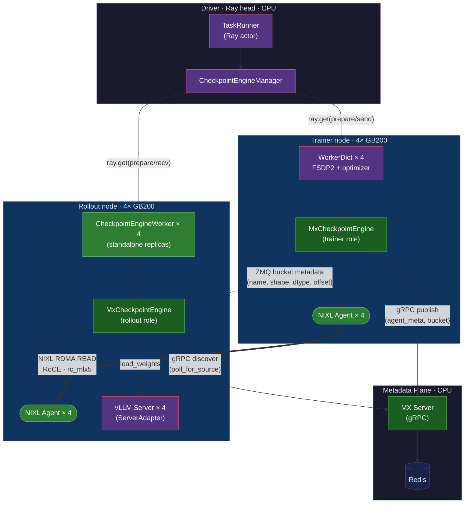
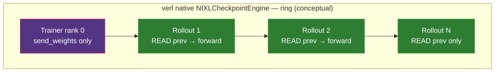
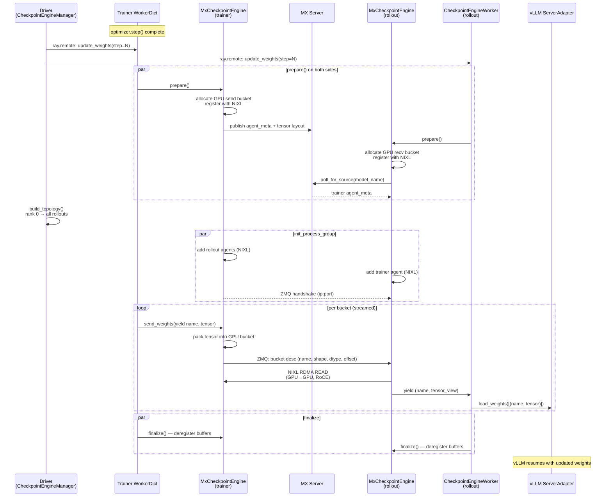
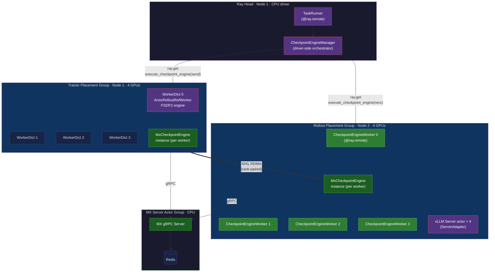
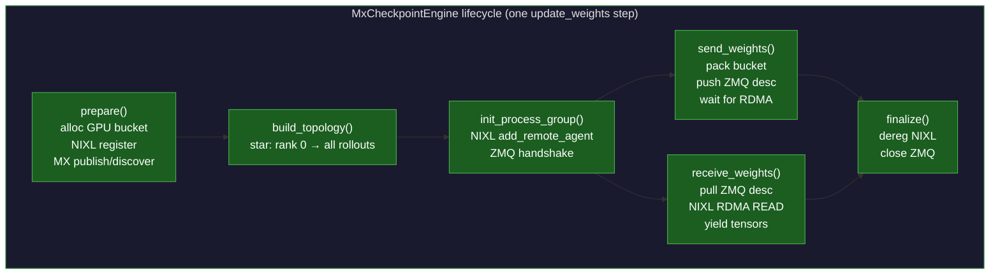

# ModelExpress × verl — Design Overview

**Last Updated**: April 2026
**Status**: E2E working — cross-node RDMA weight transfers via `MxCheckpointEngine` on 2× GB200 nodes (GKE).

This document covers how ModelExpress (MX) plugs into [verl](https://github.com/volcengine/verl) for RL post-training weight synchronization. It walks through the component design, **how MX relates to verl’s native `nixl` checkpoint engine**, the Ray actor integration, the `CheckpointEngine` surface, and the GB200 prototype results.

---

## 1. Design Overview

verl is a Ray-orchestrated RL framework. Its `CheckpointEngine` plugin system is the seam where MX slots in. Teams can use the default **`naive`** sync (process-local copy), verl’s native **`nixl`** engine (NIXL ring over RDMA), or the optional **`mx`** backend: same API and same NIXL data plane, with MX adding an **MX Server + Redis catalog** for discovery and a **star** trainer→rollout wiring instead of a ring.

### What MX adds to verl

| Layer | Role | Implementation |
|-------|------|----------------|
| Metadata plane | Source discovery, version tracking, topology coordination | MX Server (gRPC) + Redis |
| Data plane | GPU-to-GPU tensor transport | NIXL (UCX / `rc_mlx5` / RoCE) |
| verl integration | `CheckpointEngine` ABC implementation | `verl/checkpoint_engine/mx_checkpoint_engine.py` (461 lines) |
| Transport choreography | Bucket metadata handshake per transfer | ZMQ PUSH/PULL |

### Component diagram (vertical, document-friendly)



**Legend**: Green boxes are MX/NIXL additions. Purple boxes are existing verl/Ray/vLLM components. The diagram is rendered top-to-bottom (`graph TB`) so it fits in a single document column without horizontal scrolling.

### Key ideas

- **MX Server stores metadata only** — tensor names, GPU memory addresses, NIXL agent blobs, version numbers. It never touches weight bytes.
- **The heavy transfer is a one-sided RDMA READ initiated on the rollout side**: each rollout NIXL agent **pulls** weight bytes **from** the trainer's registered GPU send bucket **into** its own local recv bucket (GPU-direct over RoCE via `rc_mlx5`). Logically weights still move **trainer → rollout**; the NIC operation is a **read** whose *source* is trainer VRAM and *destination* is rollout VRAM.
- **Star vs ring wiring.** verl’s native **`nixl`** engine chains trainer and rollout ranks in a **ring** (each rank knows `prev` / `next`). **`mx`** keeps the same bucket + NIXL READ pattern but connects each rollout **directly** to the trainer, with the MX Server as a **rendezvous** for who to read from—useful when you want catalog-driven discovery or multiple future sources (e.g. rollouts that also publish).
- **Bucketed transfer preserves shapes.** verl's `CheckpointEngine` passes a tensor generator with names and shapes. MX packs them into GPU buckets and the receiver pulls them out by offset using per-bucket metadata (no separate layout side-channel beyond what the engine already carries).

---

## 2. What MX adds on top of verl’s native `nixl` checkpoint engine

verl ships **`NIXLCheckpointEngine`** (`verl/checkpoint_engine/nixl_checkpoint_engine.py`, `backend: nixl`) as the **native GPU RDMA path** inside the same `CheckpointEngine` abstraction MX uses. It is mature, self-contained, and a strong default when a **single Ray job** wires trainer and rollout ranks with **driver-computed** `prev` / `next` links.

**`MxCheckpointEngine` (`backend: mx`) does not replace that stack** — it **reuses** the same **bucket packing**, **ZMQ per-bucket metadata**, and **NIXL `initialize_xfer("READ", …)`** pull semantics. MX **adds** an **MX Server + Redis** catalog so consumers **discover** sources and versions via **gRPC**, and uses a **star** attach (each rollout READs from the trainer) instead of chaining through intermediate ranks.

### What verl’s native `nixl` engine already provides

| Aspect | Behavior |
|--------|----------|
| **Registration** | `@CheckpointEngineRegistry.register("nixl")`. Selected with `actor_rollout_ref.rollout.checkpoint_engine.backend=nixl`. |
| **Buffers** | Two byte buckets per rank (`send_buf`, `recv_buf`), registered with NIXL. On CUDA, verl often allocates via **CuPy** then views as `torch.uint8` to avoid registration issues with expandable PyTorch segments. |
| **Metadata between ranks** | **`NixlAgent`** wraps `nixl_agent` and uses **ZMQ** (`PULL` on each agent, `PUSH` to peers) to ship **per-bucket** `bucket_meta` (tensor name, shape, dtype, byte offset) plus a notify key — the same bucket-descriptor pattern **`mx`** uses peer-to-peer between trainer and rollouts once peers are connected. |
| **RDMA operation** | **`ReadOperation`**: `initialize_xfer("READ", local_descs, remote_descs, remote_agent, …)` then `transfer` / `check_xfer_state` until `DONE`. The initiator’s **local** buffer is the **destination**; **remote** is the **source** (trainer VRAM when reading from the trainer). |
| **Trainer send path** | Only **trainer rank 0** runs `send_weights`. Other trainer ranks consume the weight generator and no-op (same pattern **`mx`** inherits). Rank 0 fills a bucket and uses **`ReadableOperation`**: it tells the **next** agent in the ring that its send buffer is readable; the next agent performs the **RDMA READ** from rank 0. |
| **Rollout receive path** | Each rollout **`receive_weights`**: **READ from `prev_agent`**, slice tensors out of the bucket, **`yield`** to verl. If the rank has a **`next_agent`**, it also **`ReadableOperation`**s the same bucket metadata downstream so the next rank can READ — **pipeline along a chain**. |
| **Topology** | **`build_topology`** builds a **ring** of size **`rollout_world_size + 1`**: rank `0` = trainer head; ranks `1…N` = rollouts. Trainer has **next** only; last rollout has **prev** only; middle ranks have **prev** and **next**. |
| **Discovery / versioning** | The driver gathers each rank’s `NixlAgentMetadata` and installs **fixed `prev` / `next`** for that step — ideal when membership is stable and ordering is fully determined by Ray ranks. |
| **Standalone mode** | Same requirement as **`mx`** for non-`naive` engines: rollout uses **`CheckpointEngineWorker`** (disaggregated GPUs). |



Weights still flow **trainer → rollouts**; intermediate rollouts **repeat** the bucket so the last rank receives the full model without the trainer fanning out to everyone directly.

### Optional MX layer: same NIXL moves, different control plane

| Dimension | Native **`nixl`** (verl) | With **`mx`** |
|-----------|---------------------------|---------------|
| **Topology** | **Ring**: each bucket walks rank `0 → 1 → … → N` with optional forward between rollouts | **Star**: each rollout **READs directly** from the trainer’s bucket (trainer completes **N** READ completions — fan-out on the trainer NIC) |
| **Who owns “who do I read?”** | **Driver + Ray ranks**: `prev` / `next` from gathered `NixlAgentMetadata` | **MX Server + Redis** catalog: source identity, **version / step**, optional **worker_rank**, room for **multiple registered sources** |
| **Rendezvous across jobs / clusters** | Topology is **defined by this job’s rank graph** | Consumers **resolve** a source via **gRPC** to a stable catalog service, then attach with **NIXL** as today |
| **Extensibility** | New routing ideas are expressed in **verl driver / topology helpers** | Many policies can live in **catalog + client** without expanding core ring math for every deployment |

#### What an MX catalog enables (additive)

A Redis-backed MX catalog records **which processes publish which weight version** and the **NIXL metadata** needed to attach. That is **optional**; when you need it, it supports:

- **Global view for load spreading** — Readers can ask the catalog **which source should serve this read** when **several replicas** expose the same version, instead of always following one fixed ring order.

- **Load- and locality-aware steering** — Entries are **per-source identities**, so policy can prefer **less busy** or **network-closer** holders as the fleet grows, without each node probing the entire cluster.

- **More than one read source over time** — Processes that have **finished** receiving a version can register as **additional sources**; the catalog can list **multiple holders** so bandwidth can spread through the pool (trainer plus peers).

- **Publish / retire coordination** — A central record can track **in-flight reads** vs **writer reuse** of GPU pages so trainers retire a version before mutating shared buffers—coordination that is harder when each rank only knows ring neighbors.

- **Retention with elastic membership** — A **cluster-wide** picture of which versions exist and where a **last readable copy** remains before unregister helps elastic scale-out / scale-in.

- **Stable service names** — Trainer and rollout attach to **DNS-backed catalog endpoints** even when Ray placement or node pools change between runs.

**Prefer native `nixl`** when a single Ray job, ring latency, and driver-wired `prev` / `next` are exactly what you want — nothing else required.

**Consider `mx`** when you want **catalog-driven discovery**, **explicit versions**, **direct trainer→each-rollout** reads, or a path to **multi-source** and **policy-driven** routing **without** growing custom ring topology code in-tree for every site.

Both backends use the same **`CheckpointEngine`** actor model and keep **bulk weight bytes off Ray**; both use **NIXL/RoCE** for the actual GPU transfers.

---

## 3. Timing Diagram — One `update_weights` Step



**Observed per-step timing** (GB200, Qwen2.5-1.5B BF16, cross-node RoCE):

| Phase | Wall time |
|-------|-----------|
| `prepare` + `build_topology` + `init_process_group` | ~0.3-0.4s |
| `send_weights` / `receive_weights` (RDMA) | ~0.6-0.8s |
| `finalize` | ~0.1s |
| **Total `update_weights`** | **~1.25s avg** (range 1.22-1.28s) |

For the same model and cluster, the default `naive` engine averages **~1.6s** (in-process copy). The MX engine is faster *and* does a real cross-node transfer — the naive baseline only works because hybrid mode colocates trainer and rollout on the same GPUs.

---

## 4. ModelExpress and the Ray Actor Design

verl's runtime is a web of Ray actors. Understanding where `MxCheckpointEngine` lives inside that web is the key to the integration.

### Actor topology



### Three actor classes that matter

1. **`TaskRunner`** — a single CPU Ray actor that owns the training loop. It holds the `CheckpointEngineManager` and drives PPO/GRPO iteration.
2. **`WorkerDict` (trainer side)** — a Ray GPU actor per trainer rank. Hosts the FSDP2 model, optimizer, and — under our integration — an `MxCheckpointEngine` instance for the trainer role.
3. **`CheckpointEngineWorker` (rollout side)** — a dedicated Ray GPU actor per rollout rank. It exists only in **standalone mode** (rollout on its own GPU pool). It hosts the `MxCheckpointEngine` in the rollout role and drives `ServerAdapter.load_weights` into the colocated vLLM engine.

### Why standalone mode matters

verl has two deployment modes for the rollout:

| Mode | Ray actors | Status for MX |
|------|-----------|--------------|
| **Hybrid (colocated)** | `WorkerDict` does both training and rollout | ❌ No `execute_checkpoint_engine` method — `CheckpointEngineManager` fails |
| **Standalone (disaggregated)** | Trainer uses `WorkerDict`, rollout uses `CheckpointEngineWorker` | ✅ Full CE lifecycle available |

This is a verl framework constraint, not an MX constraint — the built-in `nixl` and `nccl` engines have the same requirement. Our prototype runs in standalone mode on 2 nodes.

### How a weight sync crosses the actor boundary

```
TaskRunner (Node 1)
  └─► CheckpointEngineManager.update_weights(step=N)        # driver-side
        ├─► ray.get([wd0.execute_checkpoint_engine("prepare"),   # fan-out to trainer
        │            wd1.execute_checkpoint_engine("prepare"),
        │            wd2.execute_checkpoint_engine("prepare"),
        │            wd3.execute_checkpoint_engine("prepare")])
        ├─► ray.get([cew0.execute_checkpoint_engine("prepare"),  # fan-out to rollout
        │            cew1...cew3.execute_checkpoint_engine("prepare")])
        ├─► build_topology(agent_meta_list)                 # computed on driver
        ├─► ray.get([.init_process_group(topology) on both sides])
        ├─► ray.get([wd0..3.send_weights(generator), cew0..3.receive_weights()])  # the RDMA moment
        └─► ray.get([.finalize() on both sides])
```

The `execute_checkpoint_engine("method", *args)` pattern is how the manager dispatches a named lifecycle call onto every CE-hosting actor in parallel. Every `ray.get` is a fan-out over 4 trainer + 4 rollout actors, so all 8 ranks move in lock-step.

### Where `MxCheckpointEngine` is instantiated

- On the **trainer**: `ActorRolloutRefWorker.init_model()` creates the engine when the config sets `actor_rollout_ref.rollout.checkpoint_engine.backend=mx`. The engine registers to handle `send_weights`.
- On the **rollout**: `CheckpointEngineWorker.__init__` constructs the same class (via the `CheckpointEngineRegistry`) but with `role="rollout"`. It registers to handle `receive_weights` and to drive `load_weights` into the ServerAdapter.

One class, two roles, distinguished by which actor type instantiates it. Both sides talk to the same MX Server over gRPC.

---

## 5. ModelExpress and the Checkpoint Engine

verl's `CheckpointEngine` ABC is the small, well-defined plugin surface that makes MX a drop-in.

### The ABC

```python
class CheckpointEngine(ABC):
    def prepare(self) -> dict: ...                         # allocate buffers, NIXL register
    @classmethod
    def build_topology(cls, trainer_meta, rollout_meta) -> tuple: ...
    def init_process_group(self, topology, rank) -> None: ...
    async def send_weights(self, weights_iter) -> None: ...       # trainer
    async def receive_weights(self) -> AsyncGenerator: ...        # rollout
    def finalize(self) -> None: ...
```

All six methods are implemented in `verl/checkpoint_engine/mx_checkpoint_engine.py` (461 lines). The class is registered with one decorator:

```python
@CheckpointEngineRegistry.register("mx")
class MxCheckpointEngine(CheckpointEngine):
    ...
```

…which makes `backend: "mx"` selectable from Hydra config.

### Lifecycle responsibilities



### Method-by-method behavior

| Method | Trainer side | Rollout side |
|--------|--------------|--------------|
| `prepare()` | Allocate registered GPU send bucket, register with NIXL agent, publish agent metadata + tensor layout to MX Server via gRPC | Allocate GPU recv bucket, register with NIXL, call `MxClient.poll_for_source(model_name)` to get the trainer's agent blob |
| `build_topology()` | Driver-side utility. Produces `(trainer_agent → [rollout_agents])` star mapping | Same (called on driver) |
| `init_process_group()` | For each rollout rank: `nixl_agent.add_remote_agent(rollout_meta)` | `nixl_agent.add_remote_agent(trainer_meta)`; ZMQ PULL socket bound on free port, advertised to trainer |
| `send_weights(iter)` | Consume `(name, tensor)` generator. Pack tensors into the GPU bucket at known offsets. Send `BucketDesc{name, shape, dtype, offset, nbytes}` over ZMQ PUSH. Block until rollout signals ACK | — |
| `receive_weights()` | — | Pull `BucketDesc` over ZMQ. Issue NIXL RDMA READ into the recv bucket at the given offset. Yield `(name, tensor_view)` to verl, which forwards to `ServerAdapter.load_weights` |
| `finalize()` | Deregister NIXL memory regions, close ZMQ, tell MX Server to retire this version | Same |

### Why a bucket, not per-tensor RDMA

Each NIXL RDMA transfer has a fixed latency overhead (~50-100µs). A 1.5B model has hundreds of parameters. Issuing per-tensor transfers would spend more time in transfer setup than in data movement. The engine packs tensors into a contiguous GPU bucket (up to a configured size, e.g. 256 MB) and issues one RDMA READ per bucket. The ZMQ channel carries a list of `BucketDesc` entries so the receiver can slice the bucket back into named tensors.

This is the same pattern used by verl's built-in NIXL engine. MX adopts it for parity — and because it works.

### Config

```yaml
actor_rollout_ref:
  rollout:
    checkpoint_engine:
      backend: mx
      engine_kwargs:
        mx_server_url: modelexpress-server.kavin.svc.cluster.local:8001
        model_name: Qwen/Qwen2.5-1.5B
        bucket_size_mb: 256      # optional, default 256
        skip_sleep_wake: true    # avoid vLLM multiproc sleep/wake crash on ARM64
```

### How verl uses `MxCheckpointEngine` on the tensor path

verl streams `(name, tensor)` pairs through the `CheckpointEngine` API. `MxCheckpointEngine` packs those into registered GPU buckets; per-bucket metadata carries **name, shape, dtype, and byte offset** so `receive_weights` can slice views and hand them to **`ServerAdapter.load_weights`** without an extra layout file. That is the same bucket pattern as verl’s native `nixl` engine; **`mx`** swaps ring wiring for **catalog + star** discovery as described in §2.

---

## 6. Prototype on GB200 — Results

### Cluster

| Resource | Value |
|----------|-------|
| Platform | GKE DGXCloud, GB200 ARM64 |
| Nodes | 2 (trainer + rollout), `hostNetwork=true` |
| GPUs | 8 × GB200 (4 per node) |
| Node pools | `customer-gpu-w0e` (trainer), `customer-gpu-o7v` (rollout) |
| Fabric | RoCE v2, IMEX channels via DRA `compute-domain-channel` |
| UCX | v1.20.0 built from source, transports `self,sm,rc,cuda_copy,gdr_copy,tcp` |
| NIXL | 1.1.0 (main branch) |
| PyTorch | 2.6 + cu128 |
| vLLM | 0.18.1 (0.19.0 has an ARM64 multiproc `resource_tracker` bug) |
| Image | `nvcr.io/nvidian/dynamo-dev/verl-mx:latest` |

### Deployment

```
Node 1  (gke-...-w0e-...-tz1d, IP 10.0.0.83)
├─ Ray head StatefulSet (verl-mx-head-0)
│   ├─ TaskRunner / CheckpointEngineManager
│   └─ 4× WorkerDict (FSDP2 trainers) + 4× MxCheckpointEngine
└─ 4× NIXL agent (rc_mlx5)

Node 2  (gke-...-o7v-...-mflg, IP 10.0.15.225)
├─ Ray worker StatefulSet (verl-mx-worker-0)
│   ├─ 4× CheckpointEngineWorker + 4× MxCheckpointEngine
│   └─ 4× vLLM ServerAdapter
└─ 4× NIXL agent (rc_mlx5)

MX Server + Redis  (kavin namespace, reachable from both nodes over gRPC)
```

### What we observed

- `[MX-DEBUG] Initializing 4 replicas in STANDALONE mode (worker_group=None)` — rollout running as dedicated CE workers, not fused WorkerDicts.
- `[MX-DEBUG] Standalone replicas ([STANDALONE x4]), using mx checkpoint engine` — repeated 11 times across the run (one per `update_weights`).
- `Backend UCX was instantiated` + `Initialized NIXL agent: <uuid>` on both nodes.
- UCX `rc_mlx5` transport negotiated — confirmed RoCE data path.
- Full lifecycle traced per step: `prepare → build_topology → init_process_group → send_weights / receive_weights → finalize`.

### Per-step `update_weights` timing (MX engine, cross-node RDMA)

| Step | `update_weights` (s) |
|------|---------------------|
| 1 | 1.278 |
| 2 | 1.250 |
| 3 | 1.233 |
| 4 | 1.252 |
| 5 | 1.243 |
| 6 | 1.223 |
| 7 | 1.235 |
| 8 | 1.249 |
| 9 | 1.263 |
| 10 | 1.282 |
| **Avg** | **≈ 1.25s** |

### Headline metrics

| Metric | Value |
|--------|-------|
| Model | Qwen/Qwen2.5-1.5B (BF16, ≈ 3 GB resident) |
| Steps completed | 10 (full PPO/GRPO run) |
| Avg step time | ~8.1-8.8s |
| Avg `update_weights` (MX) | **~1.25s** |
| Avg `update_weights` (naive baseline, hybrid mode) | ~1.6s |
| verl native `nixl` (same step, standalone) | *Not benchmarked in this doc* — same NIXL READ + buckets as **`mx`**, with **ring** topology and **no** MX Server |
| Throughput | 135-163 tokens/sec |
| Transport | NIXL / UCX `rc_mlx5` (RoCE RDMA) |
| Data path | Cross-node GPU→GPU (no CPU staging, no filesystem) |

### Manual NIXL transfer test (isolated, inside one pod)

Before wiring the engine into the training loop, we ran a standalone `MxTrainingPublisher` → `MxRefitReceiver` test to validate the MX/NIXL data plane by itself:

| Metric | Value |
|--------|-------|
| Payload | 10 tensors × 2 MB = 21 MB |
| Transfer time | 0.16s |
| Data integrity | All tensors byte-verified correct |
| Environment | Loopback (same GPU, single pod) |

This proved publisher/receiver correctness before moving to cross-node.

### How we got there — build history

21 Docker image iterations were needed to reach a working ARM64 build. Dominant issues and their fixes:

| Category | Resolution |
|----------|-----------|
| NIXL build (missing tag, `pybind11`) | Clone NIXL `main`, add `pybind11-dev` to apt install |
| PyTorch CPU-only on ARM64 | Install `torch==2.6` with `--index-url` `download.pytorch.org/whl/cu128` *before* vLLM; reinstall matching version after |
| `flash_attn` absent on ARM64 | Ship `flash_attn_compat.py` in `verl/utils` — real SDPA fallbacks for GQA attention and cross-entropy |
| vLLM 0.19 multiproc crash | Downgrade to 0.18.1 (stable on ARM64) |
| Triton JIT — missing gcc / nvcc | Base runtime on `cuda:12.8.1-devel`, add `gcc/g++` |
| `cupy` not installed | Made optional in `MxCheckpointEngine`, added torch fallback for bucket allocation |
| Ray worker → head GCS | Use head's FQDN `verl-mx-head-0.verl-mx-head.kavin.svc.cluster.local:6379` |
| `CheckpointEngineManager` fails in hybrid mode | Deploy in standalone (2-node) mode — matches built-in NIXL/NCCL engine requirements |

### What this proves

1. **MX works on Ray.** The `CheckpointEngine` plugin surface is sufficient to express a star-topology RDMA transfer with server-mediated discovery.
2. **Cross-node RoCE RDMA is real.** `update_weights` at 1.25s for a 3 GB model on a 2-node GB200 cluster is consistent with UCX `rc_mlx5` over RoCE and beats the in-process naive baseline even before we tune the bucket size.
3. **The ARM64 path is painful but survivable.** All the image work is in `docker/Dockerfile.mx-arm64` and the compat shim, aligned with other GB200 MX + vLLM container iterations on the same stack.
4. **Standalone rollout is the production shape.** Hybrid/colocated mode is useful for debugging but cannot drive any non-naive checkpoint engine — true for NIXL, NCCL, and MX alike.

