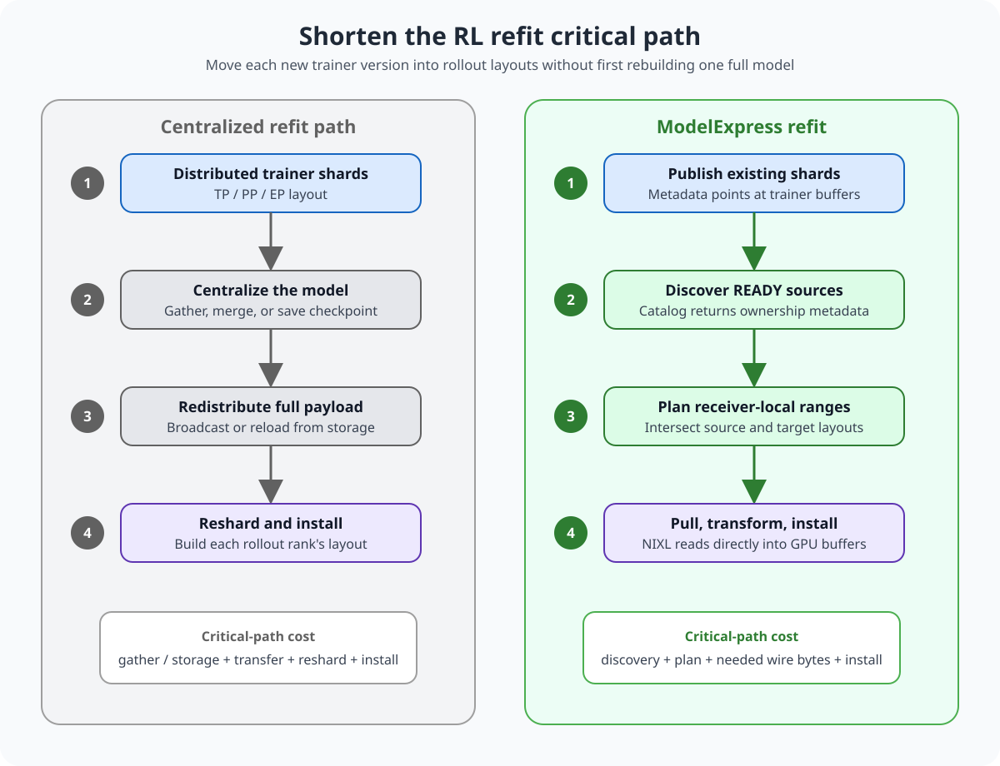
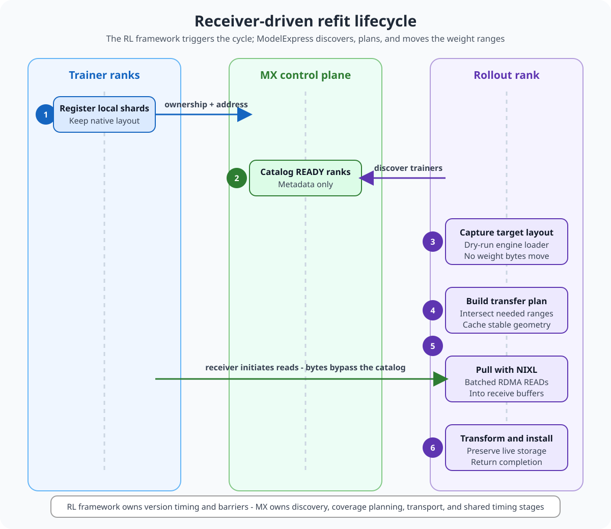
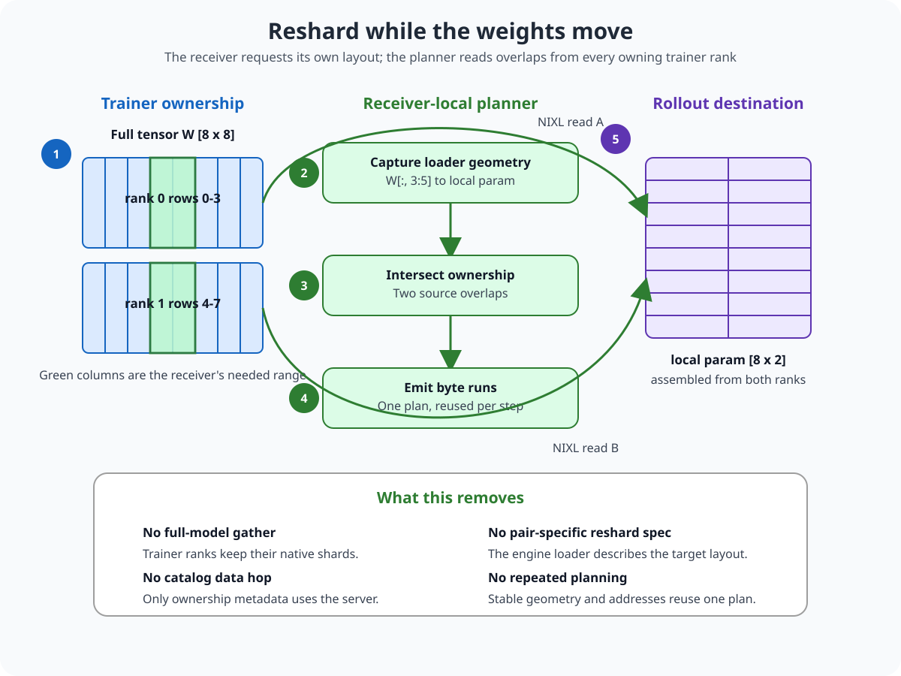

<!--
SPDX-FileCopyrightText: Copyright (c) 2025-2026 NVIDIA CORPORATION & AFFILIATES. All rights reserved.
SPDX-License-Identifier: Apache-2.0
-->

# RL integration reference

Start with [Update rollout weights for RL](guides/rl.md) to choose and run an example. This reference covers framework integration first, then receiver internals and their limits. Checkpoint publication and replay have a separate [S3 refit reference](S3_DELTA_WEIGHT_REFIT.md).

RL requires a Redis-backed ModelExpress `RefitService` (`MX_METADATA_BACKEND=redis`). Kubernetes deployment does not replace that requirement.

## Framework integration

### Trainer publication

This API reference assumes your framework creates `version`, supplies `megatron_tensor_specs`, coordinates publishing ranks, and controls when generators resume. Framework-facing clients and adapters live in [`modelexpress_rl`](../modelexpress_client/python/modelexpress_rl/); shared planning and transport primitives live in [`modelexpress.refit`](../modelexpress_client/python/modelexpress/refit/).

An RL framework creates a weight version through the external Refit API. Each trainer actor then invokes its rank-local client to stage and publish one shard. Worker registration, manifest serving, and internal shard CRUD remain hidden behind the client.

When creating a `WeightVersion`, the orchestrator may supply its UID or let MX generate one. A caller-supplied UID already assigned to another request returns `ALREADY_EXISTS`; an identical request retried with the same idempotency key returns the existing version.

```python
from modelexpress_rl import (
    MegatronTrainerContext,
    ModelExpressTrainerClient,
    ModelExpressTrainerConfig,
    WeightVersionRef,
)

trainer = ModelExpressTrainerClient.initialize(
    ModelExpressTrainerConfig(engine_context=MegatronTrainerContext())
)
trainer.bind_tensors(megatron_tensor_specs)
trainer.publish_version(version=WeightVersionRef(version.uid))
```

The deployment supplies `MODEL_NAME`, `MX_TRAINER_STAGING_MODE`, `MX_WEIGHT_PAYLOAD_FORMAT`, `MX_WORKER_HOST`, and the normal ModelExpress server configuration. The Megatron adapter derives its source slot from logical tensor names and shard geometry. DP replicas of the same partition therefore publish redundant workers for one slot, while distinct TP partitions remain separate required slots. The NIXL metadata endpoint is derived from `MX_WORKER_HOST` and the client-owned NIXL manager's listen port. `LOCAL_RANK` selects the device unless `device_id` is passed to `initialize()`.

The client owns the NIXL manager and trainer-side manifest service. `server_url` selects the central ModelExpress control-plane service and defaults to the normal ModelExpress server configuration. A Megatron worker may initialize the client before its distributed process group is ready; the explicitly selected `engine_context` is constructed lazily on the first tensor operation. Deployment environment variables do not select Python implementations.

Initialization fixes the staging mode. NIXL also fixes its payload format; canonical S3 publication follows each target `WeightVersion`. On NIXL, `publish()` hides manifest publication and the internal `CreateWeightVersionShard` RPC. The current Megatron adapter registers and exposes its live buffers through `IN_PLACE`, so callers must keep those tensors immutable while the version is published. The required lifecycle is synchronous: create and publish the version, update every generator, retire and release the version, and only then resume training or begin the next optimizer step.

Version creation and expected-source-slot declaration remain framework-orchestrator responsibilities. Each trainer adapter derives its own source slot from the engine's native topology; the orchestrator declares the expected slots using the same adapter-defined convention. `initialize()` constructs the adapter selected by `engine_context` internally. Megatron and FSDP implementations are available. Megatron-specific APIs live under `modelexpress_rl`; `modelexpress.refit.reshard` remains the shared, engine-neutral transfer core.

For checkpoint-backed publication, use the [S3 refit reference](S3_DELTA_WEIGHT_REFIT.md). It covers seed checkpoints, full snapshots, XOR deltas, reconstruction, and retention.

### Client settings

These settings select versions and sources; they do not trigger a live update. The framework owns the pause, update, verification, and resume sequence. See [Configuration](CONFIGURATION.md#loading-strategy-selection) for `MX_LOAD_STRATEGY_CHAIN` and server settings.

| Variable | Default | Purpose |
|---|---|---|
| `MX_REFIT_DESIRED_VERSION_UID` | (unset) | Exact version required when `MX_LOAD_STRATEGY_CHAIN=RL`; startup fails rather than using a version-agnostic fallback when neither P2P nor S3 can load it |
| `MX_GENERATOR_SOURCE_ORDER` | Auto-detected | Ordered RL weight sources. Desired-version cold start defaults to `GENERATOR,OBJECT_STORAGE`; `OBJECT_STORAGE` disables P2P for both cold start and active refit. `TRAINER` applies only to active refit and is rejected for desired-version cold start. |
| `MX_REFIT_CHECKPOINT_DIR` | (unset) | Host-local cache for RL S3 full checkpoints, deltas, and materialized checkpoints; the S3 strategy skips when it is unset |
| `MX_REFIT_METADATA_PORT` | `7555` | Base NIXL metadata-listener port for RL generator refit; each rank adds its local device ID. Kept separate from `MX_METADATA_PORT`, which may remain owned by the boot-time loader |

## Receiver internals

The shared `ReshardReceiver` handles geometry, transfer planning, and NIXL reads. The framework-facing `modelexpress_rl` paths add their own version, source-selection, and installation checks; generic receiver limits below are not the status of every RL path.

### Overview

An RL training step changes the model. Rollout workers must install that version before they generate samples against it. The time from “trainer version ready” to “required rollout workers ready” is refit latency, and it sits on the training loop's critical path.

Collective-based integrations coordinate participating trainer and generator ranks for broadcast or all-gather. Checkpoint-based integrations write and reload artifacts. The direct MX path instead publishes source ownership and lets each receiver plan its own reads. The tradeoff is that source buffers must remain available until readers finish.

| Refit cost | Common integration approach | Direct MX path |
|---|---|---|
| Trainer layout | Gather or checkpoint distributed shards | Keep each rank's native shard registered |
| Topology change | Central process reconstructs, then receivers reshard | Each receiver plans from source ownership into its own layout |
| Data path | Trainer gather, storage, or full-payload broadcast | Direct NIXL reads from owning ranks |
| Worker membership | Usually tied to a collective or checkpoint barrier | Receiver discovers sources and starts independently |
| Installation | Re-run the engine's general loader | Use an engine adapter; optionally cache destination mappings |



#### Core concepts

| Term | Meaning |
|---|---|
| **Shard ownership** | A trainer rank owns a range of a global tensor at a registered address. |
| **Target geometry** | The ranges and destination layout one rollout rank's real model loader expects. |
| **Transfer plan** | Source-to-destination byte runs that intersect ownership with target geometry. |
| **Install** | Engine-specific work that commits receive buffers into the live inference model. |

The difficult part is not the network copy. Training and inference often store the same logical tensor in different layouts, with fused projections, different parallelism, quantization, or grouped Mixture-of-Experts (MoE) weights. MX separates the framework-independent range planning from the engine-specific interpretation and installation of those tensors.

### The design

The going-forward pattern is:

> **Per-rank publish, receiver-side pull, receiver-side transform and install.**

The RL framework decides when a version is ready and which rollout workers must finish. Trainer adapters describe the buffers and global ranges each rank owns. MX discovers those sources, plans direct reads, and executes the transfer. An inference adapter captures the destination layout and installs the result into the live engine.



#### End-to-end lifecycle

1. **Publish trainer ownership.** Each trainer rank registers its existing buffers with NIXL and publishes tensor shape, dtype, global shard offset, local shape, address, and endpoint metadata.
2. **Discover a source set.** A rollout rank waits for the expected READY trainer ranks and fetches their shard tables through [`MxReshardRendezvous`](../modelexpress_client/python/modelexpress/refit/reshard/rendezvous.py).
3. **Capture target geometry.** The inference adapter dry-runs the engine's real weight loader with zero-storage [`LazyWeight`](../modelexpress_client/python/modelexpress/refit/reshard/geometry.py) tensors. It records which source view is read and where that view lands in a destination parameter; no weight bytes move.
4. **Build a receiver-local plan.** [`plan_transfer`](../modelexpress_client/python/modelexpress/refit/reshard/transfer_plan.py) intersects each recorded target range with the published trainer shards and emits contiguous byte runs.
5. **Pull into registered buffers.** [`NixlReshardTransport`](../modelexpress_client/python/modelexpress/refit/reshard/transport/nixl.py) groups reads by source session and issues batched one-sided Remote Direct Memory Access (RDMA) reads.
6. **Transform and install.** The receiver casts dtype-mismatched staging buffers when supported, then calls the engine adapter to update live model storage and derived state.

The first update performs discovery, geometry capture, plan construction, allocation, and memory registration. Later updates reuse the plan and buffers while source topology, shard boundaries, and addresses remain unchanged.

#### Resharding during transfer

Source and target layouts are expressed in one global tensor coordinate system. A trainer rank might publish “rows 0–3,” while a rollout rank requests “columns 3–4 across every row.” The planner intersects the request with each owning shard and emits reads that reconstruct the rollout parameter directly.



Geometry capture supports pure views that can be represented as a rank-preserving, axis-aligned box, including narrowing, unit-step slicing, and dimension permutations. [`paired_runs`](../modelexpress_client/python/modelexpress/refit/reshard/slice_plan.py) preserves actual destination strides, so non-contiguous destinations become multiple correct byte runs instead of one incorrect contiguous copy.

This design removes the trainer-side full-model gather. It does **not** guarantee that every tensor becomes one large network operation: a strided view can produce many short runs, and unsupported loader operations require a separate fallback strategy.

#### Control plane and data plane

The MX server is a directory. It stores source identity and rendezvous metadata, while trainer-to-rollout weight bytes stay on the NIXL data plane.

| Layer | Responsibility |
|---|---|
| RL framework | Select version, trigger publish/refit, wait for required workers, enforce rollout staleness policy |
| Trainer adapter | Translate native FSDP, DTensor, or Megatron ownership into global tensor ranges |
| MX rendezvous | Publish and discover READY ranks and their registered shard metadata |
| MX receiver | Capture target geometry, build/reuse the plan, allocate buffers, execute reads |
| Inference adapter | Interpret names/fusions, install parameters, refresh quantized or derived state |
| Inference engine | Own live parameters, caches, compiled graphs, and final readiness |

Fully Sharded Data Parallel (FSDP), DTensor, and Megatron integrations belong in trainer adapters; they are not hard-coded into the planner. The current rendezvous format carries shard geometry in a JSON side table because the public protobuf does not yet have typed multidimensional ownership fields.

#### Transport and installation are separate

Refit has two independent optimization surfaces:

1. **Move fewer and better-shaped bytes.** The reshard planner selects source ranges and NIXL reads them into receiver buffers.
2. **Commit those bytes with less loader overhead.** The inference adapter updates live model storage, quantization scales, fused parameters, and derived tensors.

The RL path keeps transfer and engine concerns separate. [`nixl_staged_transfer.py`](../modelexpress_client/python/modelexpress_rl/inference/nixl_staged_transfer.py) owns exact-manifest planning, registered staging, transfer, and verification. The private vLLM [`installer.py`](../modelexpress_client/python/modelexpress_rl/inference/engines/vllm/installer.py) temporarily exposes the live model's load-time parameters through vLLM's layerwise reload APIs, captures their geometry, and restores the original kernel tensors. Installation also uses layerwise reload to preserve storage referenced by CUDA graphs.

[`MdlLoader`](../modelexpress_client/python/modelexpress/engines/vllm/refit/installer.py) is a separate experimental vLLM installer called Mapped Direct Load (MDL). It caches direct, fused, and expert destination views so warm updates can copy into known slots instead of repeating general loader dispatch. MDL can consume partial input batches, but the reshard transport in this package does not yet expose a selector that reduces wire bytes for partial updates. The two features must not be treated as one end-to-end partial-refit path until that selector is wired and validated.

Each receiver keeps one load-time receive buffer per captured destination, plus a source-dtype conversion staging buffer for any parameter whose served dtype differs from its load-time dtype. Both come from classic CUDA allocations and stay registered for the receiver's lifetime, because re-registering per refit is what the cached plan exists to avoid.

That buffer shape is why the vLLM receiver installs through `process_weights_after_loading` (PWAL) rather than MDL. The receiver reconstructs *load-time* tensors, and a quantized model still needs the engine's post-load processing to derive its runtime representation from them. MDL is appropriate only when the incoming tensors already match the validated runtime representation, which is why it is a separate opt-in path rather than the default.

### Integration contract

The shared receiver has two engine-specific hooks:

```python
from modelexpress.refit.reshard import ReshardReceiver


class RuntimeReceiver(ReshardReceiver):
    def _capture(self, manifest):
        # Dry-run the runtime's loader and return:
        # (CaptureResult, {parameter_name: (load_time_shape, load_time_dtype)})
        ...

    def _install(self, receive_buffers):
        # Commit buffers into live model storage and refresh derived state.
        ...
```

The framework constructs one receiver per rollout rank and calls `update_weights(step)` when its version barrier permits the update. A trainer-side adapter must build [`PublishedTensor`](../modelexpress_client/python/modelexpress/refit/reshard/rendezvous.py) records, wrap them with NIXL endpoint metadata, and publish one READY record per trainer rank.

This is the low-level shared receiver contract. Framework integrations should start with the [`modelexpress_rl` trainer client](#trainer-publication), which selects the Megatron or FSDP adapter and owns registration and publication. The framework still supplies lifecycle hooks, declares the expected source slots, pauses generation, and coordinates completion before buffers are reused. The [runnable examples](guides/rl.md#start-with-a-runnable-example) show concrete integrations.

#### Stable-plan assumption

The receiver caches its first discovery and transfer plan. Every later call reuses the original trainer addresses and shard boundaries.

This is valid only when:

- trainer rank membership is stable;
- registered buffer addresses stay stable;
- tensor names, shapes, dtypes, and ownership do not change;
- the receiver's load-time layout stays stable.

A trainer restart, reshard, scale event, or buffer replacement requires rediscovery and replanning. The current receiver does not detect those changes.

### Implementation status

#### Implemented in this repository

| Capability | Status | Evidence |
|---|---|---|
| Loader-driven geometry capture | Implemented | [`geometry.py`](../modelexpress_client/python/modelexpress/refit/reshard/geometry.py), [`test_reshard_refit_geometry.py`](../modelexpress_client/python/tests/test_reshard_refit_geometry.py) |
| Multidimensional shard intersection | Implemented | [`slice_plan.py`](../modelexpress_client/python/modelexpress/refit/reshard/slice_plan.py), [`test_reshard_refit_slice_plan.py`](../modelexpress_client/python/tests/test_reshard_refit_slice_plan.py) |
| Strided destination reconstruction | Implemented in reference tests | [`test_reshard_refit_transfer.py`](../modelexpress_client/python/tests/test_reshard_refit_transfer.py) |
| Multi-rank shard rendezvous | Implemented with temporary JSON metadata | [`rendezvous.py`](../modelexpress_client/python/modelexpress/refit/reshard/rendezvous.py) |
| Per-source batched NIXL reads | Implemented | [`transport/nixl.py`](../modelexpress_client/python/modelexpress/refit/reshard/transport/nixl.py), [`test_reshard_refit_nixl_transport.py`](../modelexpress_client/python/tests/test_reshard_refit_nixl_transport.py) |
| Same-shape dtype conversion | Implemented through staging buffers | [`receiver.py`](../modelexpress_client/python/modelexpress/refit/reshard/receiver.py) |
| Stable-topology plan and buffer reuse | Implemented | [`ReshardReceiver`](../modelexpress_client/python/modelexpress/refit/reshard/receiver.py) |
| RL exact-version staged NIXL transfer | Implemented | [`modelexpress_rl/inference/nixl_staged_transfer.py`](../modelexpress_client/python/modelexpress_rl/inference/nixl_staged_transfer.py) |
| vLLM geometry capture and layerwise install | Implemented adapter code | [`modelexpress_rl/inference/engines/vllm/installer.py`](../modelexpress_client/python/modelexpress_rl/inference/engines/vllm/installer.py) |
| vLLM mapped direct install | Implemented as a separate opt-in installer | [`engines/vllm/refit/installer.py`](../modelexpress_client/python/modelexpress/engines/vllm/refit/installer.py) |
| Normalized refit timing schema | Implemented | [`timing.py`](../modelexpress_client/python/modelexpress/refit/timing.py), [`test_refit_timing.py`](../modelexpress_client/python/tests/test_refit_timing.py) |
| Descriptor bound for strided slices | Implemented for gap-free dim-0 partitions | [`transfer_plan.py`](../modelexpress_client/python/modelexpress/refit/reshard/transfer_plan.py), [`test_reshard_refit_transfer.py`](../modelexpress_client/python/tests/test_reshard_refit_transfer.py) |
| Engine-parameter coverage reporting and optional floor | Implemented; opt in with `MX_RESHARD_REQUIRE_FULL_COVERAGE=1` | [`receiver.py`](../modelexpress_client/python/modelexpress/refit/reshard/receiver.py), [`test_reshard_refit_coverage.py`](../modelexpress_client/python/tests/test_reshard_refit_coverage.py) |
| Megatron and FSDP/DTensor publication | Available through `modelexpress_rl` | [`train/engines/`](../modelexpress_client/python/modelexpress_rl/train/engines) |
| Generator sharing and S3 replay | Available through `modelexpress_rl`; separate from generic receiver rendezvous | [`inference/source/`](../modelexpress_client/python/modelexpress_rl/inference/source), [`checkpoint_store.py`](../modelexpress_client/python/modelexpress_rl/inference/checkpoint_store.py) |

“Implemented” means the code and focused tests are present. It does not by itself mean a framework/model/topology combination has passed distributed end-to-end validation.

#### Shared receiver limits

This table describes `modelexpress.refit.reshard.ReshardReceiver`. The framework-facing RL clients have their own version and installation checks.

| Gap | Current behavior |
|---|---|
| Full-pull fallback for unsupported operations | The planner identifies unsupported tensors, but `ReshardReceiver` fails closed because its full-pull/install fallback is not implemented. This is distinct from the descriptor bound above, which pulls whole source shards for *supported* but descriptor-heavy slices. |
| Complete element coverage | The receiver reports engine-parameter coverage and can enforce a minimum byte fraction. This is separate from proving that published overlaps cover every requested element. |
| Version-atomic multi-rank manifest | Generic rendezvous waits for a rank count; it does not provide the `WeightVersion` lifecycle exposed by `modelexpress_rl`. |
| Topology-change handling | The cached plan is not invalidated after trainer restart, reshard, scaling, or address change. |
| Partial/subset wire filtering | MDL accepts subset batches, but the reshard receiver currently executes its full cached plan on each update. |
| Expert-aware wire filtering | Expert destination mapping exists in MDL; the reshard planner has no receiver-owned expert selector. |
| Parameter digest verification | Publishers can stamp each shard with a position-sensitive digest (`MX_RESHARD_PUBLISH_DIGEST`, see `refit/reshard/verify.py`), and it is carried through discovery into the planning inputs, but the live receiver does not yet recompute and compare. The comparison needs a fresh-discovery refresh of the expectation, or ordinary training updates between prepare and a later step read as corruption. |
| Engine coverage | vLLM has direct tensor installation. SGLang's `modelexpress_rl` integration installs prepared checkpoints; it does not expose the same tensor receiver. |
| Arbitrary trainer layouts | Megatron and FSDP/DTensor adapters exist under `modelexpress_rl`; other frameworks or unsupported layouts need adapter work. |
| Transport-neutral receiver | A transport protocol exists for planning tests, but `ReshardReceiver` setup and handshake are currently NIXL-bound. |

## Timing and configuration

[`RefitTimingRecorder`](../modelexpress_client/python/modelexpress/refit/timing.py) defines a shared stage vocabulary so transport and installer changes can be compared without conflating wire time with end-to-end readiness:

1. control discovery;
2. source preparation;
3. setup and registration;
4. transfer planning;
5. wire transfer;
6. receive synchronization;
7. transformation;
8. installation;
9. post-install work;
10. rollout readiness.

Set `MX_REFIT_TIMING_STDOUT=1` when a benchmark harness must collect the normalized `MX_REFIT_TIMING` JSON record from worker stdout. Lower layers add spans only when a recorder is active.

Shared receiver and publication controls:

| Variable | Default | Purpose |
|---|---|---|
| `MX_RESHARD_MAX_SEGMENTS_PER_COPY` | `64` | Maximum exact descriptors for one no-gather refit copy before a compatible dim-0-sharded source is pulled once into contiguous staging and sliced locally |
| `MX_RESHARD_FUSED_WIRE` | `1` | Issue a refit's exact-segment, full-pull, and convert reads as one transport batch instead of draining each phase in turn. Set to `0` to restore the phased reads for an A/B comparison |
| `MX_RESHARD_BATCH_INSTALL` | `1` | Re-slice a refit's full-pulled sources with one batched `torch._foreach_copy_` instead of one `copy_()` per captured view. Issues the same copies; a per-view loop costs thousands of kernel launches whose overhead can rival the RDMA. Set to `0` to restore the per-view loop for an A/B comparison |
| `MX_RESHARD_CACHE_DESCRIPTORS` | `1` | Build NIXL read descriptors once per stable transfer plan and reuse them across refits. Set to `0` to rebuild the descriptor lists on every step for an A/B comparison |
| `MX_RESHARD_REQUIRE_FULL_COVERAGE` | `0` | Fail a refit that installs less than `MX_RESHARD_COVERAGE_FLOOR` of the engine's parameter bytes. Off by default because partial and subset refit are intended; set to `1` for benchmark runs, where an incomplete refit produces timings that are the wrong magnitude |
| `MX_RESHARD_COVERAGE_FLOOR` | `0.995` | Fraction of engine parameter bytes a gated refit must install. Not `1.0`: a few engine parameters, such as rotary `inv_freq`, are legitimately not refit material. Values outside `[0.0, 1.0]` are rejected |
| `MX_RESHARD_HANDSHAKE_TIMEOUT_S` | `900` | Budget for the whole P2P metadata handshake, across every trainer peer and every retry. Bounds the handshake independently of the refit timeout, so one unreachable publisher cannot consume the entire refit |
| `MX_RESHARD_HANDSHAKE_ATTEMPT_S` | `20` | Ceiling on a single peer dial. A reachable peer answers in well under a second, so a short attempt frees the budget to try a different peer rather than block on one |
| `MX_RESHARD_HANDSHAKE_BACKOFF_S` | `2` | Pause after a full pass over the pending peers makes no progress, so a transient stall is waited out rather than hammered |
| `MX_REFIT_STAGE_RECORD` | `1` | Emit one `refit-stage-v2` JSON record per refit, giving a benchmark harness the per-stage timings without parsing logs. Set to `0` to silence it |
| `MX_RESHARD_MAX_GBPS` | `0` | Per-rank fabric ceiling in Gbps. A measured wire rate above it means the timing is wrong rather than the transfer being fast, so the refit is rejected. `0` disables the check, since only the operator knows the real per-rank limit |
| `MX_RESHARD_MIN_GBPS` | `0` | Per-rank throughput floor; emits a `refit-slow-throughput-v1` warning below the threshold. `0` disables it. Choose a floor based on concurrent multi-rank performance, not a single-rank peak; CI or benchmark tooling decides whether warnings fail a run. |
| `MX_RESHARD_PUBLISH_DIGEST` | `0` | Have each trainer publish a position-sensitive digest of every shard it advertises, so a receiver can later confirm it installed the bytes the publisher held. Off by default: the reduction costs a pass over every published tensor, which is large next to a ~1.5 s wire, so turn it on when qualifying a build rather than when measuring throughput |

vLLM's separate MDL path uses these controls:

| Variable | Default | Purpose |
|---|---|---|
| `MX_LOAD_MODE` | `stock` | Set `direct` to enable mapped direct installation. |
| `MX_FP8_LOADERLESS` | automatic | `1` forces loaderless 8-bit floating-point (FP8) installation; `0` disables the guard. |
| `MX_LOAD_LAYOUT_VERSION` | empty | Explicitly invalidates cached destination mappings after a layout change. |

## Validation

### Focused tests

Run the framework-neutral refit tests from `modelexpress_client/python`:

```bash
pytest \
  tests/test_reshard_refit_geometry.py \
  tests/test_reshard_refit_slice_plan.py \
  tests/test_reshard_refit_transfer.py \
  tests/test_reshard_refit_rendezvous.py \
  tests/test_reshard_refit_nixl_transport.py \
  tests/test_refit_timing.py
```

The strongest local test reconstructs destination parameters from sharded source buffers through capture, planning, and the in-memory reference transport, then compares them byte-for-byte with the engine loader's ground truth. NIXL dispatch tests verify descriptor grouping and address/device mapping without requiring a GPU.

### Distributed acceptance criteria

A distributed integration should not claim a passing refit based on transfer completion alone. At minimum it should verify:

- one pinned model version across every trainer rank;
- complete requested-byte coverage with no silent fallback;
- parameter equality after installation;
- generation parity after the refit;
- correct TP, PP, EP, and replica placement;
- explicit source, wire, transform, install, and rollout-ready timings;
- bounded behavior after worker restart, late join, and timeout.

Performance claims must identify the exact implementation path. Reference transport, sliced NIXL resharding, full-tensor NIXL transfer, MDL installation, and framework collective paths measure different work and should be reported separately.

## Tradeoffs and failure modes

- **Receiver-driven pull vs. trainer-driven push:** pull lets workers join independently and avoids maintaining a receiver list on trainers. It requires source buffers and registrations to remain alive until receivers finish.
- **Exact slices vs. descriptor count:** exact slicing reduces bytes but can create many short reads. The planner bounds this: when a captured copy exceeds `MX_RESHARD_MAX_SEGMENTS_PER_COPY` (default 64) it pulls each gap-free dim-0 source shard once into contiguous staging and replays the captured views locally, trading extra wire bytes for a descriptor count bounded by source shard count. When the published layout is not a complete dim-0 partition it keeps the exact descriptors instead, so the bound never changes correctness behavior.
- **Cached plan vs. elasticity:** plan reuse removes repeated setup from warm updates. It is unsafe after source membership, ownership, or addresses change unless the receiver detects and rebuilds.
- **Generic capture vs. explicit adapters:** dry-running the real loader avoids a hand-written reshard specification for every model pair. Unsupported arithmetic, materializing reshapes, and model-specific derived state still require engine adapter work.
- **Fail closed vs. fallback:** failing on unsupported tensors prevents silently serving mixed model versions. A production fallback must materialize and install those tensors without weakening version and coverage checks.

## Source map

See the [refit implementation README](../modelexpress_client/python/modelexpress/refit/README.md#package-map) for source modules, and the [architecture reference](ARCHITECTURE.md) for the wider system.
