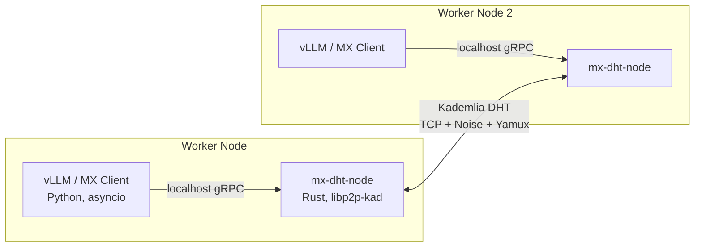
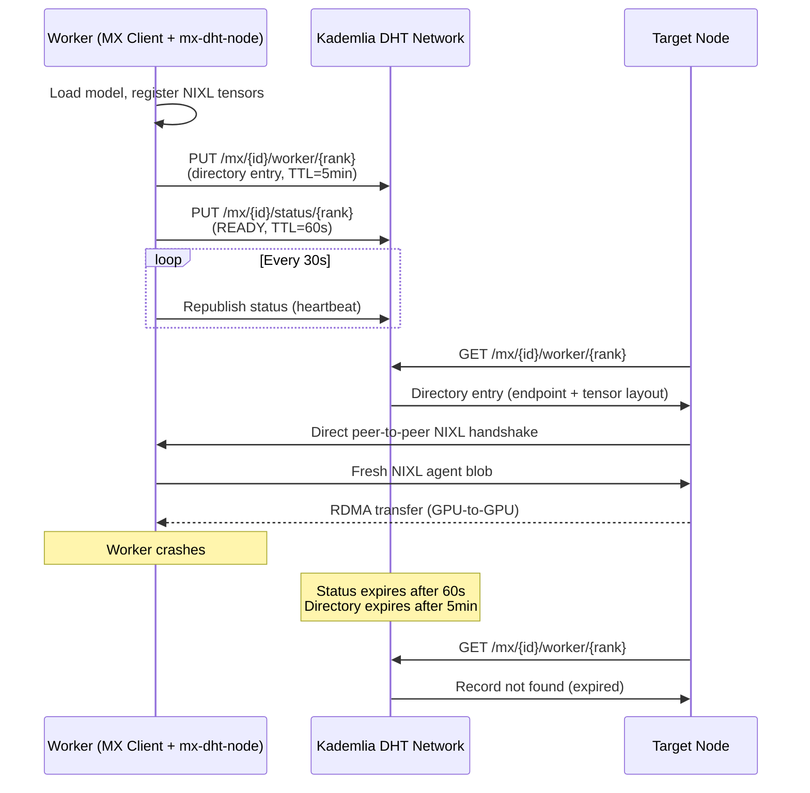

# Design: Kademlia DHT as a Metadata Backend

## Context

ModelExpress currently supports three metadata backends for P2P weight transfer
coordination: in-memory, Redis, and Kubernetes CRDs. A companion critique
([metadata-backend-critique.md](metadata-backend-critique.md)) argues that the
metadata store should hold only a lightweight directory (endpoint + tensor
layout, a few KB per worker) rather than full NIXL agent blobs. This document
proposes adding a fourth backend based on the Kademlia Distributed Hash Table
(DHT), and explains why this backend is particularly well-suited to the
index-only metadata model.

### Relationship to the Resiliency Design

The [Resiliency Design](https://docs.google.com/document/d/...) proposes
Phase 1 changes (source identity keys, per-rank storage, status persistence,
stateless server) that are prerequisites for this work, not alternatives.
The DHT backend slots into the same `MetadataBackend` trait and benefits
directly from per-rank storage (each DHT record is one worker's directory
entry) and the stateless server model (no layered cache to coordinate).

The Resiliency Design's Phase 2 (multi-source support, status watcher) is
where the DHT backend becomes most compelling: it eliminates the need for
both the Redis dependency and the K8s pod watcher in environments where
nodes can communicate directly.

## Motivation

### The infrastructure tax

Every existing backend requires external infrastructure:

| Backend | Requires | Operational burden |
|---|---|---|
| Redis | Redis server, persistent storage | Monitoring, backup, "flush on redeploy" |
| Kubernetes | K8s API server, etcd, RBAC | CRD registration, RBAC policies, etcd limits |
| In-memory | Nothing | No persistence, no HA, lost on restart |

For a system whose primary job is coordinating peer-to-peer GPU transfers,
requiring a centralized database is architecturally ironic. The nodes already
know how to talk to each other - they do RDMA at 45 GB/s. They just need a
way to discover each other first.

### What a DHT solves

A Kademlia DHT turns the participating nodes into the metadata store. No
external service, no database, no RBAC policies. Nodes join, publish their
directory entries, and query for peers - all within the same process or a
co-located sidecar.

| Property | Redis | K8s CRD | DHT |
|---|---|---|---|
| External dependency | Redis server | K8s API + etcd | None |
| Works outside K8s | Yes | No | Yes |
| Persistence | Redis durability | etcd | Republish on join |
| Node failure handling | Manual cleanup / TTL | Pod watcher / GC | Automatic (record expires) |
| Scales with cluster | Centralized bottleneck | etcd write limits | O(log n) per lookup |
| Deployment complexity | Medium | High | Low |

### Natural fit for the index-only model

The critique document argues that NIXL blobs should not be stored centrally,
and that the metadata store should hold only lightweight directory entries.
A DHT is the ideal backend for this model:

- **Small records.** Kademlia is designed for small key-value pairs (originally
  ~1 KB). A directory entry with endpoint + tensor layout is a few KB - well
  within the protocol's sweet spot. Full NIXL blobs (100-400 KB per worker)
  would strain DHT record limits; directory entries don't.

- **Built-in expiry.** Kademlia records have a natural TTL: the publishing node
  must periodically republish to keep the record alive. If a node dies, its
  records expire automatically. No pod watcher, no manual Redis flush, no
  orphan cleanup. This directly addresses Issue 6 from the critique (no
  TTL/expiry on any backend) and the unresolved status lifecycle question
  from the Resiliency Design review.

- **Per-rank keys are natural.** The Resiliency Design's per-rank storage maps
  directly to DHT keys: `/mx/{model_id}/worker/{rank}`. Each worker publishes
  its own record independently. No merge, no conflict, no atomic
  read-modify-write.

- **Discovery is the core use case.** A DHT is a discovery protocol. That's
  exactly what the metadata store should be after the blob separation: "who
  has model X, and where can I reach them?"

## Design

### Architecture

The DHT backend is implemented as a Rust sidecar process (`mx-dht-node`)
running alongside each model-serving worker. The Python vLLM loader
communicates with it over a local gRPC or HTTP API.



**Why a sidecar, not a Python library?**

py-libp2p exists and we validated interop (see `tests/libp2p_kad_interop/`),
but it has fundamental problems for production use:

- **trio, not asyncio.** py-libp2p uses trio as its async runtime. vLLM and
  the entire Python ML inference ecosystem use asyncio. These don't mix
  without a bridge layer, which adds complexity that defeats the purpose.
- **Native C dependencies.** fastecdsa (GMP), coincurve (libsecp256k1),
  pynacl (libsodium), pycryptodome. "Pure Python" it is not.
- **Maturity.** py-libp2p 0.6.0 works for basic interop (we proved that),
  but it's a fraction of rust-libp2p's maturity and test coverage.

The Rust sidecar avoids all of these problems. `libp2p-kad` is the reference
Kademlia implementation, actively maintained, and battle-tested. The Python
client talks to localhost over a simple API that fits naturally into asyncio.
The sidecar is a single static binary with no runtime dependencies.

**Importantly, the sidecar's local API can match the existing gRPC interface
that the MX Client already uses.** The Python code doesn't need to know
whether the metadata store is Redis, K8s, or a DHT - it calls the same
`publish_metadata` / `get_metadata` / `update_status` RPCs. The sidecar
translates these into DHT operations internally.

### Protocol Stack

Validated via interop testing (see `tests/libp2p_kad_interop/FINDINGS.md`):

| Layer | Protocol | Implementation |
|---|---|---|
| Transport | TCP | libp2p-tcp |
| Security | Noise (`/noise`) | libp2p-noise (Ed25519 keys) |
| Multiplexer | Yamux | libp2p-yamux |
| Routing | Identify (`/ipfs/id/1.0.0`) | libp2p-identify |
| DHT | Kademlia (`/ipfs/kad/1.0.0`) | libp2p-kad |

### Key Schema

Following the Resiliency Design's per-rank storage model:

```
Key:   /mx/{mx_source_config_id}/worker/{rank}
Value: {
  "endpoint": "10.0.1.5:50051",
  "status": "READY",
  "tensor_layout": [
    {"name": "model.layers.0.self_attn.q_proj.weight", "size": 134217728, "dtype": "float8_e4m3fn", "device_id": 0},
    ...
  ],
  "published_at": 1741856400
}
```

Status key (separate, shorter TTL):
```
Key:   /mx/{mx_source_config_id}/status/{rank}
Value: {
  "status": "READY",
  "session_id": "abc123",
  "last_heartbeat": 1741856400
}
```

Record sizes:
- Directory entry: ~2-5 KB per worker (tensor names are the bulk)
- Status entry: ~100 bytes per worker
- Total for TP=8 DeepSeek-V3: ~20-40 KB (vs ~3-12 MB with NIXL blobs today)

### Record Lifecycle



Key properties:
- **Status heartbeat (30s interval, 60s TTL):** If a worker stops
  heartbeating, its status record expires within 60 seconds. No pod watcher
  needed.
- **Directory TTL (5 minutes):** Longer than status because the directory
  entry is more expensive to query (contains tensor layout). Even after status
  expires, the directory tells targets "this worker existed recently at this
  endpoint" - useful for debugging.
- **Automatic cleanup:** Kademlia's republish/expire mechanism handles all
  garbage collection. No "flush Redis on redeploy," no orphan CRD cleanup.

### Bootstrap

Nodes need at least one known peer to join the DHT. Three strategies,
matching the deployment context:

**Kubernetes (recommended for K8s deployments):**
A headless Service provides DNS-based peer discovery. Each pod resolves the
service name to get IP addresses of other DHT nodes.

```yaml
apiVersion: v1
kind: Service
metadata:
  name: mx-dht
spec:
  clusterIP: None
  selector:
    app: mx-worker
  ports:
    - port: 4001
      name: libp2p
```

The sidecar resolves `mx-dht.namespace.svc.cluster.local` on startup and
dials discovered peers. New nodes joining the cluster automatically find
existing DHT members.

**Static seed list (bare metal / VM):**
A comma-separated list of seed node multiaddrs via environment variable:

```
MX_DHT_BOOTSTRAP=/ip4/10.0.1.5/tcp/4001/p2p/12D3KooW...,/ip4/10.0.1.6/tcp/4001/p2p/12D3KooW...
```

At least one seed node must be reachable. In practice, listing 2-3 nodes
provides redundancy.

**mDNS (development / single-network):**
libp2p supports mDNS for automatic peer discovery on a local network.
Useful for development and testing without any configuration.

```
MX_DHT_BOOTSTRAP=mdns
```

### MetadataBackend Trait Implementation

The DHT backend implements the same `MetadataBackend` trait as Redis and K8s:

```rust
pub struct DhtBackend {
    // Local gRPC/HTTP client to the co-located mx-dht-node sidecar
    client: DhtNodeClient,
}

#[async_trait]
impl MetadataBackend for DhtBackend {
    async fn connect(&self) -> MetadataResult<()> {
        // Connect to local sidecar, verify DHT membership
        self.client.health_check().await
    }

    async fn publish_metadata(&self, model_name: &str, workers: Vec<WorkerMetadata>) -> MetadataResult<()> {
        // For each worker: PUT /mx/{model_name}/worker/{rank} -> directory entry
        // Sidecar handles DHT put + periodic republish
    }

    async fn get_metadata(&self, model_name: &str) -> MetadataResult<Option<ModelMetadataRecord>> {
        // GET /mx/{model_name}/worker/* from DHT
        // Sidecar queries DHT, assembles per-rank records into ModelMetadataRecord
    }

    async fn remove_metadata(&self, model_name: &str) -> MetadataResult<()> {
        // Stop republishing records for this model
        // Records expire naturally via DHT TTL
    }

    async fn list_models(&self) -> MetadataResult<Vec<String>> {
        // Sidecar maintains a local index of known model keys
        // Or: use a well-known DHT key /mx/models as a set
    }
}
```

Configuration:
```
MX_METADATA_BACKEND=dht
MX_DHT_LISTEN=/ip4/0.0.0.0/tcp/4001
MX_DHT_BOOTSTRAP=/ip4/10.0.1.5/tcp/4001/p2p/12D3KooW...
```

### Interaction with Client Heartbeats

The Resiliency Design review surfaced strong support for client heartbeats
over pod watchers. The DHT backend makes this pattern native:

- The MX Client's local sidecar **is** the heartbeat. As long as the sidecar
  is running, it republishes records to the DHT. When it stops (because the
  worker died), records expire.
- No separate heartbeat RPC needed. The DHT's republish mechanism is the
  heartbeat.
- Status can be updated by simply publishing a new value to the status key.
  The DHT overwrites the old record. No read-modify-write, no merge.

This also enables the NIXL blob separation naturally: the sidecar can serve
as the on-demand NIXL metadata endpoint. When a target discovers a source
via the DHT directory, it connects to the source's sidecar to exchange NIXL
blobs peer-to-peer. The sidecar already has a listening port (for the DHT)
and the NIXL agent handle (from the co-located MX Client). Adding a blob
serving endpoint is minimal additional work.

## Trade-offs

### What you gain

1. **Zero external infrastructure.** No Redis, no etcd, no pod watcher RBAC.
   The nodes are the store. Deploy workers, they find each other.

2. **Automatic liveness.** Records expire when nodes die. No manual cleanup,
   no stale metadata, no "flush Redis on redeploy."

3. **Works everywhere.** Bare metal, VMs, K8s, dev laptops. Same backend,
   different bootstrap strategy.

4. **Scales with the cluster.** O(log n) lookups for n nodes. No centralized
   bottleneck. Adding nodes makes the DHT more resilient, not slower.

5. **Natural fit for per-rank, index-only storage.** Each worker publishes
   its own small record. No merge, no conflict, no encoding overhead.

6. **Heartbeat is built in.** Republish = heartbeat. Status lifecycle is
   solved by the protocol itself, not bolted on.

### What you lose

1. **No durable history.** DHT records expire. If all nodes for a model
   restart simultaneously, the metadata is gone until they republish. For
   a cache/discovery system this is fine (they republish on startup). For
   audit logging it's not (use a separate system).

2. **Eventually consistent.** Kademlia provides eventual consistency, not
   strong consistency. Two targets querying simultaneously might see slightly
   different views during record propagation. For discovery ("who has model X
   right now?") this is acceptable. For critical state transitions it would
   need additional coordination.

3. **Sidecar overhead.** One additional process per worker node. The binary
   is small (~10 MB static) and lightweight (a few MB of RAM, minimal CPU
   for DHT maintenance), but it's a process to manage.

4. **Bootstrap complexity.** Nodes need to find at least one peer. K8s
   headless Services and mDNS handle this well, but it's a new configuration
   surface compared to "point at Redis."

5. **Less mature for this use case.** Redis and K8s are battle-tested as
   metadata stores. Using a DHT for GPU cluster coordination is novel.
   The protocol itself (Kademlia) is proven at planetary scale (BitTorrent),
   but this specific application is new ground.

### When to use which backend

| Environment | Recommended backend | Reason |
|---|---|---|
| Kubernetes with Redis already deployed | Redis | Lowest migration cost |
| Kubernetes without Redis | DHT or K8s CRD | Avoid adding Redis; DHT if status lifecycle matters |
| Bare metal / VM cluster | DHT | Only backend that works without K8s or Redis |
| Development / single machine | In-memory or DHT (mDNS) | Simplest setup |
| Air-gapped / restricted network | Redis or in-memory | DHT needs peer connectivity |

## Implementation Plan

### Phase 0: Validated (done)

- Rust/Python Kademlia interop test (`tests/libp2p_kad_interop/`)
- Confirmed: Ed25519 keys, Noise security, Yamux mux, `/ipfs/kad/1.0.0`
- Both directions work: Rust put -> Python get, Python put -> Rust get
- Findings documented in `tests/libp2p_kad_interop/FINDINGS.md`

### Phase 1: mx-dht-node sidecar

- Standalone Rust binary using `libp2p-kad`
- Kademlia DHT participation (server mode)
- Local gRPC API matching the `MetadataBackend` trait operations
- Bootstrap via env var (static peers, headless service DNS, or mDNS)
- Record TTL and automatic republish
- Health check endpoint

### Phase 2: DhtBackend trait implementation

- `MetadataBackend` implementation that talks to the local sidecar
- Configuration via `MX_METADATA_BACKEND=dht`
- Integration tests with the existing test infrastructure

### Phase 3: NIXL blob serving (optional, requires blob separation)

- Add a blob exchange endpoint to the sidecar
- MX Client registers NIXL agent blob with the local sidecar on startup
- Targets fetch blobs directly from the source's sidecar after DHT discovery
- This phase depends on the blob separation from the metadata critique

## References

- [Metadata Backend Critique](metadata-backend-critique.md) - Why NIXL blobs
  don't belong in the centralized store
- [libp2p Kademlia DHT Interop Findings](../tests/libp2p_kad_interop/FINDINGS.md) -
  Rust/Python interop test results and gotchas
- [libp2p Kademlia spec](https://github.com/libp2p/specs/tree/master/kad-dht) -
  Protocol specification
- [Resiliency Design](https://docs.google.com/document/d/...) - Phase 1/2
  hardening proposal by Zheng Luo
