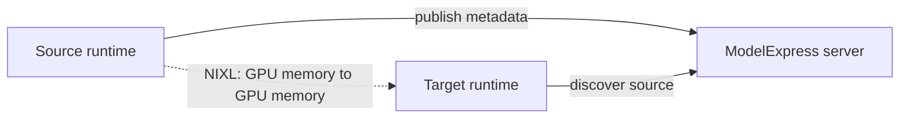

<!--
SPDX-FileCopyrightText: Copyright (c) 2025-2026 NVIDIA CORPORATION & AFFILIATES. All rights reserved.
SPDX-License-Identifier: Apache-2.0
-->

# P2P weight transfer

ModelExpress P2P transfers post-processed model tensors from a ready serving worker to a new worker over NIXL. The ModelExpress server or Kubernetes Service is used for discovery and metadata; the server does not carry the weight bytes.

## When to use it

Use P2P when replicas run the same model and compatible parallelism layout, the source can publish its loaded tensors, and the cluster exposes a supported NIXL fabric. P2P is a scale-out optimization: the first replica still needs a bootstrap path such as a local cache, Hugging Face, S3, GCS, or Azure Blob.

P2P can work without shared storage. Targets still need the runtime configuration and non-weight model files needed to construct the model; only the weight tensors are supplied by the source.

## Central-coordinator topology

The central topology uses a ModelExpress server with `redis` or `kubernetes` metadata. Redis is a good fit when an external low-latency service is already available. Kubernetes is a good fit when the server can use the `ModelMetadata` and `ModelCacheEntry` CRDs.



The smallest checked-in vLLM path is [`examples/p2p_transfer_k8s`](../../../examples/p2p_transfer_k8s/README.md). It includes server manifests, a client image, single-node and multi-node vLLM examples, SGLang variants, and a TensorRT-LLM example.

## Required settings

```bash
export MX_SERVER_ADDRESS=modelexpress-server:8001
export MX_METADATA_BACKEND=kubernetes
export MX_P2P_METADATA=1
```

Use `MX_METADATA_BACKEND=redis` and `REDIS_URL=redis://redis:6379` for Redis. The server requires `MX_METADATA_BACKEND` and the selected backend's connection setting; it does not silently choose localhost or the `default` namespace.

Both source and target must use compatible runtime images, model revision, parallelism, dtype, quantization, and accelerator layout. A mismatch is a reason to fall back to storage rather than transfer unsafe tensors.

## Kubernetes workflow

1. Install [`examples/crds.yaml`](../../../examples/crds.yaml) for the Kubernetes backend.
2. Deploy the server and its RBAC from [`server/kubernetes_backend`](../../../examples/p2p_transfer_k8s/server/kubernetes_backend/).
3. Build the runtime image from the matching client Dockerfile, for example [`client/vllm/Dockerfile`](../../../examples/p2p_transfer_k8s/client/vllm/Dockerfile).
4. Apply [`client/vllm/vllm-single-node.yaml`](../../../examples/p2p_transfer_k8s/client/vllm/vllm-single-node.yaml).
5. Wait for the first pod to be healthy before scaling the deployment.
6. Verify the target log contains `Transfer complete` or the runtime-specific completion marker.

The current CI P2P workflow exercises vLLM, SGLang NIXL, SGLang Mooncake TransferEngine, TP, DP, EP, rolling update, stale metadata, fleet scale, and Dynamo vLLM variants. TensorRT-LLM remains a beta/example path and is not in the active ModelExpress CI matrix.

## Decentralized `k8s-service` topology

Use [`examples/k8s_service_sources`](../../../examples/k8s_service_sources/README.md) when weights are stable for a pod's lifetime and source pods are interchangeable behind a Kubernetes Service. This topology needs no ModelExpress server, Redis, or CRDs. It is not the right choice for mixed revisions, live refit, live fine-tune broadcasts, or per-worker addressability.

## Artifacts

Set `MX_ARTIFACT_TRANSFER=1` to transfer compatible file-backed JIT artifacts with weights on the NIXL path. Artifact transfer requires `MX_P2P_METADATA=1`, a central coordinator, writable target cache directories, and a trusted deployment. The source and target must match the artifact identity, including the compile configuration when `MX_ARTIFACT_COMPILE_CONFIG_DIGEST` is used. Mooncake TransferEngine is currently weight-only.

## Observe a load decision

Set `MODEL_EXPRESS_LOG_LEVEL=DEBUG` in the worker and inspect these messages:

```text
Eligible loaders: [...]
Trying strategy: rdma
Transfer complete
```

If `rdma` is absent from `Eligible loaders`, inspect NIXL availability, `MX_P2P_METADATA`, server/backend reachability, the adapter capability, and the model compatibility identity before debugging the fabric.
