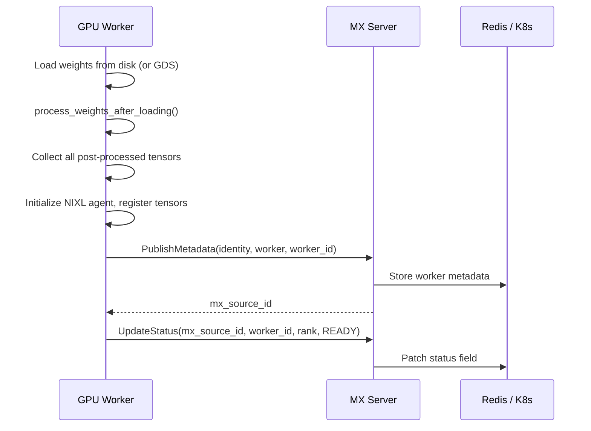
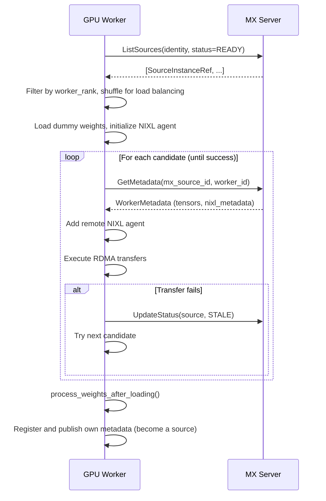

# ModelExpress Metadata Architecture

This document describes the metadata storage and coordination layer for ModelExpress P2P transfers.

## Overview

ModelExpress P2P transfers require coordination between source and target GPU workers:

1. **Source** loads model weights, registers tensors with a transfer backend (NIXL or Mooncake), and publishes metadata to the MX server
2. **Target** queries the MX server for available sources, fetches tensor metadata on demand, and executes RDMA transfers
3. **Status** transitions (`INITIALIZING` -> `READY` -> `STALE`) signal when sources are available for transfers

## Key Concepts

### Source Identity and Content-Addressed Keys

Every source is identified by a `SourceIdentity` proto containing all fields that affect tensor layout compatibility:

| Field | Example | Purpose |
|-------|---------|---------|
| `mx_version` | `"0.3.0"` | Format compatibility across upgrades |
| `mx_source_type` | `WEIGHTS`, `LORA`, `CUDA_GRAPH` | Type of tensors being served |
| `model_name` | `"deepseek-ai/DeepSeek-V3"` | Model identifier |
| `backend_framework` | `VLLM`, `SGLANG`, `TRT_LLM` | Inference framework |
| `tensor_parallel_size` | `8` | TP degree |
| `pipeline_parallel_size` | `2` | PP degree |
| `expert_parallel_size` | `4` | EP degree (MoE models) |
| `dtype` | `"bfloat16"` | Weight data type |
| `quantization` | `"fp8"`, `""` | Quantization method |
| `extra_parameters` | `{}` | Framework-specific config |

The server computes `mx_source_id = SHA256(canonical_json(identity))[:16]` -- a 16-char hex key used to address all metadata for sources with identical configuration. This is content-addressed: two sources with the same identity hash to the same `mx_source_id`, enabling automatic peer discovery.

### Multi-Instance Support

Multiple replicas of the same model (same `SourceIdentity`) can coexist. Each GPU worker process generates a unique `worker_id` (`uuid4().hex[:8]`) at startup. The combination `(mx_source_id, worker_id)` uniquely identifies one worker's metadata.

Each worker publishes independently -- no inter-worker coordination or barriers required.

### Worker Rank

Workers use `torch.distributed.get_rank()` as their global rank, which captures both tensor-parallel and pipeline-parallel position. This is stored as `worker_rank` in metadata so targets can find a peer with a matching rank.

## gRPC API

```protobuf
service P2pService {
  rpc PublishMetadata(PublishMetadataRequest) returns (PublishMetadataResponse);
  rpc ListSources(ListSourcesRequest) returns (ListSourcesResponse);
  rpc GetMetadata(GetMetadataRequest) returns (GetMetadataResponse);
  rpc UpdateStatus(UpdateStatusRequest) returns (UpdateStatusResponse);
}
```

### PublishMetadata

Called once per GPU worker after loading weights and registering with the transfer backend. The server computes `mx_source_id` from `identity` and returns it to the client.

```
PublishMetadataRequest {
  identity: SourceIdentity    // Server computes mx_source_id from this
  worker: WorkerMetadata       // One worker per call (rank, backend metadata, tensors)
  worker_id: string            // Unique per GPU process (uuid4 hex[:8])
}
```

### ListSources

Lightweight listing -- returns `SourceInstanceRef` entries (no tensor data). Clients filter by `worker_rank` to find matching peers, then call `GetMetadata` for the chosen one.

```
ListSourcesRequest {
  identity: SourceIdentity         // Optional: filter by source identity
  status_filter: SourceStatus      // Optional: e.g., SOURCE_STATUS_READY
}

ListSourcesResponse {
  instances: [SourceInstanceRef]   // One entry per worker
}

SourceInstanceRef {
  mx_source_id: string    // 16-char hex
  worker_id: string       // Unique worker identifier
  model_name: string      // Human-readable
  worker_rank: uint32     // Global rank for peer matching
}
```

### GetMetadata

Fetches full tensor metadata (MB-scale) for one specific worker. Called on demand after filtering `ListSources` results.

```
GetMetadataRequest {
  mx_source_id: string   // From ListSources or PublishMetadata response
  worker_id: string      // From ListSources or PublishMetadata response
}
```

### UpdateStatus

Transitions a worker's lifecycle status. Called after publishing metadata to mark the worker as `READY`.

```
UpdateStatusRequest {
  mx_source_id: string
  worker_id: string
  worker_rank: uint32
  status: SourceStatus   // INITIALIZING -> READY -> STALE
}
```

## Source Lifecycle

```
INITIALIZING ──> READY ──> STALE
   (publish)    (update)   (TTL expiry or explicit)
```

- **INITIALIZING**: Worker has published metadata but is not yet ready for transfers
- **READY**: Worker is fully initialized and accepting RDMA connections
- **STALE**: Worker is no longer available (TTL expiry or explicit marking)

## Backend Implementations

Configured via `MX_METADATA_BACKEND` environment variable:

| Value | Backend | Use Case |
|-------|---------|----------|
| `redis` | Redis | Production with Redis |
| `kubernetes` / `k8s` / `crd` | Kubernetes CRDs | K8s-native deployments |

### Redis Backend

#### Storage Layout

Two types of Redis keys per source:

**Source index key** -- `mx:source:{source_id}` (Redis Hash)

| Field | Value | Purpose |
|-------|-------|---------|
| `__attributes__` | JSON of all `SourceIdentity` fields | Stored once per source, avoids duplication |
| `{worker_id}` | `"{global_rank}"` | Presence marker with rank for fast listing |

**Worker data key** -- `mx:source:{source_id}:{worker_id}` (Redis Hash)

| Field | Value | Purpose |
|-------|-------|---------|
| `"{worker_rank}"` | JSON `WorkerRecordJson` | Full tensor metadata for one rank |

Global listing uses `SCAN` with pattern `mx:source:????????????????` (exactly 16 hex chars) to enumerate source index keys without a secondary index.

Both key types have a configurable TTL (`MX_STATUS_TTL_SECS`, default 3600s) refreshed on publish and status update.

#### Example Redis State

```
# Source index -- identity stored once, workers as presence markers
mx:source:a1b2c3d4e5f67890
  __attributes__  ->  {"model_name":"deepseek-ai/DeepSeek-V3","mx_version":"0.3.0",...}
  f3a2b1c4        ->  "0"    # worker_id f3a2b1c4, global rank 0
  e7d6c5b8        ->  "1"    # worker_id e7d6c5b8, global rank 1

# Worker data -- full tensor metadata
mx:source:a1b2c3d4e5f67890:f3a2b1c4
  "0"  ->  {"worker_rank":0,"backend_type":"nixl","nixl_metadata":[...],"tensors":[...],"status":2,...}

mx:source:a1b2c3d4e5f67890:e7d6c5b8
  "1"  ->  {"worker_rank":1,"backend_type":"nixl","nixl_metadata":[...],"tensors":[...],"status":2,...}
```

#### JSON Schemas

**WorkerRecordJson** (stored per rank in worker data hash):
```json
{
  "worker_rank": 0,
  "backend_type": "nixl",
  "nixl_metadata": [222, 173, 190, 239],
  "transfer_engine_session_id": null,
  "tensors": [
    {
      "name": "model.layers.0.self_attn.q_proj.weight",
      "addr": "139948187451390",
      "size": "134217728",
      "device_id": 0,
      "dtype": "bfloat16"
    }
  ],
  "status": 2,
  "updated_at": 1700000000000
}
```

`addr` and `size` are serialized as strings to avoid JSON precision loss with large u64 values.

### Kubernetes CRD Backend

Uses `ModelMetadata` CRDs for metadata and `ConfigMap`s for tensor descriptors (to avoid etcd size limits).

**CRD name format**: `mx-source-{source_id}-{worker_id}`

**ConfigMap name format**: `mx-source-{source_id}-{worker_id}-tensors-worker-{rank}`

ConfigMaps use `ownerReferences` pointing to the parent CRD so they are garbage-collected automatically.

#### Example CRD

```bash
kubectl get modelmetadatas -n <namespace>
kubectl get modelmetadata mx-source-a1b2c3d4e5f67890-f3a2b1c4 -n <namespace> -o yaml
```

```yaml
apiVersion: modelexpress.nvidia.com/v1alpha1
kind: ModelMetadata
metadata:
  name: mx-source-a1b2c3d4e5f67890-f3a2b1c4
  labels:
    modelexpress.nvidia.com/mx-source-id: a1b2c3d4e5f67890
spec:
  modelName: deepseek-ai/DeepSeek-V3
status:
  workers:
    - workerRank: 0
      nixlMetadata: <base64>
      tensorCount: 1327
      status: Ready
```

## Client Workflow

### Source Path (load from disk, publish metadata)



### Target Path (receive via RDMA)



### Three-Tier Loading Strategy

The `MxModelLoader` (`--load-format mx`) auto-detects the best loading strategy:

1. **RDMA** -- If `ListSources` returns READY instances with matching rank, receive weights via NIXL/Mooncake
2. **GDS** -- If no source available and GPUDirect Storage is available, load directly from file to GPU
3. **Disk** -- Standard vLLM `DefaultModelLoader` as final fallback

After loading by any path, the worker registers its tensors and publishes metadata so future workers can discover it as an RDMA source.

## Transfer Backends

`WorkerMetadata` uses a `oneof backend_metadata` field supporting multiple transfer backends:

| Backend | Field | Description |
|---------|-------|-------------|
| NIXL | `nixl_metadata` (bytes) | Serialized NIXL agent blob for RDMA connections |
| Mooncake | `transfer_engine_session_id` (string) | TransferEngine session ID (`"ip:port"`) |

The `backend_type` discriminator is persisted in storage for unambiguous deserialization.

## Configuration

| Variable | Default | Description |
|----------|---------|-------------|
| `MX_METADATA_BACKEND` | (required) | `redis` or `kubernetes` |
| `MX_SERVER_ADDRESS` | `modelexpress-server:8001` | gRPC server address |
| `MX_REDIS_HOST` / `REDIS_HOST` | `localhost` | Redis host |
| `MX_REDIS_PORT` / `REDIS_PORT` | `6379` | Redis port |
| `REDIS_URL` | (computed) | Full Redis URL (overrides host/port) |
| `MX_METADATA_NAMESPACE` / `POD_NAMESPACE` | `default` | K8s namespace for CRD backend |
| `MX_STATUS_TTL_SECS` | `3600` | TTL for Redis keys (seconds) |
| `MX_CONTIGUOUS_REG` | `0` | Use contiguous region registration (experimental) |

## Debugging

### Verify server connectivity

```bash
grpcurl -plaintext <server_host>:8001 list
grpcurl -plaintext -d '{}' <server_host>:8001 model_express.p2p.P2pService/ListSources
```

### Inspect Redis state

```bash
redis-cli KEYS "mx:source:*"
redis-cli HGETALL "mx:source:<source_id>"
redis-cli HGETALL "mx:source:<source_id>:<worker_id>"
```

### Inspect K8s state

```bash
kubectl get modelmetadatas -n <namespace>
kubectl get configmaps -l modelexpress.nvidia.com/mx-source-id=<source_id> -n <namespace>
```

### Common failures

| Symptom | Likely Cause |
|---------|-------------|
| `ListSources` returns empty | No source has published + updated status to READY yet |
| `GetMetadata` returns `found: false` | Worker TTL expired, or wrong `mx_source_id`/`worker_id` |
| Target stuck waiting | Source still loading (check source pod logs for progress) |
| K8s CRs missing | RBAC issue -- check source logs and service account permissions |
| Stale metadata after redeploy | Flush Redis (`FLUSHDB`) -- stale metadata causes transfer failures |
| Transfer failure with address errors | Source pod restarted -- GPU addresses are invalid. Target should try next candidate |
