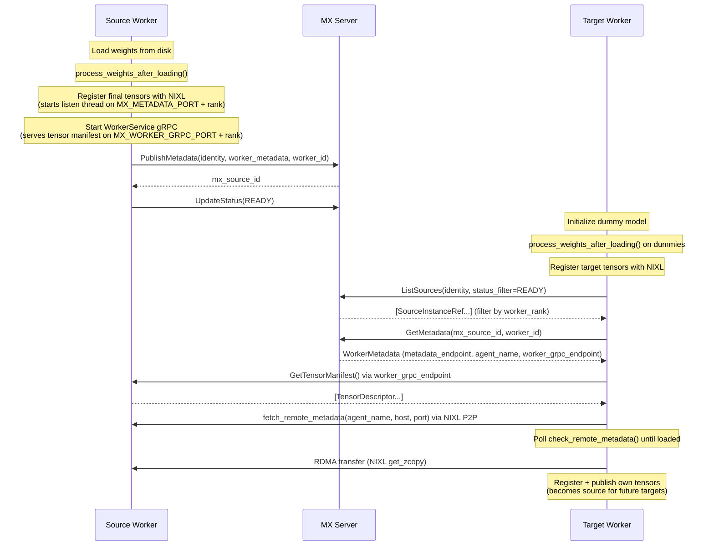

# ModelExpress Metadata Architecture

This document describes the metadata storage layer for ModelExpress P2P transfers, covering both the Redis and Kubernetes CRD backends.

## Overview

ModelExpress P2P transfers require lightweight coordination between source and target instances. The metadata layer stores only directory information - endpoints, agent names, and lifecycle status. Heavy data is exchanged directly between workers:

- **NIXL agent blobs** are exchanged peer-to-peer via NIXL's native listen thread (`fetch_remote_metadata` / `check_remote_metadata`). They are never stored centrally.
- **Tensor manifests** are served directly by each source worker via a per-worker gRPC server (`WorkerService.GetTensorManifest`).

The centralized metadata layer is intentionally minimal: it tells targets where to find source workers, not what those workers contain.

### Source Identity and mx_source_id

Every source publishes a `SourceIdentity` describing its configuration:

| Field | Example |
|-------|---------|
| `mx_version` | `"0.3.0"` |
| `mx_source_type` | `WEIGHTS`, `LORA`, `CUDA_GRAPH` |
| `model_name` | `"deepseek-ai/DeepSeek-V3"` |
| `backend_framework` | `VLLM`, `SGLANG`, `TRT_LLM` |
| `tensor_parallel_size` | `8` |
| `pipeline_parallel_size` | `1` |
| `expert_parallel_size` | `1` |
| `dtype` | `"float8_e4m3fn"` |
| `quantization` | `"fp8"` |
| `extra_parameters` | `{}` |

The server computes `SHA256(canonical_json(identity))` and takes the first 16 hex characters as the `mx_source_id`. This deterministic key means any client with the same identity fields will resolve to the same source ID without coordination.

### WorkerMetadata (proto)

```protobuf
message WorkerMetadata {
  uint32 worker_rank = 1;
  reserved 2, 3;  // formerly nixl_metadata and tensors
  SourceStatus status = 4;
  int64 updated_at = 5;
  string metadata_endpoint = 6;
  string agent_name = 7;
  string worker_grpc_endpoint = 8;
  string transfer_engine_session_id = 10;
}
```

### WorkerRecord (internal)

The server converts `WorkerMetadata` to an internal `WorkerRecord`:

| Field | Type | Description |
|-------|------|-------------|
| `worker_rank` | `u32` | GPU index within the instance |
| `backend_metadata` | `enum` | `Nixl`, `TransferEngine(session_id)`, or `None` |
| `metadata_endpoint` | `String` | host:port for NIXL listen thread |
| `agent_name` | `String` | NIXL agent name for `check_remote_metadata()` |
| `worker_grpc_endpoint` | `String` | host:port for WorkerService gRPC |
| `status` | `i32` | SourceStatus enum (0=Unknown, 1=Initializing, 2=Ready, 3=Stale) |
| `updated_at` | `i64` | Unix millis of last status update |

The `backend_metadata` discriminator is inferred from the proto fields: if `transfer_engine_session_id` is set, it's TransferEngine; if `metadata_endpoint` is set, it's Nixl; otherwise None.

## gRPC API

```protobuf
service WorkerService {
  rpc GetTensorManifest(GetTensorManifestRequest) returns (GetTensorManifestResponse);
}

service P2pService {
  rpc PublishMetadata(PublishMetadataRequest) returns (PublishMetadataResponse);
  rpc ListSources(ListSourcesRequest) returns (ListSourcesResponse);
  rpc GetMetadata(GetMetadataRequest) returns (GetMetadataResponse);
  rpc UpdateStatus(UpdateStatusRequest) returns (UpdateStatusResponse);
}
```

- `PublishMetadata` - Called by each worker after loading and registering tensors. Sends `SourceIdentity` + `WorkerMetadata` + `worker_id` (UUID). Returns the computed `mx_source_id`.
- `ListSources` - Lightweight listing. Returns one `SourceInstanceRef` per worker (source_id, worker_id, model_name, worker_rank). Supports optional `SourceIdentity` filter and `status_filter`.
- `GetMetadata` - Fetches full `WorkerMetadata` for one specific worker, identified by `mx_source_id` + `worker_id`.
- `UpdateStatus` - Patches a worker's status (e.g. Initializing -> Ready). Takes `mx_source_id`, `worker_id`, `worker_rank`, and new `SourceStatus`.

`WorkerService.GetTensorManifest` runs on each source worker (not the MX server). It returns the full list of `TensorDescriptor` messages for that worker's GPU.

## Source and Target Workflows



## MetadataBackend Trait

Both backends implement the same trait:

```rust
#[async_trait]
pub trait MetadataBackend: Send + Sync {
    async fn connect(&self) -> MetadataResult<()>;
    async fn publish_metadata(&self, identity: &SourceIdentity, worker_id: &str,
                              workers: Vec<WorkerMetadata>) -> MetadataResult<()>;
    async fn get_metadata(&self, source_id: &str, worker_id: &str)
                          -> MetadataResult<Option<ModelMetadataRecord>>;
    async fn list_workers(&self, source_id: Option<String>, status_filter: Option<SourceStatus>)
                          -> MetadataResult<Vec<SourceInstanceInfo>>;
    async fn remove_metadata(&self, source_id: &str) -> MetadataResult<()>;
    async fn list_sources(&self) -> MetadataResult<Vec<(String, String)>>;
    async fn update_status(&self, source_id: &str, worker_id: &str, worker_rank: u32,
                           status: SourceStatus, updated_at: i64) -> MetadataResult<()>;
}
```

## Backend Configuration

Set `MX_METADATA_BACKEND` to select a backend:

| Env Value | Backend | Use Case |
|-----------|---------|----------|
| `redis` | Redis | Production with Redis sidecar |
| `kubernetes` / `k8s` / `crd` | Kubernetes CRD | K8s-native deployments |

There is no in-memory or layered mode. Both backends connect to an external store.

### Environment Variables

| Variable | Default | Description |
|----------|---------|-------------|
| `MX_METADATA_BACKEND` | (required) | `redis` or `kubernetes`/`k8s`/`crd` |
| `REDIS_URL` | - | Full Redis URL (takes priority over host/port) |
| `MX_REDIS_HOST` / `REDIS_HOST` | `localhost` | Redis host |
| `MX_REDIS_PORT` / `REDIS_PORT` | `6379` | Redis port |
| `MX_STATUS_TTL_SECS` | `3600` | TTL for Redis keys (seconds) |
| `MX_METADATA_NAMESPACE` / `POD_NAMESPACE` | `default` | Kubernetes namespace for CRDs |
| `MX_METADATA_PORT` | `5555` | Base port for NIXL listen thread (per-worker: base + rank) |
| `MX_WORKER_GRPC_PORT` | `6555` | Base port for worker gRPC server (per-worker: base + rank) |
| `MX_WORKER_ADDRESS` / `POD_IP` | (auto-detect) | Worker IP/hostname for endpoints |

## Redis Backend

### Storage Layout

The Redis backend uses two key patterns per source/worker pair:

| Key Pattern | Type | Purpose |
|-------------|------|---------|
| `mx:source:{source_id}` | Hash | Source index. `__attributes__` field stores `SourceAttributesJson` (model name, identity fields). Other fields are `worker_id` -> empty string (presence markers). |
| `mx:source:{source_id}:{worker_id}` | Hash | Worker data. Each field is a worker_rank (string), value is JSON-serialized `WorkerRecordJson`. |

Global listing uses `SCAN` with pattern `mx:source:????????????????` (16-char source IDs) to enumerate source index keys.

Both key types have a TTL of `MX_STATUS_TTL_SECS` (default 3600 seconds / 1 hour), refreshed on every write. Keys expire automatically if the source stops publishing.

### WorkerRecordJson (Redis value)

```json
{
  "worker_rank": 0,
  "backend_type": "nixl",
  "metadata_endpoint": "10.0.1.5:5555",
  "agent_name": "mx-auto-worker0-a1b2c3d4",
  "worker_grpc_endpoint": "10.0.1.5:6555",
  "status": 2,
  "updated_at": 1769568000
}
```

Optional fields (`transfer_engine_session_id`) are omitted when not applicable.

### Atomic Merge

When multiple workers from the same instance publish concurrently (e.g. TP=8), each worker writes its own rank field into the worker hash. The source index hash tracks which `worker_id` values exist. All writes are pipelined with TTL refresh.

## Kubernetes CRD Backend

### ModelMetadata CRD

```yaml
apiVersion: modelexpress.nvidia.com/v1alpha1
kind: ModelMetadata
metadata:
  name: mx-source-{source_id}-{worker_id}
  namespace: default
  labels:
    modelexpress.nvidia.com/mx-source-id: "{source_id}"
    modelexpress.nvidia.com/mx-worker-id: "{worker_id}"
spec:
  modelName: deepseek-ai/DeepSeek-V3
status:
  workers:
    - workerRank: 0
      backendType: nixl
      metadataEndpoint: "10.0.1.5:5555"
      agentName: "mx-auto-worker0-a1b2c3d4"
      workerGrpcEndpoint: "10.0.1.5:6555"
      status: Ready
      updatedAt: "2026-01-27T18:02:47Z"
  conditions:
    - type: Ready
      status: "True"
      lastTransitionTime: "2026-01-27T18:02:50Z"
  observedGeneration: 1
  publishedAt: "2026-01-27T18:02:47Z"
```

### Worker Status Fields

| Field | Type | Description |
|-------|------|-------------|
| `workerRank` | integer | Worker rank (0-indexed) |
| `backendType` | string | `"nixl"`, `"transfer_engine"`, or `"none"` |
| `metadataEndpoint` | string | host:port for NIXL listen thread |
| `agentName` | string | NIXL agent name |
| `transferEngineSessionId` | string | Mooncake TransferEngine session ID |
| `workerGrpcEndpoint` | string | host:port for WorkerService gRPC |
| `status` | string | `Unknown`, `Initializing`, `Ready`, `Stale` |
| `updatedAt` | string | RFC3339 timestamp |

### CR Naming and Labels

Each CR is named `mx-source-{source_id}-{worker_id}`, with labels for both `mx-source-id` and `mx-worker-id`. This allows listing by source ID using label selectors.

## Comparison: Redis vs Kubernetes CRD

| Aspect | Redis | Kubernetes CRD |
|--------|-------|----------------|
| External dependency | Requires Redis sidecar | None (uses K8s API) |
| Observability | `redis-cli HGETALL "mx:source:..."` | `kubectl get mxmeta` |
| Lifecycle | TTL-based expiry | K8s garbage collection |
| Consistency | Redis pipelines | K8s optimistic concurrency |
| Access control | Network/auth | RBAC |
| Non-K8s environments | Works anywhere | Requires Kubernetes |

## Debugging

### Prerequisites

| Component | Check |
|-----------|-------|
| Backend | `MX_METADATA_BACKEND` set to `redis` or `kubernetes`/`k8s`/`crd` |
| Server address | Clients can reach the server: `MODEL_EXPRESS_URL` or `MX_SERVER_ADDRESS` (default `modelexpress-server:8001`) |
| Namespace (K8s) | `MX_METADATA_NAMESPACE` or `POD_NAMESPACE` set to the namespace where CRs live |

### 1. Verify server is reachable

```bash
grpcurl -plaintext <server_host>:8001 list

# List all sources
grpcurl -plaintext <server_host>:8001 model_express.p2p.P2pService/ListSources

# Get metadata for a specific worker
grpcurl -plaintext -d '{"mx_source_id":"<id>","worker_id":"<uuid>"}' \
    <server_host>:8001 model_express.p2p.P2pService/GetMetadata
```

For the Kubernetes backend, also inspect CRs:

```bash
kubectl get mxmeta -n <namespace>
kubectl get mxmeta -n <namespace> -l modelexpress.nvidia.com/mx-source-id=<id> -o yaml
```

### 2. Verify source path

Source must: (1) load and process weights, (2) register tensors with NIXL, (3) start worker gRPC server, (4) publish metadata, (5) update status to READY.

In source pod logs, look for:
- `publish_metadata` success after weight loading
- Worker gRPC server started on expected port
- `UpdateStatus` to READY after warmup

After source is up, `ListSources` should return the worker with status READY, and `GetMetadata` should return its endpoints.

### 3. Verify target path

Target must: (1) find a READY source, (2) get its metadata, (3) fetch tensor manifest from worker gRPC, (4) fetch NIXL blob via P2P, (5) run RDMA transfer.

In target pod logs, look for:
- `ListSources` returning matching workers
- `GetMetadata` returning endpoints
- `fetch_tensor_manifest` success from `worker_grpc_endpoint`
- `fetch_remote_metadata` / `check_remote_metadata` success
- `RDMA TRANSFER COMPLETE` / bandwidth numbers

### 4. Common failures

| Symptom | Likely cause |
|---------|-------------|
| `ListSources` returns no READY workers | Source hasn't called `UpdateStatus(READY)` yet; or wrong identity fields (dtype, TP size, etc.) |
| `GetMetadata` returns `found: false` | Wrong `mx_source_id` or `worker_id`; or metadata expired (Redis TTL) |
| Tensor manifest fetch fails | Worker gRPC server not started; wrong `MX_WORKER_GRPC_PORT`; network/firewall between target and source worker |
| NIXL blob fetch hangs | NIXL listen thread not started; wrong `MX_METADATA_PORT`; network/firewall; mismatched agent names |
| K8s: CRs missing | Source failed to create ModelMetadata (check RBAC and source logs) |
| "NIXL not available" on target | NIXL not installed or not loadable in the target image |

### 5. End-to-end sanity check

1. Start the MX server with the chosen backend.
2. Start source with `--load-format mx`, wait for weight loading and READY status.
3. Check server: `ListSources` shows the source, `GetMetadata` returns endpoints.
4. Start target with `--load-format mx`.
5. In target logs, confirm: source found, tensor manifest fetched, NIXL blob loaded, RDMA transfer complete.
6. Run an inference request against the target to confirm the full path.
