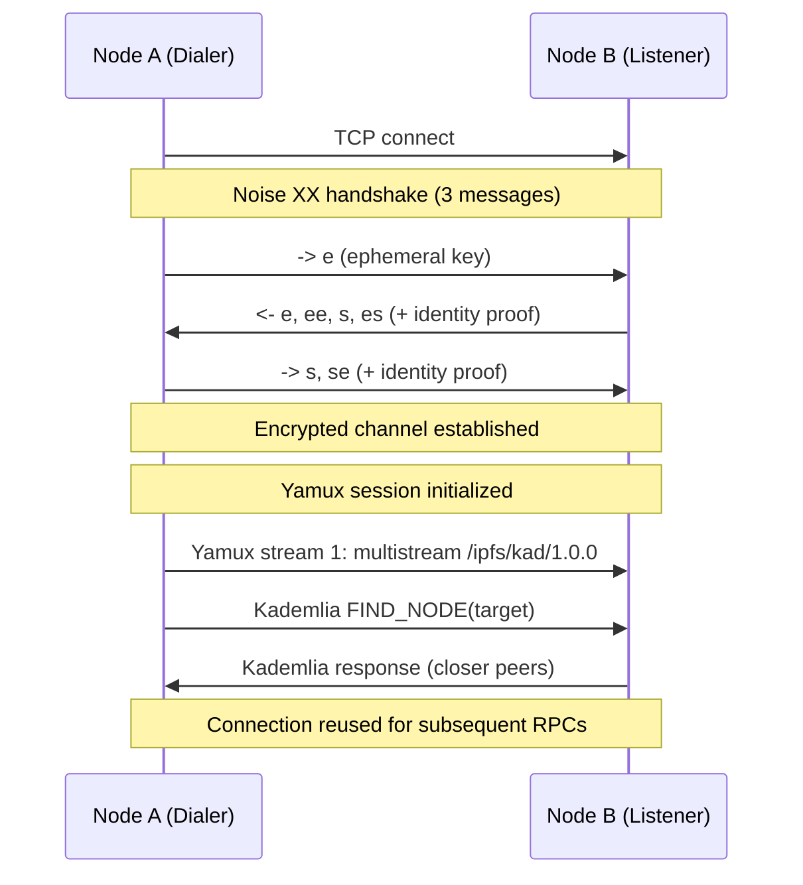
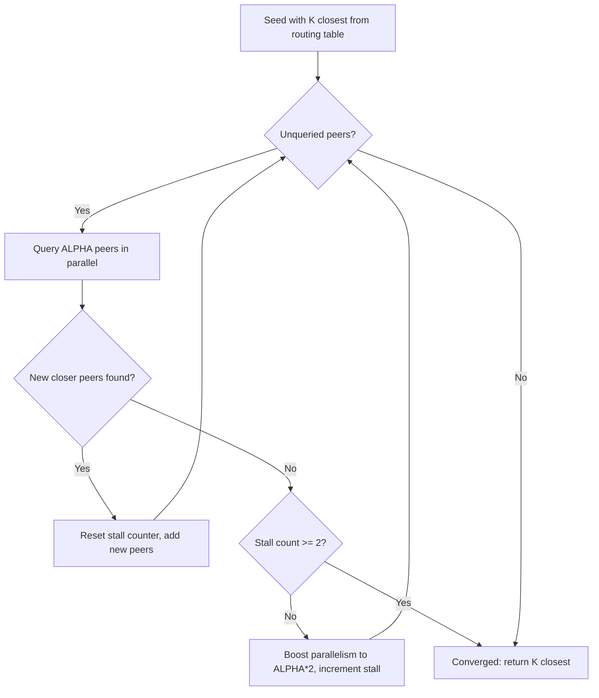
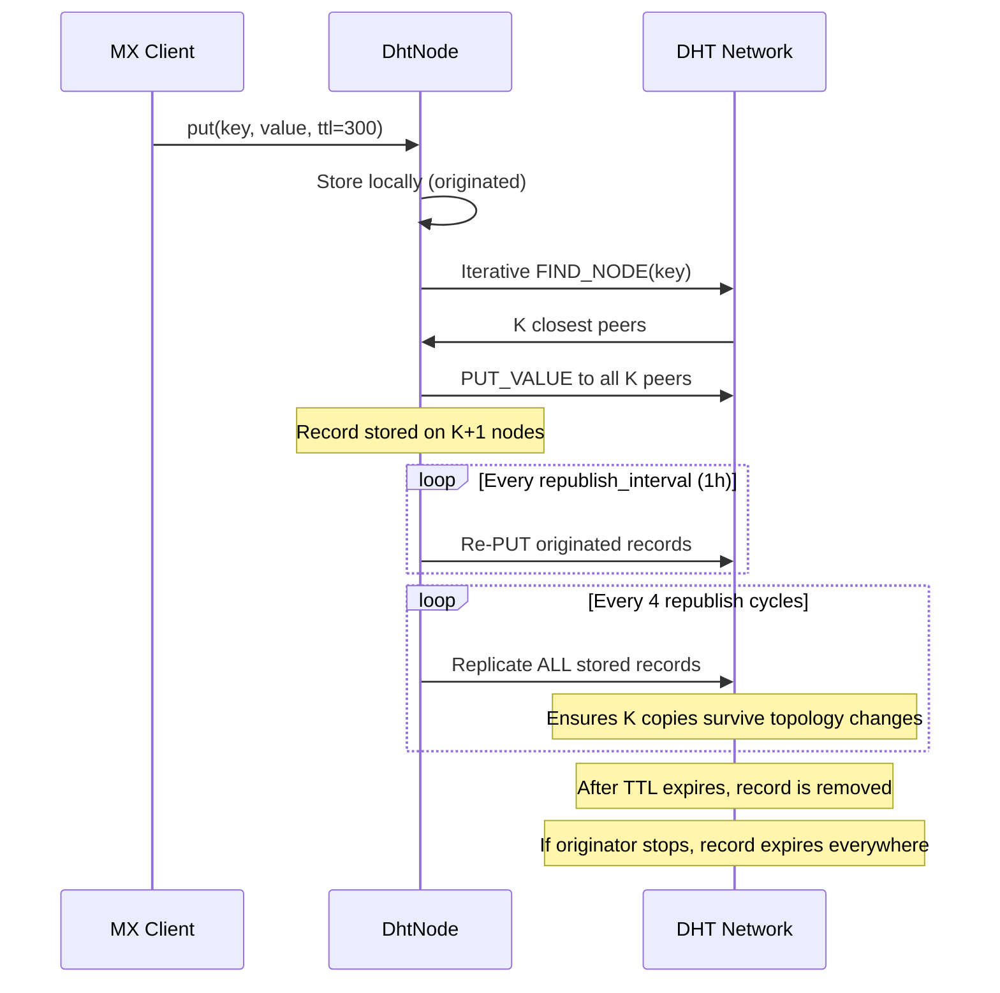

# Design: Pure Python libp2p for DHT Metadata Backend

## Document Status

This is a retroactive design document for the `mx_libp2p` library on the
`nnoble/py-libp2p-pure` feature branch. It describes the rationale, architecture,
protocol design, and integration plan for a pure Python libp2p implementation that
enables ModelExpress to use a Kademlia DHT as its metadata backend without a Rust
sidecar.

## Background

### The Problem

ModelExpress coordinates GPU-to-GPU weight transfers between worker nodes. Today,
workers discover each other through a centralized metadata store (Redis, K8s CRDs,
or in-memory). All three backends require external infrastructure, have no built-in
liveness detection, and currently store full NIXL agent blobs (100-400 KB per
worker) that should be exchanged peer-to-peer instead.

A companion design document ([dht-metadata-backend.md](../../dht-metadata-backend.md))
proposed a Kademlia DHT as a fourth backend, where the participating workers ARE the
metadata store. That document recommended a **Rust sidecar** (`mx-dht-node`) using
rust-libp2p, based on the finding that py-libp2p (the existing Python libp2p library)
was unsuitable for production:

- py-libp2p uses **trio**, not asyncio - incompatible with vLLM's event loop
- py-libp2p depends on **native C libraries** (GMP, libsecp256k1, libsodium)
- py-libp2p's maturity is insufficient for production use

### The New Path: Pure Python Reimplementation

This design proposes an alternative to the Rust sidecar: a **pure Python
reimplementation** of the libp2p stack, purpose-built for ModelExpress's needs.
Rather than wrapping the full generality of libp2p, mx_libp2p implements only the
protocols required for Kademlia DHT interop with rust-libp2p peers, using only
`cryptography` and `protobuf` as dependencies.

This approach eliminates the sidecar entirely. The DHT node runs **in-process** with
the MX Client, sharing the same asyncio event loop as vLLM. No additional process to
deploy, monitor, or coordinate. No localhost gRPC boundary. No build dependency on
the Rust toolchain for the Python client.

### Why Not the Sidecar?

The Rust sidecar is technically sound, but it introduces operational complexity that
pure Python avoids:

| Concern | Rust Sidecar | Pure Python |
|---|---|---|
| Deployment | Separate binary per worker node | pip install, runs in-process |
| Process management | Must be started/monitored alongside vLLM | Part of the Python process |
| Communication | localhost gRPC (serialization overhead) | Direct function calls |
| Build dependency | Rust toolchain required | Python-only |
| Debugging | Separate process, separate logs | Single process, shared logging |
| Failure modes | Sidecar crash orphans the worker | Process-level atomicity |
| Resource overhead | Additional process, TCP listener, gRPC server | Shared process memory |

For environments where a Rust binary is acceptable (e.g. static deployment images),
the sidecar remains a valid option. But for Python-first deployments (pip install,
Docker images, development environments), the pure Python path removes an entire
class of operational friction.

### Why Not py-libp2p?

The existing py-libp2p library was evaluated and rejected for three reasons:

1. **trio, not asyncio.** py-libp2p uses trio as its async runtime. vLLM and the
   Python ML inference ecosystem use asyncio. Bridging between them requires
   `trio-asyncio`, which adds complexity, has its own bugs, and defeats the purpose
   of in-process integration.

2. **Native C dependencies.** py-libp2p requires `fastecdsa` (GMP), `coincurve`
   (libsecp256k1), `pynacl` (libsodium), and `pycryptodome`. Building from source
   requires dev headers that aren't always available in container images. "Pure
   Python" it is not.

3. **Unnecessary generality.** py-libp2p implements the full libp2p stack including
   features ModelExpress doesn't need (multiple key types, multiple transports,
   pubsub, relay). This increases the attack surface and maintenance burden without
   benefit.

---

## Requirements

### Functional Requirements

1. **Wire compatibility with rust-libp2p 0.56+** for PUT_VALUE, GET_VALUE, and
   FIND_NODE operations over the `/ipfs/kad/1.0.0` protocol.
2. **Bootstrap** from static multiaddr lists, DNS hostname resolution (K8s headless
   Services), or programmatic peer addition.
3. **Per-record TTL** with configurable defaults and per-key override. Directory
   entries need longer TTL (5 minutes) than status heartbeats (60 seconds).
4. **Automatic record expiry and republish.** Originated records are republished
   periodically. Records from dead peers expire via TTL.
5. **Record filtering.** Application-defined callback to validate inbound records
   (e.g. key namespace enforcement, value schema validation).
6. **asyncio-native.** Must integrate directly with vLLM's asyncio event loop.
   No bridge libraries, no separate event loop threads.
7. **Minimal dependencies.** Only `cryptography` (for Noise XX crypto) and
   `protobuf` (for wire format). No C library build dependencies.

### Non-Functional Requirements

1. **Cluster sizes: 2-100 nodes.** ModelExpress deployments range from single-machine
   development to multi-rack GPU clusters. The DHT must work at both ends.
2. **Record sizes: 100 bytes - 15 KB.** Status heartbeats are ~100 bytes. Directory
   entries with tensor layout are 2-5 KB. Large records (full tensor manifests) may
   reach 10-15 KB. The 16 KB Kademlia message limit is sufficient.
3. **Datacenter network assumptions.** All nodes have direct IP connectivity. No NAT,
   no relay, no hole punching needed. TCP is sufficient.
4. **Trusted peers.** All DHT participants are ModelExpress workers in the same
   deployment. No Sybil resistance, no proof-of-work, no reputation system needed.
5. **Eventual consistency.** Kademlia provides eventual consistency, which is
   acceptable for metadata discovery. Targets that read stale metadata will fail at
   the NIXL handshake step and retry.

### Explicitly Out of Scope

- Provider records (ADD_PROVIDER, GET_PROVIDERS) - not needed for key-value metadata
- QUIC, WebSocket, or WebRTC transports - TCP is sufficient in datacenter
- TLS 1.3 - Noise XX provides mutual authentication
- RSA / secp256k1 key types - Ed25519 only (required for interop)
- PubSub (gossipsub) - not needed
- AutoNAT / relay / hole punching - datacenter has direct connectivity
- IPv6 - can be added later if needed
- mDNS discovery - DNS and static peers cover all deployment scenarios

---

## Architecture

### Protocol Stack

```
+---------------------------+
|  DhtNode (dht.py)         |  Application: bootstrap, put/get, republish
+---------------------------+
|  KadHandler (kad_handler)  |  Kademlia RPC handler + local record store
+---------------------------+
|  RoutingTable (routing.py) |  K-bucket routing table (k=20, alpha=3)
+---------------------------+
|  Kademlia (kademlia.py)   |  Protobuf message encode/decode
+---------------------------+
|  Identify (identify.py)   |  /ipfs/id/1.0.0 address exchange
+---------------------------+
|  Multistream (multistream) |  /multistream/1.0.0 protocol negotiation
+---------------------------+
|  Yamux (yamux.py)         |  Stream multiplexer over single TCP conn
+---------------------------+
|  Noise XX (noise.py)      |  Mutual authentication + encryption
+---------------------------+
|  TCP                      |  Transport
+---------------------------+
```

Each layer is a separate module with a clear boundary. The stack matches the
rust-libp2p default configuration for Kademlia, ensuring wire compatibility.

### Module Responsibilities

**crypto.py** - Ed25519 identity generation and management, peer ID derivation
(multihash of protobuf-encoded public key), base58btc encoding.

**noise.py** - Noise XX handshake implementation (-> e, <- e ee s es, -> s se) with
libp2p-specific framing: 2-byte length-prefixed messages, protobuf handshake payload
containing the identity key and signature over the static DH key. Post-handshake
transport with ChaChaPoly encryption.

**yamux.py** - Yamux v0.0.0 stream multiplexer. Supports data, window update, ping,
and go-away frames. Flow control with 256 KB default window and automatic window
replenishment.

**multistream.py** - Multistream-select 1.0.0 for protocol negotiation. Both
initiator and responder roles.

**connection.py** - Composes the above into a `Connection` object: TCP connect ->
Noise handshake -> Yamux session -> stream management. Handles both dialing and
listening roles.

**listener.py** - TCP listener with configurable max connections. Accepts inbound
connections, runs Noise handshake, creates Connection objects.

**peer_store.py** - Tracks known peers, their addresses, and active connections.
Serializes dials per peer to prevent duplicate connections. Enforces connection limits.

**routing.py** - Kademlia routing table: 256 K-buckets (one per bit of the 256-bit
peer ID space), each holding up to K=20 entries. LRU ordering with stale peer
eviction. Pending entry queue for full buckets (replacement cache).

**kademlia.py** - Protobuf encode/decode for Kademlia messages (Message, Record,
Peer). Handles the `/ipfs/kad/1.0.0` wire format.

**identify.py** - Encode/decode for `/ipfs/id/1.0.0` Identify messages. Used to
exchange listen addresses and discover observed IP (for nodes behind NAT or listening
on 0.0.0.0).

**kad_handler.py** - Inbound Kademlia RPC handler. Processes FIND_NODE, GET_VALUE,
PUT_VALUE, and PING messages. Manages local record store with configurable max
records, max record size, per-record TTL, and application-defined record filter.

**dht.py** - The `DhtNode` orchestrator. Ties everything together: listening,
dialing, routing, bootstrap, iterative lookups (FIND_NODE, GET_VALUE), PUT_VALUE
distribution, background republish/replication, observed IP detection, and
bucket refresh.

### Connection Lifecycle



Connections are persistent and multiplexed. Multiple Kademlia RPCs can run
concurrently over independent Yamux streams on the same TCP connection. The
PeerStore caches connections by peer ID and reuses them for subsequent operations.

### Iterative Lookup

The iterative lookup is the core Kademlia algorithm, used by both FIND_NODE and
GET_VALUE:



The stall detection with parallelism boost is an adaptation of rust-libp2p's
approach: when the lookup stops making progress, increase parallelism to query
more peers simultaneously before giving up. This handles sparse regions of the
key space where the initial ALPHA=3 peers may not have closer neighbors.

### Record Lifecycle



Key properties:
- **Originated records** are republished indefinitely by the originating node.
- **Received records** are replicated periodically but expire after TTL if the
  originator stops republishing.
- **Per-record TTL** allows different lifetimes for different record types (e.g.
  status heartbeats vs directory entries).
- **Record removal** (`remove()`) deletes from local store, removes from
  `_originated_records`, and stops future republish. Remote copies expire via TTL.

---

## Integration with ModelExpress

### Key Schema

Following the resiliency design's per-rank storage model:

```
Directory entry:
  Key:   /mx/{mx_source_config_id}/worker/{rank}
  Value: JSON {
    "endpoint": "10.0.1.5:50051",
    "tensor_layout": [
      {"name": "model.layers.0.self_attn.q_proj.weight",
       "size": 134217728, "dtype": "float8_e4m3fn", "device_id": 0},
      ...
    ],
    "published_at": 1741856400
  }
  TTL: 300s (5 minutes)

Status heartbeat:
  Key:   /mx/{mx_source_config_id}/status/{rank}
  Value: JSON {
    "status": "READY",
    "session_id": "abc123"
  }
  TTL: 60s (1 minute)
```

Directory entries are larger (2-5 KB) and change infrequently. Status heartbeats
are small (~100 bytes) and must be refreshed frequently. Per-record TTL supports
both patterns natively.

### MetadataBackend Integration

The DHT backend implements the `MetadataBackend` trait by wrapping a `DhtNode`
instance:

```python
class DhtMetadataBackend:
    def __init__(self, dht: DhtNode):
        self.dht = dht

    async def publish_metadata(self, source_config_id, rank, entry):
        key = f"/mx/{source_config_id}/worker/{rank}".encode()
        value = json.dumps(entry).encode()
        await self.dht.put(key, value, ttl=300)

    async def get_metadata(self, source_config_id, rank):
        key = f"/mx/{source_config_id}/worker/{rank}".encode()
        value = await self.dht.get(key)
        return json.loads(value) if value else None

    async def update_status(self, source_config_id, rank, status):
        key = f"/mx/{source_config_id}/status/{rank}".encode()
        value = json.dumps(status).encode()
        await self.dht.put(key, value, ttl=60)

    async def get_status(self, source_config_id, rank):
        key = f"/mx/{source_config_id}/status/{rank}".encode()
        value = await self.dht.get(key)
        return json.loads(value) if value else None
```

### Record Filtering

The `record_filter` callback validates inbound records:

```python
def mx_record_filter(key: bytes, value: bytes) -> bool:
    """Only accept records under the /mx/ namespace with valid JSON."""
    try:
        if not key.startswith(b"/mx/"):
            return False
        json.loads(value)
        return True
    except (json.JSONDecodeError, UnicodeDecodeError):
        return False
```

This prevents the DHT from accumulating records from non-ModelExpress peers in a
shared DHT network.

### Bootstrap Configuration

Three deployment scenarios:

**Kubernetes (headless Service):**
```python
dht = DhtNode()
await dht.start(
    listen_host="0.0.0.0",
    listen_port=4001,
    bootstrap_dns="mx-dht.namespace.svc.cluster.local",
    bootstrap_dns_port=4001,
)
```

**Bare metal / VM (static seeds):**
```python
dht = DhtNode()
await dht.start(
    listen_host="0.0.0.0",
    listen_port=4001,
    bootstrap_peers=[
        "/ip4/10.0.1.5/tcp/4001/p2p/12D3KooW...",
        "/ip4/10.0.1.6/tcp/4001/p2p/12D3KooW...",
    ],
)
```

**Development (two nodes, direct connect):**
```python
node_a = DhtNode()
await node_a.start(listen_port=4001)

node_b = DhtNode()
await node_b.start(
    listen_port=4002,
    bootstrap_peers=[f"/ip4/127.0.0.1/tcp/4001/p2p/{node_a.peer_id.hex()}"],
)
```

### Relationship to NIXL Blob Separation

The metadata backend critique argues that NIXL agent blobs (100-400 KB per worker)
should not be stored in the metadata backend at all. The DHT backend is designed
for the **post-separation world** where the metadata store holds only lightweight
directory entries (2-5 KB per worker), and NIXL blobs are exchanged peer-to-peer
between source and target workers.

This means:
- The DHT record size limit (16 KB) is sufficient for directory entries
- No need for record compression
- No stale rkey problem (rkeys never enter the DHT)
- Record expiry is the complete cleanup mechanism (no dangling blobs)

The DHT's built-in record expiry via TTL and republish directly addresses the
metadata backend critique's Issue 6 (no TTL/expiry on any backend) without
additional implementation.

---

## Protocol Compliance and Interop

### Wire Compatibility

mx_libp2p is wire-compatible with rust-libp2p 0.56+ for:

| Protocol | Version | Status |
|---|---|---|
| Multistream-select | /multistream/1.0.0 | Compatible |
| Noise XX | /noise | Compatible (ChaChaPoly + X25519 + SHA-256) |
| Yamux | /yamux/1.0.0 | Compatible |
| Kademlia | /ipfs/kad/1.0.0 | Compatible (PUT_VALUE, GET_VALUE, FIND_NODE, PING) |
| Identify | /ipfs/id/1.0.0 | Compatible |
| Identify Push | /ipfs/id/push/1.0.0 | Compatible |

### What Is NOT Compatible

- **Provider records** (ADD_PROVIDER, GET_PROVIDERS): Not implemented. If a
  rust-libp2p peer sends these, mx_libp2p returns closer peers (graceful
  degradation, not an error).
- **Key types other than Ed25519**: Not supported. secp256k1 causes handshake
  failures in interop (documented in the original DHT design findings).
- **Transports other than TCP**: Not implemented. QUIC, WebSocket, WebRTC are
  not needed in datacenter.

### Interop Validation

The test suite includes comprehensive Rust interop tests using a purpose-built
rust-libp2p 0.56 binary (`tests/libp2p_kad_interop/rust_node/`):

| Scenario | Direction | Status |
|---|---|---|
| PUT_VALUE | Rust -> Python | Verified |
| PUT_VALUE | Python -> Rust | Verified |
| GET_VALUE | Rust -> Python | Verified |
| GET_VALUE | Python -> Rust | Verified |
| Multi-hop routing | Python A -> Rust B -> Python C | Verified |
| Large records (~10 KB) | Bidirectional | Verified |
| Bulk operations (10 records) | Mixed cluster | Verified |
| Record overwrite | Bidirectional | Verified |
| Identify address exchange | Bidirectional | Verified |

---

## Configuration Reference

### DhtNode Parameters

| Parameter | Default | Description |
|---|---|---|
| `identity` | Auto-generated | Ed25519 identity (peer ID derived from public key) |
| `record_ttl` | 86400s (24h) | Default record TTL (overridden by per-record TTL) |
| `republish_interval` | 3600s (1h) | How often originated records are republished |
| `rpc_timeout` | 10s | Timeout for individual Kademlia RPCs |
| `dial_timeout` | 5s | Timeout for TCP dial + Noise handshake |
| `record_filter` | None | Callable(key, value) -> bool for inbound record validation |

### start() Parameters

| Parameter | Default | Description |
|---|---|---|
| `listen_host` | "0.0.0.0" | IP to bind the listener to |
| `listen_port` | 0 (random) | TCP port for the listener |
| `bootstrap_peers` | [] | List of multiaddr strings for initial peers |
| `bootstrap_dns` | None | Hostname for DNS-based peer discovery |
| `bootstrap_dns_port` | 4001 | Port to use for DNS-discovered peers |

### Protocol Constants

| Constant | Value | Location |
|---|---|---|
| K (bucket size) | 20 | routing.py |
| ALPHA (lookup parallelism) | 3 | routing.py |
| STALE_PEER_TIMEOUT | 300s | routing.py |
| PENDING_ENTRY_TIMEOUT | 60s | routing.py |
| BOOTSTRAP_INTERVAL | 300s | dht.py |
| REPLICATION_CYCLE_INTERVAL | 4 | dht.py |
| MAX_LOOKUP_ROUNDS | 10 | dht.py |
| STALL_PARALLELISM_BOOST | 2x | dht.py |
| MAX_CONCURRENT_BACKGROUND_QUERIES | 10 | dht.py |
| MAX_KAD_MESSAGE_SIZE | 16384 | kademlia.py |
| MAX_RECORD_VALUE_SIZE | 14336 | kad_handler.py |
| MAX_RECORDS | 1024 | kad_handler.py |
| DEFAULT_MAX_CONNECTIONS | 256 | listener.py, peer_store.py |
| DEFAULT_WINDOW_SIZE | 262144 (256 KB) | yamux.py |

---

## Security Considerations

### Threat Model

mx_libp2p is designed for **trusted datacenter networks** where all DHT participants
are ModelExpress workers in the same deployment. The threat model assumes:

- All peers are legitimate workers (no Sybil attack resistance needed)
- The network is not adversarial (no malicious message injection)
- Peers are identified by Ed25519 keys (Noise XX provides mutual authentication)
- Records are not cryptographically signed (any peer can PUT any key)

### What Is Protected

- **Transport encryption:** All traffic is encrypted via Noise XX (ChaChaPoly).
  Passive eavesdroppers cannot read DHT records.
- **Peer authentication:** Noise XX verifies Ed25519 identities during handshake.
  A peer cannot impersonate another peer's ID.
- **Message integrity:** ChaChaPoly provides authenticated encryption. Messages
  cannot be tampered with in transit.

### What Is NOT Protected

- **Record authenticity:** Any authenticated peer can PUT any record. There is no
  per-record signature validation. A compromised worker could overwrite another
  worker's directory entry.
- **Record confidentiality at rest:** Records are stored in plaintext in memory.
  Any code running in the same process can read them.
- **DoS resistance:** No rate limiting on inbound RPCs. A malicious peer could
  flood the node with FIND_NODE requests.

For the trusted datacenter threat model, these are acceptable. If the DHT is ever
exposed to untrusted peers, record signatures and rate limiting should be added.

---

## Known Limitations

1. **No NAT traversal.** Nodes must have direct IP connectivity. No AutoNAT, no
   relay, no hole punching. This is fine for datacenter deployments.

2. **Single-path iterative lookup.** Only one lookup path per query. rust-libp2p
   supports disjoint paths for fault tolerance. For small clusters (<100 nodes),
   single-path is sufficient.

3. **No persistent storage.** All records are in-memory. If all nodes restart
   simultaneously, all records are lost until workers republish. This is acceptable
   for a cache/discovery system.

4. **No provider semantics.** The DHT is a key-value store only. Content routing
   (who has this data?) is done via application-level key schema, not libp2p
   provider records.

5. **Eventually consistent.** Concurrent PUTs to the same key follow last-write-wins
   semantics. Two targets querying simultaneously might see different versions during
   propagation. For discovery metadata, this is acceptable.

6. **Python GIL.** The DHT runs in a single thread (asyncio). CPU-intensive
   operations (protobuf serialization, cryptographic operations) block the event
   loop. For the expected message rates (< 100 RPCs/sec), this is not a bottleneck.

---

## References

- [DHT Metadata Backend Design](../../dht-metadata-backend.md) - Original sidecar proposal
- [Metadata Backend Critique](../../metadata-backend-critique.md) - NIXL blob analysis
- [ModelExpress Metadata Resiliency Design](../../ModelExpress-Metadata-Resiliency-Design.md) - Phase 1 hardening
- [Review Findings](py-libp2p-review-findings.md) - Code review results for this implementation
- [libp2p Kademlia spec](https://github.com/libp2p/specs/tree/master/kad-dht)
- [Noise protocol framework](https://noiseprotocol.org/noise.html)
- [libp2p Noise spec](https://github.com/libp2p/specs/blob/master/noise/README.md)
- [Yamux spec](https://github.com/hashicorp/yamux/blob/master/spec.md)
- [rust-libp2p Kademlia](https://github.com/libp2p/rust-libp2p/tree/master/protocols/kad)
