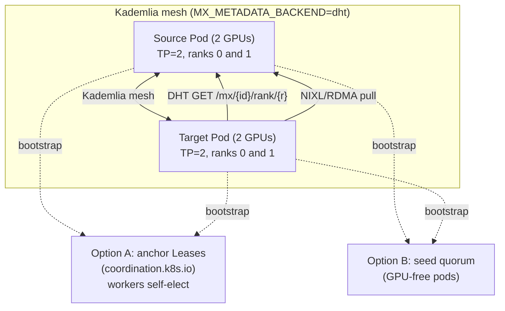

# DHT-Routed Sources Example

Concrete TP=2 manifests for deploying the `dht` metadata backend - workers discover each other over a libp2p Kademlia mesh, with no central server, no Redis, no CRDs, and no Kubernetes Service in the data path. Each worker publishes a rank-keyed pointer to itself into the DHT and resolves peers with a single content-addressed lookup.

For design rationale, backend-selection guidance, and trade-offs, see [`docs/DHT_BACKEND.md`](../../docs/DHT_BACKEND.md). For the generic deployment how-to (env vars, kubectl operations), see [`docs/DEPLOYMENT.md`](../../docs/DEPLOYMENT.md#p2p-gpu-weight-transfers).

The DHT backend is **serverless**: there is no central `modelexpress-server` in the path. A joining node still needs at least one existing peer to find the rest of the mesh, so this example presents two ways to provide that pre-converged anchor set. Both avoid the cold-start stall where a large batch of workers boots simultaneously with no established peer to bootstrap against.

## Limitations

This backend is for **stable-weight inference only**. Weights loaded at pod startup don't change for the lifetime of the pod, and each rank has exactly one publisher (one-publisher-per-(source, rank)). If your workload is RL rollouts, live fine-tune broadcasts, mixed-revision serving under load, or anything needing per-worker addressability, use the central-coordinator backends (`redis` or `kubernetes`) instead. Full details in [`DHT_BACKEND.md`](../../docs/DHT_BACKEND.md#limitations).

## Two bootstrap options

Both options give the mesh a pre-converged anchor set. The difference is a single tradeoff axis: **RBAC vs pods.**

| Option | Extra pods | RBAC | Downward API | Best when |
|--------|-----------|------|--------------|-----------|
| A - K8s Leases | None | Workers need get/list/watch/create/update/patch on `coordination.k8s.io` Leases | `POD_IP` from the downward API | You would rather grant a narrow RBAC role than run standing pods. |
| B - Seed quorum | A few GPU-free seed pods | None | None | You would rather run a few cheap pods than grant Lease RBAC. |

- **Option A (self-organizing Leases):** the anchor quorum self-elects over `coordination.k8s.io` Leases named with the `MX_DHT_BOOTSTRAP_LEASES` prefix. There are no dedicated anchor pods - the workers themselves take the anchor Leases, and whichever hold them publish their `POD_IP` for joiners to dial. The cost is that the workers need get/update RBAC on Leases plus `POD_IP` from the downward API.
- **Option B (dedicated seed quorum):** a handful of long-lived, GPU-free seed pods join the mesh as participation-only bootstrap peers (they publish no records of their own). The cost is running those seed pods; the benefit is that no RBAC is required on the workers.

Common to both: bootstrap is the only difference. The DHT env on every worker is identical (`MX_METADATA_BACKEND=dht`, `MX_DHT_LISTEN=0.0.0.0:4001`, and the P2P data-path ports). One publisher per (source, rank). Replication factor `K` defaults to a floor of 20, the recommended Kademlia bucket size; leave it unless you have a measured reason to change it (see [`DHT_BACKEND.md`](../../docs/DHT_BACKEND.md#replication-factor-k)).

## Files

Option A (top level):

- [`sources-tp2.yaml`](sources-tp2.yaml) - TP=2 source Deployment (one pod, two GPUs, `--tensor-parallel-size=2`) with the Lease bootstrap env and `serviceAccountName: mx-dht`.
- [`target.yaml`](target.yaml) - TP=2 target Deployment with the identical Lease bootstrap.
- [`lease-rbac.yaml`](lease-rbac.yaml) - `ServiceAccount` `mx-dht`, a `Role` granting Lease verbs, and the `RoleBinding`.

Option B (`seeds/`):

- [`seeds/seed-quorum.yaml`](seeds/seed-quorum.yaml) - headless Service `mx-dht-seed` plus a 3-replica seed Deployment (GPU-free, pure networking).
- [`seeds/sources-tp2.yaml`](seeds/sources-tp2.yaml) - TP=2 source Deployment bootstrapping against the seed quorum.
- [`seeds/target.yaml`](seeds/target.yaml) - TP=2 target Deployment with the same seed bootstrap.

## Architecture



Pick one bootstrap path (A or B), not both. The source publishes a rank-keyed pointer per rank; the target resolves the matching rank with one keyspace GET, calls `GetTensorManifest` against the resolved endpoint, validates `mx_source_id` and rank on the response, then pulls weights over NIXL. There is no central process and no Service in the data path.

## Prerequisites

1. Kubernetes cluster with GPU nodes. The YAMLs request `rdma/shared_ib` resources for InfiniBand/RoCE - the fast path and the configuration production should run on. Without RDMA, UCX/NIXL falls back to plain TCP at significant throughput cost; drop the `rdma/shared_ib` resource requests from the manifests to run without it.
2. A path for weights to reach the source pod. Any of: pre-downloaded to a shared PVC, streamed from S3 (set `MX_S3_URI`), or downloaded from HuggingFace at pod startup. For the HuggingFace option, create the token secret with `kubectl create secret generic hf-token-secret --from-literal=HF_TOKEN=<token>`.
3. A model revision you trust, pinned identically on sources and targets. Set `MX_MODEL_REVISION=<commit_sha>` (or `model_config.revision` in vLLM) so `mx_source_id` is content-addressed; a target only resolves the source whose identity matches its own, so a revision mismatch means the GET finds no key.

## Deploying

### Option A - self-organizing Leases

`lease-rbac.yaml` uses `${NAMESPACE}` in the RoleBinding subject; substitute it with `envsubst` before applying.

```bash
# 1. Lease RBAC (ServiceAccount + Role + RoleBinding).
NAMESPACE=<your-ns> envsubst < lease-rbac.yaml | kubectl apply -n <your-ns> -f -

# 2. TP=2 source. Wait for it to finish loading.
kubectl apply -f sources-tp2.yaml
kubectl wait --for=condition=Ready pod -l app=mx-dht,role=source --timeout=15m

# 3. Targets join the mesh and pull from the source.
kubectl apply -f target.yaml
kubectl wait --for=condition=Ready pod -l app=mx-dht,role=target --timeout=15m
```

### Option B - dedicated seed quorum

The seed manifests use `${NAMESPACE}` in `MX_DHT_BOOTSTRAP_DNS`; substitute it with `envsubst` before applying.

```bash
# 1. Seed quorum. Let the seeds converge among themselves before workers join.
NAMESPACE=<your-ns> envsubst < seeds/seed-quorum.yaml | kubectl apply -n <your-ns> -f -
kubectl wait --for=condition=Available deployment/mx-dht-seed --timeout=5m

# 2. TP=2 source. Wait for it to finish loading.
NAMESPACE=<your-ns> envsubst < seeds/sources-tp2.yaml | kubectl apply -n <your-ns> -f -
kubectl wait --for=condition=Ready pod -l app=mx-dht,role=source --timeout=15m

# 3. Targets join the mesh and pull from the source.
NAMESPACE=<your-ns> envsubst < seeds/target.yaml | kubectl apply -n <your-ns> -f -
kubectl wait --for=condition=Ready pod -l app=mx-dht,role=target --timeout=15m
```

Outside Kubernetes the bootstrap source changes but the worker configuration does not: under Slurm, set `MX_DHT_BOOTSTRAP_SLURM` (or rely on the auto-detected `SLURM_JOB_NODELIST`); on bare metal, list peer multiaddrs in `MX_DHT_BOOTSTRAP_PEERS`.

## Environment variables

| Variable                     | Default               | Meaning                                                                                                  |
|------------------------------|-----------------------|----------------------------------------------------------------------------------------------------------|
| `MX_METADATA_BACKEND`        | `""` (central server) | Set to `dht` (alias `kademlia`) to enable this backend.                                                   |
| `MX_DHT_LISTEN`              | client `0.0.0.0:0`    | `host:port` the node listens on for DHT participation.                                                    |
| `MX_DHT_BOOTSTRAP_LEASES`    | (none)                | Option A: anchor Lease name-prefix. The quorum self-elects over Leases with this prefix.                  |
| `MX_DHT_BOOTSTRAP_DNS`       | (none)                | Option B: headless Service DNS resolving to seed IPs; each is dialed at `MX_DHT_BOOTSTRAP_PORT`.          |
| `MX_DHT_BOOTSTRAP_PEERS`     | (none)                | Comma-separated libp2p multiaddrs to dial for initial peers (bare-metal bootstrap).                      |
| `MX_DHT_BOOTSTRAP_SLURM`     | `SLURM_JOB_NODELIST`  | Slurm hostlist to expand and dial; auto-detected from the Slurm environment when unset.                 |
| `MX_DHT_BOOTSTRAP_PORT`      | `4001`                | Port at which DNS- and Slurm-resolved peers are dialed.                                                  |
| `MX_DHT_RECORD_TTL`          | `86400` (24h)         | Record republish interval / TTL in seconds; published pointers refresh on this cadence to survive churn. |
| `MX_DHT_GET_RETRIES`         | `5`                   | GET retries before a lookup is declared failed. Tune up for large cold-start fan-in.                     |
| `MX_DHT_GET_BACKOFF_SECONDS` | `0.5`                 | Delay between GET retries, in seconds.                                                                   |
| `MX_MODEL_REVISION`          | (from vLLM config)    | Override for `SourceIdentity.revision`. Pin so `mx_source_id` is content-addressed.                      |
| `MX_WORKER_GRPC_PORT`        | `6555`                | Base port for the WorkerGrpcServer (bound port is this + `device_id`).                                   |
