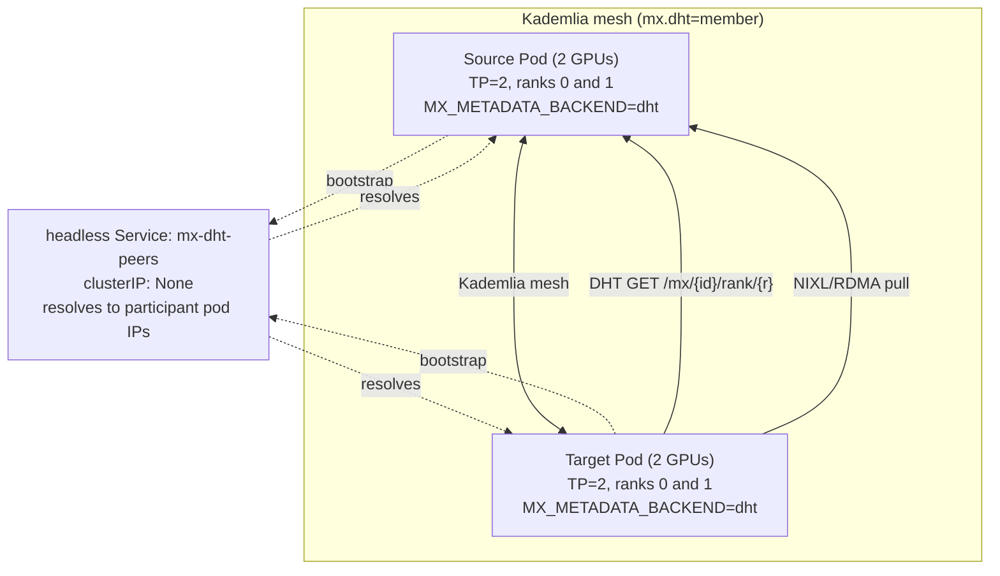

# DHT-Routed Sources Example

Concrete TP=2 manifests for deploying the `dht` metadata backend - workers discover each other over a libp2p Kademlia mesh, with no central server, no Redis, no CRDs, and no Kubernetes Service in the data path. Each worker publishes a rank-keyed pointer to itself into the DHT and resolves peers with a single content-addressed lookup.

For design rationale, backend-selection guidance, and trade-offs, see [`docs/DHT_BACKEND.md`](../../docs/DHT_BACKEND.md). For the generic deployment how-to (env vars, kubectl operations), see [`docs/DEPLOYMENT.md`](../../docs/DEPLOYMENT.md#p2p-gpu-weight-transfers).

## Limitations

This backend is for **stable-weight inference only**. Weights loaded at pod startup don't change for the lifetime of the pod, and each rank has exactly one publisher. If your workload is RL rollouts, live fine-tune broadcasts, mixed-revision serving under load, or anything needing per-worker addressability, use the central-coordinator backends (`redis` or `kubernetes`) instead. Full details in [`DHT_BACKEND.md`](../../docs/DHT_BACKEND.md#limitations).

## Files

- [`sources-tp2.yaml`](sources-tp2.yaml) - A headless Service that anchors worker-to-worker bootstrap, plus a TP=2 source Deployment (one pod, two GPUs, `--tensor-parallel-size=2`). The pod's two ranks publish `/mx/{mx_source_id}/rank/0` and `/mx/{mx_source_id}/rank/1` into the mesh.
- [`target.yaml`](target.yaml) - A TP=2 target Deployment that joins the same mesh, resolves the publisher for each rank with a DHT GET, and pulls weights over NIXL.

## How bootstrap works (no central infrastructure)

A joining node needs at least one existing peer to find the rest of the mesh. This example bootstraps **worker-to-worker**: the headless Service `mx-dht-peers` (`clusterIP: None`) selects every DHT participant pod by the shared `mx.dht=member` label, so its DNS name resolves to the participant pod IPs. Each worker points `MX_DHT_BOOTSTRAP_DNS` at that name and dials the resolved peers at `MX_DHT_BOOTSTRAP_PORT`. `publishNotReadyAddresses: true` makes pods discoverable to each other during the (long) weight-load window, before vLLM reports ready - the libp2p swarm binds at process start, well ahead of weights finishing.

No `modelexpress-server`, Redis, or CRDs are involved. The headless Service carries no data-plane traffic; it exists purely as a name a joining node can resolve to find peers.

> **Optional stable anchor.** If you already run a `modelexpress-server` (with its own `redis`/`kubernetes` backend) for other reasons, set `MX_DHT_LISTEN` on it and it will join the same mesh as a long-lived, participation-only bootstrap peer (it publishes no records of its own). There is no standalone seed binary - a dedicated anchor is a full server carrying its own backend, so it is only worth running when you already have one. For a pure `dht` deployment, the worker-to-worker bootstrap above needs nothing extra.

## Architecture



The source publishes a rank-keyed pointer per rank; the target resolves the matching rank with one keyspace GET, calls `GetTensorManifest` against the resolved endpoint, validates `mx_source_id` and rank on the response, then pulls weights over NIXL. There is no central process and no Service in the path.

## Prerequisites

1. Kubernetes cluster with GPU nodes. The YAMLs request `rdma/shared_ib` resources for InfiniBand/RoCE - the fast path and the configuration production should run on. Without RDMA, UCX/NIXL falls back to plain TCP at significant throughput cost; drop the `rdma/shared_ib` resource requests from the manifests to run without it.
2. A path for weights to reach the source pod. Any of: pre-downloaded to a shared PVC, streamed from S3 (set `MX_S3_URI`), or downloaded from HuggingFace at pod startup. For the HuggingFace option, create the token secret with `kubectl create secret generic hf-token-secret --from-literal=HF_TOKEN=<token>`.
3. A model revision you trust, pinned identically on sources and targets. Set `MX_MODEL_REVISION=<commit_sha>` (or `model_config.revision` in vLLM) so `mx_source_id` is content-addressed; a target only resolves the source whose identity matches its own, so a revision mismatch means the GET finds no key.

## Deploying

```bash
# Headless Service + TP=2 source. Wait for the source to finish loading.
kubectl apply -f sources-tp2.yaml
kubectl wait --for=condition=Ready pod -l app=mx-dht,role=source --timeout=15m

# Targets join the mesh and pull from the source.
kubectl apply -f target.yaml
kubectl wait --for=condition=Ready pod -l app=mx-dht,role=target --timeout=15m
```

Outside Kubernetes the bootstrap source changes but the worker configuration does not: under Slurm, set `MX_DHT_BOOTSTRAP_SLURM` (or rely on the auto-detected `SLURM_JOB_NODELIST`); on bare metal, list peer multiaddrs in `MX_DHT_BOOTSTRAP_PEERS`.

## Environment variables

| Variable                     | Default               | Meaning                                                                                                  |
|------------------------------|-----------------------|----------------------------------------------------------------------------------------------------------|
| `MX_METADATA_BACKEND`        | `""` (central server) | Set to `dht` (alias `kademlia`) to enable this backend.                                                   |
| `MX_DHT_LISTEN`              | client `0.0.0.0:0`    | `host:port` the node listens on for DHT participation.                                                    |
| `MX_DHT_BOOTSTRAP_DNS`       | (none)                | Headless Service DNS resolving to peer IPs; each is dialed at `MX_DHT_BOOTSTRAP_PORT`.                    |
| `MX_DHT_BOOTSTRAP_PEERS`     | (none)                | Comma-separated libp2p multiaddrs to dial for initial peers (bare-metal bootstrap).                      |
| `MX_DHT_BOOTSTRAP_SLURM`     | `SLURM_JOB_NODELIST`  | Slurm hostlist to expand and dial; auto-detected from the Slurm environment when unset.                 |
| `MX_DHT_BOOTSTRAP_PORT`      | `4001`                | Port at which DNS- and Slurm-resolved peers are dialed.                                                  |
| `MX_DHT_RECORD_TTL`          | `86400` (24h)         | Record republish interval / TTL in seconds; published pointers refresh on this cadence to survive churn. |
| `MX_DHT_GET_RETRIES`         | `5`                   | GET retries before a lookup is declared failed. Tune up for large cold-start fan-in.                     |
| `MX_DHT_GET_BACKOFF_SECONDS` | `0.5`                 | Delay between GET retries, in seconds.                                                                   |
| `MX_MODEL_REVISION`          | (from vLLM config)    | Override for `SourceIdentity.revision`. Pin so `mx_source_id` is content-addressed.                      |
| `MX_WORKER_GRPC_PORT`        | `6555`                | Base port for the WorkerGrpcServer (bound port is this + `device_id`).                                   |

Replication factor `K` defaults to 20, the recommended Kademlia bucket size. Leave it at the default unless you have a measured reason to change it; see [`DHT_BACKEND.md`](../../docs/DHT_BACKEND.md#replication-factor-k).
