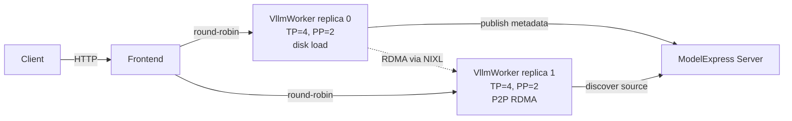

# Dynamo P2P Weight Transfer Example

Deploys ModelExpress P2P RDMA weight transfer using [NVIDIA Dynamo](https://github.com/ai-dynamo/dynamo) DynamoGraphDeployment on Kubernetes.

## Architecture



- **ModelExpress**: P2P metadata server (kubernetes CRD backend). Manages source discovery, heartbeats, and stale reaping.
- **Frontend**: Dynamo HTTP frontend, routes requests to worker replicas via round-robin.
- **VllmWorker**: Multi-node vLLM workers (TP=4, PP=2 per replica). First replica loads from disk, subsequent replicas receive weights via RDMA.

## Prerequisites

1. **Dynamo operator** installed (DynamoGraphDeployment CRD)
2. **ModelExpress CRDs** installed (one-time, requires cluster-admin):
   ```bash
   kubectl apply -f examples/crds.yaml
   ```
   Installs `ModelMetadata` (P2P worker coordination) and `ModelCacheEntry` (model-download
   registry) in one pass.
3. **PVC** with model weights pre-downloaded (`shared-model-cache`)
4. **HuggingFace token secret**: `kubectl create secret generic hf-token-secret --from-literal=HF_TOKEN=<token>`

Note: RBAC (ServiceAccount, Role, RoleBinding) is included in the aggregated YAML and applied automatically.

## Building the Image

Option A: Layer MX client on dynamo runtime (fast, for dev iteration):

```bash
docker build --platform linux/amd64 \
  -f examples/dynamo_p2p_transfer_k8s/Dockerfile \
  -t <your-registry>/mx-vllm-runtime:<tag> .
```

Option B: Build from dynamo repo with MX integrated (recommended for CI):

```bash
cd path/to/dynamo
python container/render.py --framework vllm --target runtime \
    --platform amd64 --cuda-version 12.9 --show-result
docker build --platform linux/amd64 \
    -f container/vllm-runtime-cuda12.9-amd64-rendered.Dockerfile \
    --build-arg ENABLE_MODELEXPRESS_P2P=true \
    --build-arg MODELEXPRESS_REF=main \
    -t <your-registry>/mx-vllm-runtime:<tag> .
```

## Usage

1. Update image tags in `vllm/vllm-multi-node-aggregated.yaml` (search for `# REPLACE`)

2. Apply CRDs, RBAC, and DGD:
   ```bash
   kubectl apply -f ../crds.yaml                           # one-time, cluster-admin
   kubectl apply -f vllm/rbac-modelmetadata.yaml -n <namespace>
   kubectl apply -f vllm/vllm-multi-node-aggregated.yaml -n <namespace>
   ```

3. Wait for DGD to become READY:
   ```bash
   kubectl get dgd mx-vllm -n <namespace> -w
   ```

4. Scale to 2 replicas for P2P transfer:
   ```bash
   # Edit replicas in the YAML and re-apply, or:
   kubectl patch dgd mx-vllm -n <namespace> --type merge \
     -p '{"spec":{"services":{"VllmWorker":{"replicas":2}}}}'
   ```

5. Verify P2P transfer in target worker logs:
   ```bash
   kubectl logs -n <namespace> <target-leader-pod> | grep "Transfer complete"
   ```

## Cluster-Specific Configuration

- **UCX_NET_DEVICES**: Commented out by default. Uncomment and set to your cluster's IB HCA devices if UCX auto-detection picks wrong devices.
- **Tolerations**: Not included. Add under `extraPodSpec.tolerations` if your GPU nodes have taints.
- **PVC name**: Default `shared-model-cache`. Change in `spec.pvcs` and `volumeMounts`.

## Debugging

Set `MODEL_EXPRESS_LOG_LEVEL=DEBUG` in VllmWorker envs to see:
- Per-tensor checksums during registration
- Each adopted hidden tensor with source object type
- Detailed RDMA transfer logging
