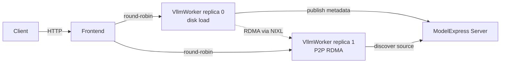
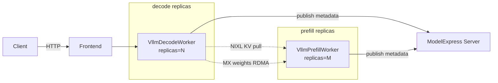

# Dynamo P2P Weight Transfer Example

Deploys [ModelExpress](https://github.com/ai-dynamo/modelexpress) P2P RDMA weight transfer on top of [NVIDIA Dynamo](https://github.com/ai-dynamo/dynamo) using the `DynamoGraphDeployment` custom resource on Kubernetes.

New worker replicas pull model weights over RDMA from other running replicas instead of loading from disk or object storage — dramatically cutting warm-up time when scaling out large models.

## Deployment Variants

| YAML | Topology | Description |
|---|---|---|
| [`vllm/vllm-multi-node-aggregated.yaml`](vllm/vllm-multi-node-aggregated.yaml) | Multi-node, TP=4 PP=2 per replica | Single `VllmWorker` service running both prefill and decode. Use for large models that don't fit on a single node. |
| [`vllm/vllm-single-node-disaggregated.yaml`](vllm/vllm-single-node-disaggregated.yaml) | Single-node, TP=4 PP=1 per replica | Separate `VllmPrefillWorker` and `VllmDecodeWorker` services with NIXL KV transfer between them. |

## Architecture — aggregated



## Architecture — disaggregated



- **ModelExpress server** (Kubernetes CRD backend): tracks which workers have the model Ready, handles heartbeats, and reaps stale entries. Decode and prefill publish under the same `source_id` (derived from model identity), so any worker of either service can serve as an RDMA source for any other worker of either service.
- **Frontend**: Dynamo's HTTP entry point; routes to decode workers round-robin.
- **Workers**: `--load-format mx` means the first replica loads from disk and publishes metadata; every subsequent replica receives weights from a Ready source over RDMA.

## Prerequisites

1. **Dynamo operator** installed (provides the `DynamoGraphDeployment` CRD).
2. **ModelMetadata CRD** installed — one-time, cluster-admin:
   ```bash
   kubectl apply -f vllm/crd-modelmetadata.yaml
   ```
3. **RBAC** for the ModelExpress server to manage ModelMetadata CRs:
   ```bash
   kubectl apply -f vllm/rbac-modelmetadata.yaml -n <namespace>
   ```
4. **PVC** with the model weights pre-downloaded (the YAMLs expect a PVC named `shared-model-cache`; change `spec.pvcs` and `volumeMounts` to match your setup).
5. **HuggingFace token** for gated models:
   ```bash
   kubectl create secret generic hf-token-secret \
     --from-literal=HF_TOKEN=<your-token> -n <namespace>
   ```

## Building the Image

**Option A — Layer the ModelExpress client on top of the official Dynamo runtime** (fast, good for iteration):

```bash
docker build --platform linux/amd64 \
  -f examples/dynamo_p2p_transfer_k8s/Dockerfile \
  -t <your-registry>/mx-vllm-runtime:<tag> .
```

Uses the public `nvcr.io/nvidia/ai-dynamo/vllm-runtime` base and adds the ModelExpress Python client. Builds in a couple of minutes.

**Option B — Rebuild from the Dynamo repo with ModelExpress integrated** (slower; needed if you want a newer vLLM than the base image ships with):

```bash
git clone https://github.com/ai-dynamo/dynamo && cd dynamo
python container/render.py --framework vllm --target runtime \
    --platform amd64 --cuda-version 12.9 --output-short-filename
docker build --platform linux/amd64 \
  -f container/rendered.Dockerfile \
  --build-arg VLLM_REF=<vllm-tag-or-commit> \
  --build-arg ENABLE_MODELEXPRESS_P2P=true \
  --build-arg MODELEXPRESS_REF=main \
  -t <your-registry>/mx-vllm-runtime:<tag> .
```

Recompiles vLLM from source and installs the ModelExpress client directly from GitHub. The build is memory-heavy — plan for a host with several tens of GB of RAM and expect a long first build.

Either way, push the resulting image to a registry reachable from your Kubernetes cluster.

## Usage

### Aggregated

1. Replace the image placeholder (`<your-registry>/modelexpress-vllm-runtime:latest`) in [`vllm/vllm-multi-node-aggregated.yaml`](vllm/vllm-multi-node-aggregated.yaml) with your pushed tag.
2. Apply:
   ```bash
   kubectl apply -f vllm/crd-modelmetadata.yaml
   kubectl apply -f vllm/rbac-modelmetadata.yaml -n <namespace>
   kubectl apply -f vllm/vllm-multi-node-aggregated.yaml -n <namespace>
   ```
3. Once the DGD is Ready, scale to validate P2P transfer:
   ```bash
   kubectl patch dgd mx-vllm -n <namespace> --type merge \
     -p '{"spec":{"services":{"VllmWorker":{"replicas":2}}}}'
   ```
4. Confirm P2P in the new replica's logs:
   ```bash
   kubectl logs -n <namespace> <new-worker-leader-pod> -c main | grep "Transfer complete"
   ```

### Disaggregated (single-node)

1. Replace image placeholders in [`vllm/vllm-single-node-disaggregated.yaml`](vllm/vllm-single-node-disaggregated.yaml).
2. Apply the same CRD + RBAC from above, then:
   ```bash
   kubectl apply -f vllm/vllm-single-node-disaggregated.yaml -n <namespace>
   ```
3. Scale either service (or both) to validate that new replicas pull weights via RDMA:
   ```bash
   kubectl patch dgd mx-vllm-disagg-sn -n <namespace> --type merge \
     -p '{"spec":{"services":{"VllmDecodeWorker":{"replicas":2}}}}'
   ```
4. Send a request to confirm end-to-end inference through the prefill→decode KV transfer:
   ```bash
   kubectl run curl-test --rm -i --image=curlimages/curl:8.9.1 \
     --restart=Never -n <namespace> -- \
     curl -sS http://mx-vllm-disagg-sn-frontend:8000/v1/chat/completions \
       -H "Content-Type: application/json" \
       -d '{"model":"<your-model>","messages":[{"role":"user","content":"hi"}],"max_tokens":20}'
   ```

## Debugging

Set `MODEL_EXPRESS_LOG_LEVEL=DEBUG` in the worker env to get:
- Per-tensor checksums during NIXL registration
- Per-adopted hidden tensor details (source object, shape, dtype)
- Verbose RDMA transfer logs

Useful grep patterns on the worker pod:

```bash
# Confirm weights were transferred over RDMA (not loaded from disk)
kubectl logs -n <namespace> <pod> -c main | grep "Transfer complete"

# Confirm ModelExpress discovered post-processing tensors during load
kubectl logs -n <namespace> <pod> -c main | grep "Adopted .* hidden"

# vLLM's disagg KV-transfer metrics on the decode side
kubectl logs -n <namespace> <decode-pod> -c main | grep -E "KV Transfer metrics|prefix cache"
```
