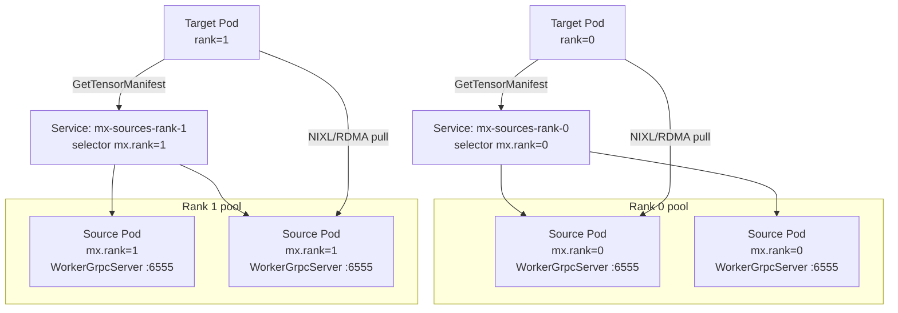

# K8s-Service-Routed Sources Example

This example demonstrates ModelExpress with the `k8s-service` metadata backend: no central coordinator, no substrate advertisement, peer discovery handled entirely by Kubernetes Services. Source pods expose their `WorkerService` gRPC server behind a Service (one per tensor-parallel rank), kube-proxy load-balances across ready backends, and clients open a direct gRPC channel to the Service DNS name to fetch tensor manifests.

For the broader deployment guide and full env var reference, see [`docs/DEPLOYMENT.md`](../../docs/DEPLOYMENT.md). For the metadata backend landscape, see [`docs/ARCHITECTURE.md`](../../docs/ARCHITECTURE.md).

## Architecture



The Service's Endpoints object is the source list, maintained by Kubernetes based on pod readiness. There is no `modelexpress-server` in this topology; `mx_source_id` is computed client-side and validated on the `GetTensorManifest` response.

## Trade-offs vs other backends

| Backend                | Coordinator     | Discovery       | Setup complexity | Heterogeneous fleet |
|------------------------|-----------------|-----------------|------------------|---------------------|
| `redis` / `kubernetes` | Central server  | CRDs or Redis   | Medium           | Yes                 |
| `k8s-service`          | None            | K8s Service     | Low              | No (homogeneous)    |

`k8s-service` is the simplest backend to deploy, but it assumes every pod behind a given Service serves identical weights. Use the `revision` field on `SourceIdentity` (populated from `model_config.revision` or `MX_MODEL_REVISION`) to catch accidental version skew during rolling updates: the `GetTensorManifest` handshake returns `FAILED_PRECONDITION` on mismatch and the client retries on a fresh channel so kube-proxy re-picks a backend.

## Rank and pod topology

ModelExpress's NIXL transfers are rank-matched: a target at rank R must pull from a source at rank R. The K8s-Service backend exposes this by having one Service per rank, with label selectors pinning to pods that hold that rank.

Two deployment shapes work, and the client code is identical for both - the difference lives entirely in the K8s Service/Deployment manifests.

**Shape 1: 1-GPU-per-pod, N pods per TP group.** Each pod holds exactly one rank. The pod is labeled `mx.rank=R` and the per-rank Service selector matches on that label. Each pod binds port 6555 (its device_id is 0 inside that pod). Targets at rank R hit `mx-sources-rank-R:6555` and kube-proxy routes them to one of the replica pods labeled `mx.rank=R`. TP communication across ranks requires cross-pod NCCL (over IB/Ethernet).

**Shape 2: multi-GPU-per-pod, N GPUs in one pod.** Each pod has N GPUs and runs N worker processes internally (vLLM spawns them with `--tensor-parallel-size=N`). Each worker binds its own `WorkerGrpcServer` on `MX_WORKER_GRPC_PORT + device_id`, so a TP=2 pod listens on 6555 (rank 0) and 6556 (rank 1). TP communication happens over NVLink inside the pod, which is usually faster for latency-sensitive inference - and is in fact the only shape that works for heavy TP, since NVLink is intra-node-only.

The two shapes diverge on the Service side. Shape 1 needs per-rank Services to partition pods by rank label (selectors are Service-wide, so no way around N Services). Shape 2 every pod has every rank, so the rank dimension moves into the *port*: ONE Service with N named ports, each external port maps to the matching in-pod port:

```yaml
# Shape 2: one Service, N named ports.
kind: Service
metadata: { name: mx-sources }
spec:
  selector: { app: mx-sources }
  ports:
    - { name: rank-0, port: 6555, targetPort: 6555 }
    - { name: rank-1, port: 6556, targetPort: 6556 }
```

**Client-side pattern rule:** `MX_K8S_SERVICE_PATTERN` with an explicit `:port` is used verbatim (Shape 1). A pattern without a port is treated as a bare hostname and the client auto-appends `:{MX_WORKER_GRPC_PORT + rank}` (Shape 2). So:

- Shape 1: `MX_K8S_SERVICE_PATTERN=mx-sources-rank-{rank}:6555` - rank in hostname, port literal.
- Shape 2: `MX_K8S_SERVICE_PATTERN=mx-sources` (also the default) - rank baked into the auto-computed port.

Shape 1 is the K8s-native pattern if you want per-rank autoscaling or are working with cross-pod setups where TP isn't involved. Shape 2 is what perf-focused TP inference deployments land on because of the NVLink requirement, and it's a strictly smaller manifest (one Service, not N). Pick based on your parallelism topology, not on how the backend works.

## Files

- [`sources-tp2.yaml`](sources-tp2.yaml) - TP=2 source pool in the **1-GPU-per-pod** shape (Shape 1 above). Two Deployments (one per rank) with rank-labeled pods, two Services selecting by `mx.rank`, two replicas per rank.
- [`sources-tp2-single-pod.yaml`](sources-tp2-single-pod.yaml) - TP=2 source pool in the **multi-GPU-per-pod** shape (Shape 2 above). One Deployment with 2-GPU pods, ONE Service named `mx-sources` with two named ports (`rank-0: 6555`, `rank-1: 6556`). Client pattern is the default `mx-sources` (bare hostname); the client auto-computes the port from rank.
- [`target.yaml`](target.yaml) - A target vLLM pod that pulls weights via the K8s-service backend. Works against either source topology (the client sees the same Service DNS regardless).

Scale the pattern to TP=N by adding N rank Deployments and N Services.

## Multi-model clusters

Multiple models coexist by giving each model its own Service-name prefix and its own `MX_K8S_SERVICE_PATTERN`. The per-pod env var is the only per-model coordination needed; there is no global Service pool to share.

Example for running two distinct models side by side:

```yaml
# Model A source pods
env:
  - name: MX_METADATA_BACKEND
    value: "k8s-service"
  - name: MX_K8S_SERVICE_PATTERN
    value: "model-a-rank-{rank}:6555"
# Matching Services: model-a-rank-0, model-a-rank-1, ...

---
# Model B source pods
env:
  - name: MX_METADATA_BACKEND
    value: "k8s-service"
  - name: MX_K8S_SERVICE_PATTERN
    value: "model-b-rank-{rank}:6555"
# Matching Services: model-b-rank-0, model-b-rank-1, ...
```

Both Deployments run concurrently; model A's targets cannot accidentally reach model B's Services or vice versa because the DNS names are different. Each model's pool stays isolated as long as the pattern prefix doesn't collide.

## What's stable vs what drifts

**The design point to internalize: Service names are decoupled from `mx_source_id` on purpose.** The name is yours to pick and lives in Kubernetes's namespace; `mx_source_id` is internal to MX, computed cryptographically from model/dtype/quantization/TP/revision/mx_version/proto-schema fields. These two namespaces don't reconcile automatically - **the operator owns keeping them aligned** (picking Service names whose pod pool actually serves the identity your clients are asking for). The alignment cost is real, and it's the deliberate tradeoff we took to keep Service names stable across library upgrades: a Helm chart written today doesn't re-template when ModelExpress adds a `SourceIdentity` field or bumps a version.

**The handshake is the safety net.** If clients and sources disagree on identity - revision skew during a rolling update, a mistakenly-shared Service between two different models, anything - the `GetTensorManifest` call returns `FAILED_PRECONDITION` and the client retries up to `MX_K8S_SOURCE_RETRIES` times on fresh channels (letting kube-proxy pick a different backend each time). Misalignment fails loudly and gives you a retry budget; it never silently transfers wrong weights.

The coordination contract: the string `MX_K8S_SERVICE_PATTERN` substitutes `{rank}` into, character-for-character, has to match an actual Service `metadata.name` in the cluster. Stable and fragile points to know about:

**Stable (won't drift across MX upgrades):**

- Service names are deployer-chosen strings. They persist across ModelExpress releases, proto schema changes, and `SourceIdentity` field additions without edits.
- `{rank}` is the only substitution. Rank is a deployment-topology property, decided once when you pick a TP degree. No library-side changes affect it.
- The client's `MX_K8S_SERVICE_PATTERN` env var uses the same deployer-chosen prefix and the same `{rank}` substitution forever.

**Runtime drift (caught by handshake, not DNS):**

- `SourceIdentity` content differences between pods - for example, a rolling update where some pods are at revision v42 and some at v43. Both expose the same Service DNS name, but the `GetTensorManifest` handshake returns `FAILED_PRECONDITION` when a target lands on a mismatched revision. The client retries on a fresh channel up to `MX_K8S_SOURCE_RETRIES` attempts, giving kube-proxy a chance to route to a matching backend.
- `mx_version` bumps during rolling updates - same deal. Source_id changes because the identity hash includes `mx_version`, so pods at different MX versions hash to different source_ids. The handshake catches it, the retry loop walks the pool.

**Configuration drift (caught at deployer review time, not runtime):**

- A typo between `MX_K8S_SERVICE_PATTERN` and the Service `metadata.name`. The client will get connection-refused or NXDOMAIN. This is a Helm-review problem, not a runtime problem: the pattern is under deployer control, declared once, and doesn't depend on cryptographic agreement with anything else.

**Why we don't derive Service names from `mx_source_id`:** it isn't viable from a UX perspective. Every `mx_version` bump and every `SourceIdentity` schema change would silently invalidate all cluster Services, with no graceful degradation (the DNS layer hard-fails before the handshake even runs). Deployer-chosen names decouple Service naming from library versioning. See the [Service naming and identity drift](../../docs/ARCHITECTURE.md#k8s-service-service-naming-and-identity-drift) section in the architecture doc for the full analysis.

## Prerequisites

1. Kubernetes cluster with GPU nodes. The YAMLs request `rdma/shared_ib` resources for InfiniBand/RoCE - that is the fast path and the configuration production should run on. If RDMA isn't available, UCX/NIXL falls back to plain TCP transport at significant throughput cost; drop the `rdma/shared_ib` resource requests from the manifests and the transfers will still complete.
2. A path for weights to reach the pods. Any of: pre-downloaded to a shared PVC, streamed from S3 (set `MX_S3_URI`), or downloaded from HuggingFace at pod startup. For the HuggingFace option, create the token secret with `kubectl create secret generic hf-token-secret --from-literal=HF_TOKEN=<token>`.
3. A model revision you trust. Pin it via `MX_MODEL_REVISION=<commit_sha>` (or set `model_config.revision` in vLLM) so `mx_source_id` is content-addressed.

## Deploying

```bash
# Source pool (rank 0 and rank 1 Deployments + Services).
kubectl apply -f sources-tp2.yaml

# Wait for sources to be Ready - readiness probe fires once weights are
# loaded and the WorkerGrpcServer is listening.
kubectl wait --for=condition=Ready pod -l app=mx-sources --timeout=15m

# Target pool. Each target pod discovers and pulls from the rank-matching
# Service automatically.
kubectl apply -f target.yaml
```

## Limitations

This backend is built for **stable-weight inference deployments**: the weights loaded at pod startup don't change for the lifetime of the pod. The Service-routing model enforces a homogeneity assumption on the backend pool (every ready pod serves the same `mx_source_id`), and the retry-on-mismatch loop exists to smooth over brief rolling-update windows, not to service continuously-shifting state.

**What does NOT work on this backend:**

- **RL-style live weight refits.** Training loops that produce a new checkpoint every step (or every N steps) and broadcast the update to all inference pods without a redeploy. The `WorkerGrpcServer` is bound to one `mx_source_id` at construction time; there is no way today for a running pod to swap its manifest in place and have readers transition cleanly.
- **Hot swap between different models.** Same reason - the source_id is fixed at pod startup, driven by the `SourceIdentity` captured before `load_model` runs.
- **Mixed-revision serving during anything longer than a brief rolling update.** If more than ~`MX_K8S_SOURCE_RETRIES` worth of transition has to be tolerated, the retry loop will exhaust before kube-proxy is likely to land the caller on a matching backend, and targets will start failing loads.
- **Any workload that needs to address an individual source worker by identity rather than pool membership.** The K8s Service selector is the granularity; there's no `worker_id`-level addressability through the gRPC call.

**Use the central-coordinator backends (`redis` or `kubernetes`) for any of the above.** The central store tracks each source worker's state individually, indexed by `worker_id`, and the target discovery RPCs (`ListSources` + `GetMetadata`) let a caller find and address a specific worker rather than picking at random from a pool. See [`docs/ARCHITECTURE.md`](../../docs/ARCHITECTURE.md#backend-choice-stable-weight-inference-vs-live-refit) for the deep explanation of why the addressability difference matters here, and [`docs/DEPLOYMENT.md`](../../docs/DEPLOYMENT.md#choosing-a-metadata-backend) for the workload-to-backend selection guide.

## Environment variables the client reads

| Variable                         | Default                         | Meaning                                                                       |
|----------------------------------|---------------------------------|-------------------------------------------------------------------------------|
| `MX_METADATA_BACKEND`            | `""` (central server)           | Set to `k8s-service` to enable this backend.                                   |
| `MX_K8S_SERVICE_PATTERN`         | `mx-sources`                    | DNS template. `{rank}` is substituted with the worker's own rank. If the pattern has no `:port`, the client auto-appends `:{MX_WORKER_GRPC_PORT + rank}`. |
| `MX_K8S_SOURCE_RETRIES`          | `5`                             | Max retries on `FAILED_PRECONDITION` before giving up.                         |
| `MX_K8S_SOURCE_BACKOFF_SECONDS`  | `0.5`                           | Sleep between retries (fresh channel per attempt).                             |
| `MX_MODEL_REVISION`              | unset                           | Override for `SourceIdentity.revision`. Useful for local / non-HF checkpoints. |
| `MX_P2P_METADATA`                | (auto-enabled)                  | This backend forces the P2P path on; this env var is ignored here. Only meaningful on central-coordinator backends. |
| `MX_WORKER_GRPC_PORT`            | `6555`                          | Base port for the WorkerGrpcServer (bound port is this + `device_id`).         |
