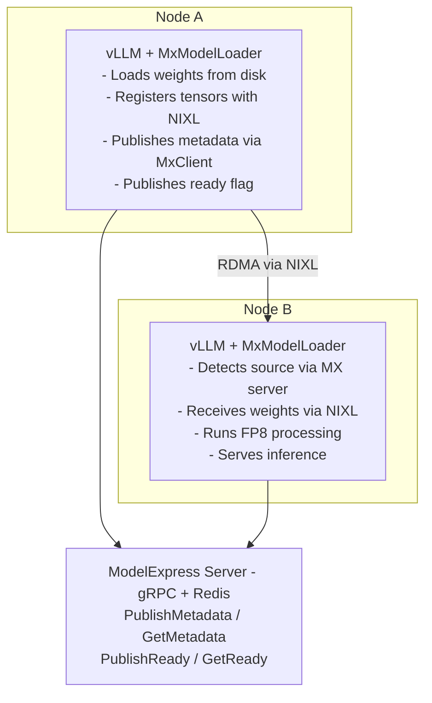

# P2P GPU Transfer Example

This example demonstrates how to set up ModelExpress for P2P GPU weight transfers between vLLM instances on Kubernetes. For the broader deployment guide and environment variable reference, see [`docs/DEPLOYMENT.md`](../../docs/DEPLOYMENT.md). For NIXL architecture details, see [`docs/ARCHITECTURE.md`](../../docs/ARCHITECTURE.md).

## Architecture



### Key Design Points

1. **Custom vLLM Loader**: NIXL transfer logic runs inside vLLM via `--load-format mx`
2. **MxClient**: All gRPC communication goes through `MxClient` (workers never access Redis directly)
3. **FP8 Support**: Raw tensors (including `weight_scale_inv`) transfer BEFORE FP8 processing
4. **Tensor Parallelism**: Full TP support with rank-matched transfers (one NIXL agent per GPU)

## Prerequisites

1. Kubernetes cluster with GPU nodes (H100/H200 recommended)
2. InfiniBand network between nodes for optimal performance
3. NVIDIA drivers and CUDA toolkit
4. Container images with NIXL and ZMQ support

## Deployment

### 1. Create HuggingFace Token Secret

```bash
kubectl create secret generic hf-token-secret --from-literal=HF_TOKEN=<your-token>
```

### 2. Deploy ModelExpress Server

```bash
kubectl apply -f deploy/modelexpress-server.yaml
```

### 3. Deploy vLLM Instances

Deploy identical instances - the first loads from disk, subsequent ones receive via RDMA:

```bash
kubectl apply -f deploy/vllm.yaml
# Scale up for more replicas
kubectl scale deployment/mx-vllm --replicas=2
```

The `mx` loader checks the MX server on startup. If a ready source exists, it receives via RDMA. Otherwise it loads from disk and becomes a source for future nodes.

## Environment Variables

### vLLM Container

| Variable | Description | Example |
|----------|-------------|---------|
| `MX_ZMQ_ADDRESS` | Base ZMQ address (rank appended) | `ipc:///tmp/mx/vllm.sock` |

With TP=4, this creates sockets: `/tmp/mx/vllm-0.sock`, `/tmp/mx/vllm-1.sock`, etc.

### ModelExpress Server

| Variable | Description | Default |
|----------|-------------|---------|
| `REDIS_URL` | Redis connection URL | `redis://localhost:6379` |

## Performance Expectations

| Model | Size | TP | Transfer Time | Throughput |
|-------|------|-----|---------------|------------|
| Llama 3.1 70B | ~140GB | 4 | ~4-5s | ~300 Gbps |
| Llama 3.1 405B | ~750GB | 8 | ~25s | ~300 Gbps |

## Troubleshooting

### Check ZMQ sockets are created

```bash
kubectl exec -it deployment/mx-vllm -c vllm -- ls -la /tmp/mx/
```

### Check client logs

```bash
kubectl logs deployment/mx-vllm -c client
```

### Check Redis connectivity

```bash
kubectl exec -it deployment/modelexpress-server -- redis-cli -h modelexpress-redis ping
```

### Verify InfiniBand is working

```bash
kubectl exec -it deployment/mx-vllm -c client -- ibstat
```

### Check UCX configuration

```bash
kubectl exec -it deployment/mx-vllm -c client -- ucx_info -d
```

## License

Apache-2.0
