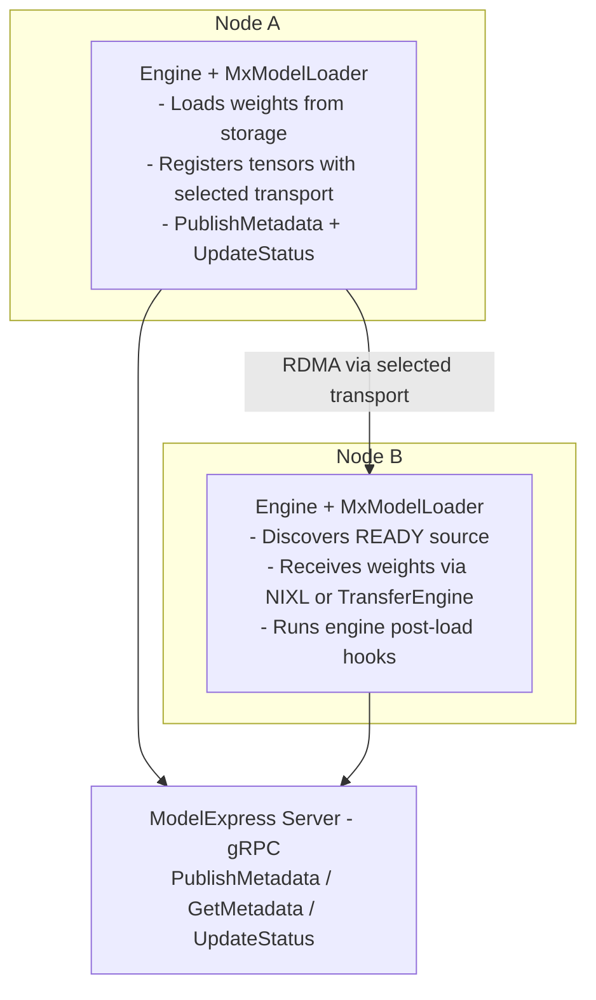

# Kubernetes P2P Weight Transfer Examples

This example demonstrates how to set up ModelExpress for P2P GPU weight transfers between inference engine replicas on Kubernetes. For the broader deployment guide and environment variable reference, see [`docs/DEPLOYMENT.md`](../../docs/DEPLOYMENT.md). For NIXL architecture details, see [`docs/ARCHITECTURE.md`](../../docs/ARCHITECTURE.md).

## Architecture


```mermaid
graph TD
    subgraph "Node A"
        A[Engine + MxModelLoader<br/>- Loads weights from storage<br/>- Registers tensors with selected transport<br/>- PublishMetadata + UpdateStatus]
    end
    subgraph "Node B"
        B[Engine + MxModelLoader<br/>- Discovers READY source<br/>- Receives weights via NIXL or TransferEngine<br/>- Runs engine post-load hooks]
    end
    A -- "RDMA via selected transport" --> B
    A --> S
    B --> S
    S[ModelExpress Server - gRPC<br/>PublishMetadata / GetMetadata / UpdateStatus]
```

### Key Design Points

1. **Engine loader integration**: vLLM uses `--load-format modelexpress`; `mx` is a backward-compatible alias. SGLang uses `remote_instance` with backend `modelexpress`.
2. **MxClient**: All gRPC communication goes through `MxClient` (workers never access Redis directly).
3. **Engine post-load hooks**: The ModelExpress adapter handles engine-specific post-load processing and tensor discovery.
4. **Tensor Parallelism**: Full TP support with rank-matched transfers. NIXL uses one agent per GPU; TransferEngine publishes one session per SGLang worker.

## Prerequisites

1. Kubernetes cluster with GPU nodes (H100/H200 recommended)
2. InfiniBand network between nodes for optimal performance
3. NVIDIA drivers and CUDA toolkit
4. Container images with NIXL and ZMQ support

## Deployment

### 1. Create HuggingFace Token Secret

```bash
kubectl create secret generic hf-token-secret --from-literal=HF_TOKEN=<your-token>
```

### 2. Choose a Metadata Backend and Deploy the Server

See [`server/`](server/) for backend-specific server manifests:
- **Redis**: [`server/redis_backend/`](server/redis_backend/)
- **Kubernetes CRD**: [`server/kubernetes_backend/`](server/kubernetes_backend/)

### 3. Deploy Clients

See [`client/`](client/) for engine deployment manifests:
- **Single-node** (TP only): [`client/vllm/vllm-single-node.yaml`](client/vllm/vllm-single-node.yaml)
- **Multi-node** (TP + PP): [`client/vllm/vllm-multi-node.yaml`](client/vllm/vllm-multi-node.yaml)
- **SGLang single-node NIXL**: [`client/sglang/sglang-single-node-p2p.yaml`](client/sglang/sglang-single-node-p2p.yaml)
- **SGLang single-node Mooncake TransferEngine**: [`client/sglang/sglang-single-node-transfer-engine.yaml`](client/sglang/sglang-single-node-transfer-engine.yaml)

The ModelExpress loader checks the MX server on startup. If a ready source exists, it receives via RDMA. Otherwise it loads from storage and becomes a source for future nodes.

For SGLang, `lmsysorg/sglang:v0.5.13.post1` is the known-good release image
with the upstream ModelExpress delegation hook.

For ModelStreamer-only startup examples that stream weights from Azure Blob Storage, S3, or a local PVC, see [`../model_streamer_k8s/`](../model_streamer_k8s/).

## Environment Variables

### Client Container

| Variable | Description | Example |
|----------|-------------|---------|
| `MX_SERVER_ADDRESS` | ModelExpress server address used by the engine integration (recommended). `MODEL_EXPRESS_URL` is deprecated and pending removal; keep it only for legacy paths that have not switched to `MX_SERVER_ADDRESS`. | `modelexpress-server:8001` |
| `MX_RDMA_NIC_PIN` | Per-rank NIC pinning for RDMA-capable deployments | `auto` |

### ModelExpress Server

| Variable | Description | Default |
|----------|-------------|---------|
| `MX_METADATA_BACKEND` | Backend type: `redis` or `kubernetes` | (required) |
| `REDIS_URL` | Redis connection URL (redis backend) | `redis://localhost:6379` |

## Performance Expectations

| Model | Size | TP | Transfer Time | Throughput |
|-------|------|-----|---------------|------------|
| Llama 3.1 70B | ~140GB | 4 | ~4-5s | ~300 Gbps |
| Llama 3.1 405B | ~750GB | 8 | ~25s | ~300 Gbps |

## Troubleshooting

### Check ZMQ sockets are created

```bash
kubectl exec -it deployment/mx-vllm -c vllm -- ls -la /tmp/mx/
```

### Check vLLM logs

```bash
kubectl logs deployment/mx-vllm -c vllm
```

### Check Redis connectivity (Redis backend)

```bash
kubectl exec -it deployment/modelexpress-server -c redis -- redis-cli ping
```

### Verify InfiniBand is working

```bash
kubectl exec -it deployment/mx-vllm -c vllm -- ibstat
```

### Check UCX configuration

```bash
kubectl exec -it deployment/mx-vllm -c vllm -- ucx_info -d
```

## License

Apache-2.0
