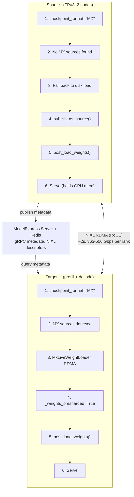

# ModelExpress P2P for TRT-LLM on GCP GB200

GPU-to-GPU weight loading for TRT-LLM via ModelExpress NIXL RDMA.
Targets load weights in ~2 seconds instead of 15-20 minutes from disk.

**Validated:** Kimi K2.5 TP=8, 16 target ranks × 90.75 GB at 363–506 Gbps (RoCE).

## How It Works



The integration uses TRT-LLM's `@register_checkpoint_loader("MX")` architecture
([TRT-LLM PR #13531](https://github.com/NVIDIA/TensorRT-LLM/pull/13531)):
- **Source** auto-detects no existing MX sources → loads from disk → publishes via `publish_model_params()`
- **Target** auto-detects existing sources → `MxLiveWeightLoader` does RDMA → marks modules `_weights_presharded`

## Quick Start

### Prerequisites

- GKE cluster with GB200 nodes (ARM64) and CPU nodes
- Dynamo platform (etcd + NATS) running in your namespace
- `nvcr-imagepullsecret` and `hf-token-secret` in your namespace
- `shared-model-cache` PVC with the model downloaded
- ComputeDomain created for your namespace

### Step 1: Deploy MX infrastructure

```bash
kubectl -n <namespace> apply -f mx-infra-decode.yaml
# Creates: modelexpress-server-decode + redis-decode
# Verify: kubectl -n <namespace> get pods -l 'app in (redis-decode, modelexpress-server-decode)'
```

### Step 2: Deploy source (loads from disk, publishes weights)

```bash
kubectl -n <namespace> apply -f kimi-source-decode-dgd.yaml
# TP=8 across 2 nodes, loads ~15-20 min from disk
```

Wait for all 8 workers to publish:
```bash
kubectl exec -n <namespace> deploy/redis-decode -- redis-cli KEYS 'mx:source:*:*' | wc -l
# Should output: 8
```

### Step 3: Deploy targets (receive weights via RDMA)

```bash
kubectl -n <namespace> apply -f kimi-disagg-mx-tp8-dgd.yaml
# Creates: Frontend + Prefill (TP=8) + Decode (TP=8)
# Both load via RDMA concurrently (~2s per rank)
```

### Step 4: Verify RDMA transfer

Check per-rank transfer logs:
```bash
kubectl exec -n <namespace> <target-worker-pod> -- cat /tmp/mx_logs/rank0.log
# Look for: "Transfer complete: 1815 tensors, 90.75 GB in 1.97s (369.1 Gbps)"
```

Or check main logs:
```bash
kubectl logs -n <namespace> <target-leader-pod> | grep "MX P2P weight transfer succeeded"
```

### Step 5: Cleanup

```bash
kubectl delete dgd -n <namespace> --all
# MX infra can stay running for future deployments
```

## Building the Image

The MX × TRT-LLM integration is now upstream:

- TRT-LLM [PR #13531](https://github.com/NVIDIA/TensorRT-LLM/pull/13531) (`MXCheckpointLoader` + `checkpoint_format="MX"`) **merged 2026-05-06** into `NVIDIA/TensorRT-LLM:main`. Ships in TRT-LLM 1.3.0rc15+.
- Dynamo [PR #8037](https://github.com/ai-dynamo/dynamo/pull/8037) (`--model-express-url` CLI + auto-detect role) **open** as of this commit.

### Recommended path — once `tensorrtllm-runtime` ships TRT-LLM 1.3.0rc15+

A thin wrapping image is all you need; no source patching:

```dockerfile
# examples/p2p_transfer_k8s/client/trtllm/Dockerfile.minimal (sketch)
FROM nvcr.io/nvidia/ai-dynamo/tensorrtllm-runtime:<post-13531-tag>

# MX Python client (publishes/receives weights via NIXL RDMA)
RUN pip install "modelexpress>=0.3.0,<0.4.0"
```

Build and push:

```bash
docker buildx build --platform linux/arm64 \
    -t <YOUR_REGISTRY>/<YOUR_NAME>:<YOUR_TAG> \
    --push .
```

Once Dynamo PR #8037 also lands and the next runtime image bumps,
`--model-express-url` is a first-class CLI flag and the image
above is everything you need.

### Bridge path — patch-based image (if your base image predates PR #13531)

If you're on a `tensorrtllm-runtime` image that predates the merge of
PR #13531, you can layer the changes on at build time via the
patch-based Dockerfile + scripts that lived on
[modelexpress PR #218](https://github.com/ai-dynamo/modelexpress/pull/218)'s
`kavink/trtllm_clean` branch. That branch hosts:

- `Dockerfile.dynamo-runtime` (wraps `tensorrtllm-runtime:1.1.0-dev.3`)
- `Dockerfile.ph3-gcp-gb200` (wraps the older `karenc:dynamo-trtllm-v1.0.0-a9b6f95`)
- `trtllm_patches/v1.3.0rc5/patch_mx_loader.py` — patches the base
  `model_loader.py` with the P2P hooks PR #13531 adds natively
- `trtllm_patches/dynamo/patch_dynamo_mx.py` — patches Dynamo with the
  CLI hooks PR #8037 adds natively

Both patches are temporary and self-deprecate as soon as the upstream
PRs ship in your base image.

## File Reference

| File | Purpose |
|------|---------|
| `mx-infra-decode.yaml` | ModelExpress server + Redis deployment |
| `kimi-source-decode-dgd.yaml` | Source DGD (TP=8, loads from disk, publishes) |
| `kimi-disagg-mx-tp8-dgd.yaml` | Target DGD (prefill + decode + frontend, loads via RDMA) |
| [`hpa/`](hpa/README.md) | HPA-driven autoscale demo (single-replica → multi-replica with RDMA) |

## Companion PRs

| PR | Repo | Status |
|----|------|--------|
| [#13531](https://github.com/NVIDIA/TensorRT-LLM/pull/13531) | TRT-LLM | **Merged 2026-05-06** — `MXCheckpointLoader`, `checkpoint_format="MX"` |
| [#202](https://github.com/ai-dynamo/modelexpress/pull/202) | ModelExpress | **Merged** — `MxLiveWeightLoader`, `publish_model_params` |
| [#267](https://github.com/ai-dynamo/modelexpress/pull/267) | ModelExpress | **Merged** — `MX_POOL_REG` allocation-based registration |
| [#8037](https://github.com/ai-dynamo/dynamo/pull/8037) | Dynamo | Open — `--model-express-url` engine integration (auto-detect source/target) |

## Customization

The yamls in this directory use placeholders for cluster-specific
values. Before applying, replace the following:

| Placeholder | Replace with | Where |
|-------------|--------------|-------|
| `<REGISTRY>/<NAME>:<TAG>` | Your container registry path + tag | All DGD yamls (`image:` field) |
| `<NAMESPACE>` | The Kubernetes namespace where Dynamo platform runs | `NATS_SERVER`, `ETCD_ENDPOINTS`, `MODEL_EXPRESS_URL`, `resourceClaimTemplateName` |
| `<GPU_NODE_POOL>` | Your GPU node pool name | `cloud.google.com/gke-nodepool` in worker yamls |
| `<CPU_NODE_POOL>` | Your CPU node pool name | `cloud.google.com/gke-nodepool` in `mx-infra-decode.yaml` |

If you don't want to build, you can validate the deployment path with
any image that has the same layered components. Build the image with
the instructions above and substitute its full URI into the DGD yamls.

### Different model

Update in the DGD yamls:
- `--model-path` and `--served-model-name` args
- `MODEL_NAME` env var
- `model_kwargs.num_hidden_layers` in the ConfigMap
- Ensure the model is on the `shared-model-cache` PVC

## GCP GB200 Required Config

All worker pods need these environment variables:

```yaml
env:
  HOME: /root
  UCX_TLS: "cuda_ipc,cuda_copy,rc"
  UCX_IB_GID_INDEX: "3"
  TRTLLM_UCX_INTERFACE: eth0
  OMPI_MCA_pml: ob1
  OMPI_MCA_btl: "tcp,self,vader"
  NCCL_CUMEM_ENABLE: "1"
  NCCL_NVLS_ENABLE: "1"
```
