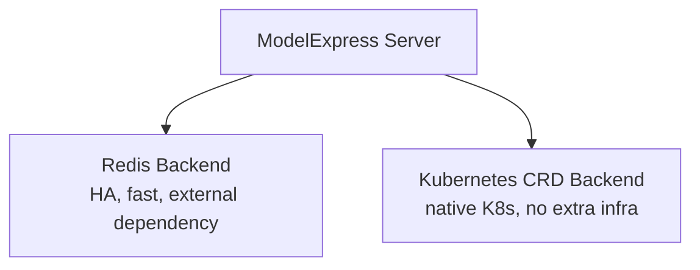

# Persistence Backends for ModelExpress Server

The ModelExpress server requires a persistent metadata backend. Two options are supported:
**Redis** (low-latency, horizontally scalable) and **Kubernetes CRDs** (no external dependency,
native K8s integration).

## Architecture



## When to Use Each Backend

| Scenario | Recommended Backend |
|----------|-------------------|
| General deployment, need HA | Redis |
| Kubernetes-native, no Redis dependency | K8s CRD |

## Files

| File | Purpose |
|------|---------|
| `modelexpress-server-redis.yaml` | MX server with Redis write-through backend |
| `modelexpress-server-kubernetes.yaml` | MX server with Kubernetes CRD backend |
| `redis-standalone.yaml` | Standalone Redis deployment with PVC persistence |
| `crd-modelmetadata.yaml` | Custom Resource Definition for model metadata |
| `rbac-modelmetadata.yaml` | RBAC roles for CRD access |
| `vllm-redis.yaml` | vLLM instance configured for Redis backend |
| `vllm-kubernetes.yaml` | vLLM instance configured for Kubernetes CRD backend |

## Usage

### Redis Write-Through

```bash
# 1. Deploy Redis with persistent storage
kubectl apply -f persistence/redis-standalone.yaml

# 2. Deploy MX server with Redis write-through
kubectl apply -f persistence/modelexpress-server-redis.yaml

# 3. Deploy vLLM instances (mx loader auto-detects source/target role)
kubectl apply -f persistence/vllm-redis.yaml
```

Set `MX_METADATA_BACKEND=redis` and `REDIS_URL=redis://redis:6379` on the server.

### Kubernetes CRD

```bash
# 1. Create CRD and RBAC
kubectl apply -f persistence/crd-modelmetadata.yaml
kubectl apply -f persistence/rbac-modelmetadata.yaml

# 2. Deploy MX server with K8s CRD backend
kubectl apply -f persistence/modelexpress-server-kubernetes.yaml

# 3. Deploy vLLM instances (mx loader auto-detects source/target role)
kubectl apply -f persistence/vllm-kubernetes.yaml
```

Set `MX_METADATA_BACKEND=kubernetes` on the server. Requires a ServiceAccount with
permissions to create/read/update ModelMetadata custom resources.
