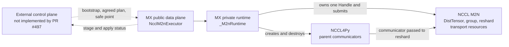
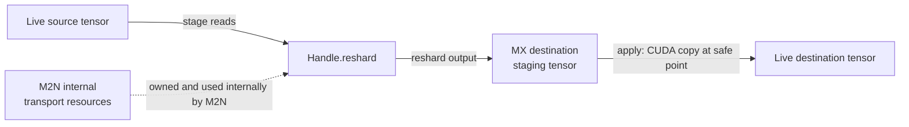
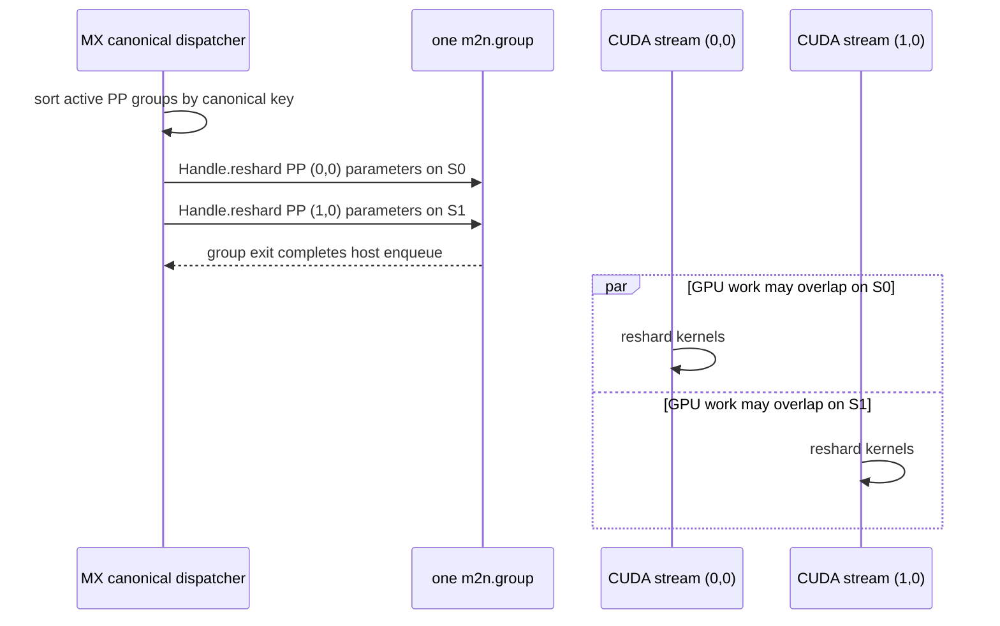

# NCCL M2N data-plane design

This document describes the PR #497 NCCL M2N implementation in
ModelExpress (MX). The implementation is a standalone collective data plane
for NeMo/Megatron-style trainer-to-generator tensor-parallel (TP) reshards. It
is not a one-sided `Transport.read()` implementation and is not yet selectable
through `ReshardReceiver`.

Production bootstrap, backend selection, distributed agreement, serving
publication, and restart orchestration require the external MX collective
control plane planned for PR #516 or a follow-up. The test runners use Gloo for
test-only bootstrap and coordination; Gloo never moves model weights and is not
part of the production data path.

## Goals and non-goals

PR #497 owns:

- one process-level M2N runtime and handle;
- PP-pair NCCL parent communicators and CUDA streams;
- construction of official M2N tensor descriptors;
- deterministic multi-PP-group collective submission;
- bounded MX-controlled completion polling;
- MX-owned destination staging and local safe-point apply;
- typed fail-stop signaling and native resource lifetime; and
- canonical healthy shutdown.

The external control plane owns:

- cohort membership and generation;
- globally stable PP-group identity;
- NCCL unique-ID distribution and communicator-rank assignment;
- cross-rank parameter-plan agreement;
- model-version and collective-round coordination;
- serving fences and stage/apply result aggregation;
- publication of a completed version; and
- coordinated restart of an affected communicator cohort.

The data plane consumes already-agreed bootstrap records and update plans. It
does not discover, negotiate, or distribute them.

## Ownership model

| Layer | Ownership |
| --- | --- |
| M2N | Internal transport staging, registered windows, collective algorithms, `DistTensor`, `group()`, and M2N handle execution |
| MX data plane | One private `_M2nRuntime`, one explicit M2N handle, all local PP communicators, one explicit CUDA stream per PP group, canonical submission, destination model staging, apply, completion polling, and teardown |
| External MX control plane | Bootstrap distribution, plan agreement, version fencing, serving coordination, publication, and cohort restart |



The dashed arrows are integration contracts with an external control plane,
not control-plane behavior implemented by PR #497.

There is one `_M2nRuntime` and one `NcclM2nExecutor` owner per process/GPU.
The runtime supports multiple PP-pair communicators but only one M2N handle.
The topology is created once and frozen when the executor attaches. Dynamic PP
membership requires coordinated shutdown and construction of a new runtime and
communicator set.

The runtime changes the current CUDA device to its `device_id`. This first
slice therefore assumes the normal one-process/one-GPU deployment model.

## Public API

The package exports:

| API | Purpose |
| --- | --- |
| `M2nPPGroupBootstrap` | Already-agreed control-plane material for one locally owned PP pair |
| `ReshardParam` | One local tensor plus its shared logical layout |
| `build_reshard_params()` | Translate `MegatronTensorSpec` values into `ReshardParam` values |
| `NcclM2nExecutor.create()` | Create the process runtime, handle, communicators, streams, and executor |
| `NcclM2nExecutor.stage()` | Transfer a complete local update without changing live destination weights |
| `M2nStagedUpdate` | Opaque token for the one currently staged update |
| `NcclM2nExecutor.apply()` | Copy staged destination data into live weights at an externally established safe point |
| `NcclM2nExecutor.release()` | Release or discard the current token while retaining reusable staging buffers |
| `NcclM2nExecutor.close()` | Perform the only supported public healthy teardown |
| `M2nCohortRestartRequired` | Machine-readable terminal failure requiring coordinated process restart |

`M2nPPGroupBootstrap` contains:

- a non-empty locally unique `group_id`;
- a globally stable `(trainer_stage, generator_stage)` key;
- NCCL unique-ID bytes shared by every member of that communicator;
- positive source and destination TP sizes; and
- this process's rank in the parent communicator.

Within a parent communicator, source ranks occupy `[0, source_size)` and
destination ranks follow. For sharded tensors, communicator rank within either
side must match the logical tensor-shard index; replicated tensors use no local
shard index. MX validates these local invariants, but the control plane
must ensure every communicator member receives the same bootstrap definition.

### Successful lifecycle

```python
executor = NcclM2nExecutor.create(device_id, pp_group_bootstraps)
update = executor.stage(updates_by_pp_group)

# External cohort agreement and a serving fence authorize local apply.
executor.apply(update)

# External cohort agreement authorizes publication. release() may instead
# discard a successfully staged but unapplied update.
executor.release(update)

# Later, during coordinated cohort shutdown:
executor.close()
```

Only one staged update may be pending. A caller must apply or discard it and
then call `release()` before staging another update or closing the executor.
`M2nStagedUpdate` is process-local and contains no distributed version or
generation identifier; associating it with a model version is a control-plane
responsibility.

`M2nStagedUpdate.results[key]` is `(local_bytes, stage_elapsed_seconds)`.
`local_bytes` is this rank's local tensor-byte count for the PP group. The
elapsed value covers collective submission and completion after local preflight,
staging allocation, and descriptor construction. It is repeated for every local
PP group and is not independently measured per-group time.

## Transfer flow

For one model update, `stage()` performs the following steps under one
runtime-owned active-operation lease:

1. Snapshot and validate the complete mapping for every locally owned PP
   group. Caller dictionary insertion order is not used for submission.
2. Validate tensor protocols, layouts, shard indices, and storage-overlap rules
   before entering M2N.
3. Allocate or reuse destination staging tensors.
4. Record one CUDA readiness event on the caller's current producer stream and
   make every active source PP stream wait for it.
5. Build official `nccl.m2n.DistTensor` source and destination descriptors.
   Ranks inactive on one side pass `None` as that side's buffer while still
   providing complete layout metadata.
6. Enter one official `nccl.m2n.group()` for the update.
7. Call `Handle.reshard()` in canonical PP-group and parameter order, passing
   each PP group's explicit CUDA stream.
8. After the native group returns, poll NCCL asynchronous state and CUDA stream
   readiness against one shared transfer deadline.
9. Return an `M2nStagedUpdate` only after all active local PP streams complete.

Each `stage()` input must contain every local PP-group key exactly once. An
empty sequence represents a group with no parameters for that update. Empty
groups remain in the local plan and result map but are omitted from native M2N
submission and completion polling. Every rank in the same communicator must
agree that the group is empty; otherwise the collective plans diverge.

## MX staging versus M2N transport staging

There are two independent staging concepts:



The M2N transport node is conceptual and inaccessible to MX; it does not imply
that every byte passes through one caller-visible M2N buffer.

M2N owns its internal transport buffers, registered windows, and their
lifetime. MX does not allocate an M2N transport window and does not call
`reshard_with_window`.

MX separately allocates one PyTorch CUDA staging tensor for each destination
parameter. M2N writes into those staging tensors instead of graph-bound live
weights. Staging is allocated lazily and reused across versions while the
parameter name, shape, dtype, and device signature remains unchanged.
Source-only PP groups do not allocate MX destination staging.

This is an MX serving-consistency policy, not an M2N API requirement. Its
costs are approximately one additional local destination model shard across
the transferred parameters and one additional device-to-device copy during
`apply()`.

The benefit is that a failed or incomplete `stage()` does not expose a partial
version through live destination tensors. The policy can later be reconsidered
across MX backends: alternatives include direct writes into live weights or an
engine-managed double buffer/pointer swap.

Staging does not make `apply()` atomic. `apply()` enqueues parameter copies and
then waits for all affected local PP streams. A copy failure after the first
live mutation can leave a mixed local model, poisons the runtime, and requires
reload/restart. Whole-version consistency at the serving boundary therefore
depends on this external sequence:

1. stop admitting inference work;
2. drain or fence all existing readers of live parameter storage;
3. collect successful staging from the complete destination cohort;
4. authorize `apply()` on every destination process;
5. keep serving disabled until every apply succeeds; and
6. publish/resume only after cohort-wide success.

## Official M2N v2 API usage

The production path uses only current public M2N Python APIs:

- `nccl.m2n.init(Config)`;
- `DistTensor` with `Mesh`, `Shard`, and `Replicate` metadata;
- `nccl.m2n.group()`;
- `Handle.reshard(..., stream=...)`; and
- `Handle.destroy()`.

MX does not allocate or register an M2N transport window. The old private
ctypes binding, caller-managed windows, `reshard_with_window`, default-stream
translation, `run_reshard`, `execute`, `execute_batch`, and `teardown` entry
points are intentionally absent. Using `Handle.reshard()` structurally removes
the old reusable-window multi-parameter overwrite race.

## Canonical multi-PP-group scheduling

The scheduling invariant is:

> Caller-side input preparation may be concurrent before `stage()`. Once
> `stage()` enters MX, the executor operation lock serializes local validation,
> staging allocation, and descriptor construction. The runtime dispatcher then
> submits M2N calls in canonical PP-group order.

For every model update, the runtime sorts PP groups by
`(trainer_stage, generator_stage)` and opens one official `m2n.group()` around
all active local groups. Calls within each communicator preserve the supplied
parameter order. Caller-thread arrival and dictionary insertion order never
select M2N communicator first-use order.

An empty parameter sequence is required in the local update map when a local PP
group is inactive for that update, but it is omitted from native submission. An
entirely empty update opens no M2N group. Every rank in one communicator must
agree on active versus empty calls; otherwise plans diverge.

Processes that own only a subset of PP pairs traverse a sorted subsequence of
one global order. M2N host calls are enqueued sequentially, but every PP group
uses a distinct CUDA stream, so GPU work may overlap after enqueue:



This depicts one process that owns both groups. A subset owner submits its
sorted subsequence; empty groups are omitted only from native calls. Distinct
streams permit overlap but do not guarantee it.

A mutex by itself would serialize host calls but would not establish identical
cross-process order. Canonical central dispatch is therefore part of the
collective correctness contract.

## CUDA producer-readiness contract

The public API does not take a CUDA stream. MX owns one real explicit stream per
PP group so it can define producer readiness, completion, concurrency, apply,
and teardown consistently.

```text
caller enqueues weight production on current CUDA stream
  -> stage() records a CUDA event on that producer stream
  -> each active source PP stream waits on the event
  -> M2N reshard is enqueued on that PP stream
  -> stage() polls NCCL async status and stream.query()
  -> stage() returns after every active local PP stream is ready
```

Callers must invoke `stage()` after source production is enqueued on the current
CUDA stream. If production used other streams, the current stream must first
wait on them. Source tensors must remain allocated and immutable through
`release()`. This lifetime rule is conservative: successful `stage()` has
already drained the relevant PP streams.

Passing a default-stream sentinel to M2N would weaken this ownership contract.
M2N may replace default handles with an internal stream, while MX still needs a
known stream for producer-event waits, completion queries, apply copies, and
resource lifetime.

## Supported layouts and local validation

The first slice supports:

- concrete contiguous CUDA tensors on the executor's exact device;
- tensor rank one through three;
- replication or TP sharding on one tensor dimension;
- the same sharded tensor dimension on source and destination;
- different source and destination TP sizes; and
- uniform, aligned Megatron local shard ranges when inputs come through
  `build_reshard_params()`.

It does not support cross-dimension transpose reshards, two-dimensional TP x
FSDP tiles, non-uniform shards, direct caller-provided M2N `DistTensor` objects,
or caller-owned communicators/streams.

Before native submission MX validates:

- complete local PP-group key coverage;
- nonempty unique parameter names within a PP group;
- positive global dimensions and supported tensor rank;
- dtype, concrete device, pointer protocol, and contiguous storage;
- exact local source or destination tile shape;
- no shard index for replicated tensors;
- a shard index for sharded tensors that equals communicator-side logical rank;
- uniform divisibility for direct `ReshardParam` inputs;
- uniform, aligned `MegatronTensorSpec.local_shard_range` when translated by
  `build_reshard_params()`; and
- the storage-overlap rules below.

The layout helpers classify a lone shard as replicated only if its row and
column extents cover the complete global tensor. A partial single shard raises
instead of risking an out-of-bounds M2N read.

These checks are local. Communicator peers must additionally agree on active
versus empty parameters, names and order, dtype, global/local shapes, meshes and
placements, source/destination geometry, and logical shard indices. Distributed
agreement is not implemented in #497.

## Storage-overlap contract

MX rejects:

- any storage overlap within one PP group; and
- any cross-group overlap involving destination storage.

Read-only source/source overlap across different PP groups is intentionally
accepted. MX retains references and requires that storage to remain immutable
while the staged update owns it.

Current upstream M2N documentation describes cross-bucket overlap as
unsupported. MX intentionally treats immutable source/source reuse across PP
groups as an empirically validated compatibility contract. The checked-in
PP1-to-PP2 regression passes the exact same PyTorch CUDA tensor and data pointer
to two communicator/stream buckets inside one outer M2N group. Across two model
versions it verifies source immutability, canonical submission, distinct stream
handles with overlapping in-flight intervals, pre-apply destination invisibility,
and exact destination values. This behavior is validated for the pinned M2N
revision below and must remain covered when that revision changes.

## Failure domain and recovery

### Before collective submission

Local bootstrap, plan, tensor, descriptor, or staging-allocation validation
failures are ordinary exceptions. Live weights remain unchanged, the runtime is
not poisoned, and corrected input may be retried.

### After collective submission starts

Submission failure, NCCL asynchronous error, CUDA query failure, or deadline
expiry poisons the complete process-level runtime and every local PP group. MX:

- retains the handle, communicators, streams, submitted M2N descriptors, and
  destination staging;
- attempts communicator abort in canonical order on a daemon thread;
- does not wait for abort completion on the failing caller;
- promptly rejects later `stage()`, `apply()`, `release()`, and `close()`; and
- raises `M2nCohortRestartRequired`.

Abort is best effort and does not make native state reusable. Retention is
deliberate quarantine: freeing resources while unknown GPU work may reference
them is unsafe. Recovery is process/cohort restart, not in-process rebuilding.
Original source tensors remain caller-owned. After a fatal submitted transfer,
the caller must keep their storage allocated and immutable until process exit;
the Python layer retains submitted M2N descriptors but does not independently
guarantee a strong reference to every original `ReshardParam` tensor.

### During apply

A failure before any live copy begins can remain ordinary. Once the first live
copy begins, rollback is not guaranteed and a destination may contain mixed
versions. MX enters fail-stop, retains the token and staging, and requires
serving to remain disabled until restart or reload.

### Typed restart signal

`M2nCohortRestartRequired` derives directly from `Exception`, not
`RuntimeError`, so generic backend retry/fallback handlers do not accidentally
consume it. It reports operation, phase, all locally configured group IDs and PP
keys and reason, and preserves the explicit root-cause chain through `__cause__`.

The reported scope is local. The external control plane must expand it to the
transitively connected global communicator cohort, stop serving/publication,
and restart every affected process.

## Admission and timeout boundaries

The runtime tracks whole top-level operations, including PP-group creation,
complete `stage()`, stream-touching preparation, apply, and close-sensitive
work. Nested helpers use the same reentrant lease.

Close changes state to `CLOSING` before waiting. New top-level work fails fast;
already-admitted work may complete. Close waits for the active-operation count
against one deadline before taking the dispatcher and a stable sorted topology
snapshot. PP-group creation publishes only a complete usable topology. A failed
creation may retain a partial internal set in poisoned quarantine.

If admitted work does not finish before the deadline, close frees nothing. It
poisons and quarantines the runtime and requires process restart. Leaking until
process exit is safer than releasing streams or communicators under live work.

Default bounds are:

- communicator initialization: 120 seconds;
- transfer completion: 900 seconds; and
- finalization: 300 seconds.

MX uses nonblocking NCCL4Py communicators and polls `get_async_error()` plus CUDA
`stream.query()`. Healthy transfer and shutdown drain contain no bare unbounded
`stream.synchronize()`.

These deadlines cover MX-controlled polling only. The transfer deadline starts
after `m2n.group()`/native `group_end()` returns. Python cannot interrupt
`m2nWaitCommReady`, `Handle.destroy()`, or another native finalize/destroy call
that never returns. Production peer-loss safety therefore requires an M2N
artifact with bounded native waits. The validated artifact still has an
approximately 600-second native readiness bound, so it is bounded but not fast.

## Healthy shutdown and one-shot teardown

`NcclM2nExecutor.close()` is the only public normal teardown entry point. It is
locally sequential and idempotent after success; concurrent calls fail fast. It
is not a distributed barrier, so the external control plane must coordinate the
cohort before any rank starts native shutdown.

Healthy order is:

```text
stop admission
  -> wait for admitted operations
  -> acquire dispatcher and snapshot sorted PP groups
  -> drain every PP stream
  -> destroy the single M2N handle while all parent communicators remain valid
  -> for each ascending PP key:
       release stream
       communicator.finalize()
       poll finalization
       communicator.destroy()
  -> commit CLOSED
  -> clear singleton and executor ownership
```

This follows the nccl-rl issue #76 ordering rule. Processes owning multiple PP
communicators use the same global order; processes owning one group traverse a
subsequence. PP2-to-PP1, PP4-to-PP1, and PP8-to-PP1 ownership patterns cannot
form a teardown wait cycle. PP2-to-PP1 has real-GPU coverage. PP4/PP8 currently
have ordering-proof/unit coverage only.

Once handle destruction starts, native teardown is one-shot. A failure in
handle destruction, stream release, communicator finalization/wait/destruction,
or the runtime close commit records the exact phase and PP key, retains
remaining resources/singleton, and forbids replay. Different ranks may have
advanced to different communicators, so replay could diverge collectively.

One narrow retry is safe: native teardown and the runtime `CLOSED` commit both
succeeded but clearing process-local singleton/executor ownership failed. A
later `close()` clears only Python bookkeeping and does not replay native work.

## Initialization and deployment requirements

Initialization validates the actual loaded `libnccl` version, not stringified
NCCL4Py package text. Structured `VersionInfo.libnccl.version.release` and
packed integer representations are supported. NCCL 2.30.5 or newer is required,
along with nonblocking NCCL4Py initialization, async-error query, abort, and the
current M2N v2 API.

MX snapshots the complete intended local restart scope before M2N
initialization. It assumes `nccl.m2n.init()` is failure-atomic when it raises.
If an invalid returned handle can be destroyed successfully, construction fails
normally and singleton ownership is reusable. If safe cleanup cannot be proven,
the handle is quarantined and a full-scope restart-required error is raised.

The optional extra currently resolves:

```text
nccl-extensions==0.1.0
```

That version does not identify an immutable source revision. As validated on
2026-08-29, production requires a revision-stamped M2N artifact containing
bounded `m2nWaitCommReady` support. The test artifact was:

```text
M2N source ref: 45c3f9b96663276c12437bdd9eb5bcf5a4b343a8
NCCL:           2.30.7
```

A reviewed merged successor with equivalent timeout behavior is acceptable.
Runtime checks cannot prove the M2N Git revision or prove that PyTorch,
NCCL4Py, and M2N loaded one compatible NCCL DSO. Production must provide one
revision-stamped M2N artifact, one mutually compatible loaded NCCL DSO,
homogeneous compatible GIN/HCA selection, and build provenance. MX must not
hardcode cluster-specific HCA names.

## Review findings addressed

| Finding | Resolution in the data plane |
| --- | --- |
| Version gate parsed the `4` in `NCCL4Py` | Read structured loaded-lib version data; reject missing or old libnccl |
| Peer failure could block in bare stream synchronization | Nonblocking NCCL/CUDA polling, shared deadlines, daemon abort, quarantine, and required bounded native artifact |
| Retrying close after partial teardown could wedge or diverge | Native teardown is one-shot; exact failed phase/key is retained; restart required after mutation |
| Close raced staging preparation and incremental PP-group creation | Whole-operation admission, `CLOSING`-first bounded drain, and atomic topology publication/snapshot |
| Poisoned runtime had no real recovery path | Explicit fail-stop/cohort-restart contract with retained unsafe resources and typed signal |
| M2N existed only behind private/test construction | Thin public `create/stage/apply/release/close` data-plane facade; production control plane remains separate |
| Old path duplicated M2N windows/default-stream behavior | Official v2 `DistTensor`, `group`, explicit PP streams, and `Handle.reshard`; caller-managed windows removed |
| Caller threads could choose communicator first-use order | One complete update enters one central dispatcher in canonical PP-key order |

This table does not claim that the external production selector/control plane
has landed.

## Testing methodology and evidence

Testing has three layers. Fake-backend success does not establish native M2N
collective correctness, so real-GPU scenarios are tracked separately.

### Static checks

The final data-plane code snapshot passed:

- Ruff 0.16.4;
- Black check on all changed Python files;
- Python bytecode compilation; and
- `git diff --check`.

### CPU and fake-backend checks

The focused suite contains:

```text
tests/test_nccl_m2n_executor.py
tests/test_nccl_m2n_runtime.py
tests/test_nccl_m2n_reshard.py
```

Fake M2N/NCCL/CUDA backends test deterministic order, lifecycle transitions,
version checks, deadlines, injected failures, quarantine, root causes, staging
visibility/reuse, overlap policy, close races, and teardown non-replay. Pure
layout/golden tests cover row/column sharding, replication, rejected layouts,
and TP reshard reference values.

Final results:

- focused suite: 111 passed in 0.87 seconds;
- finding #8 shared-source unit regression: 1 passed in 0.76 seconds; and
- complete Python suite: 1352 passed, 1 skipped, 16 warnings in 97.15 seconds
  (Pretyche Slurm job `2699879`).

### Real-GPU setup

GPU validation ran on Pretyche compute nodes, never a login node, using:

- an ARM64 PyTorch/vLLM virtual environment;
- a per-job wheel overlay for M2N ref
  `45c3f9b96663276c12437bdd9eb5bcf5a4b343a8`;
- NCCL 2.30.7 with exact `libnccl.so.2.30.7` preloaded as the single NCCL DSO;
- `TORCH_USE_RTLD_GLOBAL=1`; and
- homogeneous test HCA selection
  `mlx5_0,mlx5_1,mlx5_4,mlx5_5`.

The HCA list is Pretyche-specific test setup, not a portable MX default. Gloo
handled test-only bootstrap, barriers, and status coordination; it never moved
model weights. M2N/NCCL4Py moved the weights.

| Scenario | Verified behavior | Result |
| --- | --- | --- |
| TP1 -> TP1, two parameters, two versions | Grouped reshard, pre-apply invisibility, exact apply, staging reuse | Passed, job `2678023` |
| TP2 -> TP1, two parameters, two versions | M-to-N gather/reshard and repeated-version visibility | Passed, job `2678024` |
| TP1 -> TP2, two parameters, two versions | M-to-N split/reshard on both destination ranks | Passed, job `2678026` |
| PP2 -> PP1 multi-group | Reverse input insertion becomes canonical `[0, 1]`; exact values; event-measured work overlaps on distinct streams | Passed, job `2678029` |
| PP1 -> PP2 shared-source multi-group, two versions | One exact source pointer feeds two communicator/stream buckets; distinct handles and overlapping intervals; pre-apply invisibility and exact values | Passed, job `2699878` |
| In-flight peer loss | Source killed after native group return while streams pending; survivor times out without apply, emits typed error/direct cause, retains resources, attempts abort, and promptly rejects reuse/close | Passed, job `2678030` |

The peer-loss test validates bounded post-submission MX polling and fail-stop.
It does not prove fast recovery when a peer dies while Python is blocked inside
native `group_end()`.

## Review findings and production limitations

### Finding #7: cross-rank plan divergence — explicitly deferred

#497 does not exchange or compare plan digests. A rank that omits a parameter,
marks a group empty while peers submit calls, changes order, or disagrees on
dtype/shape/mesh/placement/geometry can enter a different collective sequence
and deadlock the cohort. The hang may occur inside native `group_end()` before
the MX transfer deadline starts.

The external control plane must agree the complete plan digest and round before
any rank calls `stage()`. This remains a production integration precondition and
must not be described as resolved by local preflight checks.

### Finding #8: same-source cross-bucket GPU test — resolved

The checked-in PP1-to-PP2 test has one trainer rank pass the exact same CUDA
tensor and data pointer to PP groups `(0, 0)` and `(0, 1)` inside one outer M2N
group. On two distinct streams it repeats two model versions and verifies source
immutability, canonical order, pre-apply destination invisibility, and exact
values on both generator ranks. Pretyche job `2699878` passed against the pinned
M2N/NCCL environment, and the complete Python suite passed in job `2699879`.
No production data-plane code changed for this finding.

### Other boundaries

- `ReshardReceiver` still constructs NIXL directly; no production backend
  factory reaches this executor.
- PR #516 or a follow-up still owns bootstrap/control-plane integration,
  serving publication, and global cohort restart.
- Dynamic PP membership requires a new runtime and communicator cohort.
- In-process recovery after poisoning is intentionally unsupported.
- First-slice layouts are uniform TP-only same-dimension reshards.
- Native calls remain outside Python's ability to interrupt.
- Fatal-path source lifetime remains a caller obligation until process exit;
  MX retains submitted M2N descriptors but relies on the caller and official
  `DistTensor` buffer-lifetime contract for the backing source allocation.
- MX staging adds destination memory and copy overhead; partial apply is
  terminal.
- Caller-owned resources and direct caller `DistTensor` values are deferred.
- Real-GPU PP4-to-PP1 and PP8-to-PP1 teardown are not covered; only their
  ordering proof/unit cases are covered.
- The historical local-window-size disagreement is not formally closed. The v2
  path no longer accepts caller-owned window sizing, but its review status
  remains explicitly deferred.
