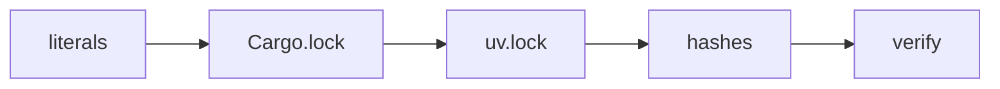

<!--
SPDX-FileCopyrightText: Copyright (c) 2025-2026 NVIDIA CORPORATION & AFFILIATES. All rights reserved.
SPDX-License-Identifier: Apache-2.0
-->

# Repository tools

Standalone developer utilities. This directory is excluded from container image
builds (via `.dockerignore`) and from the Python wheel (the wheel is built from
`modelexpress_client/python/` and only packages `modelexpress*`), so nothing here
ships to users.

## `bump_version.py`

Bumps the ModelExpress workspace version end to end, automating the on-`main`
"Bumping the ModelExpress Version" procedure in [`CLAUDE.md`](../CLAUDE.md).
Stdlib only; the lock, hash, and verify stages shell out to the existing `cargo`,
`uv`, and `pytest` toolchain.

### Usage

```bash
# from the repo root
python scripts/bump_version.py <new_version> [options]

# preview everything without writing
python scripts/bump_version.py 0.6.0 --dry-run

# typical full run
python scripts/bump_version.py 0.6.0
```

The current version is read from `[workspace.package].version` in `Cargo.toml`;
pass `--from` to override. Bumping to the version the repo is already at is a
no-op.

| Option | Effect |
|---|---|
| `--from <version>` | Override the detected current version. |
| `--dry-run` | Print the planned edits and the commands that would run; write nothing. |
| `--skip-locks` | Skip `Cargo.lock` / `uv.lock` regeneration. |
| `--skip-hashes` | Skip source-id pinned-hash regeneration. |
| `--skip-verify` | Skip the `cargo` / `pytest` verification stage. |
| `--repo-root <path>` | Repository root (default: inferred from the script location). |

### Prerequisites

- `cargo` and `uv` on `PATH` (needed for the lock and verify stages; skip with the
  matching flags if unavailable).
- The Python dev environment at `modelexpress_client/python/.venv` with the dev
  extras installed (`pytest`, the `modelexpress` package). The tool prefers that
  interpreter and falls back to the one running the script. Create it with:

  ```bash
  cd modelexpress_client/python && uv sync --extra dev
  ```

### What it does (five stages)



1. **literals** - edits the workspace/chart/Python version strings and every
   `mx_version` fixture/example literal. The structured files
   (`Cargo.toml` `[workspace.package].version` plus the three internal path-dep
   `version =` entries, `modelexpress_client/python/pyproject.toml`
   `[project].version`, `helm/Chart.yaml` `version` and `appVersion`) are edited by
   key. The `mx_version` literals are discovered across the tree, so fixtures added
   later (for example in `workspace-tests/`) are picked up automatically.
2. **Cargo.lock** - `cargo update --workspace` (touches only the four ModelExpress
   crates).
3. **uv.lock** - `uv lock`, run from `modelexpress_client/python/`.
4. **hashes** - `mx_version` feeds the SHA256-derived `mx_source_id`, so bumping it
   changes the pinned-hash assertions. The tool runs the pinned tests (which now
   fail), parses the new hashes from the assertion output, replaces each old hash
   with its new value across both `tests/test_source_id.py` and the Rust
   cross-checks in `modelexpress_server/src/p2p/source_identity.rs`, then re-runs the
   tests to confirm. A bad regeneration leaves the tests red and aborts the bump, so
   correctness never depends on trusting the parse. This catches every pinned
   occurrence, including ones the manual procedure's `-k` filter misses.
5. **verify** - `cargo check --workspace --tests`, the Rust `source_identity` tests
   (the cross-language parity check), and the Python test suite.

### What it deliberately does NOT touch

- **Public release image tags** (`nvcr.io/.../modelexpress-server:<tag>` in
  `examples/**`, `helm/values*.yaml`, `helm/README.md`). These follow a separate
  release-branch cadence and only move after the container is published on NGC.
- **External crate versions** in `Cargo.lock` (the tool matches only `mx_version`
  context and specific version keys, never a bare version string).
- **`docs/CLI.md`** example outputs, which are static illustrations.

### Verifying the tool itself

Because edits are scoped, the safest check is a round-trip on a clean tree:

```bash
python scripts/bump_version.py 0.6.0 --dry-run          # review the file list
python scripts/bump_version.py 0.6.0                    # real bump + verify
git diff                                                       # inspect the change
git checkout .                                                 # restore
```
